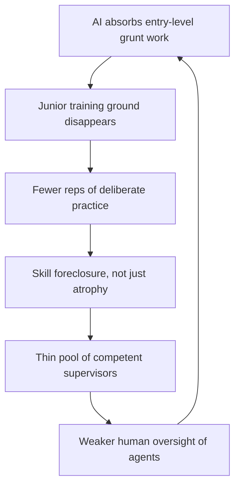

Workera runs skills assessments for large enterprises and the US federal government. On 20 May it published its 2026 benchmark. 

Workera published the 2026 AI Skills Enterprise Benchmark Report, representing more than 88,000 assessments from some of the world's most advanced enterprises and the United States federal government across 14 AI and data capabilities.

 The headline: only 13% of employees are accomplished in agentic AI skills before any upskilling, the lowest benchmark across all 14 capabilities measured.

Those same enterprises are building agents. Autonomous systems that take actions of their own. The people meant to supervise them mostly can't.

The gap that matters runs between deployment ambition and the verified state of human skill on the floor. AI-fluency surveys do not measure it.

## the disconnect is now measurable

Deloitte's State of AI in the Enterprise 2026 puts hard numbers on the mismatch. 

Within a year, 36% of companies expect at least 10% of their jobs to be fully automated. Within three years, 82% expect that level of automation. Yet 84% have not redesigned jobs or the nature of work itself around AI capabilities.

 So the work is being automated faster than the work is being rethought. And on the people side: only 53% are educating their broader workforce to raise AI fluency and 48% are implementing reskilling strategies. Just 33% are redesigning career paths.

Most of that 53% is running awareness courses. A webinar, a prompt-engineering deck, a Slack channel. That is fluency theatre. It moves a slide and leaves the capability where it was. Deloitte's own read is blunt: while insufficient worker skills are cited as the single biggest barrier to AI integration, fewer than half of companies are making significant adjustments.

I've defended workforce numbers in front of boards for thirty years. The same pattern ran through Y2K remediation, the ERP rollouts and the cloud migration. Leadership funds the tool and underfunds the people who have to run it, then acts surprised when adoption stalls. 

Workforce access to AI tools is expanding fast, yet fewer than 60% of those with access actually use it in their daily workflow, a pattern unchanged from the previous year.

 Access is not skill. Skill is not judgement.

## the centaur assumption

The useful frame here is the old chess one: centaur versus autopilot. A centaur is a human-plus-machine pairing where the human supplies judgement the model can't. Autopilot is the human stepping back entirely. The whole agentic AI thesis assumes a centaur: a competent human in the loop, catching the model when it confidently goes wrong.

The Workera data says the centaur is mostly a novice holding the reins. And the self-knowledge problem is worse than the skill problem. 

Only 11% of employees can accurately assess their own skill levels, and nearly 7 in 10 either overestimate or underestimate what they can do.

 So you can't even fix this by asking people what they need. They don't know. 

Despite 85% of L&D leaders saying they're confident in self-reported skills data, the evidence tells a different story.

The same report also shows the gap closing wherever someone actually teaches. 

81% of employees become accomplished in Responsible AI after targeted upskilling, though only 25% start there.

 Targeted, assessed, deliberate practice works. The broadcast webinar doesn't.

## the training ground is being demolished

Anders Ericsson's deliberate practice is effortful, feedback-rich repetition at the edge of your competence. It needs somewhere to happen. For most professions that somewhere has always been the junior rung: the grunt work, the first drafts, the reconciliations, the things you did badly until you did them well. AI is eating exactly that rung.

The entry-level numbers from the last few weeks all run the same way. 

Unemployment among recent college graduates climbed to 5.7% in late 2025, well above the 4.2% rate for all workers. Nearly 43% of new grads are underemployed. Entry-level job postings in the US are down 35% since early 2023, with AI tools absorbing the "grunt work" that traditionally served as the career launchpad for new hires.

 ICIMS, reporting on 21 May, found employers and entrants moving in opposite directions, with only 19% of entry-level job seekers saying they feel very confident in their careers, and nearly three in ten reporting low or no confidence at all.

That trade rarely reaches a budget line. 

Firms gain short-term productivity but risk a long-term talent shortage by eliminating the junior training grounds.

 If you automate away the apprenticeship, you stop producing the seniors who can supervise the automation. The centaur pipeline dries up.

## the autocomplete tax on judgement

A peer-reviewed study by Michael Gerlich, surveying 666 people, found that frequent reliance on AI tools may negatively affect critical thinking, largely through cognitive offloading. The effect was particularly pronounced among younger people, while those with higher education tended to retain stronger critical thinking regardless of AI use.

The generational split matters more than it first appears. An experienced engineer offloading a task to an agent is renting out a muscle they already built; they can still spot when the output is wrong. A graduate who never built the muscle is in a different category entirely, closer to foreclosure than atrophy. A developmental step was skipped rather than a skill set down. Auditing an agent's work requires the very expertise the junior was supposed to be acquiring by doing the work the agent now does. That's the autocomplete tax, and it compounds.

Which is why I'm sceptical of any reskilling programme that's really just supervised AI usage. Frictionless adoption and skill formation pull in opposite directions. If the tool removes the effortful part, it removes the part that builds the person.

## the apprenticeship portal

The most sensible institutional response of the last two months came, surprisingly, from a government department. On 29 April the US Department of Labor launched its AI in Registered Apprenticeship Innovation Portal. 

The initiative focuses on embedding AI training and curricula into existing apprenticeship programs, including AI in roles that directly build, manage, or apply AI technologies, and strengthening workforce pipelines in areas like data centers, telecommunications, and advanced manufacturing.

The DOL also announced roughly $85 million to expand apprenticeship programs, with a goal to surpass 1 million apprentices nationwide.

I have my doubts about parts of the framing and the politics around it. But the apprenticeship model itself is the right shape, because it's the only one on this list built around earn-while-you-learn. That means deliberate practice with a mentor and real feedback. It reinstates the rung that AI is demolishing elsewhere. The skilled trades already grasp this: an apprentice electrician in 2026 is now expected to read sensor networks and AI diagnostics alongside the wiring fundamentals. Practice, supervised, on real work.

## where the upskilling budget should go

The fixes are unglamorous, and every one of them costs something.

Kill self-assessment as a planning input. 

Verified skills data, a precise X-ray of where the gaps actually are, is the only honest starting point for an upskilling plan.

 You cannot manage what 89% of your people misjudge about themselves.

Stop counting fluency courses as reskilling. The Deloitte split is the tell. Educate-the-workforce is the easy box, redesign-the-work is the hard one, and the disconnect between the speed of AI advancement and the pace of workforce adaptation is what may be the largest risk in enterprise AI deployment.

 Fund the hard box.

Protect a deliberate-practice pipeline on purpose. If agents take the junior work, you owe your juniors a manufactured equivalent (rotations, real ownership, supervised hard problems) or you are borrowing your supervisory capacity from a future you have decided not to fund.

The 36% who expect automation and the 82% who expect more of it are the numbers boards quote. The two that decide the outcome are the 13% who can actually work with what is being deployed, and the 81% who got there once someone bothered to teach them properly. The lever exists. Most enterprises just haven't pulled it.

---

Tarry Singh is the founder and CEO of Real AI (realai.eu), an enterprise AI advisory and deployment firm working with global enterprises on production agent systems, model risk, and AI sovereignty strategy. He also leads Earthscan (earthscan.io) for Energy AI, and is a founding contributor to the EU-funded HCAIM and PANORAIMA programmes for responsible AI education across European universities. He writes at tarrysingh.com.
