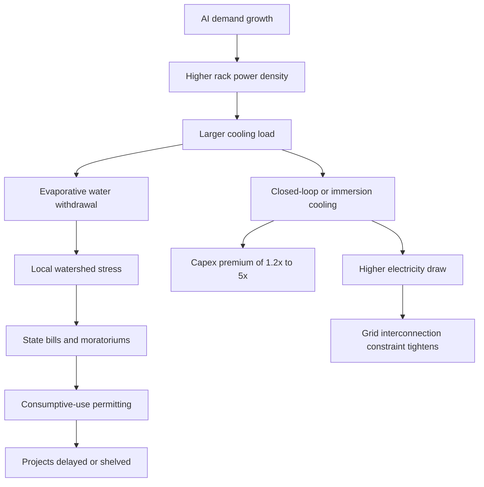

More than $130 billion in U.S. datacenter projects was delayed or abandoned in Q1 2026 alone

That is more than the entire total for 2025. 

In 2025, more than 200 bills addressing datacenters were introduced across all 50 states, of which more than 40 were enacted into law. 

Bans and moratoriums for datacenters are under discussion in more than 20 states. The proximate cause, according to state legislators and local officials from Ohio to West Virginia to Idaho, is water.

Not energy. Water.

This is awkward for everyone who spent the last eighteen months explaining to their boards that power was the constraint. It is. But water arrived first.

On 6 July 2026, the Information Technology and Innovation Foundation published [*The Data Center Water Problem Is Soluble*](https://itif.org/publications/2026/07/06/the-data-center-water-problem-is-soluble/), a 64-page forensic examination of the state-level regulatory insurgency that has effectively frozen roughly one-third of the new-build pipeline across the U.S. Midwest, Southwest, and parts of the Southeast. The report is cautious, technical, focused on governance mechanisms. Its title signals something almost plaintive. 'This is solvable' is what you write when a solvable problem has already gotten out of control.

The proximate trigger was a collision between AI-driven demand and local hydrology. 

Gartner forecasts global datacenter electricity consumption to reach 565 terawatt hours (TWh) in 2026, up from 447 TWh in 2025

That is a 26% jump in a single year. 

Electricity consumption from AI-focused datacenters grew even faster, surging 50% in 2025, per the IEA's April 2026 *Key Questions on Energy and AI* report. 

In the United States, electricity demand rose by 2.1% in 2025 and is projected to grow by nearly 2% annually through 2030, with around half of the total increase driven by the rapid expansion of datacentres.

Higher power density means higher cooling load. AI-optimised racks throw three to six times the heat of conventional servers. Evaporative cooling, still the default, consumes water at the rate of roughly 1.8 litres per kilowatt-hour, industry average. 

Over 4,500 active U.S. datacenters consume 176 TWh annually (4.4% of U.S. electricity), with 700+ more under construction across 38 states. That's a 15% increase in the installed base in under two years.

The backlash is not speculative. 

States are introducing datacenter water usage legislation to address concerns about water consumption, with California, Iowa, and Michigan considering bills that require operators to submit regular reports on their water use. 

Several states are exploring state datacenter water regulations that would mandate closed loop cooling systems, including South Carolina and Kansas, which would require datacenters to use cooling technologies that don't rely on water evaporation. West Virginia's HB 4832 would limit datacenter usage if causing adverse impacts to supply and require facilities to pay for all water utility costs incurred. Idaho's H0895, introduced in March 2026, limits consumptive water use for cooling by datacenters starting construction on or after 1 July 2026.

I have read the bills. They are not calibrated. They are reactive. Some ban evaporative systems outright. Others impose permitting thresholds (1 million gallons per day in Ohio's Great Lakes basin compact zones) that force consumptive-use permits and impact demonstrations before a shovel touches dirt. States have the jurisdiction. They are exercising it in ways that make sixteen-month permitting timelines look optimistic.

## The direct versus indirect split

The ITIF report does useful work separating direct water consumption (on-site cooling) from indirect (water consumed at the power plant generating the electricity). 

Indirect consumption is more than 10x direct consumption, but overall, datacenters account for a very small fraction of total U.S. consumption. 

Direct U.S. datacenter water use is approximately 17 billion gallons per year, about 0.3% of public water supply, according to AEI and HyperFRAME Research.

But national averages dissolve when you zoom into watershed level. 

In The Dalles, Oregon, Google's water use grew 316% while the town's population grew 12%. That is not a rounding error to a city council facing a bond referendum to expand water treatment capacity. Utilities in Virginia, Texas, and Arizona are pricing risk premiums into interconnection agreements because their boards remember what happened when they could not deliver on commitments. The political cost of a summer water advisory in a residential district is higher than the revenue from a 200 MW edge facility, and every utility CFO knows it.

The indirect piece, power-generation water, is harder to manage and murkier to attribute. A natural-gas combined-cycle plant in a hot, dry climate consumes far more water per MWh than a solar array or wind farm. 

Water use for power generation depends on the choice of power technology (e.g., gas consumes much more water than solar does) and on the local climate. Attributing that upstream consumption to 'the datacenter' creates accounting complexity and political theatre. If the facility signs a long-term PPA with a renewables project, does it still carry the water footprint of the marginal gas plant that backs it up on calm August evenings? State legislators are writing bills that conflate the two categories and regulate on totals, without waiting for ISO 14046 clarity.

## Cooling that uses almost no water

New technologies now make it possible to consume almost zero water directly for datacenter cooling. They are a bit more expensive, but close-to-zero water consumption is possible. Air-cooled chillers. Closed-loop liquid cooling with dry heat rejection. Single-phase immersion in dielectric fluid. 

Microsoft has cut potable water use 97% at its Quincy, Washington facility, and is now building zero-water-evaporation datacenters using closed-loop liquid cooling.

The capex premium for immersion or sealed liquid loops ranges from 1.2× to 2× conventional air-cooled systems for single-phase, and up to 5× for two-phase immersion that uses specialised boiling fluids and sealed-tank infrastructure. Air-cooled rejection trades water for electricity. Fans consume more power than evaporative towers, so your PUE rises while your WUE falls, and you end up explaining to a different regulator why your marginal grid impact jumped 8%.

Hyperscalers can afford the premium and are adopting these designs when permitting or community opposition forces the choice. Colo providers and regional builders cannot. The IRR on a 20 MW edge facility does not survive a 2× cooling capex multiplier and a 0.15 PUE penalty unless the lease rate adjusts, and enterprise customers are not offering that adjustment because they have not yet internalised the shift in cost structure.

## What breaks next

The failure modes are already showing up in live projects.

**Permitting latency.** 

Under the Great Lakes–St. Lawrence River Basin Water Resources Compact as enacted in Ohio, any facility in the Lake Erie watershed proposing new or increased withdrawals above 1 million gallons per day must obtain a consumptive-use permit and demonstrate no significant adverse impact. That is a multi-jurisdictional, multi-agency review with no shot clock. Add a local land-use hearing, NEPA-equivalent state environmental review, and utility interconnection queues that have [tripled in some ISO regions](https://www.texastribune.org/2026/06/08/texas-regulation-data-centers-electricity-power-water/), and your 24-month construction timeline becomes a 40-month permitting-plus-construction timeline. By the time you energise, the AI training workload that justified the facility has moved to inference, or to a competitor who found a site in a jurisdiction that had not yet legislated.

**Stranded investment.** Facilities already permitted under 2024 rules are now subject to new reporting mandates, impact fees, or consumption caps introduced in 2025–26 sessions. Retroactive application is rare but not impossible; prospective tightening is universal. If your water use per MW was acceptable when you broke ground but non-compliant under the 2026 standard, you either retrofit, which is expensive and disruptive, or you accept curtailment risk during drought years. Some operators are buying water rights from agricultural holders as insurance. That works until it becomes a political flashpoint.

**Grid co-ordination.** Power and water planning remain institutionally separate in most states. 

What's missing is institutional coordination, regulatory specificity, and a set of standardized mechanisms and metrics, per ITIF. If your state public utility commission approves a 500 MW interconnection but your state water agency caps consumptive use at levels that support only 300 MW with evaporative cooling, somebody loses. Usually the ratepayers, because the datacenter either walks or builds with gas-fired on-site generation and zero water cooling, which is legal, expensive, and carbon-intensive.

The IEA's February 2026 [*Electricity 2026*](https://www.iea.org/reports/electricity-2026/executive-summary) report projects that global electricity demand is forecast to increase at a brisk average annual rate of 3.6% over the 2026–2030 forecast period, supported by rising consumption from industry, electric vehicles, air conditioning and datacentres. AI is front-running that curve. The grid constraint is now well understood; every utility analyst has modelled the load. Water was treated as an externality, a local concern, 'not my KPI'. Then state legislatures turned it into a gating item.

A hyperscale builder's regulatory-affairs team should now price 18–24 months of additional permitting latency into every U.S. project outside the Pacific Northwest and a handful of eastern states with surplus hydro capacity. Any site in a high or extreme water-stress county (roughly two-thirds of new U.S. hyperscale campuses built since 2022, per a Bloomberg May 2025 investigation) faces either a moratorium risk or a requirement to adopt closed-loop cooling, and the budget should say so. The states writing mandatory reporting into law are the ones to watch, because transparency mandates arrive twelve months before consumption mandates, and compliance infrastructure is cheaper to build before the penalty regime goes live.

The water problem is, as ITIF's title insists, solvable. It is a combination of technology adoption (immersion, liquid cooling, dry rejection), grid decarbonisation (solar and wind consume negligible water), and regulatory coordination (joint permitting, watershed-level planning, standardised WUE metrics). All achievable. None cheap. None fast.

The $130 billion in frozen projects is not coming back this year. Possibly not next year. Some will relocate to jurisdictions that have surplus capacity and political will. Ireland is permitting again, Iceland never stopped, parts of Scandinavia remain open. Some will wait for state frameworks to stabilise. Some will not be built at all, because by the time the permitting clears, the business case has moved.

This was preventable. It is now merely manageable.

---

Tarry Singh is the founder and CEO of Real AI (realai.eu), an enterprise AI advisory and deployment firm working with global enterprises on production agent systems, model risk, and AI sovereignty strategy. He also leads Earthscan (earthscan.io) for Energy AI, and is a founding contributor to the EU-funded HCAIM and PANORAIMA programmes for responsible AI education across European universities. He writes at tarrysingh.com.
