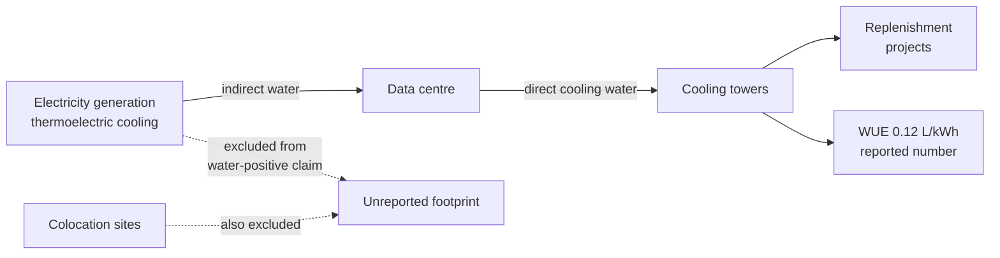

For years the cloud giants treated their water use the way a poker player treats a strong hand: hold it close, reveal nothing, smile. That changed on 10 June 2026, when Amazon finally put a single global figure on the table.

Amazon Web Services withdrew 2.5 billion gallons of water for its data centers in 2025, the company disclosed on June 10.

The company said it "returned" two-thirds of that water back to communities it operates in, mainly by investing in public infrastructure projects, as part of a broader goal to be "water positive" by 2030. By disclosing this data for the first time, Amazon joins its competitors Google, Meta, and Microsoft, each of which have reported aggregate totals for water withdrawal and replenishment dating back to at least 2020.

Good. Transparency is a feature, not a favour. But I've sat through enough of these disclosures to know the rule: read the boundary before you read the number. And the boundary on this one does a lot of quiet work.

## what got measured, and what got left out

Amazon leads on one metric, and the engineering behind it really is strong.

The company reported a water usage effectiveness (WUE) of 0.12 liters per kilowatt hour, down from 0.15 in 2024.

That metric has improved by 52 per cent since 2021, and the company claims it's roughly seven times better than the industry average of 0.84 L/kWh.

For comparison, Microsoft's most recently reported WUE was 0.27 liters per kilowatt hour.

The gains come from real choices: Amazon is increasing its use of recycled water for cooling applications and running its servers at hotter temperatures to decrease its freshwater withdrawals.

26 facilities currently operate entirely on recycled water, while an additional 130 sites are under contract to do the same.

I'll give them that. The cooling story is genuine. The accounting story is where I'd push back.

The 2.5-billion-gallon figure is the water that flows through Amazon's cooling towers, the direct on-site draw.

The figure covers owned and leased sites but excludes colocation facilities and water used to generate electricity.

That last exclusion is the whole game. Because the majority of the water a data centre is responsible for never touches the building.

Thermoelectric power plants (gas, coal, nuclear) evaporate enormous volumes of water to make steam and to cool.

Given that 176 terawatt-hours of electricity were consumed by data centers in 2023, the centers' indirect water consumption can be estimated at 1.2 gallons per kWh on average nationally.

Scaled across the country, that ratio produces a very different order of magnitude.

a federal report estimated that the indirect water consumption footprint of data centers in the United States was roughly 211 billion gallons in 2023.

Two hundred and eleven billion gallons of indirect draw, against direct cooling water in the low tens of billions. The water that matters most is the water nobody puts in the press release.

## the leaked launch memo

We don't have to guess whether this boundary was drawn deliberately. We have the document.

In November 2022, AWS announced a new sustainability campaign, 'Water Positive', with a commitment to "return more water than it uses by 2030". The leaked document, titled 'AWS Water Positive Public Launch' and dated one month before the launch, sets out the campaign's strategy.

The strategists were explicit.

As part of the campaign, Amazon planned water efficiency savings to cut its 7.7 billion-gallon primary consumption to 4.9 billion by 2030 without addressing secondary use.

On whether to count the water used to generate their electricity, they wrote that including a higher estimate "would double the size and budget" for the campaign "without addressing meaningful operational, regulatory or reputational risks", adding that there was "no focus from customers or media" on water used for electricity.

The same memo flagged the obvious hazard: selective disclosure could lead to accusations of a cover-up. There was "reputational risk of publicly committing to a goal for only a portion of Amazon's direct water footprint".

So the boundary was chosen with eyes open, on the calculation that no one would look. That calculation was probably right in 2022. It is wrong in 2026.

## how the rest of the sector reports

Before this turns into an Amazon pile-on, the inconsistency is industry-wide, and the disclosures are getting slipperier. Microsoft's headline improvement deserves the same scrutiny.

Microsoft reports a drop in water consumption from almost 8 billion liters in 2023 to almost 6 billion liters in 2024. This initially appears positive until one notes the switch in methodology: Microsoft now estimates water withdrawals based on water use efficiency metrics, rather than direct measurements. In short, the numbers changed because the method did.

Google has moved towards openness, though it took a lawsuit to get there.

The shift followed The Oregonian/OregonLive's lawsuit against the city of The Dalles, Oregon, seeking documents showing how much water Google consumed to cool its data centers in the region. The parties ultimately settled, with the city and Google agreeing to disclose annual water use. The resulting documents reveal that Google quintupled its water consumption in The Dalles between 2012 and 2025, to about 550 million gallons, or nearly 40 per cent of the city's total water consumption last year.

Forty per cent of a town's water for one company's servers. That is the kind of local fact no aggregate global number will ever surface.

And the "water positive" replenishment math has its own soft spots.

Google reports that it replenished 64 per cent of its freshwater consumption in 2024, up from 18 per cent the year before. And 28 per cent of total withdrawals occurred in regions with medium or high water stress, exacerbating local vulnerability even as Google celebrates replenishment programmes.

A gallon replenished in a wet basin does not offset a gallon evaporated in Arizona. Water is local. The accounting pretends it's fungible.

## why this stops working in 2026

The reason these disclosures are arriving now is pressure, applied from two directions at once.

From investors: in April 2026, more than a dozen investors began pressuring Amazon, Microsoft, and Alphabet's Google to provide detailed data on water and energy consumption at their U.S. data centers. The pressure comes as all three companies have recently scrapped multibillion-dollar data center projects following community opposition, and as North American data centers consumed nearly 1 trillion liters of water in 2025.

The investors are not asking for global aggregates.

Site-level data matters because it helps investors to better assess the operational risks and the performance of the company in managing them.

Exactly the data the global figure obscures.

From regulators: the voluntary era is ending.

The disclosure comes as U.S. states move toward stricter water reporting requirements for large data centers in 2026.

EPA rules taking full effect in 2026 require NPDES permits for cooling tower blowdown and mandate Legionella Risk Management Plans for large facilities.

Once water reporting is a permit condition rather than a marketing decision, the boundary you drew for the campaign stops being yours to draw.

The demand backdrop guarantees the issue won't fade.

Electricity demand from data centres soared by 17 per cent in 2025, well outpacing growth in global electricity demand of 3 per cent, and electricity consumption from data centres is set to double by 2030.

Every one of those new terawatt-hours drags indirect water behind it, the 211-billion-gallon column that today's reports leave blank.

Amazon's board should be asking why the cooling-tower number gets published to three significant figures while the larger, electricity-driven footprint goes unmeasured. That is the number a state regulator, a drought, or an investigative reporter will eventually print, on their terms. The 2.5-billion-gallon disclosure is real progress. It is also a defensive perimeter drawn around the easy number, and perimeters drawn for a 2022 audience don't hold against a 2026 one. Disclose the indirect water, or have it disclosed for you. There's no third option that survives the decade.

* * *

Tarry Singh is the founder and CEO of Real AI (realai.eu), an enterprise AI advisory and deployment firm working with global enterprises on production agent systems, model risk, and AI sovereignty strategy. He also leads Earthscan (earthscan.io) for Energy AI, and is a founding contributor to the EU-funded HCAIM and PANORAIMA programmes for responsible AI education across European universities. He writes at tarrysingh.com.
