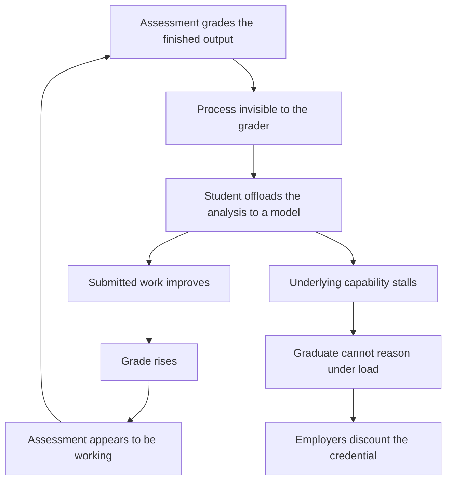

# Sunday Essay · AI Literacy Is a Curriculum Word for an Assessment Problem

Two institutions on two continents moved on the same problem within eight days of each other this month.

On 11 May 2026 the Council of the European Union adopted conclusions on artificial intelligence in education. The text asks member states to pursue an "ethical, safe and human-centred" approach, to strengthen AI literacy, to support teachers, and to protect critical thinking, the Council's own phrase ([Council press release](https://www.consilium.europa.eu/en/press/press-releases/2026/05/11/ai-in-education-council-calls-for-human-centred-approach/)). A week before that, the State University of New York (a single system of 64 campuses) had its decision reported: the Board of Trustees adopted a systemwide AI policy and a revised general-education framework that embeds AI literacy into the requirements of every incoming undergraduate from the Fall 2026 intake ([Inside Higher Ed](https://www.insidehighered.com/news/student-success/academic-life/2026/05/04/suny-sets-systemwide-ai-policy); [SUNY board resolution](https://www.suny.edu/about/leadership/board-of-trustees/meetings/webcastdocs/Reso_SUNYSystemwideAIPolicy_April2026.pdf)).

Both moves are serious. Both are the right instinct. And both, I think, are reaching for the cheaper of the two tools the problem actually requires.

"AI literacy" is a curriculum word. It names something you add: a module, a learning outcome, a box on a degree audit. The problem it is being asked to solve lives in assessment. And assessment is the expensive, slow, faculty-labour-intensive part of a university that no policy conclusion and no board resolution has yet been willing to touch.

## what the pocket calculator actually settled

We have run a version of this experiment before, and the closest precedent is the pocket calculator.

When affordable electronic calculators arrived in classrooms through the 1970s, mathematics education had something close to a nervous breakdown about it. The fear was the fear you hear today, almost word for word: students would stop learning the underlying thing (arithmetic, number sense) because a machine would do it for them. That fear was reasonable. It was right about the mechanism and wrong about the outcome, and the reason it was wrong is the part everyone now forgets.

The calculator did not become safe because students became "calculator literate." It became safe because educators drew a line. They decided, explicitly and after a great deal of argument, which cognitive work the machine was allowed to absorb and which cognitive work remained the point of the exercise. Long division by hand stopped being sacred. Estimation, number sense, knowing whether an answer was plausible, setting the problem up in the first place. Those were ringfenced. And they were ringfenced in the assessment. There were calculator papers and non-calculator papers. Nobody put that line in the syllabus. It sat in the exam hall.

That is the move. The calculator generation did not teach a unit called "calculator literacy" and call the job done. They re-architected what got tested without the machine. That decision is what preserved numeracy through a tool that could plausibly have hollowed it out.

The calculator was a narrow tool. It absorbed exactly one slab of cognition: mechanical computation. That made the line easy to draw. A large language model is a general tool. It can do the mechanical part, the reasoning part, the structuring part, and the writing part: the work that was the computation and the work that was supposed to be the learning, all in one pass. The line the calculator generation drew in an afternoon is, for AI, genuinely hard to draw, because the tool respects no natural boundary in the work. It still has to be drawn.

Wikipedia, twenty years ago, was the smaller rehearsal. It triggered the same panic and resolved the same way. Educators quietly decided that the citation, the cross-check and the synthesis were the graded skills, and left the lookup ungraded. Again, a decision about what to protect, made in the assessment.

## what the offloading research shows

The research on student behaviour points somewhere else entirely.

A 2025 study in the journal *Society* examined AI tool use and critical thinking across age groups and found a significant negative correlation between frequent AI use and critical-thinking scores, with cognitive offloading as the mediating mechanism, and the steepest effect in the 17-to-25 cohort, which is to say the undergraduate population ([*Society*](https://www.mdpi.com/2075-4698/15/1/6)). Separate work on university students found that greater AI dependence tracked with lower critical thinking, partly through cognitive fatigue ([study in *Computers in Human Behavior*](https://www.sciencedirect.com/science/article/pii/S0001691825010388)). The Hechinger Report, which covers education with actual reporters rather than press releases, put the campus version plainly: students are offloading the hard part (the analysis, the synthesis, the struggle) to the machine ([Hechinger Report](https://hechingerreport.org/proof-points-offload-critical-thinking-ai/)).

I want to be careful with these studies. Correlational findings about "critical-thinking scores" carry real measurement baggage, and the causal arrow is not nailed down. Discount them accordingly. But the direction is consistent across methods, and the mechanism, offloading, is not mysterious.

Students offloading cognitive work to AI are not suffering from a literacy deficit. They understand the tool perfectly, better than the committees writing the policies. What they are doing is responding, rationally, to an assessment system that rewards a finished output and is structurally blind to the process that produced it. A take-home essay graded on the essay cannot tell the difference between a student who wrestled with the argument and a student who prompted for it. The incentive is doing exactly what incentives do.

A literacy module does not change that incentive by one degree. You can teach an eighteen-year-old the mechanics of transformer models, the ethics of training data, the failure modes of confident fabrication (all of it, a full semester) and then send them back into a degree where every other course still grades the output and cannot see the process. They will use the tool exactly as before, and now they will do it with a vocabulary. We will have produced students who are fluent about AI and still quietly de-skilling, and we will have a learning outcome on a transcript that says we addressed the matter.

## a thing I changed in my own classroom

I teach. I am a visiting professor in the Netherlands and Italy, and I was a founding contributor to HCAIM, the Human-Centred AI Master's, funded by the EU's Connecting Europe Facility and built across four universities: TU Dublin, HU Utrecht, the University of Naples Federico II, and Budapest ([HCAIM](https://humancentered-ai.eu/)). So this is not a column written from a comfortable distance from the marking pile.

Two years ago I ran a module where a third of the grade was a written analytical assignment, submitted as a document. The work that came back was, on the surface, better than any cohort I had taught: cleaner structure, fewer errors, more confident prose. It was also, when I sat with students afterward, thinner than it looked. Several of them could not defend a choice they had supposedly made in their own submission. Not because they were dishonest. Because the submission was a negotiation with a model, and that negotiation was the work they had actually done.

So I changed the assessment. The written piece stayed, but it stopped carrying the grade. The grade moved to a fifteen-minute oral defence: sit down, here is your own submitted work, walk me through this decision, and now here is a variation on the problem, solve it while I watch. The cohort average dropped. The complaints went up. And the signal, the thing a grade is supposed to be, came back to life. I could see again who could think.

That redesign cost me time, it cost the students comfort, and it does not scale cleanly to a lecture hall of 400. The fix that works is the expensive one. The fix that is being legislated is the cheap one.

## the credential floor, with the floor removed

There is a second-order consequence here, and it is existential rather than pedagogical.

Ask employers in 2026 what a degree is worth and you get a consistent answer: a floor. Hiring for AI-adjacent roles now weights demonstrated, applied skill (portfolios, real project work, the ability to explain a result to a non-expert) over the credential and the grade-point average. The degree still functions, but mostly as a baseline filter, and what sits above the filter is evidence of capability the institution did not itself supply.

A credential is a compression. It says: the holder of this can, unaided, do a defined set of things. That claim is only worth something if the assessment behind it actually tested the unaided part. If a university grants degrees on the back of assessments that were quietly automated by the students taking them, it fails those students and debases its own currency. The signal degrades for everyone holding it, including the graduates who did the work honestly.

This is the real threat to the university, and it is worth being precise about it. It is a decade of credentials issued against assessments that no longer measure what the credential claims, discovered slowly, by employers, in the form of graduates who present well and cannot reason under load. No press release reverses that discovery. It is the kind of reputational erosion that took accountancy and parts of management consulting years to climb back from after their own measurement failures.

## what the European instruments do and do not reach

I am, for the record, broadly glad about the European motion here, and I want to give it its due before saying what it misses.

The Council conclusions are a good document. The AI Literacy Framework that the Commission has been developing with the OECD and G7 endorsement, aimed at primary and secondary education, is genuinely useful. A framework teaches nobody anything by itself, but it gives 27 fragmented national systems a shared vocabulary to argue in ([European Education Area](https://education.ec.europa.eu/event/empowering-learners-for-the-age-of-ai-launch-of-the-draft-ai-literacy-framework-and-stakeholder-consultations)). The AI Skills Academy, due to launch this year under the AI Continent Action Plan and including a pilot generative-AI degree, is a real instrument for producing AI specialists ([AI talent, skills and literacy](https://digital-strategy.ec.europa.eu/en/policies/ai-talent-skills-and-literacy); [AI Continent Action Plan](https://digital-strategy.ec.europa.eu/en/factpages/ai-continent-action-plan)). PANORAIMA, the follow-on to HCAIM, carries that human-centred curriculum work forward across a wider partnership of universities.

Now the limits. The Council conclusions bind nobody. They point a direction and create no obligation. The AI Skills Academy is a supply-side mechanism: it produces experts, which Europe genuinely needs, but it does nothing for the cognitive development of the median undergraduate reading history or law or nursing, who is the person actually at risk here. And the whole European package shares one omission with SUNY's, and with the US Department of Education's recent release of $169 million in postsecondary improvement funding that name-checks AI ([US Department of Education](https://www.ed.gov/about/news/press-release/us-department-of-education-announces-release-of-169-million-under-fund-improvement-of-postsecondary-education)). Not one of these instruments mandates, funds, or even seriously describes assessment reform. "Human-centred" is the correct value. It is, for now, a value without a mechanism.

## the line we have not drawn

AI literacy delivered as a bolt-on general-education requirement (a module, a learning outcome, a box) will probably fail at the thing it is being sold to do. It will produce measurable compliance and very little protection. A university board should refuse to approve the literacy line item until the assessment-reform line item next to it is funded first, and funded larger. The order matters. Literacy without assessment reform is decoration. Assessment reform without a literacy component is at least a floor.

What the calculator generation got right was a decision about what to protect and where to protect it. They protected it in the exam hall. Education needs the same decision now, and it needs it quickly, because every cohort that passes through unreformed is a cohort whose credential is worth a little less than it claims.

Concretely, that means a small number of unglamorous things. Define a no-AI core for each discipline (the capabilities a graduate must demonstrate unaided, the equivalent of the non-calculator paper) and test exactly those, in person, under observation, without apology. Move grade weight onto process and defence: oral examination, supervised in-class work, version history, the live variation on the problem. Stop spending money on AI-detection software, which does not work reliably and never will, and redirect it to the faculty time that real assessment costs. And treat AI literacy as what it is: a necessary vocabulary that safeguards nothing on its own.

The two institutions that moved this fortnight saw the problem clearly. The Council named critical thinking as the thing at stake, which is precisely the right thing to name. SUNY put a stake in the ground across 64 campuses, which is more than most systems have managed. I am not arguing with the direction. I am saying the instrument is one size too small for the problem, and everyone involved knows which instrument the problem actually needs. It is the one that costs faculty time, lowers averages, generates complaints, and does not photograph well in a press release.

We will draw the line eventually. The only open question is how many graduating classes we let through before we do.

---

*Tarry Singh is the founder and CEO of [Real AI](https://realai.eu), an enterprise AI advisory and deployment firm working with global enterprises on production agent systems, model risk, and AI sovereignty strategy. He also leads [Earthscan](https://earthscan.io), an Energy AI startup, and is a founding contributor to the EU-funded HCAIM and PANORAIMA programmes for responsible AI education across European universities. He writes at tarrysingh.com.*
