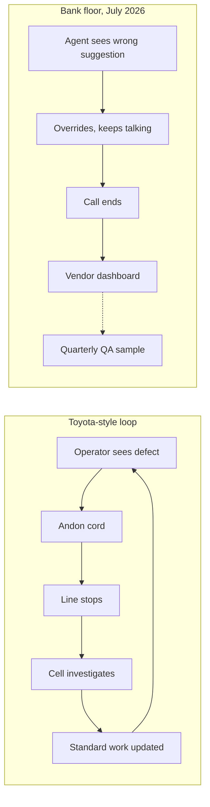

# Sunday Essay · Banks Turned On the Contact-Centre Line Before the Standard Work Existed

"EricaAssist reflects our high tech, high touch approach," said Ashley Ross, Head of Consumer Client Experience and Business Transformation at Bank of America, in the company's own [21 July 2026 press release](https://newsroom.bankofamerica.com/content/newsroom/press-releases/2026/07/bank-of-america-enhances-ericaassist-with-generative-ai-to-help-.html) announcing the enhanced generative-AI features. The tool now supports more than 18,000 employees during live client calls, offers contextual guidance in under 3 seconds, and reduces the average call time by close to a minute. To an operator who ran a metal-stamping line in the 1980s, "high tech, high touch" is not a philosophy. It is a description of a machine that runs at speed while a human keeps an eye on the tolerances. The analogy is exact. It is also the thing the bank is not saying out loud.

I want to spend this Sunday holding those two chairs next to each other, the client-experience chair on the sixth floor and the plant-floor chair on the shop level, because US banks in the last hundred days have quietly turned on an industrial system that they still describe as a service upgrade. It is a production line, described by an institution whose vocabulary was written for a service business. And the discipline that produces good units on production lines was written down forty years ago in Aichi Prefecture, by people who never met a compliance officer. Banks have skipped the reading. And the regulator has quietly stepped back from setting the reading list.

## What actually got turned on

The Bank of America announcement is one of four large-cap US rollouts that landed in a short window. JPMorgan Chase's [LLM Suite](https://thedigitalbanker.com/jpmorgan-chases-llm-suite-drives-ai-transformation-across-the-enterprise/) now sits inside the daily workflows of more than 230,000 employees, and the firm is on a trajectory from roughly 450 production use cases toward a stated internal target of 1,000. Jamie Dimon's [2025 shareholder letter](https://www.jpmorganchase.com/ir/annual-report/2025/ar-ceo-letters) frames AI as touching "virtually every function, application, and process in the company." That is a striking line for a CEO letter. To anyone who has ever walked a factory receiving a new automation module, it reads exactly the way a plant manager talks when the whole line is being rewired while orders keep going out the door.

Goldman Sachs' internal assistant, per [Fox Business's June 2025 coverage of the firmwide launch](https://www.foxbusiness.com/technology/goldman-sachs-announces-firmwide-launch-ai-assistant), reached all 46,000 employees. Wells Fargo's Fargo virtual assistant, powered inside a Google Cloud environment, has passed [245 million annualised interactions](https://umatechnology.org/wells-fargos-ai-assistant-just-crossed-245-million-interactions-no-human-handoffs-no-sensitive-data-exposed/), with zero human handoffs on completed sessions. Treat those figures with care, because most of them come from the operators themselves. The fact remains that four US institutions holding a combined book north of $10 trillion in assets now run customer-facing and internal AI systems at industrial scale. The pilot phase is over. This is production. When call durations shorten by close to a minute across 18,000 EricaAssist stations, the daily throughput implied is a heavy-industry number, not a customer-service one.

## The rulebook the industry expected

Anyone in the second decade of a US financial-services career was trained on one dominant reference for how a bank is allowed to run a model in production: Federal Reserve [SR 11-7](https://www.federalreserve.gov/supervisionreg/srletters/sr1107.htm), issued in April 2011, and its OCC counterpart. For fifteen years, every quantitative model at a US bank (every credit-score cut, every loss-forecasting engine, every stress-test cash-flow projection) lived inside its three-legged stool of development, implementation, and validation, with the last leg walked by an independent group and reported to the board. SR 11-7 was demanding, and it was knowable. You could point at the manual.

On [17 April 2026](https://www.occ.treas.gov/news-issuances/news-releases/2026/nr-occ-2026-29.html), the OCC, the Federal Reserve, and the FDIC jointly issued revised model-risk-management guidance and formally rescinded SR 11-7. The reissued text lives in [OCC Bulletin 2026-13](https://www.occ.gov/news-issuances/bulletins/2026/bulletin-2026-13.html) and its Federal Reserve twin, [SR 26-2](https://www.federalreserve.gov/supervisionreg/srletters/SR2602.htm). It does two things at once. It preserves and slightly modernises the effective-challenge discipline for classical models. And, in the sentence that mattered and did not get the coverage it deserved, it *explicitly excludes generative and agentic AI models from its scope*, on the stated basis that these technologies are "novel and rapidly evolving." The [Sullivan & Cromwell analysis](https://www.sullcrom.com/insights/memo/2026/April/OCC-Fed-FDIC-Issue-Revised-Guidance-Model-Risk-Management) of the same bulletin confirms the carve-out and notes the agencies' promise of a later request for information covering AI specifically.

Hold those two facts together. In the same fiscal quarter that Bank of America, JPMorgan Chase, Goldman Sachs, and Wells Fargo threw the switch on production-grade generative-AI systems inside their retail and workforce workflows, the three federal supervisors that would normally set the QA rulebook for those systems put out an update that says, in effect, we will get to you later. There is no equivalent of SR 11-7 for LLM Suite, EricaAssist, or the Goldman assistant right now. The line is on. The rulebook is deferred.

## Jidoka and standard work

A useful frame here is the one Taiichi Ohno wrote in postwar Nagoya and Eiji Toyoda formalised into what the world now calls the Toyota Production System. Two of its four load-bearing ideas apply almost verbatim to a bank running an AI system at industrial scale. They map directly.

The first is *jidoka*, the discipline of building machines that stop themselves the instant they produce a defective part, and of authorising the line worker nearest the defect to halt the line while it is investigated. In a bank contact centre where EricaAssist is prompting an agent in under 3 seconds, the *jidoka* question is stark. What does "stopping the line" look like when the machine gave the agent a wrong instruction, and who is authorised to press the button? At Toyota the answer is a physical cord above every station and a rule that any worker who pulls it is thanked, not punished. At Bank of America, the equivalent is a customer service rep on hour six of a shift, watching a suggestion that reads plausibly but contradicts the actual account terms, and calculating whether flagging it is worth the queue time it will cost them. Nothing in the [Bank of America release](https://newsroom.bankofamerica.com/content/newsroom/press-releases/2026/07/bank-of-america-enhances-ericaassist-with-generative-ai-to-help-.html) describes that mechanism. Nothing in [OCC 2026-13](https://www.occ.gov/news-issuances/bulletins/2026/bulletin-2026-13.html) requires it.

The second is *standard work*, the written, revisable specification of how a task is currently done best, kept by the people doing it, used as the baseline against which every improvement is measured. In a plant, standard work is the reason you can compare shift A to shift B and know something real. In a bank contact centre with an AI assistant, standard work is what tells you whether the average one-minute call reduction Bank of America is reporting is a genuine productivity gain, an artefact of shorter but incomplete resolutions, or a queue-management side effect of the AI shepherding agents past longer conversations. Without a written standard-work definition per call type, none of those three explanations can be distinguished from a spreadsheet at head office. The metric Bank of America is announcing is real. It is also, without a plant-floor discipline behind it, uninterpretable at the level of the individual agent's day.

None of this is a call for a heavier regulator. Ohno's genius was that his discipline was built by the line, for the line, and only later codified. A US bank could write its own version of this next week. The question is whether it is being written, and by whom, and against what specification. The public evidence is not encouraging.

## The voice arguing the other side

The strongest disagreement with this reading comes, honourably, from the operators themselves. Jamie Dimon's [2025 shareholder letter](https://www.jpmorganchase.com/ir/annual-report/2025/ar-ceo-letters) and his subsequent [comments on a three-and-a-half-day workweek](https://fortune.com/2026/04/06/jpmorgan-ceo-jamie-dimon-ai-cut-workweek-3-5-days-gen-z-developing-eq-important/) amount to a claim that JPMorgan's internal controls are heavier than the outside observer can see, and that the bank's roughly eighteen-billion-dollar annual technology spend, with a bit under a fifth of it earmarked for AI, includes the compliance apparatus a critic like me is asking about. Ashley Ross's high tech, high touch line is the same claim in a different register. On this reading, the plant-floor discipline exists. It is proprietary, unbadged, and does not need to be visible to be real.

I take the claim seriously and answer it on the merits. Two things go against it. First, the [Consumer Financial Protection Bureau's issue spotlight on AI chatbots in banking](https://www.consumerfinance.gov/about-us/newsroom/cfpb-issue-spotlight-analyzes-artificial-intelligence-chatbots-in-banking/) documents a pattern in which bank chatbots have failed to recognise when a consumer is invoking a federal right, misstated account terms, or exposed customer data. The CFPB's stated posture is that no new AI-specific rule is coming, because the existing consumer-financial-protection laws already apply. That posture looks light. In practice it is punitive: a wrong answer from EricaAssist that harms a customer is a UDAAP problem the day it happens, not the topic of a later rulebook. Second, the [Bank for International Settlements Annual Economic Report 2026](https://www.bis.org/publ/arpdf/ar2026e1.htm), published June 28, names an AI capex bust and circular financing among its top three threats to global financial stability. The BIS is describing the balance-sheet backdrop against which every bank AI programme is being funded, and it is warning central bankers that the funding case may not hold. Both observations sit outside the operators' walls. Both cut the same way.

The precedent worth remembering comes from an airline. In [Moffatt v. Air Canada](https://gc.ai/blog/ai-hallucination-legal-cases), a British Columbia tribunal ordered the airline in early 2024 to honour a bereavement-fare policy its chatbot had invented, on the basis that the company was responsible for the statements its automated agents made to customers. That decision has been cited hundreds of times in US and Canadian filings since. Financial-services counsel are aware of it, and so, in all likelihood, is every board audit committee at the four US banks named above. The theory of the case that a bank will not own its chatbot's mistake did not survive contact with a single small-claims tribunal in British Columbia. It will not survive the CFPB.

## What the controls would look like

There is a middle path here, and it does not require anybody to slow the rollout. Toyota did not slow production to install *jidoka*. It installed *jidoka* because production could not be trusted without it, and the arithmetic favoured stopping a bad line at station four over shipping a bad car from station forty. The equivalent inside a bank is unglamorous: a small set of things that any of the four institutions above could commit to publicly, this quarter, without waiting for the successor to SR 11-7.

A per-call-type standard-work definition, jointly maintained by contact-centre supervisors and the model team, versioned in the same repository the model itself lives in. A structured override log, so that every time an agent departs from an EricaAssist suggestion the reason is recorded in one of a small number of coded categories, and the log rolls up into a weekly dashboard the model owners are required to read. A defined stop-authority: a named role, escalatable within a shift, empowered to pause the AI-assistance layer on a team when a pattern of bad suggestions surfaces. And an independent-lineage QA sample: some fraction of interactions graded by a system whose model provenance is different from the one under test, because a house-brand grader marking the house-brand assistant's work is not, in the SR 11-7 sense, an independent challenger. None of these is exotic. All of them exist in some form inside industries that produce physical goods. None, as far as the public record shows, has been made a first-class part of the four rollouts above.

## Field note: a supervisor's Monday morning

There is a floor in Charlotte, North Carolina, and I have not walked this one, so I will not describe it in detail. A shift supervisor there will come in on Monday, July 27, and look at the morning dashboard. Average handle time will be down by roughly the minute Bank of America has told the market it is down by. First-call resolution will look flat, or slightly up. Two things that would matter more will not be on the screen. She will not see, in any comparable way, how often an agent overrode a suggestion the AI made, and whether the override was right or wrong. She will not see what a caller would have been told if the same call had come in through the pre-EricaAssist workflow. Both measurements are technically possible. Neither, as far as the public record goes, has been made a first-class metric.

Her Monday is the honest test of every claim in this essay. If she has been given the authority to pause deployment on her team when a pattern of bad suggestions surfaces, and a route to escalate it into a validation queue that a human being reads, then the plant-floor discipline is present under a different name and this whole essay is a worried misreading. If she has not, if her escalation path is a satisfaction survey that reaches her manager at end of quarter, then the machinery on her floor is running ahead of the standard work that would let anyone tell whether it is running well. She is the sensor. She has been handed a very quiet cord to pull, or perhaps no cord at all. She is the person who will find the first bad batch. The question the rest of the industry has left to her, unfairly, is whether she is going to be thanked for finding it.

---

*Tarry Singh is the founder and CEO of [Real AI](https://realai.eu), an enterprise AI advisory and deployment firm working with global enterprises on production agent systems, model risk, and AI sovereignty strategy. He also leads [Earthscan](https://earthscan.io), an Energy AI startup, and is a founding contributor to the EU-funded HCAIM and PANORAIMA programmes for responsible AI education across European universities. He writes at tarrysingh.com.*
