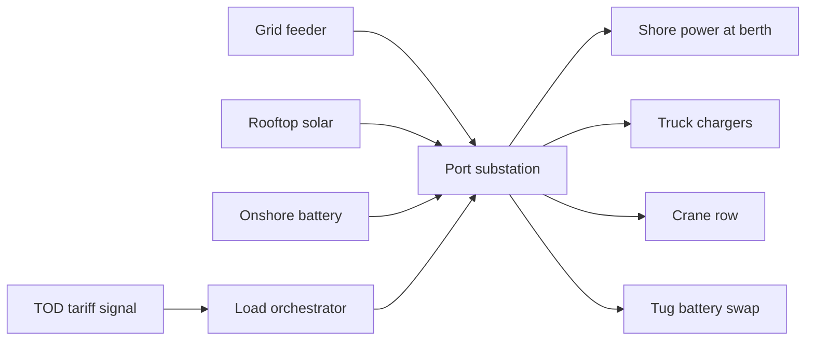

"We are building these vessels to last, to perform, and to demonstrate that Indian shipyards are ready to lead the industry's green transition." That is Shri Jose VJ, Chairman and Managing Director of Cochin Shipyard Limited, [in the June 9, 2026 announcement that ABB will supply power, propulsion, automation and digitalisation packages](https://maritime-executive.com/index.php/corporate/abb-and-cochin-shipyard-to-support-india-s-green-tug-transition-programme) for two battery-electric harbour tugs, each rated at 60 tonnes bollard pull, due for delivery to Polestar Maritime in 2027. The tugs will work at Jawaharlal Nehru Port Authority, India's largest container gateway. They are the first phase of a five-phase [Green Tug Transition Programme running to 2040](https://safety4sea.com/india-accelerates-green-transition-across-major-ports/), and the vessel-side engineering they represent is entirely correct.

What is missing from every press release that landed this quarter is the piece a substation engineer sees first: the load these tugs, together with an electrified truck fleet and an electrified crane row, will pull off the same feeder.

## The megawatt arithmetic

Read the JNPA fleet target in the same frame. In [September 2025 the Union Minister of Ports flagged off the first fleet of electric heavy trucks with swappable batteries at the port](https://www.autocarpro.in/news/jnpa-launches-indias-first-electric-heavy-truck-fleet-with-swappable-batteries-128910), 50 vehicles rising to 80 by year-end, with a stated target of converting 90 per cent of the port's internal fleet of roughly 600 trucks to electric power by December 2026. The battery-swap station on site exchanges a spent pack for a fresh one in seven minutes.

Hold three things at once. Each ABB-powered harbour tug will draw on an Onboard DC Grid architecture with battery storage and shore charging. A truck fleet at 540 heavy vehicles cycles through battery swaps at a pace of roughly one every seven minutes at capacity. The container crane row, if it moves at all in the manner of [the 15 APSEZ terminals now under the AI-augmented Kaleris platform](https://kaleris.com/news/apsez-partners-kaleris-accelerate-ai-led-transformation/), moves on grid power rather than diesel. Each is an electrification story on its own. Their arithmetic on the same substation is a different story, and one for which no port has yet published a public specification.

The renewable side of the ledger has been named. Deendayal Port at Kandla is adding around 20 MW of solar and wind. Visakhapatnam has 10 MW of solar. JNPA's own combined rooftop and ground-mounted solar sat at [about 4.10 MW as of 2023](https://solarquarter.com/2026/03/19/green-ports-india-accelerates-decarbonisation-of-port-operations-with-multi-pronged-initiatives/). Add every major Indian port's stated solar capacity together and the total sits one order of magnitude below the load a fully-electrified major port will pull once the diesel line is closed. The offset matters; it will not carry the ramp.

## What the feeder sees at 4 PM

The diagram is not exotic. Any industrial-load engineer has drawn it on a whiteboard since the 1980s. What is different in this decade is that the boxes on the right used to be on their own diesel generators. Now they share a substation, they share a tariff, and they share a feeder that a distribution utility has to keep from browning out.

Maharashtra's distribution utility MSEDCL manages the feeders that will carry Nhava Sheva's load. Its own dashboard is public: [demand catered on 8 September 2026 was 25,578 MW at morning peak, with the year's peak at 27,367 MW on 28 April](https://www.mahadiscom.in/en/msedcl-peak-demand-en/), still climbing on the cooling curve. Last October, MSEDCL [partnered with the Global Energy Alliance for People and Planet on a grid-digitalisation programme](https://solarquarter.com/2025/10/08/maharashtra-state-electricity-distribution-co-ltd-msedcl-partners-with-global-energy-alliance-for-people-and-planet-to-advance-grid-digitalization-across-maharashtra/) that names AI and ML for real-time asset monitoring, load-flow analysis and demand forecasting, plus battery energy storage integration for peak management. The utility is preparing for its side of the problem.

The port is not preparing for its side at the same pace. Nowhere in the JNPA electric-truck launch materials, nor in the ABB propulsion package, nor in the APSEZ decarbonisation outlay, is there a public specification of the load orchestrator that would sit between the substation and the equipment above. The equipment is being bought openly. The coordination layer is being deferred.

## A view from the expressway

I have driven the Mumbai-Pune expressway past the Nhava Sheva turnoff often enough to remember what the diesel truck queue looked like in the early 2000s: a slow river of tankers and reefers, the exhaust visible for a kilometre at the container gate, the shift-change light hanging over Uran township. The pollution was the story then, and everyone in Raigad knew it. The story quietly changed once you looked at it from the grid side rather than the tailpipe side. A queue of 600 diesel trucks is a fuel-supply problem. A queue of 600 electric trucks charging or swapping through the same shift window is a distribution-substation problem, and the two problems live in different ministries, with different vocabularies, on different balance sheets. The road looks the same. The substation does not.

The Ministry's Harit Sagar guidelines [require major ports to source over 60 per cent of their electricity from renewables by 2030 and to reach 90 per cent electrification of port equipment by 2047](https://safety4sea.com/india-accelerates-green-transition-across-major-ports/), with a 30 per cent cut in CO2 per tonne of cargo by 2030 as the floor. The targets are correct. What sits between the targets and the invoice is a load-management stack no Indian port has yet published a specification for, and no maritime supplier ships in the same crate as a tug.

## Where the bullish reading lands

The strongest published bullish reading of this transition, and the fairest one to engage with, is [KPMG's May 2026 piece on Indian ports as engines of the energy transition](https://kpmg.com/in/en/blogs/2026/05/green-corridors-reimagining-indias-ports-as-engines-of-the-energy-transition.html). It argues that the same coastal infrastructure that handles cargo can host green hydrogen production, ammonia bunkering and offshore-wind assembly, becoming a net exporter of clean energy rather than a net consumer of grid power. On the ten-year horizon that is plausible; Deendayal, Paradip and V.O. Chidambaranar have all been named as national Green Hydrogen Hubs.

Where I part company with the KPMG frame is the transition period. Between the diesel truck that leaves Nhava Sheva today and the port that ships green ammonia to Rotterdam in 2033 sits a five-to-seven-year window during which the port is a very large, very peaky new load on a distribution grid that was not sized for it. The window is where either the electrification pays back or the bills get ugly, and the piece of engineering that decides which is a load orchestrator that reads the TOD tariff signal, the shore-power draw, the battery-swap queue and the crane schedule in the same loop. That work is not glamorous. It does not fit inside a press release. It is exactly the piece the Ministry has not funded and the ports have not scoped.

The IEA's [April 2026 Key Questions on Energy and AI report](https://www.iea.org/news/data-centre-electricity-use-surged-in-2025-even-with-tightening-bottlenecks-driving-a-scramble-for-solutions) puts the pattern from the demand side. Its finding on proven AI applications is that they can help firms in energy-intensive industries cut energy costs by 3 to 10 percentage points; its finding on the constraint is that lack of digital skills and data availability are the two barriers holding the energy sector back from taking that up. The stack a port needs is not exotic. It is the demand-forecast, load-flow, tariff-optimisation software a large industrial estate already runs, wired to the specific asset classes a port operates. It is being under-bought because it is not what a maritime supplier ships next to a tug, and because no line in the Sagarmala budget is labelled for it.

## What a control panel will read in 2028

The Green Tug Transition Programme runs through 2040 in five phases. Phase-one vessels come into service in 2027 at JNPA. The truck fleet crosses 90 per cent electric by December 2026 if the current plan holds. The Kaleris platform deploys across the APSEZ terminals in two phases on a similar horizon. Every one of those is a step from press release to operating load. None of them ship the load orchestrator.

At some point in 2027 or 2028 a shift engineer in a JNPA substation control room will watch a ramp that looks nothing like the diesel-era load curve. Berth cranes moving during a discharge window will pull one profile. A row of truck chargers cycling battery packs will pull another. A tug on shore power will pull a third. The sun on 4 MW of rooftop panels will subtract a small, predictable slice. The engineer will read that composite against a MSEDCL tariff schedule and a feeder that has not been re-sized since the port was diesel. Whether the software on the screen in that room is any good will decide whether the year-end bill clears the diesel savings or does not. That software is not on any press release I have read this quarter. It is on the deferred budget line of every port I know of. The tugs and the trucks arrive on schedule; the reading of them arrives later, if at all. Somewhere in a switchyard behind the Nhava Sheva approach, a middle-aged shift engineer is going to inherit the problem, on a shift that already runs long.

---

*Tarry Singh is the founder and CEO of [Earthscan](https://earthscan.io), an Energy AI startup focused on remote sensing and earth observation for the energy transition. He also leads [Real AI](https://realai.eu), an enterprise AI advisory and deployment firm working with global enterprises on production agent systems, model risk, and AI sovereignty strategy, and is a founding contributor to the EU-funded HCAIM and PANORAIMA programmes for responsible AI education across European universities. He writes at [tarrysingh.com](https://tarrysingh.com).*
