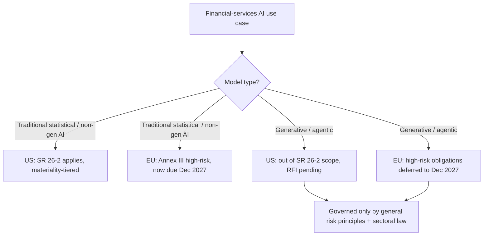

Two of the most consequential financial supervisors on the planet stepped back from AI oversight inside eight weeks. The Federal Reserve and its sister agencies did it on 17 April. The European Parliament did it the day before yesterday, on 16 June. In both cases the retreat lands on precisely the systems that worry me most — the generative and agentic tools now creeping into underwriting, fraud triage and AML.

Let me lay out what happened, because the coincidence is not being read correctly.

## What the Fed actually did to SR 11-7

For fifteen years, SR 11-7 was the spine of model governance in American banking. 

On 17 April 2026, the Federal Reserve, FDIC and OCC rescinded SR 11-7, OCC 2011-12 and related BSA/AML issuances, replacing them with a more explicitly risk-based, principles-driven framework for model risk management.

 The replacement is SR 26-2, and it is roughly half the length of what it supersedes.

The mechanical changes are real relief for smaller institutions. 

SR 26-2 replaces SR 11-7 after fifteen years; the biggest operational change is that annual revalidation is out and risk-based oversight tied to model materiality is in.

 The new guidance excludes simple arithmetic calculations such as those in spreadsheets, as well as deterministic rule-based processes and software, from the definition of a model.

 Anyone who has lived through an exam where end-user spreadsheets got dragged into the model inventory will recognise why that matters.

But here is the part that should make every chief risk officer sit up. 

The revised guidance explicitly excludes generative and agentic AI models from its scope, on the basis that these technologies are "novel and rapidly evolving."

 It still covers traditional statistical models and non-generative AI. The newest, least understood category — the one banks are racing to deploy — is carved out, with the agencies planning to issue a request for information that addresses model risk management generally and considers, in particular, banks' use of AI, including generative AI and agentic AI.

So the US position is: the riskiest models are out of the formal framework, and we'll get back to you with an RFI. Vendors have been quick to fill the vacuum — one platform provider frames the shift as banks needing "a single governed lifecycle" generated as a byproduct of normal work. Convenient, given they sell the platform. The supervisory reality underneath the marketing is blunter: 

banking organisations should apply their broader risk management and governance practices to generative and agentic AI models, which are not exempted from risk management expectations but subject to those that apply generally.

 Translation — you're on your own, govern it anyway.

## What the EU did on Monday

Now the other side of the Atlantic. The EU AI Act was meant to bite for high-risk financial systems — credit scoring, fraud detection, creditworthiness — on 2 August 2026. That is no longer happening on schedule.

On 16 June, the European Parliament adopted the AI Omnibus by a majority of 423 votes in favour; the adopted text weakens AI Act protections, delays the enforcement of key provisions and empowers industry actors.

 The headline number: 

the obligations for high-risk systems that would have started on 2 August 2026 are pushed to 2 December 2027, sixteen months later.

 One step remains — formal adoption by the Council, expected before 2 August 2026, after which publication in the Official Journal makes the new dates final.

The Council was candid about why. 

Given that high-risk provisions were due to enter into force on 2 August 2026, the co-legislators treated the proposal with utmost priority and broadly maintained the thrust of the Commission's proposal.

 The standards weren't ready, the notified bodies weren't ready, the national authorities weren't ready. So the rules move.

Both regimes, then, have pulled back from the same place at the same time. Picture where each category of financial AI now falls.

The agentic AML triage assistant and the LLM-based underwriting copilot sit in box G. No bespoke supervisory framework in the US, no live high-risk obligation in the EU until late 2027. That is the gap, and it is not a small one.

## The collision the ECB already named

Brussels has not been blind to the friction. Months before Monday's vote, the European Central Bank flagged a structural problem that the delay does nothing to resolve. In its Opinion of 13 March 2026, the ECB noted that 

AI systems intended to evaluate the creditworthiness of natural persons are high-risk under the AI Act, while under the Capital Requirements Regulation internal models play an essential role in credit approval and are closely interlinked with credit scoring models.

 The consequence is the part worth dwelling on: 

this may lead to a situation in which prudential supervisors, assessing the internal model, and the market surveillance authority, assessing the credit scoring model, provide different and potentially conflicting guidance.

That is the European version of the SR 11-7 problem — two authorities, two evidentiary standards, one model. The Omnibus delay buys time but doesn't reconcile the two regimes. It just postpones the day the seams show.

## What does not move with the deadlines

Here's where it gets uncomfortable for anyone reading the delay as a holiday. The compliance calendar moved. The risk did not.

AI-caused harm in 2026 is still subject to product liability, GDPR, anti-discrimination statutes and sector regulators. The hard part of AI Act readiness was never the documentation template — it's finding every AI system in your organisation, deciding which Annex III category each falls into, and getting product and engineering to maintain the inventory as new systems ship.

 None of that gets easier by waiting. Start now and you have eighteen months to refine; start in late 2027 and you have weeks.

And the underlying exposure is enormous, because adoption already ran ahead of governance. The ECB's economists put numbers on it: 

nearly 90% of significant euro area banks already use AI, with adoption especially high for fraud and cybercrime detection at more than half of banks, followed by marketing, chatbots and credit scoring.

 When ECB supervisors ran workshops with thirteen banks last year, the message back was confidence — many banks consider themselves well equipped to reap the benefits of AI while managing the risks, building on existing governance structures and long-standing experience with validation and control frameworks.

 I've sat in enough of those rooms to know that "we've got this" is exactly what a supervisor hears right before a model blows up.

The independent research is less sanguine. The Cambridge Centre for Alternative Finance found broad consensus on the top risks, with data privacy and model hallucinations rated the top two by AI vendors, industry and regulators alike.

 Hallucinations in a customer-facing finance bot are not a product-quality footnote; they're a conduct exposure. The delay doesn't change that arithmetic.

## My position

If I were on a bank board this quarter, I would push to treat both retreats as a trap, not a reprieve — and I'd put it in the minutes. The deregulatory framing being sold by Brussels and Washington alike is that simplification frees you to innovate. The practitioner's read is the opposite: supervisors have quietly told you they don't yet know how to examine your agentic systems, which means the burden of proving they're safe has shifted entirely onto you, with no template to hide behind and no deadline to wait for.

I'd bet against the firms that stand down their model-risk programmes on the strength of these headlines. The ones that win the next exam cycle will be the ones that built a single governed lifecycle covering classical models and generative agents together — not because either rulebook compels it today, but because the inventory, the effective challenge and the audit trail are the only things that survive whatever the RFI and the 2027 deadline eventually demand. The regulators blinked. The risk didn't even slow down.

---

Tarry Singh is the founder and CEO of Real AI (realai.eu), an enterprise AI advisory and deployment firm working with global enterprises on production agent systems, model risk, and AI sovereignty strategy. He also leads Earthscan (earthscan.io) for Energy AI, and is a founding contributor to the EU-funded HCAIM and PANORAIMA programmes for responsible AI education across European universities. He writes at tarrysingh.com.
