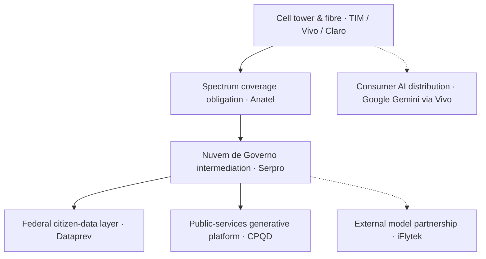

Sunday Essay · Brazil's Sovereign AI Runs Through the Cell Tower

A rain-slick access road climbs out of Petrolina in the Brazilian northeast, past a scatter of goats and a sun-bleached bus stop, up to a small green shed at the base of a forty-metre lattice tower. Inside the shed a technician in a reflective vest is coaxing a fibre splice into a cabinet that will, eventually, carry inference traffic for a Portuguese-language language model belonging to a state health system that does not yet exist. Nothing here looks like sovereign AI. That is because sovereign AI, in the country that will spend more on it this decade than any other in the Americas, does not look like a data centre or a supercomputer or a foundation model. It looks like a shed.

## An unfashionable answer to a fashionable question

There is a fashionable version of the sovereign-AI story that goes: a country decides to matter, buys 20,000 GPUs, builds a supercomputer with a flag on it, trains a language model in the local tongue, and joins the club of nations that can host their own frontier. That story has propelled a lot of column inches and a lot of ministerial photo ops. India has one version. France has another. The Gulf countries have a third. Brazil has, on paper, a fourth: the [Plano Brasileiro de Inteligência Artificial](https://www.gov.br/g20/en/news/brasil-launches-a-usd-4-billion-plan-for-ai-and-prepares-global-action) announced in 2024, worth R$ 23 billion through 2028, with headline items including a Santos Dumont supercomputer upgrade and a sovereign public cloud run by [Serpro and Dataprev](https://www.gov.br/governodigital/pt-br/noticias/novo-plano-brasileiro-de-inteligencia-artificial-preve-o-investimento-de-r-1-76-bi-para-melhoria-de-servicos-publicos).

Read the plan side-by-side with what is actually being wired together in 2026 and you find something more interesting. The load-bearing decisions are being made well below the top of the plan, at the seam where the country's three big mobile operators, TIM Brasil, Telefônica Brasil (Vivo) and Claro, meet the regulator, Anatel, and the two state IT companies that hold the keys to the federal cloud, Serpro and Dataprev. The sovereign-AI question, in Brazil, is a telecom question. It is being answered municipality by municipality, spectrum band by spectrum band, splice by splice.

## A small February contract with a large signal

On 24 February 2026, [Anatel signed a five-year multicloud and AI-services contract with Serpro](https://convergenciadigital.com.br/internet/anatel-contrata-nuvem-do-serpro-por-r-428-milhoes-para-aplicacoes-de-inteligencia-artificial/) worth R$ 4.28 million a year. Almost nobody outside the Brazilian telecom press covered it. The number is small. But read what the contract actually does. Anatel, the agency that runs 700 MHz auctions, sets spectrum policy, adjudicates carrier disputes, and holds the country's Call Data Record archive, is now buying its AI and analytics through a Serpro-mediated intermediation layer that negotiates across cloud providers while keeping restricted workloads inside a *Nuvem de Governo* boundary. In the [Serpro brief on the deal](https://www.serpro.gov.br/menu/noticias/noticias-2026/serpro-amplia-uso-de-dados-e-ia-na-anatel), the use cases listed include CDR processing, crowdsourcing analysis, SEI IA (the internal document assistant), and virtual assistants across the regulator's public interfaces.

This is a control story more than a technology story. When the country's telecom regulator moves its AI workloads through a state-owned intermediation layer, the effect over three to five years is that the regulator can no longer be told what it can and cannot do with the traffic data of the operators it regulates by a cloud vendor headquartered elsewhere. Whether that is good or bad depends on what you think of Serpro. It is unambiguously a jurisdictional shift, and it happened on a Wednesday for the price of a Barra da Tijuca two-bedroom.

## The base station is the policy instrument

On 16 April 2026, [Anatel closed the proposal window](https://www.telecompaper.com/news/brazil-receives-bids-from-8-companies-for-700-mhz-auction--1568246) for its 700 MHz spectrum auction. Eight companies submitted bids: Amazônia Serviços Digitais, Brisanet, Claro, Iez! Telecom, MHNet, Telefônica, TIM and Unifique. The auction covered residual 700 MHz spectrum with an obligation-heavy licence attached: buyers must service roughly [800,000 people across 864 small municipalities](https://www.telecomreviewamericas.com/articles/reports-and-coverage/brazil-invests-brl-2-billion-in-700-mhz-band/) that the market alone will not reach. Committed investment came in around BRL 2 billion.

Coverage obligations attached to a spectrum licence are, in 2026, an AI sovereignty instrument. Every one of those 864 municipalities becomes an inference edge point once the coverage arrives. Every one of them becomes a jurisdictional foothold for whichever cloud, model, or state agency reaches it first. Anatel has been quiet about this framing; coverage obligations were written for a pre-LLM voice-and-broadband world. But the [6 GHz split Anatel proposed](https://globalvalidity.com/brazil-anatel-proposes-6-ghz-spectrum-split-for-wi%E2%80%91fi-and-6g/) later in the same quarter, dividing 5.925 to 6.425 GHz for unlicensed Wi-Fi and 6.425 to 7.125 GHz for licensed 6G and IMT, will carry the same character. Whoever holds the licensed side inherits the physical layer of Brazil's on-device AI in the second half of the decade.

## The largest carrier quietly built the platform layer

On [1 March 2026, Telefônica Brasil (Vivo)](https://www.redhat.com/en/about/press-releases/telefonica-brazil-modernizes-it-cloud-infrastructure-red-hat-openshift-massively-boost-operational-efficiency) announced it had migrated its business-critical service bus from legacy virtualisation to Red Hat OpenShift. The vendor headline claimed a 99% reduction in resource-scaling time and a 95% reduction in storage consumption. Both figures are Red Hat-supplied vendor metrics rather than third-party benchmarks, and the baseline is deliberately unflattering.

The percentages matter less than the platform. The country's largest carrier by revenue has built what Red Hat and Telefônica jointly describe as a *sovereign- and AI-ready foundation*. That is marketing language. Underneath the marketing language sits a real architectural change: the platform Vivo runs its workloads on is now portable across on-premise, private cloud and public cloud, and its inference-serving path can be steered by policy rather than by procurement inertia. Two weeks earlier, [Google announced its Gemini AI Plus tier](https://blog.google/company-news/inside-google/around-the-globe/google-latin-america/google-for-brazil-2026/) is being distributed to Vivo customers under a promotional arrangement, and Google Cloud committed to tripling its Brazilian AI training pipeline to 3 million people. Vivo is now, simultaneously, a Google Cloud distribution partner in the consumer layer and a portable-platform operator underneath. That double role is the shape of sovereignty in a country that cannot yet make its own GPUs and knows it.

## The Unicamp critique

The Brazilian sovereign-AI story attracts a level of intelligent scepticism that the boosters would prefer to wave away. The Instituto de Economia at Unicamp published a widely-cited essay titled ["Da euforia à inquietação"](https://www.eco.unicamp.br/midia/o-plano-brasileiro-de-inteligencia-artificial-da-euforia-a-inquietacao) arguing that the PBIA at its release was closer to a PowerPoint than a plan, and that the country's underlying science-and-technology budget in 2022, [R$ 26 billion for the entire S&T portfolio](https://abes.org.br/en/plano-brasileiro-de-inteligencia-artificial-desafios-oportunidades-e-perspectivas-para-uma-ia-soberana/), makes an R$ 23 billion four-year AI carve-out sit awkwardly against the country's execution capacity for imported hardware. The objection is a serious one. Brazil does not fabricate high-end GPUs. It does not fabricate the memory. It does not fabricate the interconnects. Every rack in the Santos Dumont upgrade, every H200 that lands in a Serpro data centre, every 700 MHz radio hanging on a Petrolina tower arrives through a supply chain that begins in Taiwan, South Korea and the United States.

The Unicamp piece reads that dependency as fatal for the sovereignty claim. I read it as a constraint the plan is quietly designing around. No country outside the top three even pretends to close the supply chain, and Brazil is not trying. The Brazilian answer is to sovereign-ise everything above the physical chip: the placement, the routing, the workload boundary, the identity, the audit log, the language model, the fibre trench between the tower and the compute. That is a lower ambition than a chip fab, and it is a higher ambition than a data-residency clause. The plan's authors will not say this out loud because it is politically less impressive. But it is what is being built.

## The state IT companies are the pivot

[Serpro is building a 12 MW data centre](https://www.datacenterdynamics.com/en/news/brazils-serpro-to-build-two-data-centers-to-expand-processing-capacity/) in Brasília's Biotic technology park, designed to host AI workloads for federal ministries, with two sovereign cloud zones already operating in Brasília and a third planned via Telebras to complete the federal public cloud footprint. In April, Brazil's Ministry of Management and Innovation in Public Services signed a partnership with [CPQD worth BRL 390 million over four years](https://telesintese.com.br/governo-e-cpqd-preparam-nucleo-soberano-de-ia-para-servicos-publicos/) to build a generative-AI platform for public services. CPQD is the country's telecoms R&D centre, the successor institution to the old Telebras research arm. The state picked a telecommunications research institute over a general-purpose tech contractor to build the public-services platform, and that choice carries a premise. The premise, still unproven, is that the last-mile problem in a country of 213 million people is a telecom problem before it is a language-model problem.

The stack and the institutional footprint line up more neatly than the plan does.

There is a China leg to this that Brasília is willing to discuss and Washington is not, so I will. In 2025 Serpro signed a [Brazil–China cooperation protocol on AI](https://dig.watch/updates/brazil-serpro-iflytek-ai-cooperation) that included a technical partnership with iFlytek, the Anhui-based speech-and-language-model firm. The protocol has been operational through 2026. Whatever you think of Chinese state involvement in another country's public-sector AI stack, the fact that Brazil signed the deal at Serpro level and not at ministry level is telling. Serpro is the fulcrum. The state-IT company that runs the sovereign cloud is now also the state-IT company that negotiates AI cooperation abroad. That is the pivot Brasília has chosen, and it will pay for it in ways nobody in the Presidential Palace has priced yet.

## What is actually being metered

The temptation on a day like this is to run a number showing that Brazilian sovereign AI is either succeeding or failing. The measurement problem is too severe for that. The gap between what gets announced and what gets metered runs through every figure on offer. The PBIA counts committed reais rather than delivered inference. The carriers count subscribers, and say nothing about which workloads ran inside a sovereign boundary. Anatel counts spectrum revenue and coverage-obligation fulfilment; the share of national inference traffic that stays in Brazilian jurisdiction appears in no report. Google counts Gemini Plus trial activations. Enterprise migrations would be the number that mattered. Every dashboard is measuring the wrong denominator.

A supervisory function at the Central Bank of Brazil or at the Tribunal de Contas da União needs a different measurement. The one worth building is the fraction of production AI traffic (regulator, health system, judiciary, tax, banking) whose entire path stays inside a jurisdiction Brazil controls: data at rest, model at inference, telemetry, audit log. In 2026 that number is small and rising. In 2028 it will be the only sovereignty metric worth quoting. Until then, most of the numbers being reported are proxy variables, and the honest ones will admit it.

## The shape of sovereignty in a country that cannot make chips

Latin America is going to spend the second half of the decade being written about as if it were catching up. That framing will misread what is happening. Brazil cannot build a sovereign AI in the shape of the United States's or China's, and it knows that. What it is building is a stack in which the physical layer, the identity layer, the routing layer, the workload boundary and the language model *sit inside institutions the state can call at short notice*. TIM's fibre trench, Vivo's OpenShift cluster, Claro's tower on the coverage-obligated municipality, Anatel's Serpro-mediated cloud, CPQD's public-services model, Dataprev's citizen-data layer: different institutions, overlapping timelines, one architecture. The coherence of that picture is more visible than the plan admits.

For the rest of Latin America, Mexico, Chile, Colombia, Argentina, the question through 2027 will be whether the Brazilian pattern travels. My reading is that pieces of it will. Mexico's IFT does not have Anatel's institutional depth, and Mexico lacks a state-IT pair with the range of Serpro and Dataprev, but Telcel and AT&T México operate at similar scale and will be under similar pressure. Chile's Entel and Movistar have unusually strong local infrastructure and a state that historically leans on private-sector build; they will do a lighter version. Argentina is a case where the state does not have the fiscal room to run the play at all, and where the sovereignty question will be answered by whichever hyperscaler wires up Buenos Aires first. That is topography, and no amount of plan writes around it.

## For the tower technician

The technician finishes the splice, closes the cabinet, radios in the coverage confirmation, and drives back down the access road as the rain lifts. The village they just connected will not know its name is now written into a spectrum coverage obligation that Anatel counts against a licence a carrier holds subject to a regulator whose AI backbone is contractually attached to a state cloud that is negotiating a partnership with a Chinese language-model firm and a portable platform layer a Spanish operator built on an American software company's stack for consumption through a search-engine giant's Gemini tier. The technician knows the tower is up, the light is green, and there is a coffee at the roadside stand at the bottom of the hill. Nothing above them works if the shed is not on the tower and the fibre is not in the ground. The plan will be told in Brasília; the sovereignty was built in the shed.

* * *

*Tarry Singh is the founder and CEO of* [*Real AI*](https://realai.eu)*, an enterprise AI advisory and deployment firm working with global enterprises on production agent systems, model risk, and AI sovereignty strategy. He also leads* [*Earthscan*](https://earthscan.io) *for Energy AI, and is a founding contributor to the EU-funded HCAIM and PANORAIMA programmes for responsible AI education across European universities. He writes at tarrysingh.com.*
