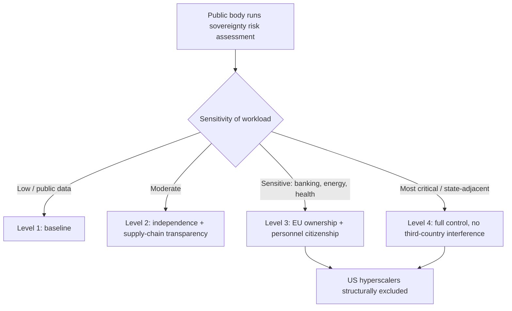

On 3 June, the European Commission did the thing it has been threatening to do for the better part of a decade. It put a number on dependence and then proposed a law to shrink it. 

The European Commission presented the European technological sovereignty package, a set of measures to strengthen the EU's capacity in semiconductors, artificial intelligence, cloud and open source.

The package brings together two legislative proposals (the Chips Act 2.0 and the Cloud and AI Development Act) alongside an EU Open Source Strategy and a Strategic Roadmap for Digitalisation and AI in Energy.

I've sat through enough of these launches to know the gap between a Commission communication and a running data centre. Part of this package is genuinely new. Part of it is theatre.

## the number that triggered the law

The Commission's own figures are the most honest part of the document. 

The communication states the EU remains structurally reliant on non-EU providers for more than 80% of digital products, services, infrastructure and intellectual property. Europe produces only around 10% of global semiconductors. More than 70% of the EU cloud market is held by three US hyperscalers.

That last figure is the one that keeps European CISOs awake. 

Microsoft, Google and Amazon Web Services together hold 70% of the European market, with local providers mustering a mere 15% collectively.

 Eight years of "digital sovereignty" rhetoric, and the curve went the wrong way.

## what CADA actually does

The centrepiece is the Cloud and AI Development Act, or CADA. Strip away the press-release verbs and it does one structurally significant thing: it builds a classification system into procurement law. 

The Act defines cloud and AI sovereignty comprising four assurance levels, to be used by public sector bodies based on their risk assessments.

Cloud service providers can be recognised under this framework by Member States after undergoing an audit.

The teeth are at the top of the ladder. 

Level 2 requires providers to demonstrate independence from third countries and transparency over their software supply chain; Level 3 requires providers to be owned and controlled from the EU and meet additional criteria such as personnel citizenship; Level 4 requires full transparency and control over the software supply chain with no interference from a third country.

Level 3 is the rung that bites. EU ownership and control, with personnel-citizenship conditions. 

That tier, required for critical public infrastructure, demands EU ownership and control, which structurally excludes AWS, Microsoft Azure, and Google Cloud in their current form.

 Nobody alleges wrongdoing. The cause is a piece of American legislation.

## the law that wrote this law

The trigger is American law. 

The legal trigger for the entire package is an American one: the Clarifying Lawful Overseas Use of Data Act, passed by Congress in March 2018, which requires any US-incorporated company to hand over data it controls to US law enforcement regardless of where that data is physically stored. A contract clause promising data will remain on European servers does not override a valid US warrant.

This is where the hyperscalers' "sovereign cloud" marketing collides with a courtroom. The most damaging admission came from the vendor itself. 

In June 2025, Microsoft's French subsidiary confirmed under oath at a French Senate hearing that it cannot guarantee data sovereignty against US authorities, even for data stored in France under a French-marketed "sovereign" offering.

Microsoft's counter-argument is statistical, and it is a vendor argument. 

Microsoft's transparency reports show that disclosures of foreign enterprise content data to US law enforcement constitute 0.008% of the total demands it has received each year since the CLOUD Act was enacted, fewer than one in every 10,000 demands.

 Fine. But sovereignty is not an actuarial question about how often the warrant arrives. It is a question about who holds the legal authority to compel disclosure at all. By Microsoft's own sworn testimony, that authority sits in Washington. Rarity is not the same as immunity.

The industry has noticed which way this points. 

The Computer and Communications Industry Association called the framework "a dangerous recipe for progressive market shutdown" and said the Level 3 and Level 4 requirements are "closed-market requirements dressed up as policy thresholds," with Daniel Friedlaender of CCIA Europe calling it "fragmented discrimination across Europe in 27 different ways."

## the execution record

The direction is right. The execution record is dreadful.

Gaia-X is the ghost in this room. Launched in 2019 as the federated European cloud that would challenge the hyperscalers, it instead invited them in and dissolved into committee. The man who ran it has been blunt about the outcome. 

Francesco Bonfiglio, Gaia-X's former chief executive, notes that the market share of EU providers actually shrank, falling from 26% to 10% between 2017 and 2020, cumulatively.

 His diagnosis is the one Brussels still hasn't internalised: the fundamental problem is that European politicians replaced industry in defining "how" to do things instead of focusing on "what" needs to be done.

CADA improves on Gaia-X in one respect. It is binding law, where Gaia-X was a voluntary association in which the hyperscalers got a seat and quietly steered the thing into a hedge. But binding on whom, and by when? 

The CADA trilogue between Parliament and Council is expected to open in Q3 2026, with final text unlikely before late 2027, meaning the Level 3 ownership requirements remain a proposal that US cloud providers are already lobbying hard against.

 A 2027 statute, member-state transposition after that, audits after that. The workloads it's meant to repatriate will have compounded for years.

And the chips half of the package should temper anyone's enthusiasm. 

Intel's planned €30 billion fab in Magdeburg, the flagship of the original Chips Act, was cancelled in July 2025 after insufficient customer commitments.

The EU's own Court of Auditors forecasts the bloc will reach only 11.7% global chip market share by 2030, against a 20% target, while the US CHIPS Act had already disbursed $33.7 billion in grants by January 2025 versus the EU's €13.75 billion in approved state aid by early 2026.

 Chips Act 2.0 is being sold by the same institution that missed Chips Act 1.0 by half.

## the procurement euro

What might actually move the needle sits outside the legislation. The procurement euro is finally showing up. 

In April 2026 the Commission awarded a €180 million sovereign cloud contract to four European provider groups, the first procurement procedure to apply explicit sovereignty criteria to cloud services.

 Symbolic, small, but it is demand rather than a standard. 

The Parliament made its own gesture, replacing Google with Qwant as its default search engine on 4 June.

 And on the compute side, Mistral announced Mistral Compute, a sovereign AI cloud built on 18,000 Nvidia Grace Blackwell systems to host European enterprise workloads without leaning on American or Chinese hyperscalers.

The dependency in that last sentence matters. The "sovereign" cloud runs on Nvidia silicon. Hardware independence remains, for now, a slogan.

The honest external read is the one I keep coming back to. 

Keegan McBride of the Tony Blair Institute warns that a "Europe first" posture risks becoming a trap: genuine tech leadership requires exporting products globally, not just regulating imports. Europe has a strong track record on regulation; its commercial expansion is thinner.

A European board with regulated workloads should not be waiting for the trilogue. The CLOUD Act exposure is real today, the procurement signal is real today, and the migration timeline for a production AI system is measured in quarters rather than weeks. Classify your data, move Tier A and the sensitive part of Tier B to a genuinely EU-controlled provider now, and keep the bulk commodity load wherever it's cheapest. Treat CADA's Level 3 as a procurement requirement that already exists in spirit.

The Commission has written the wall. Whether anyone builds behind it before 2030 turns on political will rather than legal text. The law itself now looks likely to arrive. The date it arrives on will, on this institution's record, slip badly.

---

Tarry Singh is the founder and CEO of Real AI (realai.eu), an enterprise AI advisory and deployment firm working with global enterprises on production agent systems, model risk, and AI sovereignty strategy. He also leads Earthscan (earthscan.io) for Energy AI, and is a founding contributor to the EU-funded HCAIM and PANORAIMA programmes for responsible AI education across European universities. He writes at tarrysingh.com.
