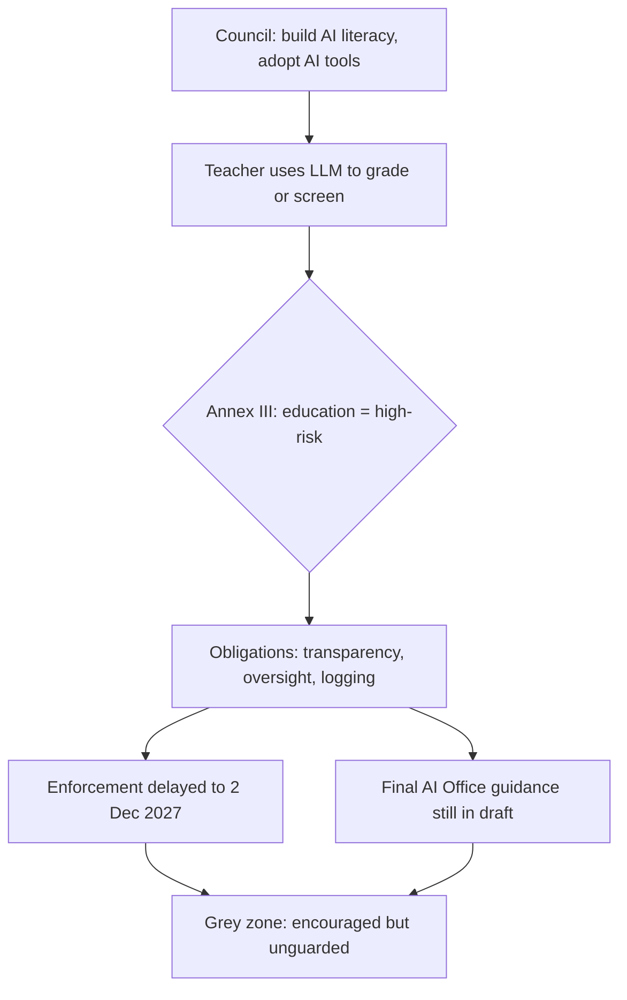

Brussels moved on AI in education three times inside thirteen days in May. Taken one at a time, each move reads like routine EU process. Taken together, they describe a policy that is arguing with itself in public, and leaving every dean, rector and VET coordinator in Europe to referee.

On 7 May 2026, the Council and Parliament reached political agreement on the Digital Omnibus, the package that simplifies the AI Act.

The proposal was adopted on 19 November 2025 and the political agreement followed on 7 May 2026; rules for high-risk systems in areas including education, employment and biometrics will now apply from 2 December 2027.

That's a slip from the original August 2026 date. ([European Commission](https://digital-strategy.ec.europa.eu/en/policies/regulatory-framework-ai))

On 11 May 2026, the same Council, meeting as education ministers, approved conclusions on teachers in the era of AI.

The conclusions call for an ethical, safe and human-centred approach to AI in education, stressing that teachers should remain at the heart of the learning process, and focus on strengthening digital skills and AI literacy, guaranteeing inclusion and fairness, empowering teachers, and supporting well-being.

It was, the Council noted, the first time the relationship between AI and teaching has been addressed in EU education policy.

([Digital Watch](https://dig.watch/updates/council-of-the-eu-pushes-for-human-centred-ai-in-education-systems))

On 19 May 2026, the Commission published draft guidelines on which AI systems count as high-risk, and opened them for comment.

On 19 May 2026 the Commission published the draft guidelines under Article 6 of the EU AI Act and launched a public consultation open until 23 June 2026.

([European Commission](https://digital-strategy.ec.europa.eu/en/news/commission-seeks-feedback-draft-guidelines-classification-high-risk-artificial-intelligence-systems))

So inside a fortnight: encourage teachers to adopt AI, delay the rules that govern the riskiest educational uses by sixteen months, and then, late, start explaining what those rules even mean. I've sat through enough programme reviews to recognise the shape of this. Three workstreams that never reconciled their calendars, presented as a plan.

## the missed February deadline

The more telling fact is that the high-risk classification guidance was statutorily overdue.

Article 6(5) required the Commission to provide those guidelines, with practical examples of high-risk and not-high-risk use cases, no later than 2 February 2026.

It arrived on 19 May, more than three months past its own legal deadline.

The draft guidance emerged following an initial February 2026 deadline, with the absence of final guidance and delays in standards becoming a central issue in discussions of the Act's operational readiness; the guidelines were initially due 2 February ahead of provisions taking effect 2 August.

([IAPP](https://iapp.org/news/a/european-commission-delivers-draft-high-risk-ai-guidelines-after-delays))

That ordering matters for institutions. You cannot comply with obligations for a category until you know what falls into the category. And the category that matters here is unambiguous.

Annex III covers education and vocational training alongside biometrics, employment, essential services, law enforcement and the administration of justice.

Education sits in the same tier as credit scoring and law-enforcement tooling. The drafters put it there because a grade can determine a life.

The draft itself reads the exceptions narrowly.

A system may avoid high-risk classification where it performs only a narrow procedural task or a preparatory one. But the draft guidance reads those exceptions narrowly: systems that sort documents or convert unstructured data may be procedural, while systems that score, rank, suggest next steps or produce specific recommendations are more likely to influence the substance of the decision and fall into high-risk classification.

The operational question is whether the system is organising the record or shaping the judgment.

([Thompson Coburn](https://www.thompsoncoburn.com/insights/european-commission-releases-draft-high-risk-ai-guidelines-what-businesses-should-take-from-them/))

A generative model marking an essay is shaping the judgment. So is most of what teachers were just encouraged to explore.

## the trap teachers were walked into

The European University Association's Michael Jørgensen put the problem bluntly.

He told Times Higher Education that if you do assessment with AI there's a whole range of requirements to meet, both as user and provider, and that it's fair to say the big LLMs do not fulfil the criteria because of transparency and the data they're trained on.

On teachers using ChatGPT for assessment, he said there is a risk it is illegal, but that we don't know yet, because the guidelines from the Commission's AI Office haven't landed.

([Times Higher Education](https://www.timeshighereducation.com/news/looming-eu-ai-act-could-force-universities-change-everything))

Ministers want teachers to build AI literacy and use education-specific tools. The same legal framework classifies the most obvious use (letting a model grade or screen) as high-risk, served by guidance that is still in draft and enforcement that won't bite until December 2027. A teacher who takes the encouragement at face value today is operating in a grey zone the regulator has not yet coloured in.

The vendors will tell you this is fine, that consumer LLMs are general-purpose and the deployer carries the risk. Discount that.

The draft guidelines clarify that if a general-purpose AI system is not explicitly limited to exclude high-risk uses, its intended purpose may be deemed to encompass them, triggering high-risk classification.

The burden does not conveniently evaporate at the API boundary.

## the credentialing question nobody costed

OpenAI's EU Economic Blueprint proposes a headline number, and the Commission's own skills agenda echoes it.

Train 100 million Europeans in foundational AI skills by 2030 through freely accessible online courses in all official EU languages.

([OpenAI](https://openai.com/global-affairs/openais-eu-economic-blueprint/)) It's a fine slogan. It is also a vendor's slogan, and I treat vendor literacy programmes the way I treat free samples: useful, never neutral.

The trouble is the denominator. Europe is missing the easier target underneath it.

The Commission says just 55.6% of the EU population currently has at least basic digital skills, and at the current pace the EU would need to accelerate adoption nearly nine times to meet its 80% basic-skills target by 2030.

([Visual Capitalist](https://www.visualcapitalist.com/cp/europe-2030-digital-skills-target/)) If we cannot get to basic digital competence, a hundred million people fluent in prompt engineering and model limitations is a press-release target with no budget line under it.

The credentialing gap is the part the literacy talk skates over. The Commission's own answer to "who trains the trainers and what is the certificate worth" is still being assembled.

The AI Continent Action Plan promises to train the next generation of experts by increasing the offer of bachelor's, master's and PhD degrees in AI and launching an AI Skills Academy offering programmes on AI and generative AI to upskill students and professionals.

([European Commission](https://digital-strategy.ec.europa.eu/en/policies/ai-talent-skills-and-literacy)) An academy that aggregates courses is not a credential a labour market trusts. A credential needs an awarding body, a standard, and recognition across borders, which is the same recognition problem that has dogged the digital-skills certificate for years.

This is the part of the file I work on most directly, through the HCAIM and PANORAIMA programmes, and the plain version is this: literacy without assessable, portable credentials is consumption rather than capability. You can teach 100 million people to chat with a model. Certifying that any of them can govern one is a different, harder, slower thing.

## governance before enforcement

The Commission did publish something genuinely useful in the same window: updated ethical guidance for educators.

The 2026 update was prepared by the Working Group on the Ethical Use of AI and Data in Education, convened through the European Digital Education Hub.

([European Education Area](https://education.ec.europa.eu/focus-topics/digital-education/actions/plan/ethical-guidelines-for-educators-on-using-artificial-intelligence)) Guidance is not cover.

A university or VET board should not be waiting for December 2027. The first move is a hard line that no consumer LLM touches summative assessment until classification is documented; the delay buys time to build governance. The second is a written inventory of every place AI already shapes a judgment about a learner, which means admissions screening, progress monitoring and grading, because those are the Annex III triggers, and most institutions cannot currently produce that list. The third is to treat the credentialing question as a procurement decision: demand that any "AI literacy" programme issues an assessable, recognised qualification, or decline it.

On present evidence, Europe will hit neither the 80% basic-skills target nor the 100-million figure by 2030. The binding constraint won't be compute or curriculum. It will be that we mandated adoption, deferred the rules that make adoption safe, and asked teachers to stand in the gap. Teachers are guides. Asking them to absorb the risk of an unfinished regulation is the mistake.

* * *

Tarry Singh is the founder and CEO of Real AI (realai.eu), an enterprise AI advisory and deployment firm working with global enterprises on production agent systems, model risk, and AI sovereignty strategy. He also leads Earthscan (earthscan.io) for Energy AI, and is a founding contributor to the EU-funded HCAIM and PANORAIMA programmes for responsible AI education across European universities. He writes at tarrysingh.com.
