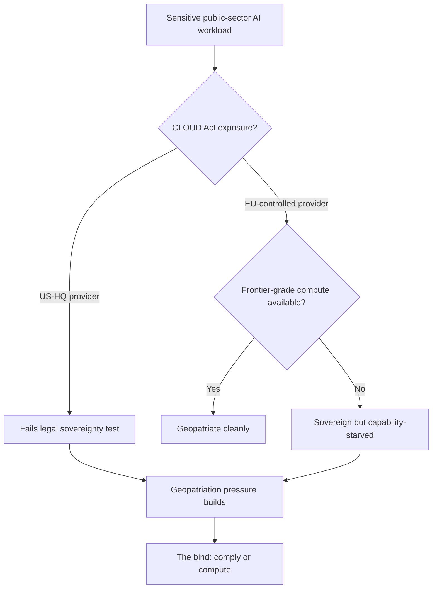

In the last week of May, digital sovereignty stopped being a conference slide and became something a board has to budget for. Three events, in three jurisdictions, did that.

On 27 May the European Commission tabled its Tech Sovereignty Package. 

The package, presented on 27 May 2026, is a legislative bundle proposing restrictions on the use of US cloud providers (including AWS, Microsoft Azure, and Google Cloud) for sensitive government data across all 27 member states, includes the Cloud and AI Development Act and a Chips Act update, and the restrictions apply to public-sector organisations handling financial, judicial, and healthcare data; private companies are not covered.

 The day before, the Dutch government did something it had never done before. And ten days earlier, a US federal contractor handed Brussels its argument for free.

The sequence is the story.

## the Dutch precedent

On 26 May the Netherlands blocked IBM spin-off Kyndryl from buying Solvinity, the Dutch cloud provider that runs DigiD, the national digital identity system millions of citizens use for tax, healthcare and pension access. 

The Netherlands blocked Kyndryl from acquiring Solvinity, the cloud provider that hosts the Dutch digital identity system DigiD, and it is the first US acquisition the Dutch Investment Screening Bureau has ever prohibited.

This was not a hedge. 

The Investment Screening Bureau advised State Secretary Willemijn Aerdts to proceed with a complete prohibition of the acquisition, and she adopted the advice.

 The €100 million deal had already cleared the competition regulator in February. The national-security screen reached the opposite conclusion, and the mechanism behind it was an American law. The 2018 CLOUD Act gives US law enforcement and intelligence agencies authority to compel US-headquartered companies to hand over data stored on their servers anywhere in the world, regardless of the host country's data protection laws.

Kyndryl, predictably, was unhappy. 

The company said the politicisation of the process had overshadowed the benefits the transaction could have delivered to Solvinity's customers and Dutch citizens.

 Washington registered its displeasure too. But the precedent is set: a member state will now kill an M&A deal purely on jurisdictional grounds, even when the antitrust authority has waved it through. That is a different risk surface for any US acquirer eyeing European critical infrastructure.

## the own goal across the Atlantic

The Commission could not have scripted the timing better. 

On the same day the package was presented, officials in Brussels needed only to point across the Atlantic. Ten days earlier, a contractor for the United States' own cybersecurity agency had left the keys to America's most sensitive government cloud accounts sitting on the open internet for six months.

 When the agency that polices everyone else's cloud hygiene leaves its credentials exposed, the European argument writes itself.

The structural point underneath the package is honest, at least. 

AWS, Azure and Google Cloud together control roughly 70 per cent of Europe's cloud market, and Europe does not yet have homegrown hyperscalers capable of absorbing the full range of government workloads currently on American infrastructure.

 That is the bind the whole exercise has to resolve, and it doesn't.

## the sovereignty-washing problem the Commission can't shake

In April the Commission ran a pilot of its own medicine, a €180 million sovereign cloud tender, and the result exposed the gap between the rhetoric and the market. 

The Commission awarded contracts so that EU entities can procure sovereign cloud services for up to €180 million over six years, and one of the winning groups was a Belgian-French-Luxembourgish partnership led by Proximus that uses services from S3NS (a joint venture between Thales and Google Cloud) along with Clarence and Mistral.

A "sovereign" tender, in other words, that runs partly on Google Cloud technology. 

Francisco Mingorance, secretary general of the European cloud trade association CISPE, called recognising S3NS as sovereign "clearly an own goal" that "threatens to institutionalize sovereignty washing at the highest levels."

 The Commission's defence was that non-European technologies, when operated within a strict and appropriate framework, can meet the minimum level of sovereignty required.

 Maybe. But the legal insulation is untested. 

Forrester's analyst noted that S3NS offers "much better legal insulation" from CLOUD Act jurisdiction than a direct US provider relationship, but added that this insulation is "yet to be tested in court since Google still has a minority share."

So the EU's own benchmark concedes the point the package is meant to overturn: there isn't enough genuinely European capacity to go around, so a compromise gets relabelled as sovereignty. Compare that with the same week's Vodafone announcement. 

Vodafone signing with AWS to strengthen sovereign cloud services for German business and public authorities, with all data stored, operated, managed and controlled within Europe.

 The hyperscalers aren't sitting still; they're racing to redefine "sovereign" before Brussels does it for them.

## the gap nobody in the package wants to name

The hardest constraint is not legal. It's capability. Legal sovereignty and AI capability are not the same thing, and for frontier workloads they pull in opposite directions.

The independent capability picture is brutal for Europe. On SemiAnalysis's ClusterMAX ranking from April 2026, the EU member-state category contains exactly one Gold-tier provider (Nebius, the Dutch successor to Yandex), one Silver-tier provider in France (Scaleway), one in Luxembourg (GCORE), and all remaining providers in the "Not Recommended" category.

 A European public body told to keep a frontier-grade AI workload on EU-headquartered infrastructure is choosing from a list of roughly three. That is the bind the diagram lands on: comply with the jurisdiction rule or get competitive compute, rarely both.

And the timing is not on Europe's side. The Cloud and AI Development Act, the legislative heart of the package, is scheduled for Q4 2027 while the underlying inputs (GPUs, power, qualified operators) stay globally constrained.

## the contradiction in the EU's own week

Brussels moved the other way either side of the sovereignty push. On 7 May the co-legislators agreed to *soften* the AI Act. 

Annex III high-risk obligations were postponed from 2 August 2026 to 2 December 2027, deferred by 16 months.

 Industry reporting connected the dots bluntly: 

this came one day after the EU delayed implementation of certain AI Act rules, which industry sentiment suggests was at least partly down to US lobbying efforts.

So in a single month the Union eased its flagship AI rulebook under external pressure and hardened its cloud-sovereignty stance against the same external party. Call that what it is: two directorates pulling against each other while the lobbying weather decides which one wins on any given Tuesday.

Meanwhile the compute story everyone is supposedly sovereign-proofing against keeps shifting under everyone's feet. 

The US Commerce Department approved around ten Chinese companies including Alibaba, Tencent and ByteDance to buy Nvidia H200 chips, under an arrangement where the US would receive 25 per cent of the revenue.

 Export control as revenue share. The chokepoint is being monetised rather than defended.

## what a sovereignty claim has to show

The geopatriation pressure is real and it is not going away. 

Geopatriation is one of Gartner's top strategic technology trends for 2026, and over the past year a number of hyperscaler outages, including the major AWS incident in October, have underlined why cloud concentration creates both operational and jurisdictional exposure.

 The instinct to map workloads to jurisdictions is correct.

Any sovereignty strategy that leads with a vendor's "sovereign" label instead of an architecture will, I expect, fail its first serious test. The S3NS episode is the warning. If the Commission's own flagship tender can be accused of sovereignty-washing, your procurement team's "EU sovereign cloud" tick-box is worth precisely nothing in front of a regulator or a court. 

The distinction matters: providers must be able to show that their sovereignty claims are supported by operating models, governance and technical controls, rather than branding alone.

Do the unglamorous work. Inventory which workloads run on which providers under which jurisdiction. Most organisations cannot answer that in a single document, and that itself is the first finding. Tier the data. Keep frontier-dependent workloads where the frontier compute actually is, with encryption keys you hold and an exit plan you have actually tested under failure. Treat "sovereign" as a property you can evidence rather than a logo you can buy.

The 95 European firms who wrote to von der Leyen demanding a continent-wide sovereign effort had the need right. They were early about the supply. Until the capacity catches the rhetoric (a three-year build at best), sovereignty in Europe will mostly be a story enterprises tell themselves about workloads still physically running on someone else's silicon.

---

Tarry Singh is the founder and CEO of Real AI (realai.eu), an enterprise AI advisory and deployment firm working with global enterprises on production agent systems, model risk, and AI sovereignty strategy. He also leads Earthscan (earthscan.io) for Energy AI, and is a founding contributor to the EU-funded HCAIM and PANORAIMA programmes for responsible AI education across European universities. He writes at tarrysingh.com.
