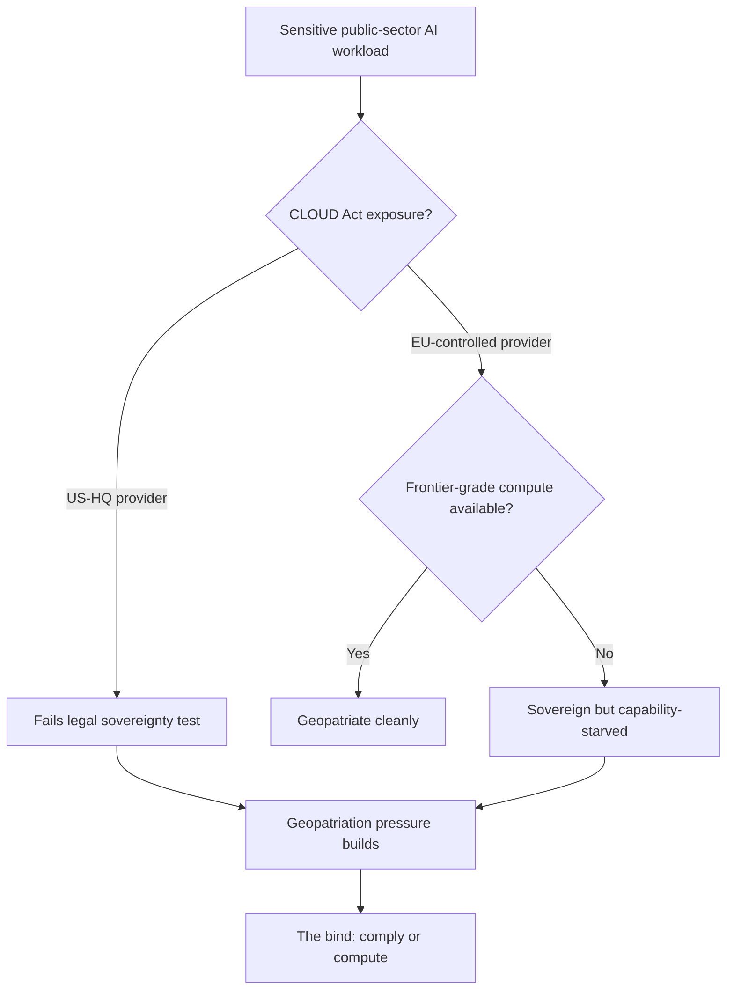

In the last week of May, digital sovereignty stopped being a conference slide and became a line a board has to budget for. Three events, in three jurisdictions, did that.

On 27 May 2026 the European Commission tabled its Tech Sovereignty Package. It bundles a Cloud and AI Development Act with a Chips Act update, and proposes restricting the use of US cloud providers, AWS and Microsoft Azure and Google Cloud included, for sensitive government data across all 27 member states. The scope is public-sector organisations handling financial, judicial and healthcare data. Private companies are not covered.

The day before, the Dutch government did something it had never done before. And the week before that, a contractor working for America's own cyber-defence agency handed Brussels its argument for free.

The sequence is the story.

## the Dutch precedent

On 26 May the Netherlands blocked Kyndryl, the IBM spin-off, from buying Solvinity. Solvinity runs DigiD, the national digital identity system millions of Dutch citizens use for tax, healthcare and pension access. The Dutch Investment Screening Bureau has never prohibited a US acquisition before. This one it killed outright, advising State Secretary Willemijn Aerdts to impose a complete prohibition of the acquisition, which she adopted.

The €100 million deal had already cleared the competition regulator in February. The national-security screen reached the opposite conclusion, and the mechanism behind it was an American law. The 2018 CLOUD Act gives US law enforcement and intelligence agencies authority to compel US-headquartered companies to hand over data stored on their servers anywhere in the world, regardless of the host country's data protection laws.

Kyndryl was unhappy, predictably. The company said the politicisation of the process had overshadowed the benefits the transaction could have delivered to Solvinity's customers and Dutch citizens. Washington registered its displeasure too. Neither changed the outcome. A member state will now kill an M&A deal purely on jurisdictional grounds, even when the antitrust authority has waved it through, and that is a different risk surface for any US acquirer eyeing European critical infrastructure.

## six months of CISA's keys on GitHub

The Commission could not have scripted the timing. On 19 May, eight days before the package was presented, [TechCrunch reported](https://techcrunch.com/2026/05/19/us-cyber-agency-cisa-exposed-reams-of-passwords-and-cloud-keys-to-the-open-web/) that the US Cybersecurity and Infrastructure Security Agency had left cloud keys, access tokens and plaintext passwords on the open web. Guillaume Valadon, a researcher at the security firm GitGuardian, found them in a public GitHub repository called Private-CISA, created by an employee of the federal contractor Nightwing.

[Brian Krebs put the contents on the record](https://krebsonsecurity.com/2026/05/cisa-admin-leaked-aws-govcloud-keys-on-github/): administrative credentials to three AWS GovCloud accounts, plaintext usernames and passwords for dozens of internal CISA systems, and files describing how CISA builds, tests and deploys its own software. The repository went up on 13 November 2025 and stayed public until mid-May 2026. Six months.

CISA said there was no indication that any sensitive data was compromised. Philippe Caturegli, a security consultant quoted by Krebs, found the exposed AWS keys still valid some 48 hours after the agency had been notified. Two House Democrats, Bennie Thompson and Delia Ramirez, [demanded a briefing](https://www.govexec.com/technology/2026/05/cisa-leaked-agency-credentials-congressional-scrutiny/413673/) on how it happened.

Brussels did not have to say a word. When the agency that writes everyone else's cloud hygiene guidance leaves its own GovCloud keys on GitHub for six months, the European argument writes itself. It is a rhetorical gift. It proves nothing about jurisdiction. A Nightwing employee could have pasted the same spreadsheet into a public repo from inside a European provider's tenancy, and the CLOUD Act would have had nothing to do with it. Operational discipline and legal jurisdiction are separate variables, and Europe spent that week arguing about one.

The structural point underneath the package is honest, at least. AWS, Azure and Google Cloud together control roughly 70 per cent of Europe's cloud market, and Europe does not yet have homegrown hyperscalers capable of absorbing the full range of government workloads currently on American infrastructure. That is the bind the whole exercise has to resolve, and it doesn't.

## the sovereignty-washing problem the Commission can't shake

In April the Commission ran a pilot of its own medicine: a €180 million sovereign cloud tender. The award lets EU entities procure sovereign cloud services for up to €180 million over six years. One of the winning groups was a Belgian-French-Luxembourgish partnership led by Proximus, using services from S3NS, the joint venture between Thales and Google Cloud, along with Clarence and Mistral.

A "sovereign" tender, in other words, that runs partly on Google Cloud technology.

Francisco Mingorance, secretary general of the European cloud trade association CISPE, called recognising S3NS as sovereign "clearly an own goal" that "threatens to institutionalize sovereignty washing at the highest levels." The Commission's defence was that non-European technologies, when operated within a strict and appropriate framework, can meet the minimum level of sovereignty required.

Maybe. The legal insulation is untested, though. Forrester's analyst noted that S3NS offers "much better legal insulation" from CLOUD Act jurisdiction than a direct US provider relationship, then added the part that matters: this insulation is "yet to be tested in court since Google still has a minority share."

So the EU's own benchmark concedes the point the package is meant to overturn. There isn't enough genuinely European capacity to go around, so a compromise gets relabelled as sovereignty. Set that against the same week's announcement from Vodafone, which signed with AWS to strengthen sovereign cloud services for German business and public authorities, with all data stored, operated, managed and controlled within Europe. The hyperscalers aren't sitting still. They are racing to redefine "sovereign" before Brussels does it for them.

## the gap nobody in the package wants to name

The hardest constraint is not legal. It's capability. Legal sovereignty and AI capability are not the same thing, and for frontier workloads they pull in opposite directions.

The independent capability picture is brutal for Europe. SemiAnalysis's ClusterMAX ranking from April 2026 puts exactly one Gold-tier provider in the EU member-state category: Nebius, the Dutch successor to Yandex. France has one Silver-tier provider, Scaleway. Luxembourg has one, GCORE. Every remaining provider sits in the "Not Recommended" category.

A European public body told to keep a frontier-grade AI workload on EU-headquartered infrastructure is choosing from a list of roughly three. That is where the diagram lands: comply with the jurisdiction rule or get competitive compute, rarely both.

Timing is not on Europe's side either. The Cloud and AI Development Act, the legislative heart of the package, is scheduled for Q4 2027 while the underlying inputs (GPUs, power, qualified operators) stay globally constrained.

## the contradiction in the EU's own week

Brussels moved the other way either side of the sovereignty push. On 7 May the co-legislators agreed to *soften* the AI Act. Annex III high-risk obligations were postponed from 2 August 2026 to 2 December 2027, deferred by 16 months. Industry reporting connected the dots bluntly: this came one day after the EU delayed implementation of certain AI Act rules, which industry sentiment suggests was at least partly down to US lobbying efforts.

So in a single month the Union eased its flagship AI rulebook under external pressure and hardened its cloud-sovereignty stance against the same external party. Two directorates pulling against each other, with the lobbying weather deciding which one wins on any given Tuesday.

Meanwhile the compute story everyone is supposedly sovereign-proofing against keeps shifting. The US Commerce Department approved around ten Chinese companies, Alibaba, Tencent and ByteDance among them, to buy Nvidia H200 chips, under an arrangement where the US would receive 25 per cent of the revenue. Export control as revenue share. Washington is monetising the chokepoint rather than defending it.

## what a sovereignty claim has to show

The geopatriation pressure is real and it is not going away. Gartner lists geopatriation among its top strategic technology trends for 2026, and a run of hyperscaler outages over the past year, the major AWS incident in October included, has shown why cloud concentration creates operational and jurisdictional exposure at once. The instinct to map workloads to jurisdictions is correct.

Any sovereignty strategy that leads with a vendor's "sovereign" label instead of an architecture will, I expect, fail its first serious test. The S3NS episode is the warning. If the Commission's own flagship tender can be accused of sovereignty-washing, a procurement team's "EU sovereign cloud" tick-box is worth precisely nothing in front of a regulator or a court. Providers must be able to show that their sovereignty claims are supported by operating models, governance and technical controls, rather than branding alone.

The unglamorous work comes first. An inventory of which workloads run on which providers under which jurisdiction. Most organisations cannot produce that in a single document, and the gap is itself the first finding. Then a data tier. Then a straight decision about which workloads genuinely depend on frontier compute, because those belong where the frontier compute is, with encryption keys the organisation holds and an exit plan someone has actually run under failure. Sovereignty is a property you can evidence rather than a logo you can buy.

The 95 European firms who wrote to von der Leyen demanding a continent-wide sovereign effort had the demand right. What they did not have, and what the package still does not supply, is a supply side to point at. A three-year build is the optimistic case. Until the capacity catches the rhetoric, sovereignty in Europe will mostly be a story enterprises tell themselves about workloads still physically running on someone else's silicon.

Nobody in Brussels has settled whether the Act lands in Q4 2027 as money that builds that capacity or as a rule member states quietly work around for want of anything European to buy.

---

Tarry Singh is the founder and CEO of Real AI (realai.eu), an enterprise AI advisory and deployment firm working with global enterprises on production agent systems, model risk, and AI sovereignty strategy. He also leads Earthscan (earthscan.io) for Energy AI, and is a founding contributor to the EU-funded HCAIM and PANORAIMA programmes for responsible AI education across European universities. He writes at tarrysingh.com.
