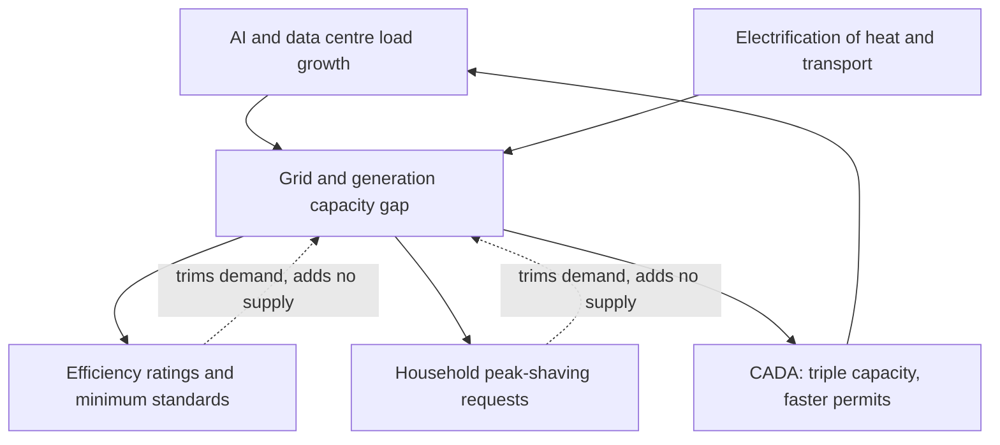

On Wednesday 3 June 2026, the European Commission did two things within hours of each other. It launched a package designed to massively expand Europe's data centre footprint. And it asked households across the bloc to cut electricity use at peak times, citing the rapid growth of AI data centres, accelerating electrification, and rising overall digital infrastructure demand as factors straining European power grids.

Read those two messages back to back and the contradiction is hard to miss. I've sat through enough strategy days to know what it looks like when an organisation files two plans that quietly cancel each other out. This is that, at continental scale.

## what actually landed

The headline act is the [Cloud and AI Development Act](https://digital-strategy.ec.europa.eu/en/library/proposal-cloud-and-ai-development-act-cada), part of a broader European Technological Sovereignty Package. 

The Commission adopted a proposal for the Cloud and AI Development Act with the aim of strengthening the EU's cloud and AI ecosystem, investment and infrastructure.

 Its three legs: research and innovation, capacity, and autonomy. The capacity leg is the ambitious one — at least tripling the EU's data centre capacity within the next 5–7 years, simplifying and accelerating permitting, and improving access to key resources such as energy, land, water and financing.

Alongside CADA came the [Data Centre Energy Efficiency Package](https://energy.ec.europa.eu/topics/energy-efficiency/energy-efficiency-targets-directive-and-rules/energy-efficiency-directive/energy-performance-data-centres_en) and a [Strategic Roadmap for Digitalisation and AI in energy](https://energy.ec.europa.eu/news/commission-presents-measures-digitalise-europes-energy-system-while-ensuring-sustainable-2026-06-03_en). The efficiency package contains an assessment of the data submitted under the reporting scheme, introduces a rating scheme for data centres in Europe, and launches work on minimum performance standards.

 The roadmap's pitch on the demand side is gentler: 

digital solutions can help consumers shift consumption to hours when electricity is cheaper and thereby lower their energy bills.

That's the polite framing of "please run your washing machine at 2am so the GPUs can have the grid at 7pm".

## the arithmetic doesn't close

Here's the part the press release won't tell you. The constraint isn't transparency. It's electrons and copper.

Start with demand. The IEA's latest reads are blunt: 

the global electricity demand of data centres grew by 17% in 2025, while electricity consumption from AI-focused data centres surged 50%.

 The capital behind it is staggering — the largest technology companies' capital expenditure exceeded USD 400 billion in 2025, and is expected to jump by another 75% in 2026.

 Treat that vendor-adjacent capex number with the usual caution; announced spend and delivered megawatts are not the same thing. But the direction is not in dispute.

Now the supply side, where Europe is genuinely stuck. The IEA's [Electricity 2026](https://www.iea.org/reports/electricity-2026/executive-summary) puts it plainly: 

more than 2,500 GW worth of projects, including renewables, storage and large loads such as data centres, are currently waiting to connect to grids worldwide, and annual grid investment must rise by around 50% by 2030 from today's level of roughly $400 billion.

Europe is the acute case. In Denmark, grid congestion has forced the operator to pause new connections, with tens of gigawatts queued against a national peak demand of single digits. Ireland is the cautionary tale already running in production: 

data centres now consume more than 22% of Ireland's national electricity, the highest per-capita data centre electricity share of any country in the world, and 

Dublin has already rejected Google's application to build a new data centre, citing insufficient grid capacity.

 The household cost is not theoretical — research indicates rapid data centre growth could inflate regional electricity costs by 20% to 40% in areas with high concentrations of digital infrastructure, including Slough in the UK and Paris in France.

So look at the structure of what Brussels actually has in its hands.

Ratings, labels and demand-response asks are reasonable instruments. None of them generates a watt. The TNW analysis of Wednesday's package reached the same conclusion I did: 

the standards and rating scheme are reasonable tools, but they address symptoms rather than the underlying constraint — Europe does not have enough electricity generation and grid capacity to simultaneously decarbonise, electrify transport and heating, and power the AI infrastructure it says it needs.

## the rating scheme is good policy aimed at the wrong bottleneck

I want to be fair to the efficiency package, because it does one thing well. The [rating scheme](https://energy.ec.europa.eu/news/rating-scheme-data-centres-eu-commission-launches-call-feedback-2026-03-27_en) turns reported data into something commercial. 

The rating will be available via electronic labels, issued automatically by the European database, to make the energy use of data centres more transparent and inform procurement of more sustainable digital assets and services across Europe.

A hyperscaler's facility carrying a visible EU performance label, legible to corporate buyers, is genuine pressure. It moves sustainability from an internal slide to a line item a procurement officer can compare. Useful. But a label tells you how efficiently a building converts grid power into compute. It says nothing about whether the grid has the power to convert.

## the sovereignty leg has a paradox baked in

The harder problem sits inside CADA's own logic. The whole package exists because of dependence: 

despite having an economy comparable in size to the United States, the EU holds only half the US share of global data-centre capacity, and three US hyperscalers control around 65% of the EU cloud services market.

Now follow the incentive. If you streamline permitting and ease access to energy and land for whoever can build at scale today, the firms best positioned to take that on are AWS, Microsoft and Google. They have the capital, the operators and the customers. The autonomy leg — a single EU-wide assessment framework for cloud and AI sovereignty, accompanied by a public sector adoption mechanism

 — is meant to counterweight that. Whether a sovereignty framework and a public-sector buying nudge can offset a structural capital and capability gap is the question on which the entire act turns. I've watched Europe try to legislate its way out of a market-share hole before. It rarely works without money on the table, and the money here is mostly indicative.

And the competitive backdrop is unforgiving. The US offers full immediate expensing on data centre kit; India is dangling multi-decade tax holidays. Europe is offering harmonised permits and a fund that may or may not materialise. One independent read of the IEA numbers has European capacity growing by roughly 70% to 2030 — well short of tripling. I can't independently verify that single figure, but it rhymes with everything the grid data is telling us.

## my stake

I'd bet against the EU hitting a tripling of data centre capacity inside the 5–7 year window. Not because the ambition is wrong — because the binding constraint is grid and generation lead time, and you cannot permit your way past a transformer that takes three years to deliver. The Commission's own framing already concedes the squeeze: building gigawatt-scale AI infrastructure while asking households to conserve is a narrative most member states have not yet figured out how to sell to voters facing higher bills.

If I were advising a board with European compute exposure right now, three moves. First, stop treating grid connection as a procurement detail — it's now the gating risk, and flexible-connection agreements where you accept curtailment in exchange for getting connected at all are going to be the norm, not the exception. Second, get serious about behind-the-meter generation and on-site storage; waiting for the grid to scale to your load is a bet on a queue clearing, and the queue is 2,500 GW long. Third, design for the label before it's mandatory — minimum performance standards are coming, and a facility that can't show a credible PUE and water profile will be a stranded asset in a market where the rating is public.

Wednesday's package is not a bad day's work. It's a coherent set of instruments. But it's a demand-management answer to a supply problem, dressed as an industrial strategy. The gap between the AI Europe says it wants and the electricity it can actually deliver is the real story — and no rating label closes it.

---

Tarry Singh is the founder and CEO of Real AI (realai.eu), an enterprise AI advisory and deployment firm working with global enterprises on production agent systems, model risk, and AI sovereignty strategy. He also leads Earthscan (earthscan.io) for Energy AI, and is a founding contributor to the EU-funded HCAIM and PANORAIMA programmes for responsible AI education across European universities. He writes at tarrysingh.com.
