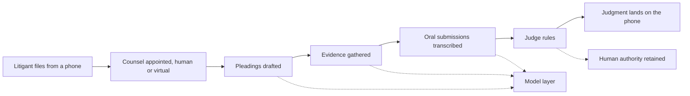

The most important AI move in the Gulf right now is happening at the layer above the chip, inside the statute book.

I came round to that view sitting across from a junior associate at the back of a hotel cafe last month. She described the strangest week of her career: the platform her firm had spent the better part of a year installing started drafting her opening memos faster than she could review them, and the partner across the table never noticed. The June 2026 headlines are still mostly about chips and gigawatts: Stargate, the GB300 licences, the 5-gigawatt builds in Abu Dhabi. The quieter build, the one I think matters more in a ten-year frame, is the one she was describing.

## Three moves in a hundred days

Three Gulf-anchored moves have done more to define what a sovereign legal-AI stack looks like than every think-tank paper I have read on the subject this year.

On 12 June 2026, Sheikh Mohammed bin Rashid Al Maktoum approved the creation of a [Federal Authority for Artificial Intelligence and Data](https://www.mediaoffice.ae/en/news/2026/jun/12-06/mohammed-bin-rashid-approves-establishing-artificial-intelligence-and-data-authority). It is a single federal body, reporting directly to Cabinet, that consolidates the UAE's AI Office, the digital-government sector of the TDRA, and the previously announced Emirates Data Office under one roof. Omar Sultan Al Olama runs it. It owns national priorities for digital government, proposes policies and legislation, and runs the national data platforms. One desk for every AI rule that ships out of the federation.

On 13 February 2026, Saudi Arabia's new Copyright Law was [published in the Umm Al-Qura gazette](https://gowlingwlg.com/en/insights-resources/articles/2026/saudi-arabia-copyright-law-2026), with an effective date 180 days later, mid-August 2026. Tucked inside is an exception permitting reproduction of original works, without permission and without compensation, for the purposes of developing AI products and algorithms. There are conditions. A purpose-limit, a proportionality test, implementing regulations still to come. But the direction is plain. The Kingdom is opening a corridor for training-data ingestion that the EU is closing.

And since January 2026, the DIFC's [Regulation 10](https://www.difc.com/business/registrars-and-commissioners/commissioner-of-data-protection/regulation-10) on data processed through autonomous and semi-autonomous systems has been in force across Dubai's onshore financial free zone. It requires AI impact assessments, transparency duties for AI-driven decisions, and documentation of high-risk use cases, with fines of $25,000 to $50,000 per violation. That is a small number until you remember every law firm, every bank, every fintech in the DIFC is now in scope, and the Commissioner of Data Protection has been clear that enforcement follows certification, not the other way round.

The three artefacts fit together. One creates the federal *authority*. One rewrites the *substrate* law around which AI training is permitted. One installs the *operational* duty on every regulated entity in a marquee free zone. Authority, substrate, operations. The build is not happening at the chip layer. It is happening at the layer above the chip.

## Reading the Court of the Future as architecture

The UAE Ministry of Justice showed its [Court of the Future](https://gulfnews.com/uae/government/no-papers-no-documents-no-lawyers-uae-unveils-court-of-the-future-1.500310563) at GITEX 2025 and has been rolling it out in pilot since. From inside the platform, a litigant can appoint counsel in under a minute by choosing between a real lawyer pulled from an interactive listing, or a virtual one, AI-generated, that drafts pleadings, gathers evidence, and pleads before a human judge. Facial recognition grants access. Voice-to-text handles oral submissions. The judgment lands on a phone.

Most of the Western coverage has read this as a gimmick. I think it is a deliberate structural choice, and the structure is the giveaway. The Ministry kept one thing under human control: the verdict. It ceded everything between filing and ruling to the system. That is exactly the boundary a careful jurisdiction would draw if it wanted to absorb AI into the legal substrate without losing the political legitimacy of the bench. A judgment from a human judge, in a courtroom whose every other moving part runs on a model, is still a human judgment in the eyes of any appellate body that matters. A judgment from a model is not. The line is drawn at the only place it could survive contestation.

## A digression: what a hallucination costs in the Gulf

There is a serious objection to all of this, and it deserves answering on the merits. Specialised legal-domain models from LexisNexis and Thomson Reuters were [shown by Stanford researchers in 2024](https://hai.stanford.edu/news/ai-trial-legal-models-hallucinate-1-out-of-6-or-more-benchmarking-queries) to fabricate authority on a meaningful fraction of legal-research queries. Bird & Bird's [regulatory tracker](https://www.twobirds.com/en/capabilities/artificial-intelligence/ai-legal-services/ai-regulatory-horizon-tracker/saudi-arabia) for Saudi Arabia spends most of its commentary on this risk. Latham & Watkins has cautioned that the [layered UAE framework](https://www.lw.com/en/insights/ai-in-the-uae-understanding-the-regulatory-landscape-and-key-authorities), federal statute plus free-zone rules plus sector regulators, has not yet been stress-tested at enforcement scale. The sceptical reading is straightforward: the Gulf is moving faster than its case law can catch up.

That reading is correct, and it is also less damaging than it sounds. The reason is [Mata v. Avianca](https://en.wikipedia.org/wiki/Mata_v._Avianca,_Inc.) and every case that has followed it since June 2023. Federal sanctions for fabricated citations. Bar-association advisories. Malpractice carriers writing new exclusions. The Western legal profession has learned, the hard way, that you do not let an unverified model write into a court file. The Gulf is in a strong position to read that body of precedent and codify it into platform behaviour before deployment. The Ministry of Justice's posture, virtual counsel for memoranda and evidence gathering and a human judge for the verdict, is exactly the architecture Mata teaches.

The harder question is the [ALARB benchmark](https://arxiv.org/html/2510.00694), an Arabic Legal Argument Reasoning suite built on 13,000 Saudi commercial court cases. The headline finding is that a 12-billion-parameter model fine-tuned on ALARB matched GPT-4o on verdict prediction and Arabic verdict generation. That should make every general-purpose-AI vendor nervous. A Gulf institution can train a domain-specific model that beats the frontier on the work that institution does, with weights it owns. That is the sovereignty story everyone wants and almost nobody is delivering.

## Where the chip story and the law story disagree

I have spent a fair amount of 2026 arguing with people who think sovereign AI is a chip-supply question. Compute matters, of course. But a state that holds compute on its soil and a state that holds the legal substrate on its soil are two different sovereigns. The first is renting. The second is owning.

G42's [Digital Embassies framework](https://www.prnewswire.com/apac/news-releases/g42-introduces-digital-embassies-and-greenshield-to-make-ai-sovereignty-portable-302665166.html), launched in January 2026, is the cleanest expression of that distinction I have seen from inside the Gulf itself. It lets a country's data and AI workloads sit in another country's data centres while remaining under the originating state's jurisdiction: a government-to-government legal construct rather than a technical one. An admission, in effect, that the chips will be Sunnyvale's for years, but the law need not be.

## The operating layer

If you are running a regulated business in the Gulf right now, a law firm, a bank, an insurer, a state-owned utility, anything in DIFC or ADGM, the practical agenda looks like this.

First, write the AI impact assessment Regulation 10 demands as if the Commissioner already has your file open, and treat it as an internal forcing function. Most of the bad deployments I have seen this year, and at Real AI we have walked into a half dozen, failed because nobody on the buy side could articulate, in writing, what the model was for. The model itself was usually fine. Regulation 10 is a free excuse to do that work.

Second, pick the legal-domain model question deliberately. The temptation is to default to Harvey or CoCounsel because A&O Shearman did. The Gulf-specific evidence, ALARB plus the Arabic-language data sovereignty question plus the Saudi copyright corridor, points the other way for institutions whose core practice is Gulf law. A 12-billion-parameter weights-you-own model trained on your own case data is, in the second half of 2026, a real option. Build the data discipline now, while the Saudi copyright exception is fresh and the implementing regulations are still being written. The window for influencing how that exception is operationalised closes the moment the first regulator's guidance lands.

Third, stop reading the Court of the Future as a consumer-facing product and study it as a regulatory blueprint. The architecture is the message: model handles work, human holds authority, the boundary is codified in platform behaviour rather than left to lawyer discretion. That boundary is going to migrate from courts into every adjacent jurisdiction in the region: insurance claims, tax filings, regulatory submissions. The firms that figure out where the line will sit in their own practice, before the regulator draws it for them, will own the next five years of Gulf legal work. The ones that do not will spend those years writing impact assessments after the fact, while the platforms eat their billable hours from below.

The cabinet, the court, and the copyright clause have already made their move. The next one is on the operators.

---

*Tarry Singh is the founder and CEO of [Real AI](https://realai.eu), an enterprise AI advisory and deployment firm working with global enterprises on production agent systems, model risk, and AI sovereignty strategy. He also leads [Earthscan](https://earthscan.io) for Energy AI startup, and is a founding contributor to the EU-funded HCAIM and PANORAIMA programmes for responsible AI education across European universities. He writes at [tarrysingh.com](https://tarrysingh.com).*
