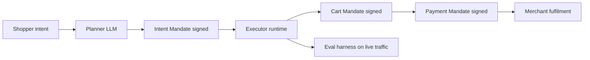

# The Cart That Signs Itself

The interesting question about agentic commerce this summer has moved. A year ago it was whether a language model could pick out a jacket. That argument is over. Today the question is who signs the cart, on whose authority, with what recourse when it turns out the jacket was the wrong colour, the wrong size, or the wrong customer's.

That question has been sitting under retail conversation for eighteen months, and the answer has only recently started showing up in production code. When it does, it looks nothing like the picture the vendor decks were selling in early 2025, of a single elegant model that "understands" a shopper and "acts" on their behalf. What shows up in production is a design pattern with an old name (the planner-executor split), carrying a new set of legal and cryptographic obligations underneath it.

## The pattern, restated

The split itself is unremarkable. A planner LLM produces a short structured plan, three to five steps, expressed as function calls, tool invocations, or a graph of sub-tasks. An executor runtime, often a much cheaper model, sometimes no model at all, carries the plan out and reports back. When a step fails, the planner is invoked again to repair it. This is [the "plan-and-execute" pattern LangChain formalised](https://www.langchain.com/blog/planning-agents), and [the ADaPT variant](https://arxiv.org/abs/2603.14864) is the one you see in most 2026 shopping-agent papers, where a short plan is generated up front and re-planned only when the executor stalls.

What is new is not the pattern. What is new is that in retail, the executor is no longer just calling an internal API. It is negotiating with a merchant on the buyer's behalf, on a rail that requires the transaction to be provably authorised. Google's [Agent Payments Protocol, published on 16 September 2025](https://cloud.google.com/blog/products/ai-machine-learning/announcing-agents-to-payments-ap2-protocol), split the executor's job into three signed artefacts: an Intent Mandate ("the user wants a black rain jacket, size L, under €120"), a Cart Mandate ("the agent assembled these three items totalling €112.40"), and a Payment Mandate ("this card, this merchant, this amount, this timestamp"). Each mandate is a [W3C Verifiable Credential](https://www.w3.org/TR/vc-data-model/), signed cryptographically, retained by the merchant and the payment network for the life of the transaction. Call it what you want. The output is a set of cryptographically signed documents a regulator can subpoena, on which merchants, payment networks, and issuing banks will rely to settle a live purchase.

## Where the split shows up in the wild

Zalando is the working example most European operators are studying, because the company is running the pattern at scale and publishing enough about it to reason from. In its [full-year 2025 results, published on 13 March 2026](https://corporate.zalando.com/en/investor-relations/zalando-full-year-2025-results), Zalando confirmed the Assistant was live in all 25 markets, with roughly 10 million users interacting with it in Q1 2026, up from about 6 million across the entire prior year. [The joint case study with OpenAI](https://openai.com/index/zalando/) is unusually specific about the migration. The planner moved from GPT-3.5 to a fine-tuned GPT-4o mini, and traffic scaled 12x without a proportional cost increase. Product clicks in the recommendation carousel rose 23%, wishlist additions rose 41%, and "unhelpful" recommendations fell by 5 percentage points.

Those are OpenAI's numbers and Zalando's numbers, which is a category worth remembering. Vendor and buyer report jointly on a metric that flatters both. I would not treat the 12x scaling figure as an efficiency claim independent of scope: traffic scaled because the Assistant was rolled out to new markets, not because per-request cost dropped by an order of magnitude. Zalando's own [Trend Spotter rollout note](https://corporate.zalando.com/en/technology/zalando-brings-its-ai-powered-assistant-all-markets-and-adds-four-new-cities-its-trend) is more measured on the expansion mechanics.

The more consequential news is at the executor layer. On 12 January 2026, [Zalando was named the first European retailer to integrate Google's Universal Commerce Protocol](https://retailtechinnovationhub.com/home/2026/1/12/zalando-taps-googles-universal-commerce-protocol-with-new-checkout-feature-first-up), the discovery-and-checkout companion standard to AP2. Users searching in Google's AI Mode can, in the US roll-out first, complete a purchase from Zalando's catalogue without leaving the Google surface. Two principles are wired into the integration: the seller of record remains Zalando (which preserves EU consumer-protection standing) and the transaction is executed via Google Pay against a cryptographically signed Cart Mandate.

That is the planner-executor split reaching down to the payments rail. The planner (in Google's surface, or in Zalando's app) proposes. The executor (the UCP/AP2 stack) commits, and the commit is a signed document a regulator can inspect.

## What Klarna showed us about the executor without an evaluator

The counterexample worth engaging is Klarna, and it is worth doing so on the merits rather than as an easy joke. From early 2024, [Klarna's AI assistant handled 2.3 million conversations in its first month](https://www.langchain.com/blog/customers-klarna) and was credited internally with doing the work of 700 full-time agents. By early 2026 the same company was rehiring humans. [Sebastian Siemiatkowski's own account, in his May 2025 press round](https://www.entrepreneur.com/business-news/klarna-ceo-reverses-course-by-hiring-more-humans-not-ai/491396), was that Klarna had over-optimised for speed and cost and under-measured customer outcome quality. As late as July 2026, [Bernard Marr's Forbes write-up of the reversal](https://www.forbes.com/sites/bernardmarr/2026/07/16/how-klarnas-ai-agent-strategy-backfired-but-became-a-useful-lesson/) framed the lesson as a management failure rather than an architecture failure.

I read it the other way. Klarna's system was the executor-heavy variant of the pattern: a routing agent, a set of tools, a tight resolution-time target, and a survey-based satisfaction metric fed back weekly. The planner-executor split existed. What was missing was an evaluator worth trusting on the hard 5–10% of cases (disputed refunds, hardship plans, fraud, incorrect charges) where the customer arrives frustrated and the wrong sentence turns a support ticket into a regulatory complaint. A recent [taxonomy paper on RAG failure modes](https://www.clawrxiv.io/abs/2604.02033) puts pure generation hallucinations at 9–12% across corpus regimes; the retail number for consequential error rates on complex tickets is not published, but the Klarna experience suggests it sits in a similar band and is not reducible by any amount of cheaper inference.

The design lesson is uncomfortable. In a planner-executor system, the eval harness is not a nice-to-have you build in year two. It is a component of the executor. Without it, the pattern degrades into whatever the loudest metric happens to be: resolution time in Klarna's case, click-through in a retail assistant's, mandate-signature latency in an AP2 flow. Systems always optimise what you measure. The Klarna reversal is what happens when what you measure and what your customer values diverge for eighteen months without a correction signal reaching the roadmap.

## What the EU is quietly wiring in beneath all of this

2 August 2026 is the date [the Commission's GPAI enforcement powers enter into application](https://digital-strategy.ec.europa.eu/en/policies/guidelines-gpai-providers). For a European retailer running a planner-executor agent, this is the operative shift: any general-purpose model at the planner layer inherits documentation, copyright-compliance and information-sharing duties, with fines up to 3% of global annual turnover or €15 million, whichever is higher. Under [Article 50 transparency rules](https://artificialintelligenceact.eu/transparency-rules-article-50/), the customer must know they are talking to an AI, and generated outputs used in commercial contexts must be labelled where reasonable.

The [Commission's own AI-Act guidance for deployers](https://www.nicfab.eu/en/posts/deployer-ai-agents/) is careful to note that a retail chatbot or a product-recommendation system is not, in itself, a high-risk system in the sense of Annex III. That is a real defence and worth using accurately in board discussions this quarter. What the guidance also says, more quietly, is that autonomy and tool use are the factors that can pull a system into a heavier scope. A shopping agent that signs a Cart Mandate on a customer's behalf, then commits it against a live payments rail, is precisely the kind of tool-using autonomy the regulators are watching. The distance between "assistant" and "deployer with substantive obligations" is narrower than the marketing suggests.

## The failure modes worth engineering against

The pattern has known weak points. A retailer building against them in the second half of 2026 should assume each will surface within a year of go-live.

The first is planner-executor drift. The planner is trained or fine-tuned on one distribution of tool schemas; the executor's tools evolve on a faster clock as merchandising teams ship new endpoints. Two months in, the planner is producing sub-tasks the executor can no longer satisfy cleanly, and the failure mode is silent: the system routes to a fallback that looks smooth on the front end and produces a subtly wrong outcome on the back. A rigorously versioned tool-schema contract, checked in CI against the planner's function-calling harness, is not a nice engineering habit; it is the difference between an assistant that ages well and one that quietly rots.

The second is under-measured mandate rejection. The AP2 flow is designed to fail closed: an unsigned or mis-signed Cart Mandate should not clear. In production, rejections cluster on edge cases (currency mismatches, promotional pricing that expires between planner and executor, cross-border VAT that only surfaces at checkout). If the retailer's dashboard shows only successful conversions, the rejection tail is invisible until it is a percentage. Instrument mandate-rejection rate by cause from day one, and route the top three causes each week to the team that owns the planner.

The third is the eval blind spot Klarna found. Speed and cost are the metrics vendors will hand you. Neither is a proxy for customer outcome on the 5–10% of cases where the assistant fails. Build a human-graded eval slice, weekly, on real hard tickets, and make the planner's promotion to production conditional on it. The [taxonomy of common RAG failure modes](https://snorkel.ai/blog/retrieval-augmented-generation-rag-failure-modes-and-how-to-fix-them/) is worth reading here for the retrieval side of the problem; most of what gets called an "agent problem" in retail is a retrieval or fusion problem the executor cannot recover from without the planner asking a better question.

## The question I do not have an answer for

There is one question I have been putting to European retail engineering leaders for six months and have not received a clean answer to. If the Cart Mandate is signed by an agent operating on the shopper's behalf, and the shopper's agent is running on infrastructure owned neither by the shopper nor by the merchant (a Google surface today, tomorrow a lab whose surface has not launched yet), where does the retailer's evaluation of the transaction live? The Cart Mandate proves the shopper authorised the purchase. It does not tell the retailer whether the assistant that assembled the cart understood what the shopper wanted, or whether the promotional pricing it applied is one the merchandising team would have accepted at that hour of that day in that market.

The retailer sees the signed cart. The customer sees the delivery. Between the two there is a language model whose training data, prompt schedule, and post-training tuning are the property of a third party, and whose behaviour on the specific class of edge case that will define next quarter's returns rate is not something either the retailer or the customer can independently audit. The current pattern leaves that gap open, and I do not know who closes it. Which party owns the sentence between the wish and the wallet, and who pays when that sentence is wrong, is the open question of the next eighteen months of agentic commerce. Every European retailer I have asked has admitted they do not know either.

---

*Tarry Singh is the founder and CEO of [Real AI](https://realai.eu), an enterprise AI advisory and deployment firm working with global enterprises on production agent systems, model risk, and AI sovereignty strategy. He also leads [Earthscan](https://earthscan.io), an Energy AI startup, and is a founding contributor to the EU-funded HCAIM and PANORAIMA programmes for responsible AI education across European universities. He writes at tarrysingh.com.*
