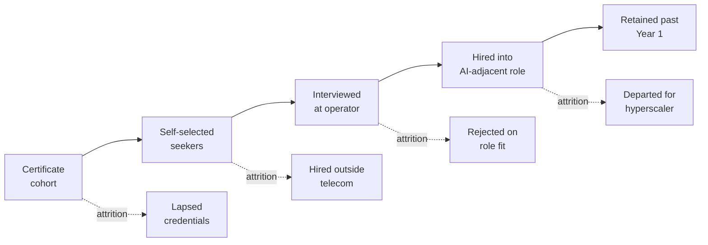

The chairs are turned inward, six deep, and the room smells faintly of the cardamom coffee someone brought in and forgot to distribute. A woman near the window has been at this operator longer than most of the room has been at work, and she is watching the trainer sketch a call-flow she has drawn on a whiteboard herself a thousand times, only now with a small language-model box slotted into the middle of it. Her badge says operations. Her eyes are asking a plain question: when the course ends, does the box get her job or does she get the box?

That question is being answered, in aggregate, by four Gulf telcos, two national AI authorities, three hyperscalers, and the human-resources departments of about fifteen ministries. It is being answered slowly, quietly, and, this is the interesting part, with a growing gap between what the certificate count on the front page of the annual report says and what the payroll roster inside the operator's HRIS looks like on a Monday morning six months later. The classroom is doing what it was asked to do. The roster is not moving at the same speed.

## What the certificate count is

Start with the biggest single number, which is Saudi Arabia's. The Saudi Data and AI Authority reports that the SAMAI initiative has passed [1,563,983 beneficiaries](https://www.arabnews.com/node/2622098/saudi-arabia) since inception, with women 52% and men 48%, employees 70% and students 30%, and 11,000 to 14,000 counted as specialists rather than the general workforce cohort. Layered on top: Microsoft announced in February 2026 a partnership to help [3 million people in Saudi Arabia acquire AI skills by 2030](https://news.microsoft.com/source/emea/2026/02/microsoft-accelerates-ai-skilling-in-saudi-arabia-helping-3-million-people-acquire-ai-skills-by-2030/). HUMAIN, the Saudi state's vertically integrated AI holding, put a strategic framework in place with Accenture that [ties adoption acceleration to the compute buildout](https://newsroom.accenture.com/news/2026/humain-and-accenture-accelerate-ai-adoption-at-scale-across-public-and-private-sectors-in-saudi-arabia), dated 2026.

Cross the border to the UAE and the shape repeats in a smaller frame. Amazon Web Services and e& [announced at GITEX Global](https://www.eand.com/en/news/25-03-25-eand-launch-ai-skilling-programme.html) an AI Nation Afaaq programme that plans to deliver 30,000 sponsored certification vouchers through the e& Academy: 25,000 AWS Certified AI Practitioner and 5,000 AWS Certified Machine Learning Engineer – Associate. Dubai AI Week 2026 launched a Dubai AI Academy aimed at [training 10,000 leaders in government, business and technology by 2030](https://www.difc.com/whats-on/news/dubai-ai-academy-launches-at-dubai-ai-retreat-to-educate-10000-leaders-to-accelerate-ai-adoption), run by the Dubai Centre for Artificial Intelligence with Oxford's Saïd Business School, Udacity and the Minerva Project, alongside a separate AI Workforce Transformation programme targeting 50,000 Dubai government employees. Ooredoo and Qatar Airways [signed an AI-and-cloud alliance](https://www.ooredoo.qa/web/en/press-release/ooredoo-and-qatar-airways-partner-to-transform-ai-in-qatar/) whose training arm is smaller in headcount and larger in per-head economics, because the target role is defined before the training begins: Qatari engineers trained on the operator's live NVIDIA GPU platform for cloud, security and AI operations posts.

I want to be careful. Every number in those two paragraphs is a certificate number or a training-headcount number. None of them is a hired-into-role number. The distinction is worth marking because the region's press-release cycle keeps eliding it, and because the operators' investor materials keep the two ledgers in separate rooms.

## What the roster shows

The payroll side is harder to see because operators do not publish it in the same shape they publish the certificate count. Three data points are worth putting side by side.

First, PwC's [2026 Global AI Jobs Barometer, UAE analysis](https://www.pwc.com/gx/en/issues/artificial-intelligence/job-barometer/aijb-uae-2025-analysis.pdf) reports that the UAE's share of AI-related job advertisements rose from about 1.0% in 2021 to 3.2% in 2025, moving the country from 21st to 13th globally in AI hiring. That is a real move on a real denominator. The same report puts the wage premium for AI-related skills in the UAE's Technology, Media and Telecommunications sector at 50%, against 92% in financial services, 47% in manufacturing, 21% in professional services, and 18% in energy and utilities. TMT pays a real premium. It does not pay the highest premium in the market, which tells you the operators are competing for the same trained specialists as the banks and losing the top decile to them.

Second, the same barometer notes that AI-exposed junior roles are now seven times more likely to require traditionally senior skills than the least-exposed junior roles, and the skills demanded of AI-exposed jobs are changing 66% faster than skills for other jobs, 2.5 times faster than the year before. Set that against the operator's training pipeline. The AWS Certified AI Practitioner voucher is aimed at what the industry calls an AI User. The 66% skills-drift figure is the pace at which the certificate is losing its half-life. Certification is running, in the pace-adjusted sense, on a treadmill, and every operator's HR planner ought to know exactly how fast the treadmill is going.

Third, the operators themselves. stc's investor material for 2025 puts capital-expenditure intensity in [the 9.43% range for the first half](https://www.stc.com/content/dam/groupsites/en/pdf/EarningsPresentationQ2-2025En.pdf), with disclosed emphasis on the 250 MW-to-1 GW AI-data-centre build alongside HUMAIN and partners. The infrastructure line is where the money is going. The training line, in every Gulf operator's disclosure I have read this quarter, sits inside general SG&A, is not broken out, and is dwarfed by the compute build.

That last point deserves to sit on its own line. The compute is being paid for in disclosed billions. The training is being reported in press-release headcounts. Those two facts belong on the same page of the same annual report, and in almost every case they are not.

## The peer-reviewed argument I want to engage

The best-argued piece of pushback on the region's numbers I have read this year is a July 2025 note in [Humanities and Social Sciences Communications](https://www.nature.com/articles/s41599-025-05984-5) on the GCC workforce and how it is adapting to work redesign. The paper's headline claim, distilled, is that per-capita training investment across the six Gulf states is at or above OECD levels, but the translation into measured productivity and role redesign is running well below what those inputs would predict. The authors stop short of calling this a failure. They call it, more usefully, a lag: the gap between the certificate being issued and the process on the operator's floor being redrawn to use what the certificate certified.

That framing deserves a full answer, in agreement in part and disagreement in part. In agreement: the lag is real, it is currently the largest single mismatch between what Gulf governments have paid for and what Gulf operators have absorbed, and it will get wider through 2027 before it gets narrower. In disagreement: the paper's implicit remedy, which is that governments should slow the certificate machine until the operator side catches up, mistakes which side of the pipeline is easier to accelerate. Governments in the Gulf can move classroom throughput in weeks. Telcos cannot re-scope 6,000 network-engineer roles in the same weeks. The right answer is to accept the mismatch as a physical constant of workforce reform and to instrument both sides carefully, not to slow the fast side down out of a false symmetry.

## Where the classroom is doing the right thing

The programmes worth defending are the ones with a role attached at the end. The e& AI Graduate Programme, which places roughly 100 Emirati graduates a year into technology tracks, produces hires. stc's Talent Incubation Programme, running through STC Academy since 2018, produces hires. Ooredoo's Qatar Airways alliance is producing a specific pipeline of GPU-platform engineers, small in absolute count and disciplined in per-head economics, because the target role is defined before the classroom door opens.

The programmes that need a harder look are the ones that hand out a certificate at the end and count it as an outcome. There is nothing wrong with an AI User certificate at population scale. It is, plausibly, the most cost-effective single instrument a public treasury has for lifting a country's median AI literacy in a Vision-2030 sense. It is not, on any reading I can defend, the same instrument as the one that fills an AI-adjacent role on a telco's headcount plan. Confusing the two is where the honest measurement problem starts, and it is where every quarterly presentation on Gulf AI training currently ends.

Draw the pipeline as a straight line and you are lying to the annual report. Draw it with the four attrition side-paths and the shape gets honest. Most of the certificates leak out through the middle four arrows. That leak is not the classroom's fault. It is a physical property of an economy where financial services will out-pay the operator, hyperscalers will out-recruit the operator, government agencies will out-benefit the operator, and the operator's own hiring managers will hold to job specs written before the certificate scheme existed.

## What PANORAIMA gets right, and what it does not yet address

The European contrast is useful precisely because it is not the Gulf. The [PANORAIMA network](https://www.panoraima.eu/), the Digital-Skills-5 successor to the concluded HCAIM programme, brought 16 partners together across eight European universities in January 2025 to embed AI capability into master's programmes outside computer science. Engineering, humanities, business, life sciences. The [first pilot specialisation tracks](https://www.bme.hu/en/news/241206/bme-vik-gtk-artificial-intelligence-panoraima-project) run in September 2026. Full availability, including online modules, arrives in September 2027. What PANORAIMA does that the Gulf programmes do not yet do at scale is bind the credential to a domain-specific curriculum designed with the hiring side of the market in the room. A public-health master's with an embedded AI track reads directly onto a public-health hiring specification. A finance master's with an embedded AI track reads directly onto a bank's specification. The credential and the role are drawn together on the same sheet of paper.

The Gulf's blind spot is not scale. It is that the hiring side of the market, telcos included, has not been asked, on the record, what specification the certificate should satisfy. AWS wrote the specification for the Afaaq voucher. Microsoft wrote it for the Saudi partnership. That is fine for what those credentials are. It is not sufficient for the operators' own network-engineering, platform-engineering and site-reliability roles, which need a specification the operators themselves author. Nobody at a Gulf operator's HR planning function has, in the disclosures I can see, published that specification for external comment. Publishing it would be an act of institutional courage worth about eighteen months of hiring.

## What a serious operator should be doing this quarter

Three quiet moves would separate the operators that end this cycle with a hired workforce from the ones that end it with a certificate count.

Publish the conversion rate. If AI Nation Afaaq trains 30,000 people, publish how many were hired into an e& role within twelve months of certification, at what compensation band, and at what retention rate through the first year. This is a number every telco HRIS can produce in a week. Not publishing it is a decision, and it is a decision that will read differently in the annual report of 2027 than it does now.

Own the role specification. For every certificate the operator promotes, name the internal job code and level it feeds, and where the code does not yet exist, write it and publish the writing schedule. This is the only move that shifts the roster in the same year as the certificate class. Everything else is a lagging indicator.

Instrument the after. Six months on the job is where the certificate either becomes a competency or leaks back out to the hyperscaler recruiter. The GCC's employers, telcos included, do not currently instrument that six-month window at any granularity that would let a CHRO answer, on a call, what the retention curve looks like for a SAMAI-certified new hire versus a non-certified one at the same level. The Nature paper's headline lag is, at its root, the sum of six-month windows that nobody looked at.

None of these three moves needs an approval from the ministry, a partnership with a hyperscaler, or an increase in the certificate budget. All of them run on data the operator already has. All of them will make the annual-report number smaller, harder to quote, and far more useful to the operator's board.

## The stake

The stake is worth stating flat. I do not think the Gulf's AI-training programmes are a waste. They are one of the best-designed instruments any regional bloc has fielded for population-scale AI literacy, and the SAMAI numbers reflect real work by real educators over a difficult two years. I also think the operators, the telcos in particular, are riding the halo of those numbers into their own annual reports without matching the classroom's speed with a corresponding move on the roster. The 2027 reckoning will not be about whether Gulf citizens can pass an AI Practitioner exam. Millions can, and millions more will. It will be about which operators, banks, ministries and utilities took the trouble to reorganise real work around what those citizens now know, and which ones did not. The certificate is a promise the operator has not, yet, agreed to keep.

## Coda

Back to the room. It is late afternoon in Riyadh, or Dubai, or Doha; the light is the same at that hour, and so is the shape of the coffee break. The trainer wraps the module. The woman near the window has passed the practice exam and put the printed certificate into her bag, folded once. Her badge still says operations. Her line manager has not, as of this Sunday, been given a new job code to slot her into. On Monday morning she opens the same NOC dashboard she opened on Friday, and the small language-model box she was shown in the classroom is not, yet, on the console. She logs in. She takes the first ticket. She gets on with the shift. The certificate is in her bag. What the operator does with it is now the operator's problem, and it is a problem the operator has not yet named on any page of any report she has ever been shown.

---

*Tarry Singh is the founder and CEO of Real AI ([realai.eu](https://realai.eu)), an enterprise AI advisory and deployment firm working with global enterprises on production agent systems, model risk, and AI sovereignty strategy. He also leads [Earthscan](https://earthscan.io) for Energy AI, and is a founding contributor to the EU-funded HCAIM and PANORAIMA programmes for responsible AI education across European universities. He writes at [tarrysingh.com](https://tarrysingh.com).*
