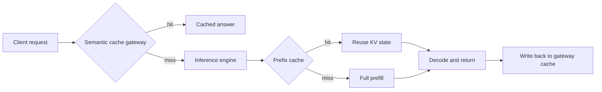

# Cheap hits, confident wrong answers

## the bill that's getting harder to ignore

Inference now eats roughly 85% of enterprise AI budgets, and 73% of firms told the FinOps Foundation they blew through their AI cost projections last year ([State of FinOps 2026](https://data.finops.org/)). The four big US hyperscalers will spend somewhere between $630 billion and $690 billion on AI infrastructure in calendar 2026, up about 60% on 2025, while their combined revenue grows around 15% ([Futurum, AI Capex 2026](https://futurumgroup.com/insights/ai-capex-2026-the-690b-infrastructure-sprint/)). The pricing your CFO budgeted against this year is being subsidised. That is not a stable equilibrium. I expect a normalisation inside twelve to twenty-four months. So the question for any team running production LLM workloads in mid-2026 is plain: where does the inference bill actually go, and what can you cut without cutting quality?

One answer is caching. Two distinct caching layers, to be precise, with two very different risk profiles. The teams I see succeeding treat them as separate engineering problems with separate operating models. The teams burning money treat them as one.

## what's actually cacheable

Two layers, top to bottom.

The first is **prefix caching at the inference engine**: vLLM, SGLang's RadixAttention, TensorRT-LLM. The KV cache from the prefill stage of one request gets reused by the next request that shares its leading tokens. It is lossless. It is deterministic. It changes nothing about the model's output. On RAG and multi-turn chat, where every request starts with the same system prompt and retrieved context, SGLang's published numbers show cache hit rates from 50% to nearly 99%. The same benchmarks give it about a 29% throughput edge over vLLM on prefix-heavy workloads ([SGLang RadixAttention docs](https://sgl-project-sglang-93.mintlify.app/concepts/radix-attention), [Spheron benchmark notes](https://www.spheron.network/blog/vllm-vs-tensorrt-llm-vs-sglang-benchmarks/)). The frontier model providers expose the same idea as a billing primitive. Anthropic charges cache reads at 10% of input rate, a 90% discount. OpenAI does it automatically at roughly 50% for any stable prefix above 1,024 tokens, and Google's Gemini 2.5 family discounts cached content 90% ([Artificial Analysis caching tracker](https://artificialanalysis.ai/models/caching), [DigitalOcean on prompt caching](https://www.digitalocean.com/blog/prompt-caching-with-digital-ocean)). Engineering teams that have invested in prompt cache hit-rate work report blended cost cuts of 60–85% on long-context agent loops ([AgentMarketCap, April 2026](https://agentmarketcap.ai/blog/2026/04/11/prompt-cache-hit-rate-engineering-2026)).

The second is **semantic caching at the gateway**: GPTCache, Redis LangCache (public preview as of late 2025, still pre-GA in 2026), Portkey, Bifrost, the gateway-layer libraries. This one intercepts a request before it reaches the model, embeds the query, looks up nearby vectors, and returns a previously generated answer if cosine similarity clears some threshold ([Redis on LangCache](https://redis.io/blog/langcache-public-preview/)). It is probabilistic. It can be wrong. And that distinction is where most production trouble starts.

## the pattern

Prefix caching belongs in the engine because the engine owns the KV state. Semantic caching belongs at the gateway because that is where you can see the full request, attach policy, log everything, and shed load before the GPUs spin. Both layers can sit in front of the same workload. They answer different questions: prefix caching asks *have I already computed the attention for these exact tokens?*, semantic caching asks *have I already answered something close enough to this?* The first question has an exact answer. The second has only a similarity score.

## the numbers, with vendor caveats

Vendor case studies on semantic caching cluster around dramatic claims. One widely-cited deployment dropped a $47,000 monthly LLM bill to $12,700, a 73% cut. The team got there by pushing cache hit rates from 18% to 67% ([summary at Maxim](https://www.getmaxim.ai/articles/semantic-caching-for-llms-cut-ai-costs-and-latency-with-an-enterprise-ai-gateway/)). AWS published research on 63,796 chatbot queries showing 86% cost reduction at the optimal threshold ([AWS results via Maxim](https://www.getmaxim.ai/articles/top-semantic-caching-solutions-for-ai-applications-in-2026/)). Redis claims up to 70% token savings on LangCache. Take each of these with the same posture you would take to any hyperscaler benchmark: the curve is real, the magnitude is workload-specific, the upper end is the marketing number.

Independent production reporting lands lower. Real agent workflows and FAQ traffic typically hit cache 30–70% of the time once you have tightened thresholds enough to avoid serving nonsense ([Redis LLM optimization, 2026](https://redis.io/blog/llm-token-optimization-speed-up-apps/)). Add prefix caching underneath that and a well-tuned stack can cut blended inference cost 40–60% on agent-heavy traffic. That is the upside.

The arithmetic is worth walking. Take an agent loop with a 12,000-token system prefix, 800 tokens of per-turn user content, six turns per session, and 200 tokens of generated output per turn. At Claude Opus 4.8 list pricing ($5 per million input, $25 per million output), one full session runs roughly $0.49 with no caching. Turn on Anthropic prefix caching at 10% read rate, and the same session falls to about $0.13, a 73% cut, lossless. Layer a gateway semantic cache that absorbs an additional 40% of *whole sessions* before they reach the engine, and the per-1,000-session bill drops from $490 to about $78. The first cut is the engineering team's. The second cut is the platform team's. They do not interfere with each other.

## where the floor falls out

A semantic cache fails differently from every other cache in your stack. A wrong hit does not slow your service. It returns a confident, well-formatted, entirely valid HTTP 200 with the wrong answer.

The data on this is bad. One developer ran 28 query pairs through several common gateway configurations and found false-positive rates near 99% at default thresholds; even the best-performing combination returned an incorrect answer 19.3% of the time ([test report on dev.to](https://dev.to/k_ivanow/i-tested-28-query-pairs-to-see-if-semantic-caches-actually-lie-to-users-the-result-surprised-me-333b)). PyImageSearch's May write-up on TTLs and cache safety walks through the same problem in production code ([PyImageSearch, 4 May 2026](https://pyimagesearch.com/2026/05/04/semantic-caching-for-llms-ttls-confidence-and-cache-safety/)). InfoQ's banking case study describes a team that had to engineer false-positive controls specifically because RAG semantic caching kept matching queries that *looked* similar but carried different filters or negations ([InfoQ on RAG semantic caching](https://www.infoq.com/articles/reducing-false-positives-retrieval-augmented-generation/)).

The failure modes I would put on every architecture review for a team about to ship one of these.

Hallucination amplification. If the underlying model hallucinated once, every semantically-similar request that follows gets served that hallucination from cache. The error does not decay. It compounds. Sampling-based ground-truth checks are the only way to detect it.

Embedding drift. A model swap from one OpenAI embedding family to another silently moved cosine similarities to near-random, and a cache started serving the wrong answer before anyone noticed ([TianPan, April 2026](https://tianpan.co/blog/2026-04-09-semantic-caching-llm-production)). Treat the embedding model as part of the cache key version. Migrate with a shadow cache.

Conversational context collapse. After several turns, the prompt is dominated by history, and two unrelated conversations look near-identical in vector space. Negations and boolean filters make this worse. I would not put a semantic cache in front of a stateful agent loop without an extremely tight threshold and a human-graded sample of every cache hit for the first thousand requests.

## the shipping order

Ship prefix caching first. It is free, it is lossless, the providers price it in your favour, and every modern inference engine supports it. There is no defensible reason a long-context agent in production today is running without it.

Add semantic caching second, and only on traffic where a wrong answer costs less than the savings. Read-only FAQ. Deterministic retrieval over a stable corpus. Internal search. Repeated boilerplate generation. Set the cosine threshold high. Start at 0.92 and audit your hits. Accept the lower hit rate, log every cache hit with a confidence score, and run a sampling pipeline behind it that re-issues a small percentage against the live model and alarms on disagreement. The threshold-versus-accuracy literature is now a year deep and consistent: below 0.88 you are taking on real false-positive risk; above 0.95 you are approaching exact caching and losing the point of going semantic at all ([Portkey on thresholds](https://portkey.ai/blog/semantic-caching-thresholds/)). Pick the band consciously, not by accepting the library default.

The honest version: a two-tier cache pattern is one of the highest-return interventions available to teams trying to bring their inference bill back under control. It is also one of the easiest places to ship a silent quality regression. Both of those things are true on the same day, in the same architecture diagram, in the same line item on the FinOps dashboard. The teams that get this right build the observability first and the cache second. The teams that get it wrong build it the other way around, and they only find out which group they were in when a customer notices.

---

*Tarry Singh is the founder and CEO of [Real AI](https://realai.eu), an enterprise AI advisory and deployment firm working with global enterprises on production agent systems, model risk, and AI sovereignty strategy. He also leads [Earthscan](https://earthscan.io), an Energy AI startup, and is a founding contributor to the EU-funded HCAIM and PANORAIMA programmes for responsible AI education across European universities. He writes at [tarrysingh.com](https://tarrysingh.com).*
