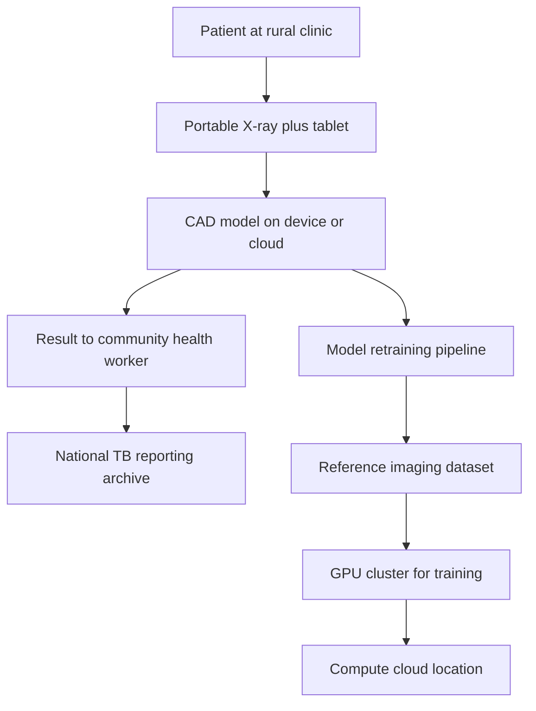

# Reading a Chest X-ray in Turkana: Where the AI Lives

An AI-enabled chest X-ray taken today in a village in western Kenya returns a result to the clinician holding the tablet in about ninety seconds. What I want to know is where the reading happens between the moment the shutter closes and the moment the score appears.

Not the software. The software is settled. In June 2025 the World Health Organization [approved six computer-aided detection products for TB screening on chest X-rays](https://www.who.int/news/item/11-06-2025-who-approves-six-software-products-for-computer-aided-detection-of-tb-on-chest-x-ray), up from the three products it had endorsed in 2021. The list includes CAD4TB from Delft Imaging, qXR from Qure.ai, and Lunit INSIGHT CXR alongside three newer entrants. AUC figures on the current versions clear 0.90 on the validation cohorts. The model layer, for TB screening at least, is done arguing with itself. What is not done is the sentence you have to write after the model returns a positive. That sentence is: it ran on a GPU sitting in some room. Which room?

I have been asking that question in every African deployment I have looked at over the last three months, and the honest answer, most of the time, is: it depends on which layer of the stack you are pointing at.

## What is settled, and what is not

Take Kenya at its word first. In October 2025 the Ministry of Health, working with the Centre for Health Solutions and the Global Fund, [flagged off 80 ultra-portable digital X-ray systems](https://www.the-star.co.ke/news/2025-10-13-kenya-flags-off-80-ultra-portable-digital-x-ray-systems-to-combat-tb-to-counties) with CAD software on board, distributing them to primary health facilities across the country. Between March and May 2025 the same infrastructure had already been used in the StopTB "AI Against TB" campaign, and the reported yield was blunt: [more than 9,000 people screened across ten counties, at a 14.8% positivity rate](https://chskenya.org/over-9000-kenyans-screened-for-tb-across-10-counties-using-cutting-edge-ai-powered-tools/), with Nairobi and Murang'a producing the largest case counts. If you are a district TB officer in Turkana, this is a real number, arrived at with real machines by real workers, and it is materially better than what your team could produce twelve months earlier.

That is one layer. The device is in the field, the model is WHO-endorsed, the workflow is documented in the [StopTB project summary from March 2024](https://www.stoptb.org/sites/default/files/imported/document/kenya_x-ray-cad_project_summary_intp_mar_24.pdf), the community trusts the tablet enough to show up. In Nigeria, [an ultra-portable CAD4TB deployment during active case finding](https://www.ncbi.nlm.nih.gov/pmc/articles/PMC12257310/) showed a similar shape. The progress is real.

The open question is what sits underneath. When the CAD model on that Kenyan tablet is retrained, the training runs somewhere. The reference chest X-rays it learned from came from somewhere. The archived output, used for national reporting, for research, for the next model, lands somewhere. Ask each of those "somewheres" and the answer is rarely Nairobi. It is more often Utrecht, or Bangalore, or a hyperscaler zone in Virginia. That is not an accusation. It is the current shape of the stack.

## The archive layer moved this year. The compute layer did not.

Two artefacts from the last nine months matter for this argument. First, on 21 November 2025, [Africa CDC launched AGARI](https://africacdc.org/news-item/africa-cdc-launches-agari-a-continent-wide-genomic-data-platform-to-strengthen-outbreak-response/), the Africa Genome Archiving for Response and Insight platform, as a continent-wide archive for pathogen genomic data, built with the African Society for Laboratory Medicine and member states. It is explicit about data sovereignty: countries decide what they share and under what conditions. Six years ago only seven African countries could do basic pathogen sequencing in-country. AGARI's own framing puts that number at 46 today. That is a real archive-layer answer to a real archive-layer problem.

Second, on 16 May 2026, Nigeria's [National Biotechnology Research and Development Agency announced its National Genomics and Bioinformatics Data Generation, Repository and Management Infrastructure](https://nbrda.gov.ng/2026/05/16/nbrda-launches-national-genomics-infrastructure-to-drive-precision-medicine/), signing an MoU with IndyGeneUS Bio to stand up a sovereign Trusted Research Environment on Nigerian soil. The rationale is not subtle: roughly 80% of the genomic data in global use today is drawn from non-African populations, and any precision-medicine model trained on that reference set walks into an African clinic already miscalibrated. The [BraTS-Africa challenge](https://academic.oup.com/noa/article/8/1/vdag082/8667669), pulling MRI scans from six centres in Nigeria to create the first public annotated African brain-tumour imaging dataset, is a smaller-scale version of the same correction being made at the reference-data layer.

Those announcements move the archive layer and the reference-data layer. They do not move the training layer. Neither AGARI nor NBRDA ships with a GPU footprint. When Nigeria's TRE runs an analysis on a novel indigenous variant, the compute renting that analysis is not, in the near term, going to be a Lagos-hosted cluster. It will most likely be an American or European cloud, licensed under a data-processing agreement that is careful about egress and quiet about the electron bill.

## The diagnostic-sovereignty critique

[A recent paper in the Journal of Global Health Economics and Policy](https://jogh-ep.org/article/161583-cloud-control-and-diagnostic-sovereignty-the-political-economy-of-ai-enabled-health-diagnostics-in-africa) argues that AI-enabled diagnostics in Africa are, at present, a case study in diagnostic sovereignty gone wrong: models developed in high-income settings, hosted on foreign clouds, validated on populations that do not resemble the ones they screen. The claim is not that AI-enabled TB screening is a bad idea. The claim is that the current architecture concentrates decisional power outside the countries whose citizens are being screened, and that the productivity gains being reported obscure a slow transfer of clinical governance offshore.

I think the paper's diagnosis is broadly correct, and its prescription is where I would push back. The response that works is to bring the archive and compute layers into national planning on the same clock as the device deployment. The Kenyan clinician screening those 9,000 people last quarter should not be asked to wait for a fully sovereign stack before the model runs. Instead, the national plan should already fund the years-2027-to-2030 build of the layers underneath, and price the transition into the current programme, so the sovereignty is written in ink by the time the current cohort of X-ray machines needs replacement.

That prescription just got harder. In late April 2026 [Ghana walked away from a $109 million United States health-data deal](https://www.washingtonpost.com/national/2026/05/01/ghana-us-health-deal-africa-usaid/a64a27e2-45b3-11f1-b19d-32431046b5b4_story.html), citing clauses that would have given up to ten US entities standing access to national health data models, dashboards, and metadata without case-by-case consent. Kenya, Zambia and Zimbabwe have rejected similar offers. In parallel, [the Gates Foundation and OpenAI announced Horizon 1000](https://openai.com/index/horizon-1000/), a $50 million initiative to put AI tools into 1,000 primary-care clinics in Rwanda, Kenya, South Africa and Nigeria by 2028. That programme will be tested precisely on the question I began with: where does the model actually run, and what does the sovereignty of the compute look like when the same funder controls both the training pipeline and the deployment channel?

## What a district officer should ask

Model accuracy is the wrong question to put to a district TB officer in Turkana next week. WHO has settled that argument for chest X-rays. Three questions matter more. What is the data-residency clause in the contract with the CAD vendor. Where does the aggregated national reporting sit, and who can read it. What is the plan, dated and funded, for the archive and compute layers over the next thirty-six months. Those three questions will decide the story about clinical AI in Africa in 2028. The screening is happening. The stack under it is where the sovereignty argument settles, quietly, in procurement documents, one contract at a time.

In the corner of a clinic in Turkana this afternoon, a health worker will hand a tablet back to a colleague, sign a paper form, and walk to the next patient. Somewhere thousands of kilometres away, a rack of GPUs will register the small event that made her afternoon possible and will bill it in a currency her ministry does not print. Both of those things are true today. Only one of them has to stay true.

---

*Tarry Singh is the founder and CEO of Real AI ([realai.eu](https://realai.eu)), an enterprise AI advisory and deployment firm working with global enterprises on production agent systems, model risk, and AI sovereignty strategy. He also leads Earthscan ([earthscan.io](https://earthscan.io)) for Energy AI startup, and is a founding contributor to the EU-funded HCAIM and PANORAIMA programmes for responsible AI education across European universities. He writes at [tarrysingh.com](https://tarrysingh.com).*
