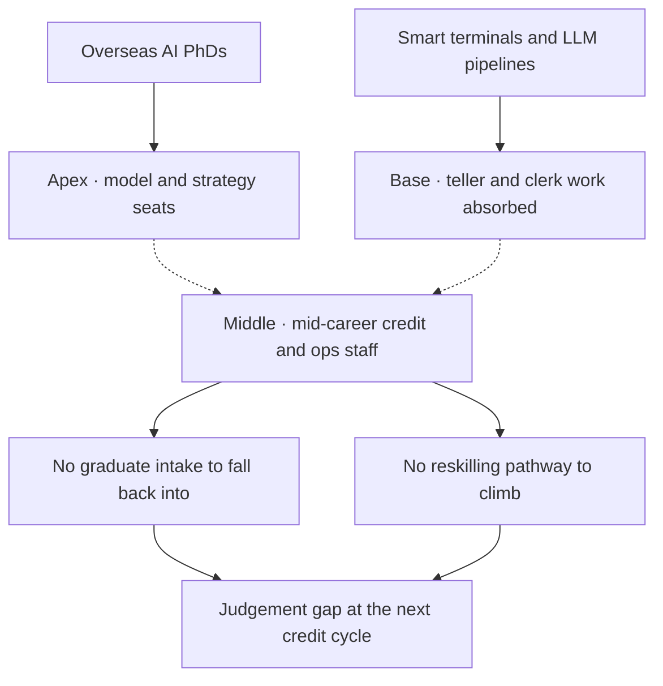

# China's Bank-AI Push Forgot the Middle

China's banks are building an artificial-intelligence workforce strategy with no room in it for the middle of their current workforce. The strategy is internally coherent. I doubt it pays off the way Beijing assumes.

## What the listings say

A month ago Bank of Communications opened a senior post in its financial-technology unit for an AI expert with a PhD from a globally recognised university and at least three years' experience at a major overseas financial institution. Bank of China advertised an "AI planning and research" role at head office under the same gating: overseas PhD, overseas tenure, expertise in large language models. China Guangfa Bank put up a forward-looking research seat aimed at LLM commercialisation, with the same filter. [China Daily walked the listings on 11 June](https://www.chinadaily.com.cn/a/202606/11/WS6a2a17b7a310d6866eb4da99.html) and read it as a vigorous talent drive.

Those listings describe the workforce China's largest banks now think they need. The hires are senior, narrow, and almost entirely imported: trained outside the country, with their formative work done at firms whose risk culture and tooling come from the same Anglo-American provenance. None of them came up through the in-house programmes or the analyst ranks. They sit at the top of a pyramid the rest of which is being quietly redesigned underneath them.

## What is happening to the base

The base is being automated. China Construction Bank's 5G+ Intelligent Bank concept, [documented through its Huawei build-out](https://carrier.huawei.com/en/case-study/case-studies/china-construction-bank) and now reproduced across cities, strips the branch of human tellers and folds account opening, transfers, FX and wealth-product issuance into smart automated terminals. Industrial and Commercial Bank of China says it now runs large language models across more than two hundred production applications spanning twenty-plus business lines, with a 100-billion-parameter in-house model under the hood. That figure comes from the bank itself, which makes it an aspirational ceiling rather than a benchmark. ICBC is well past piloting and into integration.

Multiple lenders moved DeepSeek into customer service and credit-approval pipelines through early 2026, [as Global Times reported at the time](https://www.globaltimes.cn/page/202503/1330054.shtml). The DeepSeek call is itself a sovereignty hedge: an open-weights Chinese model that avoids the licensing dance with a US lab. The combined effect across the sector is the disappearance of jobs that for thirty years formed the first rung of a banking career: branch teller, junior credit clerk, retail relationship apprentice. Those roles are not being relabelled. They are being deleted from the headcount plan.

## The Hangzhou ruling

A court supplied the first piece of institutional friction this year. On 28 April the Hangzhou Intermediate People's Court published a typical-cases bulletin centred on a worker, named only by his surname Zhou, who had spent two years as a quality-assurance supervisor on AI-generated answers at a Hangzhou tech firm. When his employer's own LLMs ate the role, the firm offered him a demoted seat at 15,000 yuan a month instead of his 25,000-yuan salary, then terminated him for refusing. [Bloomberg carried the ruling on 2 May](https://www.bloomberg.com/news/articles/2026-05-02/chinese-court-rules-firms-can-t-lay-off-workers-on-ai-grounds); [Caixin Global ran the Chinese-side framing](https://www.caixinglobal.com/2026-04-30/chinese-courts-rule-companies-cannot-fire-workers-simply-to-replace-them-with-ai-102439602.html); the [State Council Information Office published the court's own English statement](http://english.scio.gov.cn/m/chinavoices/2026-04/30/content_118471189.html) the same week.

The termination grounds did not fall under "negative circumstances" such as business downsizing or operational difficulties, and did not meet the legal threshold of "impossible to continue the employment contract." Translated out of court Chinese: a company cannot fire you just because the model is cheaper, and the burden of proving the role can no longer be done by you sits with the employer.

That ruling is the first publicly enforced check on the substitution path Chinese banks are now travelling. The next test cases sit further out from Hangzhou: a branch of a city commercial bank in Shenyang, the seat of a credit analyst at a tier-two lender in Wuxi, the desk of a back-office processor at Postal Savings Bank in Xining. A few will go to court, and the courts will rule on them in the same language. The political signal, to the banks and to the labour market that watches the banks, is exactly what the apex-only hiring strategy was set up to ignore.

## What is missing in the middle

The labour-market backdrop is well documented. [Rest of World's reporting on the "quiet layoffs"](https://restofworld.org/2026/china-tech-layoffs-alibaba-baidu-ai-pivot/) running through China's tech-adjacent corporates this year describes contractor cuts, graduate-hire freezes, and attrition allowed to run hot, all under the banner of AI productivity gains. The pattern is on its way into the joint-stock and city commercial banks, and the timing is measured in months.

What is conspicuously absent is a serious national reskilling pathway aimed at the population most at risk inside financial services. That population is mid-career and mid-tier: between thirty-five and fifty, in a non-headquarters role, too senior to be reabsorbed into a graduate intake and too junior to be one of the PhDs Bank of Communications wants. [Tsinghua's PBC School of Finance](https://eng.pbcsf.tsinghua.edu.cn/) ran a high-level capacity-building programme on AI in inclusive finance in mid-May, useful and aimed squarely at senior executives. [The Shanghai Advanced Institute of Finance's MF-FinTech track](https://en.saif.sjtu.edu.cn/), launched in 2019, enrols graduate students. Neither reaches the people the Hangzhou court was protecting. They were not designed to.

## What the optimists answer

The optimist case has substance. [McKinsey's recent piece on agentic AI in banking operations](https://www.mckinsey.com/capabilities/operations/our-insights/the-paradigm-shift-how-agentic-ai-is-redefining-banking-operations) argues, with some evidence, that the right design is augmentation, with AI agents taking over the high-volume, low-judgement portions of work so the middle can handle the harder cases the agents cannot. [Accenture's banking blog](https://bankingblog.accenture.com/agentic-ai-future-of-work) makes a similar argument with a workforce-design overlay. Task-based roles dissolve, outcome-based roles emerge, the human stays in the loop. They have the design space right. The redesign cost, and whose payroll absorbs it, is where the argument breaks down.

McKinsey's own data, in the same body of work, makes the case for me. Nearly 80% of financial institutions report using some form of AI; a similar share reports no significant bottom-line impact. Only 34% have scaled it for a core process. The augmentation model exists in the slide deck. In production, what scales easily is the substitution path, because substitution is the path that does not require the bank's HR function to do the harder thing.

## The harder thing, and what it costs

The harder thing is week twelve of a real reskilling programme aimed at a forty-four-year-old credit analyst, taught in Mandarin, in Chongqing, by someone who has actually shipped a production credit model and can explain to her why her instinct about a particular SME borrower is now a feature in a gradient-boosted tree rather than the basis of the approval. That programme costs more per head than a senior AI PhD's signing bonus. It produces a less photogenic press release. It will be the last thing any of the joint-stock banks fund voluntarily.

My own reading is narrower than the doom version. The technology will work. ICBC will run its production model fleet, CCB's branches will keep losing tellers, and the PhDs will arrive on schedule. What I expect to go wrong is the next credit cycle. When it bites, and in China it will bite, it will land on a workforce that no longer has the mid-tier judgement that catches a deteriorating loan book six months before the model does. That is the silent cost of the substitution path, and it will not show up in any productivity statistic until the quarter it has to.

## A desk in a second-tier city

A forty-two-year-old credit analyst sits at her desk in a city commercial bank in a second-tier city, mid-July 2026, late afternoon. Her terminal shows the dashboard head office rolled out in March. There is a borrower she has known for nine years whose receivables look wrong this quarter, and she knows why, and the dashboard does not. There is also a draft memo from HR about a "career development conversation" scheduled for Tuesday. Neither the bank's apex hire in Pudong nor the smart teller in the lobby downstairs will sit across from her on Tuesday. The court in Hangzhou cannot see her either. She closes the dashboard, picks up the phone, and calls the borrower herself.

---

*Tarry Singh is the founder and CEO of [Real AI](https://realai.eu), an enterprise AI advisory and deployment firm working with global enterprises on production agent systems, model risk, and AI sovereignty strategy. He also leads [Earthscan](https://earthscan.io) for Energy AI startup work, and is a founding contributor to the EU-funded HCAIM and PANORAIMA programmes for responsible AI education across European universities. He writes at [tarrysingh.com](https://tarrysingh.com).*
