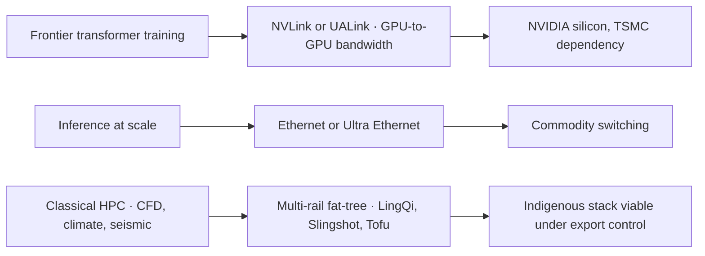

On 23 June 2026, the sixty-seventh TOP500 list was announced at ISC in Hamburg, and LineShine, a previously unlisted system installed in China, debuted at number one, displacing El Capitan as the world's most powerful supercomputer.

That, by itself, is unremarkable. The TOP500 changes hands.

LineShine achieved 2.198 exaflops on the High Performance Linpack benchmark using CPUs only, making it the first system on the TOP500 to exceed two exaflops of sustained double-precision performance without GPU accelerators.

No NVIDIA. No AMD MI-series. Not even Intel Ponte Vecchio.

The system consists of 20,480 computing nodes, each equipped with two ARMv9-based LX2 processors integrating two compute dies with 304 cores total and eight on-package HBM stacks delivering 32 GB at 4 TB/s aggregate bandwidth. Ninety compute cabinets. Forty-two megawatts. A custom Chinese interconnect called LingQi that nobody outside Shenzhen had benchmarked until three weeks ago.

This is not a stunt. In a forum built for reproducible measurement, China has shown it can field a full-stack exascale architecture under export controls that prevent access to H100s, B200s, and InfiniBand.

## The LingQi fabric: fat-tree at 1.6 Tb/s per node

The LingQi interconnect is a dual-plane, multi-rail fat-tree topology delivering 1.6 Tb/s of bandwidth per node, supporting 2 million ports and scaling to more than 100,000 nodes, with InfiniBand-like features such as credit-based flow control to optimise data flow.

A four-layer fat tree delivers a single-hop latency across the network of 1.07 microseconds, and the entire bisection bandwidth exceeds 3.5 Pb/s.

For context: NVIDIA's NVLink 5.0 delivers 1.8 TB/s per GPU in a tightly coupled NVSwitch domain.

AMD disclosed approximately 3.6 TB/s scale-up bandwidth per MI455X accelerator in the Helios rack at CES in January 2026 through UALink 1.0's higher lane count.

LineShine's LingQi is running at 1.6 Tb/s *per node*, and each node has two LX2 processors, so that figure is not per accelerator. The bandwidth density is deliberately lower than GPU-scale-up fabrics, but the *system* bisection is enormous because every node is a many-core workhorse that does not need to shovel activation tensors to separate GPUs every few milliseconds.

Calling LingQi slow misses the topology assumption behind it. GPU clusters are optimised for all-to-all collectives at sub-10-microsecond scale inside a pod; CPU clusters are optimised for slightly looser coupling across many more endpoints.

The latency figure sounds more like Ethernet than InfiniBand, though it might just be an honest assessment of InfiniBand's latency, and the LingQi interconnect is reasonably believed to be based on a variation of InfiniBand technology or a stripped-down version of Ethernet. The Chinese have not published a datasheet. My guess is a custom SerDes running over copper or active optical cable, with Ethernet framing and InfiniBand-inspired flow control: a hedged middle path.

## Why CPU-only works when the memory hierarchy is co-designed

The common objection is: FP64 matrix multiplication on CPUs is hopeless compared to tensor cores. True. But LineShine is not training diffusion transformers.

The LX2 supports FP64/FP32/FP16/INT8 via SME and SVE units, delivering up to 60.3/120.6 TFLOPS in FP64/FP32. Each processor integrates HBM *on-package*: no PCIe round-trip, no CXL indirection, no NUMA hop to a discrete GPU.

A dedicated SDMA engine handles data movement between DDR and HBM.

The entire LineShine system draws 42.22 MW with an efficiency of 52.07 FP64 GFlops/W. That is not competitive with GPU-based inference at FP8. For sustained double-precision workloads (computational fluid dynamics, climate, molecular dynamics, finite-element) it is in line with Aurora and El Capitan, both of which lean on accelerators and draw comparable or higher power per delivered flop on classical HPC codes.

Once you put HBM directly on a many-core CPU die and route the interconnect into the package, the overhead that made CPU-only clusters uncompetitive disappears. No PCIe tax. No copying into GPU memory and back.

The system incorporates 3D floating orthogonal computing and full liquid cooling to manage thermal output, employing what officials described as the largest centralised liquid cooling deployment yet built. At this density liquid cooling is architectural.

Goldman Sachs forecasts that liquid-cooled AI servers will increase from 15% in 2024 to 54% in 2025. It puts 2026 at 76%, driven largely by soaring demand for full-rack liquid-cooling solutions.

LineShine is not an AI training cluster. It is a sovereign *compute* platform.

## The sovereignty angle: vertical integration under constraint

LineShine was built at the National Supercomputing Center in Shenzhen using Huawei's LX2 Armv9 processors, custom interconnects, and Chinese storage. It is a direct response to US export controls, and it shows China can build frontier HPC infrastructure without American chips.

The project targets sustained performance above 2 ExaFLOPS using no foreign-made components.

Europe is attempting a similar path, incompletely.

In April 2026, the European Commission awarded a €180 million contract to procure sovereign cloud for EU institutions, bodies, offices, and agencies to four providers.

Europe controls less than 5% of global AI compute, while US hyperscalers dominate over 70% of the regional cloud market. The EU sovereign AI infrastructure stack is now operational all the same, from the €75M EURO-3C federated cloud to Mistral's €830M Paris data centre and Deutsche Telekom's 0.5 ExaFLOPS Industrial AI Cloud. Almost all of it runs on NVIDIA or AMD silicon fabbed at TSMC.

Factories run NVIDIA and some AMD on TSMC silicon. Europe's digital sovereignty is operational in the sense that data stays in EU datacentres. It is not silicon-sovereign.

China has closed that gap. Whether the system is export-viable or cost-competitive is irrelevant. It proves the capability exists. If a customer government wants compute that cannot be switched off by Ethernet or cut off by TSMC allocation, LineShine is an existence proof. The LingQi interconnect, in particular, is significant because it is the long-pole dependency. You can fab Arm cores at SMIC on a trailing node if you accept lower clocks. You can stack HBM if Samsung or SK Hynix will sell to you (or if CXMT scales). But if you cannot build a low-latency, high-bisection fabric that scales to 100,000 nodes, your exascale programme fails. China just demonstrated it has that fabric.

## What this implies for the NVLink / UALink / InfiniBand fork

For three years the scale-up interconnect market was NVIDIA NVLink or nothing.

In May 2024, AMD, Broadcom, Cisco, Google, Hewlett Packard Enterprise, Intel, Meta, and Microsoft announced they aligned to develop UALink, a new industry standard dedicated to advancing high-speed and low-latency communication for scale-up AI accelerators.

UALink 2.0 was published on 7 April 2026, and UALink silicon such as AMD MI400 is expected to be more broadly available in H2 2026. But shipping volume remains limited.

UALink is generally one to two generations behind NVLink, though it is seen as a significant development that could enable the non-NVIDIA ecosystem to challenge NVIDIA's dominance in AI scale-up starting in 2027.

LineShine demonstrates a third path: build a network-oriented interconnect (multi-rail fat-tree, not all-to-all NVSwitch) and co-design the processors so they do not need 1.8 TB/s GPU-to-GPU links in the first place. This is the older HPC playbook (Cray's Aries, Slingshot, Fujitsu's Tofu) extended with on-package HBM and Arm vector extensions.

Aurora is built by Intel using HPE Cray EX with Intel Xeon CPU Max Series and Intel Data Center GPU Max Series accelerators communicating through Cray's Slingshot-11 interconnect. The topology is converging: a high-radix switch fabric with RDMA semantics and either co-packaged or tightly coupled memory to minimise PCIe/CXL hops.

The market is fragmenting by use-case. If you are training 405B-parameter transformers, you need NVLink or UALink at GPU-level bandwidth. If you are running inference at scale, you can tolerate Ethernet (or Ultra Ethernet). If you are running classical HPC (weather, CFD, seismic) you want the fattest CPU-to-network pipe you can afford, and GPUs may be irrelevant.

LineShine picked the third wedge and went vertical. That wedge is large enough to matter.

## Liquid cooling at 460 kW a cabinet

The global AI datacentre liquid cooling market is entering a high-growth phase, valued at an estimated USD 3.20 billion in 2025. Forecasts put it at USD 3.70 billion in 2026 and USD 17.83 billion by 2036, a CAGR of 16.9%.

Direct-to-chip solutions effectively support rack densities of 60–100 kW, making them the standard choice for AI training clusters deploying NVIDIA H100/H200 GPUs and next-generation Blackwell architectures.

LineShine is running at approximately 460 kW per cabinet across ninety cabinets. You cannot cool that with air at any economically viable airflow. The Chinese claim centralised liquid cooling at scale. I would want to see independent thermal verification, but the claim is plausible given the demonstrated power draw and cabinet density.

In China, liquid-cooling costs can be 30–50% more than traditional air-cooled solutions, while in many Western markets this premium can reach 100–150%. If you are under export control and building at national priority, you absorb the premium. If you are a hyperscaler optimising for margin, you delay until rack density forces your hand, which it now has.

The compute-interconnect-cooling stack is coupled. You cannot separate them in design or procurement anymore. A fast interconnect with poor thermal management throttles. Dense compute with slow interconnect stalls. Sovereign ambitions without indigenous interconnect IP create a kill-switch dependency. Shenzhen answered all three in one build, and that is why LineShine matters more than its TOP500 ranking.

I doubt LingQi ever becomes a commercial export. I am much more confident that any analysis assuming NVIDIA NVLink, Broadcom switching, and Vertiv cooling are the only routes to 100-petawatt-class deployment is now out of date. The playbook just forked.

* * *

Tarry Singh is the founder and CEO of Real AI (realai.eu), an enterprise AI advisory and deployment firm working with global enterprises on production agent systems, model risk, and AI sovereignty strategy. He also leads Earthscan (earthscan.io) for Energy AI, and is a founding contributor to the EU-funded HCAIM and PANORAIMA programmes for responsible AI education across European universities. He writes at tarrysingh.com.
