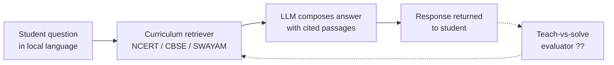

# Cite Your Sources, Class Three: India's Classroom AI and the Retrieval Pattern It Almost Deploys

1 million teachers. That is the number sitting under a mission statement I have been reading in fragments since spring, waiting to see whether the operational plan can catch the ambition.

The number belongs to Bodhan AI, the IIT Madras Centre of Excellence in AI for Education. Its goal, unveiled by Union Education Minister Dharmendra Pradhan at the IIT-M Technology Summit at Bharat Mandapam in New Delhi, is to train 1 million Indian school teachers in classroom AI literacy by 2027, per [Careers360's coverage in May 2026](https://news.careers360.com/iit-madras-bodhan-ai-help-train-1-million-school-teachers-ai-literacy-2027-students-education-dharmendra-pradhan-pedagogy-workload/amp). Sitting alongside it is a CBSE mandate that from the 2026-27 academic session onwards, Computational Thinking and Artificial Intelligence become part of every affiliated school from Class 3 upwards. That mandate lives in [Circular Acad-15/2026](https://cbseacademic.nic.in/web_material/Circulars/2026/15_Circular_2026.pdf) issued on 1 April 2026 by Dr Praggya M Singh, CBSE Director of Academics. And underneath both, quieter and more consequential than either, sits IIT Kanpur's [SATHEE platform](https://www.iitk.ac.in/ai-enabled-version-of-sathee-app), an AI-driven exam-prep and learning system now shipping in twelve Indian languages.

Those three items are one plan, and the design pattern behind them is recognisable. India is installing, at national scale, a version of what practitioners have taken to calling the *curriculum-grounded retrieval-augmented tutor*. The pattern is the right one. The measurement loop around it is still missing, and that gap matters more than the rollout numbers do.

## The shape of the pattern

With the marketing stripped off, SATHEE's shape is familiar to anyone who has built a serious RAG system in the last two years. A student asks a question in one of twelve Indian languages. The system does not answer from the model's parametric weights. It retrieves from a curated curriculum corpus of NCERT textbook passages, past examination papers and teacher-written explanations, and pipes the retrieved passages into the model as grounding context. The model composes an explanation in the student's language, cites the source passages, and is meant to refuse or defer where the retrieved evidence is thin.

The MDPI [systematic study of entity-linked retrieval for educational platforms](https://www.mdpi.com/2504-2289/10/4/120) sets out exactly this architecture and names its three targets: hallucination, weak curricular fidelity and dependence on external cloud infrastructure. All three matter in India. Hallucination in a Class 6 physics answer becomes a wrongly-marked exam. Curricular fidelity is the difference between an NCERT-aligned explanation and something plausible-sounding that will lose the student marks in every board that follows the framework. And the third, the cloud-dependence question, is why so much of India's public education AI is being built with an eye to offline and on-premise deployment. The [ScienceDirect systematic survey of RAG in education](https://www.sciencedirect.com/science/article/pii/S2666920X25000578), cutting across 51 studies, lists the same three constraints and adds a fourth that Indian builders will confront by year end: limited multimodality, the diagram-and-figure problem that a purely textual retriever cannot solve.

The dotted return path is the piece I have not yet seen wired up in any of the Indian deployments. It is the piece that decides whether this rollout teaches anyone anything.

## The teach-versus-solve gap

The most useful piece of academic work I have read on any of this in the past two months is a June preprint from a team at Washington University in St. Louis and Southern Methodist University. In [*Beyond Helpfulness: A Teaching-over-Solving Diagnostic for Measuring Educational Impact in LLM Tutors*](https://arxiv.org/abs/2606.16206), Yao, Zheng and Li run a study across eight publicly benchmarked LLMs and find that the correlation between a model's ability to *solve* a maths problem and its ability to *teach it* is only 0.421. Several models change rank meaningfully when the evaluation shifts from solving to pedagogy.

A four-tenths correlation means a model that answers Class 10 algebra questions correctly with high probability may still be a mediocre teacher of Class 10 algebra, and you cannot tell which without evaluating the pedagogy directly. Every vendor deck this quarter, every internal readout at a state education department, will report the solving score. The teaching score will not be measured because the tooling to measure it does not exist in most deployments.

## Why India is a hard case for this specifically

The gap is a general problem. India sharpens it.

The language surface is real. SATHEE ships in twelve Indian languages. Recent benchmark work like [ParamBench, a graduate-level evaluation of LLMs on Indic subjects](https://arxiv.org/pdf/2508.16185), has begun to show that many frontier models degrade sharply on low-resource Indic languages, and that romanised versus native scripts produce meaningfully different answers. If your evaluator lives only in English, you are grading a system whose failure modes only show up in Bengali or Tamil.

The classroom register is not the university register. A Class 3 explanation is a different rhetorical task from a Class 12 doubt-solve, and both are different from JEE preparation. Pedagogy at seven years old is closer to a picture book than to a proof, and closer, in some ways, to the multimodality problem the ScienceDirect survey flags as still open. Bodhan AI's brief spans lesson planning, worksheet generation and evaluation across Classes 1 through 12. That is a rubric surface three ages of student wide.

And the deployment scale removes the option to hire your way out of the eval problem. IIT Madras' [AI for Educators certification](https://www.iitm.ac.in/happenings/press-releases-and-coverages/ai-all-20-iit-madras-expands-swayam-plus-free-ai-courses) is running through Swayam Plus, and the [PIB record of the Pravartak-SWAYAM rural rollout](https://www.pib.gov.in/PressReleasePage.aspx?PRID=2219370) covers the K-12 tail. Between them, the enrolment surface for teachers of Class 3 upwards is measured in hundreds of thousands, and climbing. When those teachers each nudge students through daily conversational tutors across twelve languages, the volume of interactions per week outruns any human sampling regime. The evaluator has to be automated, and it has to be independent of the model that answered the question.

## What "wiring the loop" would look like

The discipline is not exotic. A curriculum-grounded tutor with a pedagogy evaluator would run something like this: for every student interaction the tutor conducts, a separate model, prompted with a rubric derived from NCERT teaching guides, would rate the response on three axes: factual grounding to the retrieved passage, age-appropriate framing, and whether the tutor *taught* the concept or simply *solved* it. Random samples would go to a human teacher for calibration. Rubric drift would be checked monthly against a small held-out set of real classroom questions.

The engineering is not hard. Anthropic's own [write-up on demystifying agent evals](https://www.anthropic.com/engineering/demystifying-evals-for-ai-agents) recommends starting exactly here: 20 to 50 real failures. In an Indian classroom setting, 20 to 50 real failures is what a good teacher collects in a week.

In the Real AI engagements where educational deployment is on the table, I keep pushing this because the *absence* of the pattern is politically invisible. A minister can announce 1 million teachers trained and a curriculum mandated in every affiliated school. Neither of those press releases requires anyone to have measured whether a real Class 4 student in a rural school in Uttarakhand learned something they would not have learned from the textbook alone. Until that measurement is a live production number that appears in a Ministry dashboard next to the enrolment counts, the pattern is being installed without its return path.

## A note on the vendor and government numbers

The temptation, when a national programme is this large, is to lean on the vendor and PIB figures as if they were operating metrics. They are not. The PIB press release on the SWAYAM Plus AI training for rural school teachers counts enrolments; it says nothing about learning. IIT Madras' *AI for All 2.0* announcement counts course launches; it says nothing about outcomes. Both are honest documents. Neither is evidence that any child is being taught better. They deserve the same discount as any vendor's throughput claim.

## The classroom on Tuesday morning

I keep returning, when I think about this, to a small room I sat in on a visit to a government school outside Jaipur years before any of this infrastructure existed. A teacher was working through a Hindi comprehension passage with about forty children on a stone floor. She would ask a question. A child would answer. She would say, *not quite, look at the third line again*. She never solved for them. She pointed back at the text and waited.

The pattern India is installing is a machine version of pointing back at the text and waiting. That much is right. But a teacher who cannot tell whether the child understood is only a very fast search engine with a warm voice, waiting on a stone floor for the third line to be read again.

---

*Tarry Singh is the founder and CEO of [Real AI](https://realai.eu), an enterprise AI advisory and deployment firm working with global enterprises on production agent systems, model risk, and AI sovereignty strategy. He also leads [Earthscan](https://earthscan.io) for Energy AI startup, and is a founding contributor to the EU-funded HCAIM and PANORAIMA programmes for responsible AI education across European universities. He writes at tarrysingh.com.*
