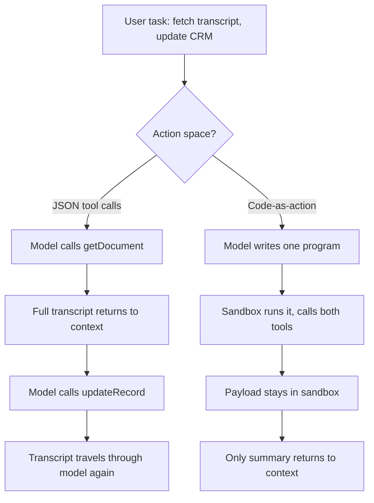

For two years the default way to give a language model hands has been the JSON tool call. You define a schema, the model emits a structured blob, your harness executes it, the result goes back into context, the model decides what to do next. Round and round. It works. It's also where a surprising amount of cost, latency, and brittleness lives — and in the last three weeks the major vendors have all converged on a different answer.

The answer is old. Let the model write code.

This is the pattern variously called CodeAct, Code Mode, or programmatic tool calling. Instead of the atomic unit being a tool call, the atomic unit becomes a code block that calls many tools, applies control flow, and keeps intermediate data out of the model's context. I want to walk through why it's suddenly everywhere, what the numbers actually say once you discount the marketing, and where I'd refuse to use it.

## the loop you've been paying for

Start with the cost structure of the conventional approach, because it's the thing the new pattern attacks. 

In the default pattern, an agent loads many tool definitions into the model context. Each tool definition contains schema information and metadata. Intermediate results from each tool call are also streamed back into the context so the model can decide the next call.

Two failure modes follow. The first is the catalogue problem — every tool you connect costs tokens before the agent does any work. The second is subtler. 

Chaining multiple MCP tools together involves passing their responses through the context, absorbing more valuable tokens and introducing chances for the LLM to make additional mistakes.

 If you fetch a 40,000-token meeting transcript with one tool and write it to a CRM with another, that transcript travels through the model twice for no logical reason. The model is acting as a very expensive data bus.

Code-as-action removes the bus. The model writes a short program; the program calls the tools; the large payloads stay inside the execution environment; only the summary comes back. The insight underneath is almost embarrassingly simple: 

LLMs are better at writing code than making individual tool calls — they have seen millions of lines of real-world code but only contrived tool-calling examples.

## not new — but newly productised

The pattern itself was formalised at ICML 2024. Xingyao Wang and colleagues argued that 

LLM agents are typically prompted to produce actions by generating JSON or text in a pre-defined format, which is usually limited by constrained action space and restricted flexibility, and proposed using executable Python code to consolidate LLM agents' actions into a unified action space.

 Their CodeActAgent, fine-tuned from Llama 2 and Mistral, posted up to a 20% higher success rate against text and JSON baselines. Worth a skeptical footnote: that was a 2024 result on 7B-class models and curated benchmarks, not a claim about your production stack.

What changed is that the research pattern became three shipping products in roughly six months, and the last leg landed in the past few weeks.

Cloudflare moved first with Code Mode last September, then put the dangerous bit — somewhere safe to run the code — into open beta. 

Cloudflare released Dynamic Worker Loader into open beta, offering V8 isolate-based sandboxing for AI-generated code execution, claiming isolates start in milliseconds using megabytes of memory, making them roughly 100x faster and up to 100x more memory-efficient than containers.

 The `@cloudflare/codemode` package reached version 0.3.8, last published roughly two weeks ago.

 It's explicitly flagged experimental, which is the honest label.

Anthropic published the MCP variant, where direct tool calls consume context for each definition and result, and agents scale better by writing code to call tools instead.

 They productised it as Programmatic Tool Calling. The mechanics matter for anyone wiring it up: 

Anthropic's Programmatic Tool Calling is the production instantiation of the same core insight, with two additions — the allowed_callers opt-in and explicit caller provenance in every tool_use block.

And then Microsoft. At Build 2026 — held 2–3 June — Microsoft Agent Framework shipped CodeAct on top of its Hyperlight micro-VM runtime. 

CodeAct collapses the loop: instead of choosing a tool, waiting, and choosing the next one, the model writes a single short Python program that calls your tools via call_tool(…), runs it once in a sandbox, and returns a consolidated result; it ships in the new agent-framework-hyperlight (alpha) package, which runs the model-generated code in a fresh, locally isolated Hyperlight micro-VM per call.

 Three different stacks, one architecture.

## the numbers, discounted

The token-reduction figures are eye-watering, which is exactly when a practitioner should slow down. Anthropic reports a workflow that previously consumed about 150,000 tokens when tools and intermediate data were passed directly through the model was reimplemented with code execution and filesystem-based MCP APIs and used about 2,000 tokens — a 98.7 percent reduction for that scenario.

 Cloudflare's demo showed 

Code Mode using 32% fewer tokens than direct tool calling for a single-event task, and 81% fewer for a complex 31-event task.

Read those carefully. The 98.7% is one cherry-picked scenario — a large payload moving between two tools, the single worst case for the old pattern. An independent test by AIMultiple, using a different setup, landed lower: 

code execution used 78.5% fewer input tokens, 165K versus 771K.

 Still large, but it tells you the headline number is workload-dependent, not a constant. The savings scale with payload size and call count. For an agent that makes three small, well-defined calls in a fixed order, you'll save almost nothing and add a sandbox to your ops burden. Cloudflare's own docs say it plainly: 

for simple, single tool calls, standard AI SDK tool calling is simpler and sufficient.

## where the risk actually moved

Here's where it gets uncomfortable. Code-as-action doesn't remove risk — it relocates it. You've swapped a schema parser for a code executor, and a prompt injection that reaches a code executor is a different class of problem than one reaching a schema parser.

 That's the sentence I'd want every board to internalise before signing off.

This is why the sandbox is the architecture, not an afterthought. The three vendors made three different bets on where to draw the hardware boundary. Cloudflare went with V8 isolates and was refreshingly candid about the trade: 

isolate-based sandboxing presents a more complex attack surface than hardware virtual machines, noting that V8 security bugs are more common than hypervisor vulnerabilities, mitigated by automatic V8 patching within hours, a second-layer sandbox, MPK, and Spectre defences.

 Microsoft went the other way, putting a hardware boundary around every single call. 

CodeAct historically had to trade safety, because running model-generated code against a host or even a general-purpose container is a real risk — long-lived shared state, broad filesystem and network reach; Hyperlight removes that trade-off because every execute_code call gets its own freshly created micro-VM with only the mounts and domains you opted into.

The discipline that survives all three is the same. Keep the sandbox locked by default. 

If the model needs to read a file outside the mounted paths, or hit an API outside the allow-list, the recommended approach is not to open a hole in the sandbox — instead, expose a narrow host tool that does exactly the operation you want, so the sandbox stays locked down and the sensitive I/O lives in code you reviewed and shipped.

There's an underrated upside too, and it's the one I'd lead with in front of a risk committee rather than the token savings: auditability. 

Code actions are inspectable in a way that JSON tool call sequences aren't — when something goes wrong, you have Python you can read, paste into a notebook, and run yourself.

## where I'd push back

If I were on the architecture review for this, I'd approve code-as-action for exactly one profile: agents with large tool catalogues, big intermediate payloads, or genuine iteration and branching. That's where the pattern earns its operational cost. The vendor benchmarks are real but staged; treat them as ceilings, not forecasts, and instrument your own token spend before and after.

For everything else — a handful of well-defined calls in a fixed order — I'd refuse it. You'd be standing up a sandboxed execution environment, accepting a code-injection attack surface, and adding container lifecycle to your on-call rota, all to orchestrate four API calls a JSON loop handles fine. That's not architecture. That's fashion. The pattern is genuinely good. Most agents don't need it yet, and the teams that adopt it because it's what Microsoft demoed at Build will spend the next year debugging a sandbox they didn't have to build.

---

Tarry Singh is the founder and CEO of Real AI (realai.eu), an enterprise AI advisory and deployment firm working with global enterprises on production agent systems, model risk, and AI sovereignty strategy. He also leads Earthscan (earthscan.io) for Energy AI, and is a founding contributor to the EU-funded HCAIM and PANORAIMA programmes for responsible AI education across European universities. He writes at tarrysingh.com.
