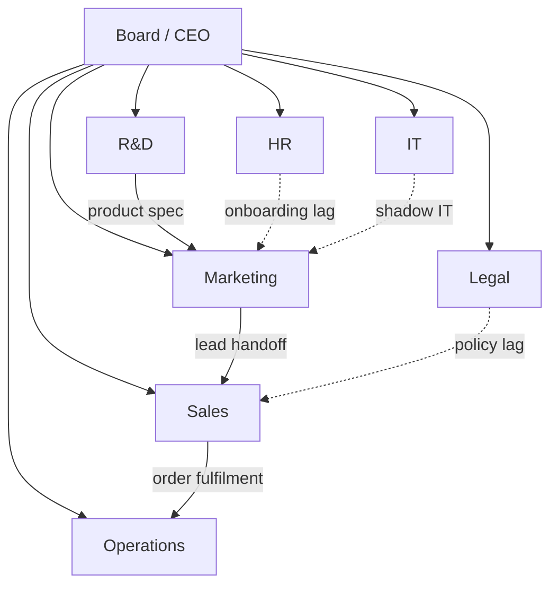
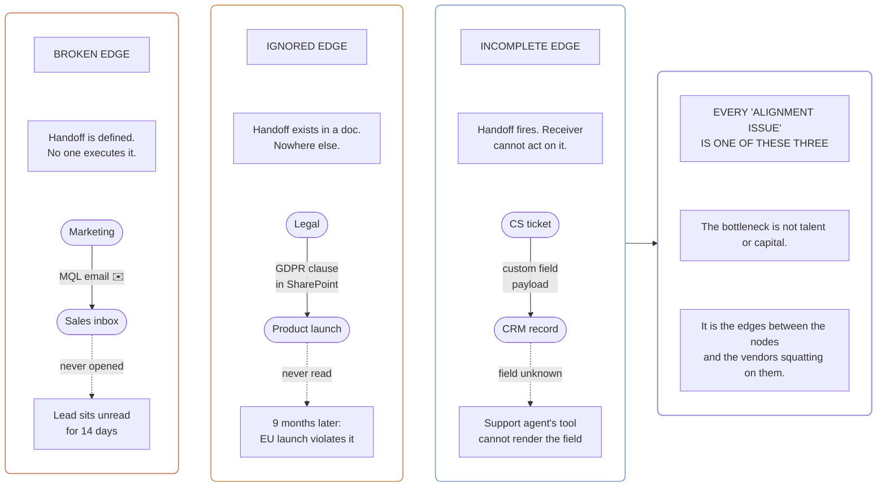
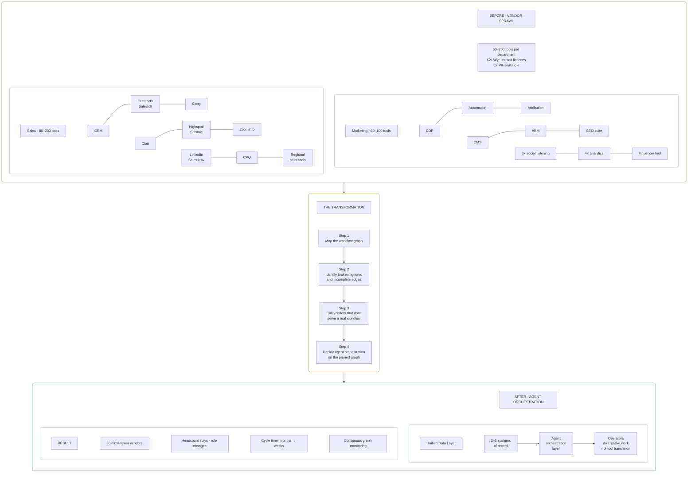

By 2011, Marc Andreessen had already told us [software was eating the world](https://a16z.com/why-software-is-eating-the-world/). Fifteen years later, the prophecy has run out of new things to eat. Every retailer is a software company; every bank is a software company; the dairy giant I audited a decade ago was already a software company, even if half its operating leadership would have denied it under oath. The thing the original thesis didn't bother to spell out (or left for someone else) is what a company actually *is*, once the software has eaten it.

A company is a graph of algorithms. Each department is a cluster of workflows. Each workflow is a sequence of steps the organisation has agreed someone should do. The organogram on the wall is just a permission system layered over that graph. The reason a Fortune 500 is harder to change than a Series-B startup has nothing to do with strategy; it has to do with the number of edges in the graph and the number of vendors squatting on them.

I'm going to argue two things, in that order. First, that this view of the firm is not a metaphor but the operating model, and the bottleneck of any modern enterprise is no longer talent or capital, it is the edges between the nodes. Second, that private equity will be the first buyer class to operationalise that insight at industrial scale, because their hold-period clock, their control rights, and their portfolio compounding mathematics make them the buyer who can least afford to leave it on the table.

## The bottleneck is the edges, not the nodes

The familiar way of looking at a struggling business is to count its people, its products, its market share (the nodes). The more useful way, fifteen years into the software-eats-everything cycle, is to count the edges between the nodes and ask which of them carry actual signal and which of them are dotted lines that nobody owns.

### Three ways an edge breaks

Edges break in three ways. They are *broken* when a handoff is well-defined but no one executes it: marketing emails a qualified lead to a salesperson who never reads the inbox. They are *ignored* when the handoff exists in a process document and nowhere else: legal's new GDPR clause sat in a SharePoint folder for nine months while the European launch quietly violated it. They are *incomplete* when the handoff fires but the receiving system cannot act on it: a customer-success ticket lands in the CRM with a field the support agent's tool doesn't know how to render. Every consultant who has ever walked into a board meeting and described "alignment issues" was describing edges.

### The fifteen-thousand-tool census

What is harder to admit is that the modern enterprise has spent the last decade *buying more edges*. Scott Brinker's annual martech census now [maps 15,384 distinct marketing-technology products](https://martech.org/scott-brinker-unveils-his-most-populous-marketing-technology-landscape-yet/), up from around 150 the year he started counting in 2011. That is roughly a hundred-fold expansion in fifteen years. Each new vendor lands in a department with a workflow nobody asked for. Each one adds an edge that somebody has to learn, integrate, govern, and eventually replace. The bottleneck is not that the marketing team is too small. The bottleneck is that the marketing team is running ninety overlapping subroutines they did not write and cannot fully see.

I am sceptical of any chief marketing officer who responds to this with "we already consolidated last year." The consolidation rarely outlasts the procurement cycle that follows it; somebody in a regional office discovers a new point tool and the count starts climbing again.

## Vendor sprawl is the visible form of edge debt

### The numbers, plainly

Zylo's [2025 SaaS Management Index](https://zylo.com/news/2025-saas-management-index) tracked enterprise software portfolios and found the average organisation was burning $21 million a year on unused or under-utilised licences, a 14 per cent year-over-year rise in waste, with 52.7 per cent of provisioned seats sitting idle. Productiv's three-year study of about 100 million enterprise seats put the unused share at 40 per cent. Gartner's last public sales-tech read pegged the figure more conservatively at 25 per cent unused, and added that **40 per cent of seller productivity is lost to context-switching** between the CRM and the half-dozen point tools that ship around it.

The three sources disagree by a factor of two on the headline figure. They agree on the shape: somewhere between a quarter and half of provisioned enterprise SaaS is dead weight. At a $50 billion-revenue company that translates to nine-figure annual bleed. At a $1 billion-revenue company it is the size of a small acquisition.

### The unit-of-purchase / unit-of-work mismatch

These numbers do not mean enterprises are bad at procurement. They mean the unit of acquisition (a SaaS contract) does not map cleanly to the unit of work (a workflow). Every contract lands on a person, but every workflow crosses three or four people, sometimes three or four departments, sometimes three or four countries. The seats sit idle because the workflow they were bought to serve is incoherent before the software arrives. Buying more software does not fix that. It just makes the receipts longer.

There is a structural reason this keeps happening. Procurement reports to finance. Workflow design, when it exists at all, sits inside the business unit. Finance optimises per-contract; the business unit optimises per-quarter. Nobody optimises per-workflow. That gap is where the $21 million annual bleed lives, and no amount of better procurement governance closes it, because the problem is not procurement, it is that there is no continuous owner of the workflow graph itself.

## Marketing, told plainly

### The 60-to-100-tool reality

Take a mid-sized enterprise at $1 billion to $5 billion in revenue, the size of company that is too large to know its own systems and too small to have anyone whose job it is to find out. Its marketing organisation will be running somewhere between 60 and 100 vendors across inbound, outbound, brand, content, analytics, and partner functions. A customer-data platform: Segment, mParticle, Tealium, or whatever the chosen Adobe or Salesforce suite ships natively. A marketing-automation suite: Marketo, HubSpot, Pardot, depending on what got bought when. An attribution tool, usually Bizible or Demandbase. A CMS plus four separate content products. An ABM platform. An SEO suite. Three social-listening tools because the agencies each brought one. Four analytics dashboards. A standalone influencer system because somebody read a deck.

### What the dairy audit taught me

I led a global audit for a Dutch dairy multinational several years before Real AI existed and before the word *agentic* had any technical content. They were an FMCG company at full global scale. Their marketing function ran more vendors than any other department, and the team running it was small relative to the surface area. We did not have language for what we were trying to do at the time, but the framing my team eventually used was three layers: a *system of records*, a *system of knowledge*, a *system of wisdom*. The records layer was already digitised, but isolated inside individual operating countries and individual product domains. The knowledge layer existed in scraps (a brand playbook in the Netherlands, a different one in Indonesia, a third in the Middle East), occasionally shared across borders but never federated. The wisdom layer (what does this mean, what should we do next) was entirely human and almost entirely local. The full cycle, from observation to a change actually landing in a market, took six to twelve months. For a fast-moving consumer-goods business that competes daily on shelf space, that is brutal.

We could not have built what an agent layer can build today. The lesson stuck, though: the bottleneck was never the absence of data, it was the absence of plumbing. The vendor sprawl was a symptom; the disease was that no subsystem could speak across the others. A marketing organisation with one hundred vendors and three real workflows is the same organisation as one with five vendors and three real workflows. It is just more expensive, slower, and harder to audit.

### The day-after-tomorrow target

The reasonable target for that company today, with the tooling that did not exist then, is a marketing function running on a unified data layer, three to five core systems of record, and an agent layer that orchestrates the workflows the operators actually run. The vendor count drops thirty to fifty per cent. The headcount does not, but the headcount stops being a coping mechanism for tools that do not integrate and starts being a creative function again.

The companies that get this wrong will spend the next two years buying agent layers without first culling the systems beneath them. The agent then orchestrates a graph that should have been pruned. The orchestration looks impressive in the demo and adds latency in production.

## Sales is the same picture, larger

### Eighty to two hundred tools across the funnel

A $10–50 billion enterprise's sales organisation, by my count and by every RevOps practitioner I have asked, will be running between 80 and 200 distinct tools across pipeline generation, account management, forecasting, CPQ, contract lifecycle, customer success, and post-sale telemetry. The list is repetitive enough to recite from memory: Salesforce as the system of record; HubSpot as the cheaper alternative the SDR team prefers; Outreach and Salesloft for cadence (until the merger settles down); Gong for conversation intelligence; Clari for forecasting; Highspot or Seismic for content enablement; ZoomInfo for data enrichment; LinkedIn Sales Navigator for the contacts ZoomInfo couldn't find. Add the regional tools each country lead bought independently and you are at the upper end of the band.

### What the Salesloft–Clari merger really signals

The Salesloft–Clari merger at the end of 2025 was [the first market-level signal](https://forecastio.ai/blog/revops-tools) that the industry itself had stopped pretending more tools meant more revenue. Gartner's number, 40 per cent of seller productivity lost to context-switching, is the inverse of the same problem. A salesperson with six SaaS tabs open is not selling. They are translating between schemas.

### Consolidation is not workflow redesign

The honest thing to say about sales technology is that its consolidation cycle is now underway. The honest thing to add is that consolidation is not the same as workflow redesign. Folding two CRMs together gives you a fatter CRM. Re-architecting the workflows around what a sales team actually does (qualify, advance, close, retain) gives you something else. An agent orchestration layer is what makes that re-architecture cheap enough to attempt at scale.

Any company spending eight figures a year on sales technology should push for a workflow audit before the next renewal cycle. The audit costs less than one mid-tier vendor's annual subscription. The savings cover that audit ten times over in the first year. The reason it doesn't happen is not cost; it is that nobody at the company has the authority to cancel four vendors simultaneously without inheriting the political fallout.

## The cameos · HR, R&D, legal, IT

The pattern holds in every other function. HR runs ATS, HRIS, learning management, performance, engagement, payroll, benefits. Each one was bought in a different procurement cycle, each one carrying a workflow somebody mid-level negotiated. R&D runs design tools, PLM systems, simulation suites, requirements management, lab-information management, source control. Legal runs contract lifecycle management, e-discovery, matter management, compliance attestation. IT, the worst case, runs the rest of it plus the auth and the firewalls and the observability and the asset inventory; a typical large enterprise's IT department alone touches three hundred SaaS applications in any given month.

There is no department exempt from this. There is, by extension, no enterprise exempt.

## What an agentic audit actually does

### Reading the graph, not the deck

Agentic AI does not abolish vendors. It abolishes the per-edge labour cost. McKinsey's [most recent agentic-AI economic read](https://www.mckinsey.com/capabilities/quantumblack/our-insights/seizing-the-agentic-ai-advantage) puts the global productivity uplift at $2.6 to $4.4 trillion annually. That is a number that should be discounted on instinct, but I'll note that across twenty years of these forecasts McKinsey's enterprise-software productivity figures have consistently been *under* the eventual measured value, not over. Their [November 2025 State of AI](https://www.mckinsey.com/capabilities/quantumblack/our-insights/the-state-of-ai) found 62 per cent of organisations were experimenting with or scaling agents and 23 per cent had a production agent in at least one function. Deloitte's 2026 enterprise survey put the average measured ROI on agentic deployments at 171 per cent and the US figure at 192 per cent. These are not vendor brochures. These are the response patterns from CIOs and CFOs whose careers are on the line when the number is wrong.

What the agent layer does, concretely, is *read the graph*. It listens to events crossing departmental boundaries (a lead status change, a contract amendment, a stockout, a new EU AI Act compliance obligation) and routes the work without a human having to define every state transition in a Visio diagram first. It does, at machine cadence, the system-of-knowledge layer my dairy audit could only sketch by hand. It surfaces broken edges in a way a workflow consultant could not surface them, because the consultant could only observe what humans noticed; the agent observes the system itself.

### The vendor field · who can actually do this

The market for agent orchestration is already noisy, and most of the noise is rebadging. Salesforce's [Agentforce](https://www.salesforce.com/agentforce/) is a service-cloud add-on with an LLM wrapper; it inherits Salesforce's data model, which is the system the workflows need to escape, not the layer they need to sit on. Microsoft's [Copilot Studio](https://www.microsoft.com/en-us/microsoft-copilot/microsoft-copilot-studio) is CIO-friendly and ships with the Microsoft stack already integrated, but the abstraction sits above the workflow rather than re-architecting it; Copilot answers questions about the graph it cannot prune. Crew AI and LangGraph are open-source frameworks, not finished products; they are what your platform team builds *on*, not what you buy. Cognition (the Devin company) and Decagon are interesting at narrow edges, Devin for software-engineering workflows and Decagon for customer support, but neither is a horizontal answer.

The vendor that most resembles an actual re-architecture is [Sierra](https://sierra.ai/), Bret Taylor's company. Their pitch is to *replace* the workflow under the customer-experience function rather than glue an LLM to it. Whether they execute on that is a different question; the pitch itself is the only one in the field that takes "read the graph" seriously.

The honest framing for any operating partner evaluating this market: most of what is being sold as "agent platform" is a Visio diagram with a thin LLM on top. If the procurement process treats it the way you treat any other SaaS purchase (bake-off, RFP, two-year contract), you are buying paint and calling it a remodel.

### Time, not headcount

The thing this changes in practice is not headcount. It is *time*. The dairy company's six-to-twelve-month change cycle compresses to weeks. The Fortune 500 that took eighteen months to roll out a new pricing model rolls one out in a quarter. That is the actual productivity story; the seat-count story is the headline that gets the press release. CFOs who treat agent adoption as a headcount lever will miss the actual margin lift, which is cycle-time compression and the option value of moves the company could not previously make at all.

## Why private equity is the first buyer to operationalise this

### The 33,000-company asset base

The 270,000-companies figure that floats around alternative-asset commentary conflates portfolio entities (SPVs, holding cos, LP vehicles) with the operating companies a sponsor is actually trying to ship-shape. The relevant number, from PitchBook's [Q1 2026 Global PE First Look](https://pitchbook.com/news/reports/2025-annual-global-pe-first-look), is closer to **33,000 actively held PE-backed operating companies globally, more than 11,000 of them held past the five-year mark**. Alternative-assets AUM crossed $16 trillion in 2025 by McKinsey's count, with PE specifically sitting north of $7 trillion. Whatever the precise line, the asset class is large enough that a one-percentage-point improvement in operating margin across the held book is measured in tens of billions a year.

### The arithmetic of one point of margin

Run the numbers, conservatively. Take the 33,000 actively held operating companies. Assume a median revenue in the $150 million to $300 million band, a defensible middle for the held book once you exclude the megacap exceptions on either end. That is a global revenue footprint somewhere between five and ten trillion dollars under PE ownership. One percentage point of operating-margin uplift across that base is **fifty to one hundred billion dollars a year of recoverable EBITDA**, money the sponsor either captures at exit through a higher multiple or leaves on the table for the next owner to harvest.

The capital cost of running an agentic audit on a $200 million-revenue mid-market company sits in the low six figures today and is falling fast. The labour cost is one to three operating-partner FTEs. The cost-to-recovery ratio is not subtle. This is one of those rare cases where a back-of-envelope return calculation underestimates the actual case, because the audit also compresses the diligence cycle on the *next* acquisition, and the playbook compounds across the book.

```mermaid
%% caption: The audit playbook compounds: acquire, audit, optimise, exit; then the same artifact ports to the next company, and the arithmetic scales across the held book.
flowchart TD
  subgraph SPONSOR[" "]
    direction TB
    SP_H["PE SPONSOR · AGENTIC AUDIT PLAYBOOK"]
    subgraph ACQUIRE[" "]
      direction TB
      ACQ_H["ACQUIRE"]
      A1["Due diligence\non target company"]
      A2["Map the workflow graph\nin diligence · not after"]
      A3["Price the inefficiency\ninto the bid"]
      ACQ_H ~~~ A1
      A1 --> A2 --> A3
    end
    subgraph AUDIT[" "]
      direction TB
      AUD_H["AUDIT"]
      AU1["Deploy agent layer\non Day 1 of ownership"]
      AU2["Surface broken, ignored\nand incomplete edges"]
      AU3["Generate real-time\npunchlist for OpPartner"]
      AUD_H ~~~ AU1
      AU1 --> AU2 --> AU3
    end
    subgraph OPTIMISE[" "]
      direction TB
      OPT_H["OPTIMISE"]
      O1["Cull vendors\nthat don't serve workflows"]
      O2["Re-architect edges\nnot just nodes"]
      O3["Compress cycle time:\nmonths → weeks"]
      OPT_H ~~~ O1
      O1 --> O2 --> O3
    end
    subgraph EXIT[" "]
      direction TB
      EX_H["EXIT"]
      E1["Higher EBITDA margin\n= higher exit multiple"]
      E2["Clean graph\nde-risks buyer diligence"]
      E3["Playbook ports\nto next portfolio co"]
      EX_H ~~~ E1
      E1 --> E2 --> E3
    end
    ACQUIRE --> AUDIT --> OPTIMISE --> EXIT
    SP_H ~~~ ACQUIRE
  end
  subgraph COMPOUND[" "]
    direction TB
    CP_H["THE COMPOUNDING EFFECT"]
    subgraph PORTFOLIO[" "]
      direction LR
      PF1["PortCo 1\nPlaybook v1"]
      PF2["PortCo 2\nPlaybook v1.1"]
      PF3["PortCo 3\nPlaybook v1.2"]
      PF4["PortCo N\nPlaybook vN"]
      PF1 --> PF2 --> PF3 -. "..." .-> PF4
    end
    CP_STAT["Each audit refines a shared artifact.\nDiligence cost ↓ · Accuracy ↑ · Time-to-value ↓"]
    CP_H ~~~ PORTFOLIO
    PORTFOLIO ~~~ CP_STAT
  end
  subgraph MATH[" "]
    direction TB
    MA_H["THE ARITHMETIC"]
    MA1["33,000 PE-backed operating cos globally"]
    MA2["Median revenue $150M–$300M per co"]
    MA3["1pp margin uplift across the book ="]
    MA4["$50–100B/yr recoverable EBITDA"]
    MA_H ~~~ MA1
    MA1 ~~~ MA2
    MA2 ~~~ MA3
    MA3 ~~~ MA4
  end
  EXIT -. "playbook\ncompounds" .-> COMPOUND
  COMPOUND --> MATH
  class SP_H hdrCopper
  class ACQ_H,AUD_H,OPT_H,EX_H hdrCopper
  class A1,A2,A3,AU1,AU2,AU3,O1,O2,O3,E1,E2,E3 actionNode
  class PF1,PF2,PF3,PF4 portcoNode
  class CP_H hdrTeal
  class CP_STAT statNode
  class MA_H hdrCopper
  class MA1,MA2,MA3 mathNode
  class MA4 hdrCopper
  style SPONSOR fill:none,stroke:#c98e4f,stroke-width:1.5px,rx:8
  style ACQUIRE fill:none,stroke:#849cc8,stroke-width:1px,rx:6
  style AUDIT fill:none,stroke:#849cc8,stroke-width:1px,rx:6
  style OPTIMISE fill:none,stroke:#849cc8,stroke-width:1px,rx:6
  style EXIT fill:none,stroke:#849cc8,stroke-width:1px,rx:6
  style COMPOUND fill:none,stroke:#5fa6b4,stroke-width:1.5px,rx:8
  style PORTFOLIO fill:none,stroke:#a698d4,stroke-width:1px,rx:6
  style MATH fill:none,stroke:#c98e4f,stroke-width:1.5px,rx:8
```

### Three structural advantages

A PE sponsor has three structural advantages over a corporate board for this work. First, the **hold-period clock**, three to seven years on average, creates a deadline no public-company CEO faces. A CEO answering to a quarterly cycle cannot credibly tell the board "wait three years, we are rebuilding the workflow graph." A sponsor at year two of a five-year hold can. Second, **control**: the sponsor sits on the board, names the operating partners, and can rewire incentives without a proxy battle. Third, the **portfolio compounding effect**: a playbook that works at one company can be ported to the next twenty, with diminishing rebuild cost and improving accuracy each time. The PE shops that build an in-house agentic-audit capability in 2026 will be the ones that compound the playbook by 2028. The ones that don't will buy the playbook from a competitor at exit time.

### The named players to watch

The sponsors who will get this right are not necessarily the sponsors with the biggest funds. They are the sponsors with the deepest operating-partner benches.

[Vista Equity Partners](https://www.vistaequitypartners.com/) has been running a workflow-orchestration thesis for fifteen years. They did not call it that, but the Vista Value Creation team has been re-architecting enterprise-software portfolio cos with a vendor-rationalisation lens longer than the rest of the industry combined. They are also the firm with the deepest in-house operating capability across the asset class. If any sponsor institutionalises the agentic audit first, the most likely candidate is Vista.

[Thoma Bravo](https://www.thomabravo.com/)'s SaaS roll-up engine is the closest the asset class has to a continuous-improvement function, though their thesis is more about pricing power and gross-margin discipline than workflow redesign. They will adopt the audit because the math is too obvious to ignore, not because the playbook is in their DNA.

[KKR's Capstone](https://www.kkr.com/our-firm/capstone) team has the operating-partner depth and the industrial-ops culture to do this work outside of pure software cos: manufacturing, healthcare, services portfolios where the workflow graph is messier and the upside larger. They are the ones to watch if you want to see whether the playbook generalises beyond enterprise SaaS.

[EQT](https://eqtgroup.com/)'s Digital Transformation arm runs a Sweden-based version of the same playbook in mid-market Europe and the Nordics. Smaller stage average, more vendor-heavy portfolios, and a culture that is comfortable with continuous in-life intervention.

[Apollo](https://www.apollo.com/) will use the audit primarily as a cost-out lever, which is a narrower use of the tool than the alternatives but still legitimate. The risk is that cost-out becomes the only motion and the growth-side margin opportunity gets left on the table.

Blackstone, despite its scale, sits one rung below the operating-partner-heavy houses on this dimension. Their model favours capital allocation over workflow redesign. They will buy the capability through an acquisition before they build it from scratch.

These are the firms to watch over the next twenty-four months. Whichever of them institutionalises the agentic audit first will set the new benchmark for the rest of the asset class to either match or price against.

### What an agentic-audit-first sponsor looks like

I have been told, in three separate conversations with operating partners over the last six months, that the diligence process at most mid-market sponsors still consists of a McKinsey-style off-site, a deck, and a spreadsheet. What an agentic-audit-first sponsor offers, by contrast, is a system that runs on the portfolio company's own data from day one of ownership, surfaces the broken edges, and gives the operating partner a punchlist that updates in real time. The diligence is the audit, the audit is the playbook, the playbook is the value-creation thesis. They are the same document, refreshed continuously.

## The honest jab

I will say this plainly. **If your PE firm doesn't have an agentic workflow-audit capability running across the held book by the end of 2026, the next acquirer will price your portfolio at a discount for the inefficiency you didn't fix.** That is not a forecast. It is what already happens whenever one buyer can run a cheaper diligence than the other; the seller eats the difference. The asset class will reprice in the direction of whoever can read the graph fastest.

### Why the diligence platforms will mostly fail

The people who get this wrong will get it wrong in the usual way, by buying tools instead of building the function. There is already a small market of "AI-native diligence platforms" pitching the same playbook back to sponsors: [AlphaSense](https://www.alpha-sense.com/)'s enterprise-research expansion, the new wave of vertical specialists, and the in-house diligence stacks the bulge-bracket banks are quietly assembling. Most of them will fail to deliver, not because the technology is bad but because they will treat the graph as a static thing, a deliverable, when it is in fact a living object that has to be re-read every quarter as the portfolio company changes shape. A diligence deck is a snapshot. An agentic audit is a process. Selling the snapshot at diligence price is a rational vendor strategy. Buying the snapshot and calling it the process is not a rational sponsor strategy.

### The compounding gap

The sponsors that build the function in-house, with operating partners who actually understand both the agentic stack and the workflow theory, will compound. The ones that outsource the function will rent the alpha to the vendor. **My strong expectation is that any sponsor that responds to this moment by buying a platform instead of hiring an operating partner who can read the graph themselves will come out behind.** The platform follows the operator. The operator does not follow the platform.

That is the structural shape of the next ten years inside the alternative-asset industry. It is also, less obviously, the shape of the next ten years for any company with an organogram and a vendor list, which is to say, every company.

### The closing reset

A company is a graph of algorithms. The audit just got cheap.

*The first sponsor that treats the held book as code, not as a portfolio of decks, will reset the discount rate for everybody else.*

* * *

Tarry Singh is the founder and CEO of [Real AI](https://realai.eu), an enterprise AI advisory and deployment firm working with global enterprises on production agent systems, model risk, and AI sovereignty strategy. He also leads [Earthscan](https://earthscan.io) for Energy AI, and is a founding contributor to the EU-funded HCAIM and PANORAIMA programmes for responsible AI education across European universities. He writes at tarrysingh.com.
