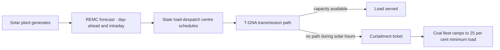

# The Control Room Knew By Noon

Between April and June 2026, India curtailed 8,133 gigawatt-hours of solar power (2,417 GWh in April, 3,235 in May, 2,481 in June) according to a written reply from Minister of State for New and Renewable Energy Shripad Naik to the Rajya Sabha, tabled in July and carried by [Energetica India](https://energetica-india.net/news/india-curtails-8133-gwh-of-solar-power-in-april-june-amid-grid-constraints). That is roughly 18 per cent of the average monthly solar generation across the quarter. The reply names the reason plainly: to maintain grid security, and to address "the mismatch between the commissioning of transmission infrastructure and renewable energy projects."

That is a plain admission, in Parliament, that we generated the sun and could not move it.

## what the summer looked like from a control room

If you have ever sat in a state load-despatch centre, in Bengaluru or Chennai or Ahmedabad, the summer of 2026 played out the same way for the operators on shift. The morning ramp began around six. Solar climbed. By eleven, the injection numbers on the wall were rehearsing yesterday's ceiling. By noon, someone in the room said the word every dispatcher hates: *back it down*.

The forecast was not wrong. India runs eleven [Renewable Energy Management Centres](https://www.pib.gov.in/PressReleasePage.aspx?PRID=1604689), commissioned across 2019–2020 to give state and regional dispatchers day-ahead and intraday forecasts for the roughly 55 GW of wind and solar sitting on their networks. The Central Electricity Authority now [requires weather-monitoring stations at every large solar and wind project](https://solarquarter.com/2026/04/11/indias-power-sector-roadmap-2026-2036-balancing-renewable-growth-with-grid-reliability-cea/) so the forecasts get better still. The AI layer this whole conversation revolves around is in the buildings; the machine-learning forecasting tools, the SCADA integration, the auto-dispatch nudges. It has been there for years.

And 8,133 GWh went to ground.

## where the model met the wire

The story most Indian energy commentary is telling this year is that AI is going to solve the grid, that better forecasting and better dispatch and better predictive maintenance will let us absorb the [509 GW of solar and 155 GW of wind](https://cea.nic.in/wp-content/uploads/notification/2026/04/Long_term_National_Resource_Adeqaucy_Plan2026_27_to_2035_36.pdf) that the CEA's Long-Term National Resource Adequacy Plan projects onto the 2035–36 grid. That story is a comfort. It also gets the causal chain backwards.

An ICRA analysis released [on 8 July 2026](https://www.pv-magazine-india.com/2026/07/08/one-third-of-new-renewable-energy-capacity-faces-grid-curtailment-due-to-transmission-constraints-says-icra/) put a number on the physical constraint the summer made undeniable. About a third of India's recently commissioned renewable capacity, roughly 33 per cent of 54.8 GW, is being evacuated through the temporary general network access route. During solar hours the curtailment on those T-GNA lines runs 50 to 60 per cent. ICRA also noted that only 12 per cent of transmission projects awarded through the tariff-based competitive bidding route were commissioned on their scheduled date by March 2026; the median delay was over ten months. The industry now needs, by ICRA's maths, roughly 20,000 circuit kilometres of new transmission and 120 GVA of substation capacity every year to hit the National Electricity Plan-II targets.

The forecasting layer does not build a wire. NePPS, the AI advisory system NTPC's [Advanced Computing Center at NETRA](https://ntpc.co.in/about-us/corporate-functions/netra/scientific-services/advanced-computing-center) has been running on the state-owned thermal fleet for years, does not build a wire. GE Vernova's AEMS system, deployed across the three regional load-despatch centres and [credited by the vendor with maintaining grid stability during the 2019 national unity event](https://www.gevernova.com/software/customer-stories/posoco-and-ge-vernova-ensure-power-grid-stability-during-national-show-unity), does not build a wire. Every one of these systems does what it was designed to do, and it turns out what it was designed to do is optimise an infrastructure the country has not yet built.

## the counter-argument, taken seriously

There is a serious counter to what I have just written, and it comes from inside the vendor community and from a set of Indian analysts who have been on this beat for years. The counter runs: if AI at the forecasting layer is well-tuned, the curtailment numbers would be worse without it. The 18 per cent figure represents the *reduced* loss made possible by REMC forecasts guiding dispatchers to pre-empt frequency excursions, rather than the loss the system would have absorbed under blind operation. A [Center for Strategic and International Studies analysis](https://www.csis.org/analysis/optimizing-indias-electricity-grid-renewables-using-ai-and-machine-learning-applications), predating this summer's peak, made a version of that case: better forecasting shifts the burden from spinning reserve toward stored or scheduled energy, which is exactly what a renewables-heavy grid needs.

I take that seriously. It is not wrong. But it is not the argument the industry is publicly making, and it is not what the CEA's numbers require in order to be met. The pitch at every India-power conference in 2025–2026 is that AI at the grid layer meaningfully raises the ceiling of renewables India can absorb. The evidence in front of us this summer is that the ceiling is set by copper, steel and land-acquisition timelines, and the forecasting layer optimises below that ceiling without lifting it. The two claims are not opposites. The first is real. The second is the one the CEA plan and the Rajya Sabha reply, read together, quietly refuse.

## where NTPC spent its move

The most instructive public-sector move of the last two months was NTPC's [Expression of Interest released on 5 June 2026](https://www.business-standard.com/companies/news/ntpc-floats-eoi-for-flexible-thermal-generation-to-balance-renewable-power-126060500773_1.html), for retrofitting sub-critical coal units in the 150–250 MW range to two-shift operation at a minimum technical load of 25 per cent. Translated out of trade-press language: NTPC wants its older, smaller coal fleet to ramp down hard when the sun is up and ramp back up when it isn't, without the metal fatigue a supercritical unit would take from that duty cycle. That is a machinery decision. It is also a working admission that the country's balancing problem is a physical problem, heat cycles and rotor mass and boiler creep, before it is a software problem.

NTPC did present, at the [India AI Impact Summit in February](https://www.newsonair.gov.in/union-minister-manohar-lal-inaugurates-ministry-of-power-pavilion-at-ai-impact-summit-2026), a Ministry of Power pavilion themed "From Megawatts to Megabytes". The megawatts came first for a reason. The pavilion's slogan is more honest than most of its speeches: the digital layer sits on the physical one, and one of them has been built out for seventy-five years while the other is being asked to close a gap it was not designed to close.

## whose Monday morning this is

If you are a dispatcher in a state load-despatch centre on Monday morning, the piece of this that shows up on your console is a curtailment ticket. The CEA planning document, the Rajya Sabha reply and ICRA's PDF are somebody else's Monday. Somewhere on your feeder, a solar developer's plant is being told to shed 60 per cent of what it can generate for the next four hours, because there is no path for the electrons to reach the load. The AI on your desk has already told you the plant can generate. Your job today is to explain to a plant manager why it cannot.

That is the shape the country's clean-energy transition has quietly taken. Not the model. Not the vendor. The queue at the substation.

## the question the plan is standing on

The question that sits on the dispatcher's desk, and on the CEA's, is whether the transmission commissioning that would let you dispatch this generation catches up before the [26.3 GW of AI-data-centre load](https://www.indiagazette.com/news/279212452/renewables-likely-to-meet-much-of-263-gw-ai-data-centre-power-demand-by-2031-32) the CEA is planning for by 2031–32 lands on the same wires that could not carry the sun this July. That is a hard question. Ten-month median delays on TBCB projects, twenty thousand circuit kilometres a year of new transmission required, a solar buildout that is not slowing down, and now a compute-driven load that arrives on those same substations. Whether India's grid planners can close that gap in the ten years the CEA has given them, and whether the political economy of land and right-of-way in ten states will let them, is not a question a control room can answer.

I do not know the answer. Nobody I have read this month does either. The plan is built on the assumption that the answer is yes. That assumption is going to be tested in every summer between now and 2035, in curtailment gigawatt-hours the wall in Bengaluru will keep counting.

---

*Tarry Singh is the founder and CEO of [Real AI](https://realai.eu), an enterprise AI advisory and deployment firm working with global enterprises on production agent systems, model risk, and AI sovereignty strategy. He also leads [Earthscan](https://earthscan.io) for Energy AI startup, and is a founding contributor to the EU-funded HCAIM and PANORAIMA programmes for responsible AI education across European universities. He writes at tarrysingh.com.*
