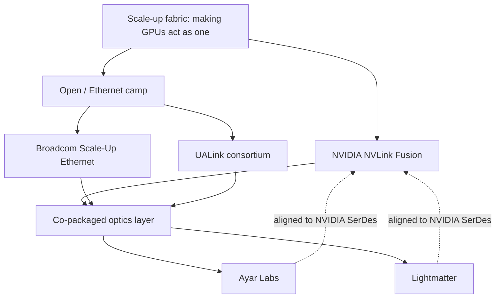

Two press releases, 48 hours apart, told you more about the next decade of AI infrastructure than any keynote. On 2 June 2026, Ayar Labs said it had joined NVIDIA's NVLink Fusion ecosystem. On 3 June, Lightmatter said the same. Both make co-packaged optics, the technology that replaces copper inside the rack when copper physically can't go further. Both are now plugged into NVIDIA's fabric rather than building an alternative to it.

I have watched a lot of interconnect wars. This one is being settled in the part of the stack nobody outside the labs talks about. Not the GPU. The wire between the GPUs.

## why the wire is the whole game now

The physics is what's actually changing.

Traditional copper interconnects increasingly constrain performance, system growth and power efficiency. At the speeds these interconnects operate, copper can only reach a few metres without signal degradation.

Push the per-lane signalling rate up and the reach collapses further.

At 1.6T, passive copper cannot span a standard rack height of 2.2 metres, making optical the only viable inter-rack option.

That sounds like a niche engineering footnote. It isn't. The "scale-up" network (the dense, all-to-all fabric that makes a pile of GPUs behave as one accelerator) is where most of the traffic lives during training.

Copper's limited reach restricts the "world size", the number of GPUs that can be connected within a single scale-up domain, and increasing that world size is one of the few remaining routes to more compute, especially in today's regime of inference-based model scaling and test-time compute.

NVIDIA's GB200 NVL72 was a leap precisely because it moved the world size from 8 GPUs to 72, all wired together over a copper backplane inside one 120-kilowatt rack.

The Grace Blackwell NVL72 uses a copper backplane containing miles of cables to make 36 nodes and 72 GPUs behave like one enormous AI accelerator.

You can keep cramming GPUs into a single rack to stay on copper. NVIDIA's Kyber design does exactly that. But there's a ceiling, and it is thermal and electrical rather than commercial. Beyond it, you go optical or you stop scaling. Even Jensen Huang, who spent years dismissing optics as too power-hungry, has turned.

At GTC this spring he unveiled the Vera Rubin NVL576 and Rosa Feynman NVL1152, two multi-rack systems that would use photonics to expand their compute domains by a factor of eight.

So the real estate that matters has shifted. The most valuable square centimetres in an AI data centre are no longer just under the GPU die. They're in the optical engine sitting next to the switch ASIC.

## what nvidia actually did in early june

NVLink Fusion was unveiled at COMPUTEX as a way to let other people's silicon into NVIDIA's rack.

It's new silicon that lets industries build semi-custom AI infrastructure with NVIDIA NVLink, with MediaTek, Marvell, Alchip, Astera Labs, Synopsys and Cadence among the first adopters, enabling custom silicon scale-up.

The pitch is openness. The reality is a moat with a drawbridge that NVIDIA controls.

The crossings started in March.

NVIDIA and Marvell announced a partnership connecting Marvell to the NVIDIA AI factory through NVLink Fusion, agreed to collaborate on silicon photonics, and NVIDIA invested $2 billion in Marvell.

Then the two optics specialists in early June.

Ayar Labs joined the NVLink Fusion ecosystem, making its products optically and electrically compatible with NVIDIA's optical and SerDes technologies.

A day later, Lightmatter joined the NVLink Fusion ecosystem to deliver Co-Packaged Optics and Near-Packaged Optics products compatible with NVIDIA's optical and SerDes technologies.

Lightmatter's framing is telling. It's adapting its bi-directional optical link architecture for NVIDIA's optical and electrical technology, reducing fibre and connector requirements by 50%.

Adapting *their* architecture to *NVIDIA's* SerDes. The optics innovators are bending to NVIDIA's electrical interface. And NVIDIA is an investor in Ayar Labs anyway. The announcement builds on Ayar Labs' $500 million Series E, which included NVIDIA, and its strategic investors include AMD, MediaTek and NVIDIA.

This is the part worth being uncomfortable about. Copper was a commodity. Anyone could buy cable. Optics at this density is a small number of hard-to-build engines, and NVIDIA is busy making sure the best of them speak its dialect first.

## the open camp has specs; nvidia has racks

The counterweight is supposed to be UALink, the open, multi-vendor scale-up interconnect backed by AMD, Apple, Google, Intel, Meta, Microsoft and others. The consortium has been productive on paper.

In April 2025 it ratified the UALink 200G 1.0 spec, enabling 200G-per-lane scale-up connection for up to 1,024 accelerators within a pod.

In April 2026 it shipped version 2.0 with in-network compute, chiplet definitions and management layers.

Chips for the group's 1.0 spec will reach labs in the second half of 2026, appear in 2027, and reach products later that year.

So the open alternative to NVLink will have shipping silicon roughly when NVIDIA is deploying its second optical generation.

Despite the initial standard dropping in spring 2025, little to no 1.0-compliant hardware is available, with most systems still in the production phase.

A standard with no silicon is a PDF.

The more serious near-term challenger is Broadcom, because Broadcom ships.

Tomahawk Ultra has already begun shipping to customers, including supporting Google in producing its AI chips.

Its Scale-Up Ethernet approach claims real numbers: up to 51.2 Tbps at full bandwidth, 250 nanoseconds of switch latency, and packet performance up to 77 billion packets per second.

Broadcom's executives are openly dismissive of UALink's timeline, with one arguing you can tunnel UALink or Infinity Fabric over Ethernet to get Tomahawk Ultra's latency today, and that Ethernet is going to win out for next-gen scale-up.

That is the vendor talking its own book. Broadcom sells Ethernet, so of course Ethernet wins in Broadcom's telling. But the shipping-today point is real, and it's the one that matters to anyone signing a purchase order this year.

Every camp depends on the same thing. Broadcom's own OFC 2026 portfolio leans on optics. It co-founded the Optical Compute Interconnect MSA, arguing networking requires a shift from electrical to optical-based scale-up architectures.

UALink needs optics. NVIDIA needs optics. The fabric wars sit on top of the same thin layer of light engines. And NVIDIA just signed the two most credible independent suppliers of that layer into its ecosystem within two days.

## the optical layer and who controls it

Early June 2026 is when the lock-in surface moved. It has not closed yet.

I doubt UALink matters commercially before 2028. My expectation is that the real contest through 2027 runs between NVIDIA Fusion and Broadcom Ethernet, and that it turns on who controls co-packaged optics supply rather than on switch benchmarks. Whoever owns the light engines sets the terms.

That has a sovereignty edge Europe should not miss. Fujitsu, plugging its 2nm Arm CPU into NVLink Fusion, talks about a 2-nanometre Arm-based CPU paving the way for a new class of scalable, sovereign and sustainable AI systems.

That word "sovereign" is doing a lot of work. Building your national champion CPU on a fabric whose optical layer is being quietly consolidated by one US vendor is tenancy with extra steps.

Broadcom's Jericho 4 already targets secure, lossless fabrics for clusters above 1 million XPUs; the open path exists. It just demands deliberate procurement discipline that prizes optical-layer interoperability over the path of least resistance.

The vendors will keep telling you their fabric is open. Some of it genuinely is. But openness measured at the protocol layer means little if the optical components underneath have all been tuned to one company's SerDes first. Copper was dumb and universal. Light is clever and, increasingly, captured.

* * *

Tarry Singh is the founder and CEO of Real AI (realai.eu), an enterprise AI advisory and deployment firm working with global enterprises on production agent systems, model risk, and AI sovereignty strategy. He also leads Earthscan (earthscan.io) for Energy AI, and is a founding contributor to the EU-funded HCAIM and PANORAIMA programmes for responsible AI education across European universities. He writes at tarrysingh.com.
