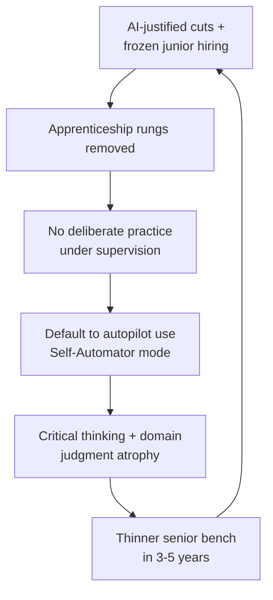

Here is the contradiction sitting in plain sight this fortnight. On 20 May, Meta started notifying roughly 8,000 people their jobs were gone, and on the same day Intuit said it would let go about 3,000 — 17% of its staff — to redirect money into AI. 

On 20 May, Meta began notifying 8,000 employees — roughly 10% of its workforce — that their positions were eliminated, and that same day Intuit announced 3,000 cuts representing 17% of its global headcount.

 A day later, the Governor of California signed an executive order to study what to do about it.

I have watched four of these cycles now — Y2K consultancy gluts, the dotcom unwind, the offshoring wave, the cloud migration. The pattern rhymes. What is different this time is the justification. Companies are not pleading weak demand. They are posting record numbers and cutting anyway, and the word doing the heavy lifting in every memo is "AI".

## the tell is in the cash flow

Look at what funds the cuts. 

The defining feature of the 2026 tech labour market is the simultaneity of layoffs with record financial performance and record capital investment — four hyperscalers have committed to a combined $700 billion in capex for 2026, nearly double 2025.

 [Meta's Q1 revenue](https://www.techtimes.com/articles/317392/20260529/tech-layoffs-reach-142000-2026-profitable-companies-cut-jobs-fund-700b-ai-infrastructure.htm) tells you everything: 

Q1 2026 revenue reached $56.3 billion, up 33% year-over-year, and the company's annual AI infrastructure budget runs four to five times its entire human compensation bill.

So this is a capital reallocation. People out, GPUs in. Fine — that is a defensible board decision if the productivity actually lands. The trouble is that a lot of it is theatre. Wharton's Peter Cappelli, who has spent a career measuring this stuff, [is blunt about it](https://www.techtimes.com/articles/317392/20260529/tech-layoffs-reach-142000-2026-profitable-companies-cut-jobs-fund-700b-ai-infrastructure.htm): 

companies announce layoffs saying they expect AI will cover the work, but they "Hadn't done it. They're just hoping."

 Even Sam Altman concedes the point — 

he has said there is "some AI washing where people are blaming AI for layoffs they would otherwise do," while confirming real displacement is also happening.

 [Oxford Economics](https://www.techtimes.com/articles/317392/20260529/tech-layoffs-reach-142000-2026-profitable-companies-cut-jobs-fund-700b-ai-infrastructure.htm) put it on the record in January: 

firms "don't appear to be replacing workers with AI on a significant scale," suggesting some are using AI as cover for routine cost-cutting.

If I were on one of these boards I would push for a single uncomfortable disclosure before signing off another reduction: show me the validated task-level productivity, not the licence-seat usage chart. Most can't. They are cutting on faith.

## the quieter cut is the one that compounds

The headline numbers grab attention. The damage is somewhere else. [CBS News reported](https://www.cbsnews.com/news/ai-layoffs-hiring-entry-level-workers/) what economists are actually seeing: 

Goldman Sachs found AI reduced monthly payroll growth by roughly 16,000 jobs over the past year, but the main channel is not layoffs — it is reduced hiring, especially of junior workers, according to Columbia's Daniel Keum.

 

Younger workers face particular trouble because entry-level roles are easier to automate, while seniors are far harder to replace.

Stanford's data makes it concrete. [Per the 2026 AI Index](https://www.kqed.org/news/12084655/after-meta-layoffs-newsom-signs-ai-order-to-protect-workers-and-jobs), 

software developers aged 22 to 25 are among those most likely to see their skills made redundant earliest — US employment for that cohort fell nearly 20% from 2024, even as headcount for older developers kept growing.

Stop and think about what that means for a craft. You become a senior engineer — or analyst, or underwriter, or radiologist — by doing the boring middle work badly, then less badly, under supervision. Take away the junior rungs and you are eating your own seed corn. In five years the seniors retire and there is nobody who served the apprenticeship. This is not a hiring decision. It is a slow dismantling of how expertise is manufactured.

## centaurs, cyborgs, and the people who quietly switched off

The most useful piece of research I have seen on what actually happens to skill under AI is the BCG consultant study, and it should be taped to every Chief People Officer's monitor. Tracking 244 consultants across roughly 5,000 AI interactions, [researchers found three distinct modes](https://www.resultsense.com/insights/2026-03-11-ai-cognitive-offloading-thinking-machines-human-cost). 

Cyborgs — 60% — engaged in continuous iterative dialogue with AI and developed new AI-related expertise; Centaurs — 14% — used AI selectively while keeping firm human control, achieving the highest accuracy and deepening their domain expertise.

 Then the group nobody wants to name. 

27% — the Self-Automators — delegated entire workflows, developed neither AI skills nor domain skills, and became passive conduits.

That is the whole argument in one dataset. The centaur — human judgment in command, machine doing the legwork — is the winning posture, and it is the rarest. Left to drift, more than a quarter of highly trained people slide into autopilot and get measurably worse at their own job while feeling more productive.

The neuroscience backs the unease. A convergence of work from [MIT, Harvard and Microsoft](https://www.resultsense.com/insights/2026-03-11-ai-cognitive-offloading-thinking-machines-human-cost) shows 

generative AI tools boost short-term performance by 14–40% while simultaneously eroding the critical thinking, memory and independent judgement they are supposed to augment.

 Gerlich's 666-participant study found [the same correlation](https://www.mdpi.com/2075-4698/15/1/6): 

a significant negative correlation between frequent AI tool usage and critical thinking, mediated by cognitive offloading, with younger participants showing higher dependence and lower critical thinking scores.

The loop is vicious, and it is worth seeing as a structure rather than a list:

## the reskilling that isn't happening

Now the part that turns this from a tech-sector story into a board-level negligence story. Everyone says reskilling is the answer. Almost nobody is funding it. [Aon's Human Capital survey](https://riskandinsurance.com/ai-adoption-outpaces-workforce-readiness-creating-risks-for-organizations/) of board directors and senior leaders found the gap baldly: 

while 73% of organisations have deployed or are piloting AI, just 18% report that the majority of their workforce has taken part in AI reskilling or upskilling in the past 12 months.

 The priorities tell the rest. 

81% of employers said operational efficiency was a key objective for deploying AI and 80% cited automating routine tasks — but only 35% identified workforce upskilling and reskilling as a primary objective.

Meanwhile the demand signal is screaming. [The Bipartisan Policy Center's dashboard, via Lightcast](https://gloat.com/blog/ai-workforce-trends/), found 

US job postings requiring AI skills grew 144% year over year as of April 2026, against just 7% growth in overall postings.

 You cannot square those numbers. Companies want AI fluency they refuse to pay to build, while cutting the entry-level roles where it would be built.

Here's where it gets uncomfortable for the optimists. Even the firms doing the cutting know it. [Deloitte's 2026 enterprise survey](https://www.deloitte.com/global/en/issues/generative-ai/state-of-ai-in-enterprise.html) reports 

that while most organisations focus on educating employees, far fewer are re-architecting roles, workflows and career paths — and the most successful ones rebuild jobs to combine human strengths with AI.

 Rebuild, not bolt on. Most are bolting on.

## what California just admitted

Newsom's order, signed 21 May, is worth reading not for what it does — it does almost nothing binding — but for what it concedes. [Executive Order N-6-26](https://www.gov.ca.gov/2026/05/21/governor-newsom-signs-first-of-its-kind-executive-order-to-prepare-workers-and-businesses-for-potential-ai-disruption/) 

mandates that state agencies work with academics, labour, employers and AI firms to study workforce impacts, modernise worker protections, and expand training and upskilling programmes.

 The granular bit matters: [AO Shearman's reading](https://www.aoshearman.com/en/insights/ao-shearman-on-tech/california-governor-executive-order-mandates-review-of-labor-policies-amid-ai-workforce-displacement) notes 

a 15 October deadline for the labour agency to review training programmes, and a directive for the employment department to build an "AI Playbook" expanding dislocated-worker strategies for AI-exposed occupations.

When the most AI-rich state in the world starts drafting severance standards and a redundancy playbook, the quiet part is out loud: nobody trusts the private sector to reskill at the pace it is cutting.

## the practitioner's read

I would bet against the autopilot economy. Not because the tools don't work — they do, often startlingly — but because the firms treating AI purely as a headcount lever are building a capability hole they cannot see on this quarter's P&L. The 27% Self-Automator share is the leading indicator. It will show up as eroded judgment, homogenised output and a senior bench that never got built, two and three years out, long after the cost savings were booked and the executive who booked them moved on.

The fix isn't romantic and it isn't expensive relative to a $700 billion capex line. Keep the junior rungs. Mandate deliberate practice — periods where people solve the problem before the model does, so the muscle stays. Measure centaur behaviour, not seat licences. Reward the people who argue with the machine, not the ones who paste its first answer.

Cutting the apprentices to fund the autopilot is the kind of decision that looks brilliant on a deck and ruinous in a decade. I have seen enough cycles to know which one wins.

---

Tarry Singh is the founder and CEO of Real AI (realai.eu), an enterprise AI advisory and deployment firm working with global enterprises on production agent systems, model risk, and AI sovereignty strategy. He also leads Earthscan (earthscan.io) for Energy AI, and is a founding contributor to the EU-funded HCAIM and PANORAIMA programmes for responsible AI education across European universities. He writes at tarrysingh.com.
