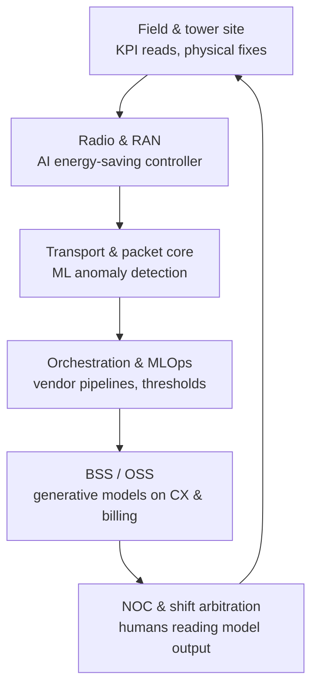

# Sunday Essay · The Delhi Convocation, and What Its Fifty Certificates Cannot Fix

## a paragraph I underlined three years ago

There is a passage in the Telecom Regulatory Authority of India's July 2023 recommendations paper on artificial intelligence in the telecom sector that I keep going back to. It sits in the section on capacity building, and its argument, in the regulator's own careful language, is that the current courses and programmes on AI and machine learning offered by Indian institutions and universities may not be adequate to meet the capacity and competence required to develop and deploy AI solutions in telecom networks. [The document itself is on TRAI's server, and it says what it says](https://www.trai.gov.in/sites/default/files/2024-09/Recommendation_20072023.pdf).

Three years on, that sentence has not aged. It has hardened.

## fifty certificates in a Delhi auditorium

On 2 February 2026, at an event whose press coverage barely rippled outside the sector press, [Vodafone Idea Foundation and the Department of Telecommunications certified fifty students](https://www.myvi.in/content/dam/vodafoneideadigital/StaticPages/PressReleases/2025/Press-Note-Vi-Foundation-and-DoT-certify-first-batch-of-students-trained-for-Telecom-roles.pdf) as the inaugural batch of a Telecom Innovation Research and Training Centre programme. The training ran for one month, in November 2025. The syllabus covered artificial intelligence and machine learning with telecom-oriented applications, and [the Vi Foundation's own release](https://apacnewsnetwork.com/2026/02/vodafone-idea-foundation-dot-conclude-first-batch-of-telecom-innovation-skilling-programme/) called out data analytics and cybersecurity as the anchor topics.

Fifty students. One month. One programme. One country of 1.4 billion people, with roughly 460,000 5G base transceiver stations already lit up as of late 2024, [a figure attributed to the India AI summit reporting from earlier this year](https://www.newkerala.com/news/a/telecom-networks-shift-focus-ai-infrastructure-india-ai-811.htm), and a stated intention to run those networks with AI in the operational loop.

I am not being unkind to the fifty students. Someone who finishes a month-long AI course in a public-private programme, in a country where seat availability is a rationing problem, has done real work. They deserved the ceremony. The problem is the ratio. If you take that batch as broadly typical of a public-private telecom AI-skilling programme in India in 2026, and if you multiply it by the number of such programmes that publish batches in a given year, you are still counting in the low four figures a year, at a moment when [reporting from India's IT and telecom job market](https://www.outlookindia.com/national/slow-death-of-it-sector-jobs-how-ai-layoffs-are-reshaping-indias-tech-workforce-and-middle-class-dreams) is describing silent layoffs of 25,000 to 35,000 tech roles in 2026 alone, with demand shifting toward AI, platform engineering, and specialised engineering work while routine roles come under pressure.

The certificate ceremony and the layoff notice arrive from the same conversation, on different letterheads.

## what the actual work looks like

The reskilling has to land wherever a layer of a 2026 mobile network now takes an AI decision inside a five-minute window. Several layers do. The human role changes at each one. The diagram below reads like a stack because it is one, though any engineer who has run a circle for one of the three private operators will tell you the stack is porous in exactly the places our syllabi treat as clean interfaces.

The skilling debate keeps talking as though there is one job called *AI engineer* to be trained for, and one course to train it. In practice there are seven or eight jobs, at seven or eight layers of the network, and each of them requires a different marriage of legacy telecom knowledge with AI-shaped judgement. A radio-network optimiser who has spent fifteen years tuning KPI thresholds does not become a data scientist in four weeks. Nor should she. She becomes a person who can read the output of the AI-RAN energy-saving controller [that Bharti Airtel documented with GSMA](https://www.gsma.com/solutions-and-impact/connectivity-for-good/external-affairs/gsma_study/bharti-airtel-ran-energy-saving-with-ai-and-ml/), and challenge it when it goes wrong at 3 a.m. on a wedding-season Saturday. That controller sits inside a stack where energy costs are, per GSMA's figures, about 29 per cent of annual network OPEX with roughly 80 per cent attributable to RAN. The challenging is the human job. Almost nobody has been trained for it at scale, and no one-month certificate programme will get there.

## a memory from a Karnataka circle

In late 2004 I sat in a portacabin outside Mysore watching a young field engineer, whom I will not name, argue with an OSS console about why a particular BTS kept flagging amber on its handover-success KPI. He had been posted to the circle straight out of a diploma course from a private engineering college near Hubballi. His formal training on radio parameter tuning had been three days. His actual training on radio parameter tuning had, by that point, been eight months of night shifts and one senior manager who took the time to sit with him at 2 a.m. and explain what the numbers on the screen meant when a wedding-season load hit the site.

By month twelve he was better than the vendor field-support engineers. By month eighteen he was tuning parameters faster than the OSS could recompute them. Nobody gave him a certificate. He got a raise, a transfer, and eventually a supervisory role. I think about him whenever I hear someone talk about one-month intensive AI upskilling at a public convocation.

I do not tell that story out of nostalgia. India's mobile networks work today because of that pattern. The workforce of roughly six hundred thousand field engineers, circle-level planners, NOC operators, tower-company technicians, and BSS/OSS shift staff who actually run the country's networks learned their trade the same way: on site, at night, with someone senior across the desk. The AI transition will demand that same pattern, at the same scale, on a shorter runway, and with a workforce that is now demographically older, more managerially insulated, and considerably more nervous. The auditorium cannot supply it.

## the arithmetic behind the certificates

[The World Economic Forum's Future of Jobs 2025 dataset puts India's training-need figure at 63 per cent](https://www.weforum.org/stories/2025/04/the-future-of-jobs-in-india-employers-seek-to-boost-tech-talent-to-drive-ai-and-digital-technology-growth/), meaning 63 of every 100 Indian workers require meaningful training by 2030. Assume the telecom operational workforce broadly tracks that national average and you are looking at roughly 380,000 workers across the three private operators and the tower companies who need re-training, in whole or in part, in the next four years. Public-private cohorts of fifty do not close that gap. Cohorts of five thousand do not close that gap. The training has to happen where the person already works, on paid time, with a mentor and a real problem in front of them, or it does not happen at the scale required.

There is a second arithmetic problem, quieter but harder. [A Quess Corp analysis reported by YourStory in early July 2026](https://yourstory.com/enterprise-story/2026/07/indias-gccs-internal-ai-reskilling-talent-shortage-quess-report) noted that in India's Global Capability Centres, telecom and networks was the *only* vertical to see a decline in hiring in the current cycle. Those centres are the closest large-cohort peer to an in-house AI unit at an operator. Set against the layoff numbers, that decline is uncomfortable reading. Operators are mostly asking their existing engineers to become the AI talent they need, and trimming the ones who cannot.

The public programmes are not designed to absorb that.

## the skilling stack, layer by layer

A coherent programme, at Vi and Airtel and Jio and at the sector level above them, would break apart the way the network breaks apart. Radio and RAN AI needs eight to twelve weeks of embedded reskilling for engineers who already know KPI-space, taught by the vendor and the operator jointly, on real cell-site data with a live rollback plan. Transport and packet-core AI needs three months of on-the-job training with the SD-WAN and orchestration teams, ideally rotated across two circles. BSS and OSS AI needs a customer-analytics track that treats prompt design and evaluation as first-class engineering. That is the layer where generative models are already in production, at [Vodafone Idea with TCS](https://www.tcs.com/who-we-are/newsroom/press-release/vodafone-idea-tcs-collaboration-ai-powered-customer-experience-platform) on customer-experience workloads. And the AI operations layer itself, the orchestration and MLOps piece, is where the fresh graduates should be entering, before anyone asks them to solve problems at every other layer.

None of that maps to a one-month certificate. None of it maps cleanly to a NASSCOM FutureSkills Prime course either, though [FutureSkills Prime's aggregate 18.56 lakh signups reported by PIB](https://www.pib.gov.in/PressReleaseIframePage.aspx?PRID=2036445&reg=48&lang=2), of whom roughly 3.37 lakh have completed a course, is a genuinely useful floor for foundational familiarity. Foundational familiarity is not the same thing as production competence. Everyone in the industry knows this. Almost nobody says it in the same room as the minister.

I have argued this in rooms with operator CHROs and DoT officials on the same panel: fifty-student telecom-AI convocations should not be the anchor of a national plan. The anchor should be paid, on-shift, in-job reskilling with a real problem and a senior colleague, at a ratio of not less than one in every ten field engineers per year, sustained across five years. It should be co-funded by the operators and the DoT with matched contributions, and audited against network-KPI outcomes instead of attendance rolls. Everything else the sector is currently calling reskilling is theatre for the annual report, and I have told the people running it so.

## the model-consumption counter-argument

[A CCS Insight commentary on AI-RAN energy-savings deployments](https://www.ccsinsight.com/blog/reducing-ran-energy-usage-with-artificial-intelligence/) makes the point, drawing on vendor conversations with Ericsson, Nokia, and the European operators, that the operator role in AI-RAN is not deep model-building at all. It is model-consumption. The vendors will ship the models. The operator's job is to trust the pipeline, tune the thresholds, and let the controller run. On that view the skilling problem is smaller than I am describing. You do not need to train a large fraction of the workforce as AI engineers. You need a much smaller cadre of AI-literate senior operators who can arbitrate what the vendors ship.

I take this seriously. It is the honest counter-argument, and it is at least half correct. Where I would push back is on the middle. The senior arbitrator role does exist and it will grow. The vendor-model role does exist and it is real. What the CCS Insight framing understates is the operational layer between them: the second-shift supervisor, the NOC lead, the field-team supervisor. Those people now have to run a network whose control loops are partly opaque to them, and whose failure modes are new and clustered. Neither the vendor nor the auditorium is training them. That layer is where the productivity gain, and the operational risk, will most quietly sit for the next five years. If we are wrong about them, the vendors' models will still ship and the KPIs will still turn amber, but nobody in the shift will know why.

## note for the Monday shift

I write this for the second-shift supervisor at a metro NOC in Pune, the tower-company technician whose Monday morning starts with a call from a circle head about a KPI that dropped over the weekend, and the twelve-year field engineer in Coimbatore who was asked in January to "start using the copilot" and has not been given a clear brief on what that actually means.

The fifty certificates were not aimed at you and they were not going to help you anyway. Do not measure your career against a national convocation photograph. Measure it against the person one grade above you, and against the shift you handed over this morning. That is the only ledger that has ever mattered in telecom, and the ledger has not changed.

The copilots will keep getting better and you will be asked to work with them without much warning. Ask, in writing, for the training your operator promised in the last town hall. Ask for the vendor documentation on the model's failure modes. Ask for one hour a week on paid time with your senior. If you get none of those, you have the answer to a question you were going to have to ask anyway.

The convocation photograph will fade. Your Monday shift will not. Run it like an engineer.

---

*Tarry Singh is the founder and CEO of Real AI (linked to [realai.eu](https://realai.eu)), an enterprise AI advisory and deployment firm working with global enterprises on production agent systems, model risk, and AI sovereignty strategy. He also leads Earthscan (link [earthscan.io](https://earthscan.io)) for Energy AI startup, and is a founding contributor to the EU-funded HCAIM and PANORAIMA programmes for responsible AI education across European universities. He writes at [tarrysingh.com](https://tarrysingh.com).*
