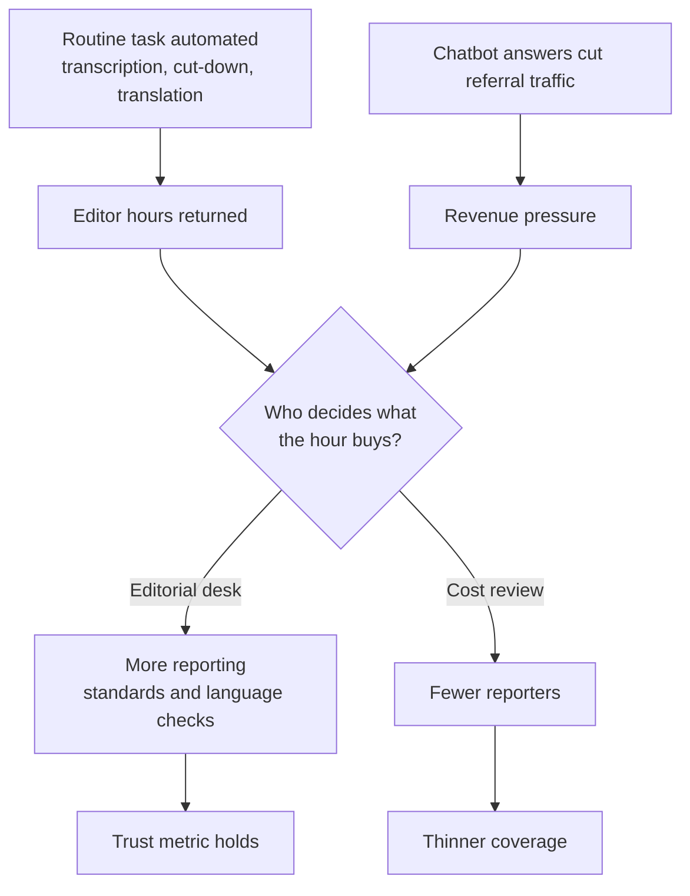

# An Editor's Quiet Math: AI in Four Southeast Asian Newsrooms

Watching a newsroom adopt AI tells you almost nothing useful about whether the newsroom is better off. The tool is easy to count. Everything around it is harder: the work that survives, the work that quietly stops happening, the colleague who has stopped raising her hand in the editorial meeting because the script is faster than she is. The cleanest sentence I can write about what I have spent the last fortnight reading from this region is that the tooling story and the headcount story are running on different clocks, and the executives talking about them are usually not the same people.

## Singapore: the tool that works

Mediacorp's CNA built an internal editor called SmartCut that takes the day's broadcast bulletins and slices them into the social-shaped vertical clips the digital desk needs. The tool reportedly [saves about 1,200 hours of editor time a year](https://www.inma.org/blogs/conference/post.cfm/mediacorp-s-cna-shares-7-lessons-learned-from-two-ai-projects) and won WAN-IFRA's Best Use of AI in the Newsroom prize in 2024. SMS Tan Kiat How told Mediacorp's Career Forward 2026 forum on 5 June that the company has now stood up an in-house "MediaGPT," and that every AI step still routes through a human reviewer before anything reaches air or feed ([Ministry of Digital Development and Information, 5 June 2026](https://www.mddi.gov.sg/newsroom/remarks-by-sms-tan-kiat-how-at-mediacorp-s-career-forward-2026/)).

Down the road, SPH Media has been wiring itself into a generative-AI workflow that handles transcription, translation, summarisation, named-entity extraction, sentiment analysis and PDF parsing, with the consolidated signals surfaced through an in-house newsroom analytics tool called Lumos ([iTnews Asia](https://www.itnews.asia/news/sph-media-enhances-content-delivery-with-generative-ai-and-data-analytics-608912)).

Neither newsroom is selling the autonomous-agent fantasy, and I would defend both approaches in front of a board. They are doing what an honest production shop should do: pulling routine mechanical work off human plates so the human plates can hold something with more weight. The roles being protected here are the senior editors, the language specialists, the standards desk. The roles being absorbed are the cut-down, the timestamp, the rough translation pass, the slug. Anyone who has worked a broadcast control room knows which side of that line is the actual journalism.

## Jakarta: the other ledger

The Indonesian Press Council says [at least 1,200 media workers were laid off between 2023 and 2024](https://jakartaglobe.id/news/indonesias-media-hit-by-layoffs-ad-slump-and-rise-of-fast-journalism), and 2026 has been worse. Kompas TV has cut roughly 150 staff. CNN Indonesia has lost about 200. tvOne has shrunk by 75. Republika and TVRI are in similar territory ([Jakarta Globe](https://jakartaglobe.id/news/not-just-deadlines-indonesian-journalists-now-have-to-worry-about-layoffs)). A BBC Media Action survey of 212 Indonesian journalists, summarised by Development + Cooperation, found 75% now using AI tools in daily work, up sharply from the prior wave ([D+C](https://www.dandc.eu/en/article/ai%E2%80%93media-indonesia-guidelines-challenges)).

The ad slump did most of the damage. AI did not fire 1,200 people in Indonesian newsrooms last year. But AI is the only line on the management slide that points down, and it will therefore be the cover under which the next round is discussed in offsites this autumn. Tempo's digital CEO Wahyu Dhyatmika has been blunt for two years now that the math of Indonesian news survival runs through paid subscription: 17% of Indonesians willing to pay for news, but 17% of 280 million is still a lot. That argument needs a labour force the cuts are eroding.

The tool can save 1,200 hours in Singapore and the industry can shed 1,200 jobs in Jakarta in the same calendar year. Both numbers can be honest in their own contexts. The mistake is to read them as one story.

## Kuala Lumpur and Hanoi: the trust column

Astro AWANI, the Malaysian broadcaster, has been ranked the country's most trusted news brand for the ninth consecutive year, with [64% brand trust in the Reuters Institute Digital News Report 2026](https://corporate.astro.com.my/mediaroom-releases/astro-awani-stays-malaysias-most-trusted-news-brand-for-9th-consecutive-year-amid-trust-decline). The same Reuters Institute report, published on 17 June, shows trust in news declining or flat in most of the 48 markets it surveys ([Reuters Institute executive summary, 17 June 2026](https://reutersinstitute.politics.ox.ac.uk/digital-news-report/2026/dnr-executive-summary)). Astro frames its AI programme as a trust amplifier wrapped around a human editorial spine, and the trust score is the only metric I have seen any Asian newsroom executive use to defend the AI bill internally.

In Hanoi, VnExpress runs a different version of the same approach. The newsroom deployed an AI fact-checking tool through its VinAI collaboration in 2025 (the first of its kind in Southeast Asia, as far as I can establish), running alongside reader-sentiment NLP tuned for Vietnamese dialects and an automated comment-moderation system that has been on since 2017. Engagement is reportedly up around 30% year on year on the personalised feed ([ainvest writeup of VnExpress](https://www.ainvest.com/news/vietnam-media-tech-boom-frontier-smart-investors-vnexpress-case-study-2505/)). That 30% deserves the caution any vendor-friendly metric gets. The direction is worth taking seriously.

## Where the math wobbles

A newsroom executive selling AI internally has every incentive to report the saved hours and not the lost roles. A METR survey of 349 technical workers published on 11 May 2026 [found a self-reported median 1.4–2× productivity gain](https://metr.org/blog/2026-05-11-ai-usage-survey/) from AI use. METR's own researchers, who in instrumented controlled studies have repeatedly found a gap between perceived and measured gains, gave the lowest answers in the entire sample. Vendors quote the headline median. The lower number from the people closest to controlled measurement is the one I would put on the slide.

For the newsroom-specific equivalent, the WAN-IFRA Newsroom AI Catalyst, supported by OpenAI, now spans [145 newsrooms globally across eight cohorts](https://openai.com/index/newsroom-ai-catalyst-global-program-with-wan-ifra/). The latest available cohort report, [WAN-IFRA's 6th AI report from September 2025](https://wan-ifra.org/2025/09/wan-ifras-6th-ai-report-publishers-perspective-on-the-ai-value-equation/), is candid enough to title itself around "the AI value equation," which is publisher-speak for *we still cannot prove this pays back at the P&L level.* The Indonesian, Vietnamese, Singaporean and Malaysian publishers in the Asia-Pacific cohort are running pilots in transcription, archive search, headline generation and translation. The published results are heavy on hours-saved and adoption counts. They are light on what the saved hours actually bought. More reporting, or fewer reporters.

The International Federation of Journalists, in [its takeaways from the same Reuters Institute report](https://www.ifj.org/media-centre/news/detail/category/ai/article/reuters-digital-news-report-2026-key-takeaways-for-newsrooms-and-journalists-unions), takes the harder line: that AI summarisation and chatbot answers are eating the click-through that funded the work in the first place, and that any productivity gain measured inside the newsroom has to be netted against the audience and revenue loss happening outside it. I do not fully agree with the IFJ framing. The chatbot displacement is real, but the cost-of-reporting math at a place like CNA or VnExpress runs on broadcast and subscription, not on the search-referral funnel a Western metro daily lives on. The IFJ still has the right end of the question. A productivity number that ignores what is happening to the demand side of the same business is a partial truth, and partial truths are how a board ends up shocked.

That gap is where I want the next twelve months of writing to land. The models work; that part is settled. The open question is what a newsroom decides to do with the time they return, and who is in the room when that decision is made.

## A note from a desk I cannot name

She runs a desk at a mid-sized broadsheet somewhere in the region. We were talking about the morning brief, the one her tool now produces in seconds where it used to take two staff thirty minutes. I asked her what she did with the saved hour. She said she spent it rereading the things the model had skipped: the wire copy with the awkward second paragraph, the local-language reports the translation tool clearly did not understand, the press release that read like a press release in three different layers. The tool had taken the floor. She had moved upstairs.

She was not sure her bosses had noticed that she was the reason the upstairs work was still being done. Across the office, a junior editor was packing the contents of his desk into a banker's box. His exit was unrelated to AI, technically, in the sense that the year-end review was unrelated to the model his desk had quietly grown to depend on. He waved on his way to the lift, and the room kept publishing.

---

*Tarry Singh is the founder and CEO of [Real AI](https://realai.eu), an enterprise AI advisory and deployment firm working with global enterprises on production agent systems, model risk, and AI sovereignty strategy. He also leads [Earthscan](https://earthscan.io) for Energy AI, and is a founding contributor to the EU-funded HCAIM and PANORAIMA programmes for responsible AI education across European universities. He writes at [tarrysingh.com](https://tarrysingh.com).*
