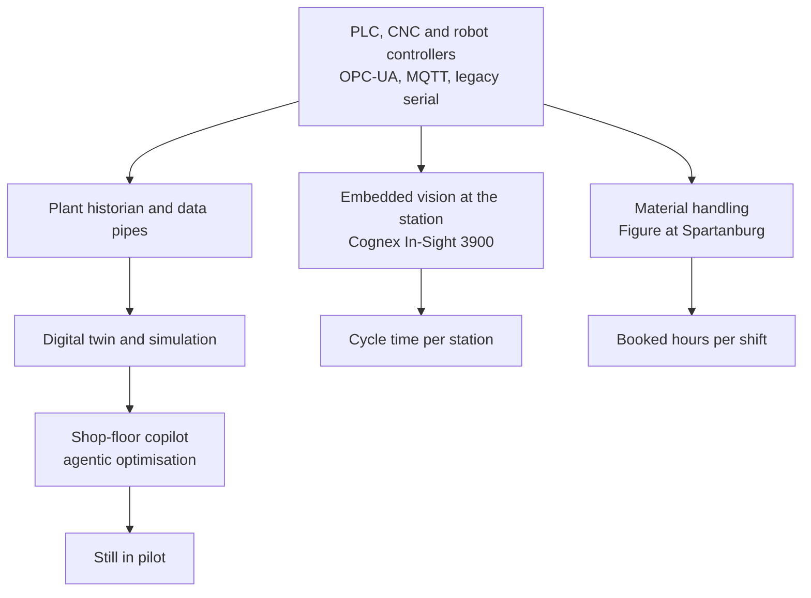

# Erlangen, Spartanburg, and the Quiet Half of Industrial AI

Two press cycles, six weeks apart, have done more to clarify where industrial AI actually sits in 2026 than the entire prior year of vendor decks. The first ran in mid-January, when Siemens and NVIDIA announced at CES that they were jointly building what they call an "Industrial AI Operating System," with the Siemens Electronics Factory in Erlangen, Germany, named as the first blueprint site ([NVIDIA Newsroom](https://nvidianews.nvidia.com/news/siemens-and-nvidia-expand-partnership-industrial-ai-operating-system), [Siemens press](https://press.siemens.com/global/en/pressrelease/siemens-and-nvidia-expand-partnership-build-industrial-ai-operating-system)). The second ran across late April at Hannover Messe, where roughly 3,000 exhibitors spent five days showing what the operating-system idea looks like once it leaves the slide ([Deutsche Messe](https://www.hannovermesse.de/en/press/press-releases/hannover-messe/hannover-messe-2026-industrial-ai-as-competitive-game-changer)). Then, on May 5, Cognex quietly launched the In-Sight 3900, a new embedded-AI vision system on Qualcomm Dragonwing silicon. It runs inspections roughly four times faster than the prior generation at resolutions up to 25 megapixels, with the model executing on the camera instead of off in a cloud round-trip ([Cognex press](https://www.cognex.com/en/company/press-releases/in-sight-3900-high-performance-ai-vision-system)).

Taken together, those three announcements say something coherent. The cognitive layer of industrial AI, the part the copilots and the operating-system metaphor are trying to sell, is real, partially shipping, and still mostly in pilot. The physical layer of vision, manipulation and motion is the part actually booking cycle time on the factory floor.

That asymmetry is the story this month.

## what shipped, precisely

A vision system on a camera is not the same product category as an LLM assistant for a maintenance engineer. The Cognex 3900 ships defect detection at the line. No PC. No round-trip. The relevant number is the change in cycle time per inspection station, a measurement plants have been making since the 1980s and know how to defend in a capex review.

BMW's Spartanburg pilot with Figure AI is the other end of the same axis. Across an eleven-month deployment, Figure's humanoid loaded over 90,000 sheet-metal parts contributing to the production of more than 30,000 X3 vehicles, at greater than 99% placement accuracy ([IIoT World coverage](https://www.iiot-world.com/artificial-intelligence-ml/robotics/physical-ai-deployment-roi-humanoid-robots/)). BMW has scheduled a second test at its Leipzig plant from April 2026, advancing to a full pilot phase from summer 2026, the first European production deployment of humanoid robots ([BMW Group](https://www.press.bmwgroup.com/global/article/detail/T0455864EN/bmw-group-to-deploy-humanoid-robots-in-production-in-germany-for-the-first-time)). Mercedes-Benz has parallel work underway with Apptronik's Apollo platform at the Berlin Digital Factory Campus.

The Erlangen blueprint, by contrast, is an architecture. Siemens and NVIDIA describe a factory that "continuously analyzes its digital twins, tests improvements virtually, and turns validated insights into operational changes on the shopfloor." Foxconn, PepsiCo, and HD Hyundai are publicly evaluating it. The blueprint is committed to during 2026, which means the operational milestones are still being scheduled, the integrations are still being scoped, and most of the customer evidence will arrive in 2027 at the earliest. Rockwell's Hannover Messe demo of an "AI-orchestrated factory system design" sits in the same category, convincing on the booth and still in the design phase against any specific customer line ([The Machine Maker](https://themachinemaker.com/news/rockwell-automation-showcases-ai-orchestrated-factory-system-design-at-hannover-messe-2026/)). And Krones showed a useful counterexample: AI-based fluid simulation that compressed engineering time by 95%. One scoped job, one measurable win, no platform pitch attached.

These are not the same kind of fact.

## the pilot-to-production gap, with numbers attached

Grant Thornton's 2026 manufacturing AI survey is the bracing read of the month ([Grant Thornton](https://www.grantthornton.com/insights/survey-reports/manufacturing/2026/manufacturing-insights-2026-ai-impact-survey-report)). Among manufacturing respondents, zero reported significant revenue uplift from AI initiatives, against 12% across all industries. Zero reported significant cost savings, against 12% overall. Roughly 48% are running pilots; only 10% describe AI as fully integrated into operations. IDC's broader Asia-Pacific work sits in the same key. 45% of AI-fuelled digital use cases there are expected to miss ROI targets in 2026, which IDC attributes to unclear gains and poor data foundations ([IDC FutureScape](https://my.idc.com/getdoc.jsp?containerId=prAP53930325)).

These numbers do not contradict the Cognex or BMW announcements. They locate them. The places where AI is producing measurable industrial value in 2026 are narrow, bounded and physical: inspection stations, predictive-maintenance triage on critical assets, material handling at well-instrumented workcells. The places where it is still in pilot are the broad cognitive ones the marketing of "industrial AI OS" implies: shop-floor copilots that translate spoken intent into PLC code, end-to-end agentic optimisation of throughput, autonomous root-cause analysis across heterogeneous lines.

The vendors know this. Microsoft's Hannover Messe blog spent more space describing co-development arrangements and reference architectures than reporting deployed customer outcomes ([Microsoft Cloud Blog](https://www.microsoft.com/en-us/microsoft-cloud/blog/manufacturing/2026/04/16/industrial-intelligence-unlocked-microsoft-at-hannover-messe-2026/)). Accenture and Avanade went one further, announcing in late April that they are co-developing an "agentic factory" with Microsoft, with Kruger and Nissha Metallizing Solutions as early validators ahead of general availability later in 2026 ([Accenture newsroom](https://newsroom.accenture.com/news/2026/accenture-and-avanade-collaborate-with-microsoft-to-develop-agentic-factory-to-help-reduce-manufacturing-downtime)). "Early validator" is the polite phrase for "pre-production pilot at a willing customer." No criticism intended; that is the actual state of the practice, and reporting it accurately is more useful than pretending otherwise.

## the OPC-UA problem

What holds the cognitive layer back is a data-integration gap that pre-dates the LLM cycle by a decade and a half. Model capability is not the binding constraint. The control systems on a real production line speak OPC-UA, MQTT, proprietary fieldbus dialects, and a long tail of legacy serial protocols specific to whichever generation of CNC, PLC, or robot controller a plant happened to standardise on twenty years ago. Connecting an LLM-driven assistant to that estate is a brownfield integration problem, with safety, latency and determinism constraints an enterprise IT team has never been asked to satisfy. Prompt engineering does not touch it.

The Industrial AI OS framing addresses this honestly when you read the small print. Siemens is committing "hundreds of industrial AI experts" alongside its software, and NVIDIA is contributing "AI infrastructure, simulation libraries, models, frameworks and blueprints." Translated: the value sits in the integration labour more than in the foundation model. Anyone selling this as a software-only purchase has not deployed on a real factory floor.

This is also where Foxconn becomes interesting. Hon Hai's strategic partnership with SAP, announced at NVIDIA GTC in March, is explicitly a manufacturing-and-supply-chain agreement aimed at the APAC region ([Hon Hai press](https://www.foxconn.com/en-us/press-center/press-releases/latest-news/1981)). Foxconn already runs the systems that need to be instrumented. It already employs the people who know which sensor on which line tells the truth. Pairing that operational footprint with an ERP backbone is a more credible go-to-market posture than starting from a hyperscaler's developer keynote and working inward.

## the EU AI Act clock

On 2 August 2026, the high-risk-systems provisions of the EU AI Act become enforceable for the standalone Annex III categories and for GPAI providers, with penalties for non-compliance running to €15 million or 3% of global annual turnover ([European Commission](https://digital-strategy.ec.europa.eu/en/policies/regulatory-framework-ai)). The May 7 Omnibus agreement pushed the deadline for Annex I product-embedded systems to 2 August 2028, but the standalone obligations and the GPAI provisions are still on the original calendar.

Most of the manufacturing AI conversations I see in 2026 act as if this date does not apply, on the theory that "we are using a copilot, not a high-risk system." A copilot autocompleting a maintenance log is indeed low-risk. The same copilot whose telemetry trains a workforce-performance model, or whose output drives an automated shift-scheduling decision, has walked into Annex III before anyone in the room had to vote on it. The risk classification follows the deployment, not the tool. And the deployments coming out of the OS framing are by design more entangled with workforce decisions than last year's discrete pilots were.

## what to instrument through Q3

Three numbers are worth instrumenting at a Tier-1 industrial through the rest of 2026, and all three are mundane. Cycle time per inspection station before and after embedded-AI vision retrofit. Booked humanoid hours per shift against the cost-per-hour the integrator is quoting. And the deflection rate on Level-1 maintenance triage tickets the copilot is supposed to be handling. Everything above those three is narrative. Below them is the question of whether the practitioner has built the basic data pipes a copilot needs to be useful.

The boards buying the OS pitch as a single line item, without staffing the brownfield integration work underneath it, are the ones I expect to be disappointed. Erlangen will tell us whether the framing holds. Spartanburg has already told us the physical layer pays its way. The quiet half, the cognitive shop-floor work the industry has been promising since 2019, is still earning its credibility one workcell at a time.

---

*Tarry Singh is the founder and CEO of [Real AI](https://realai.eu), an enterprise AI advisory and deployment firm working with global enterprises on production agent systems, model risk, and AI sovereignty strategy. He also leads [Earthscan](https://earthscan.io) for Energy AI startup, and is a founding contributor to the EU-funded HCAIM and PANORAIMA programmes for responsible AI education across European universities. He writes at tarrysingh.com.*
