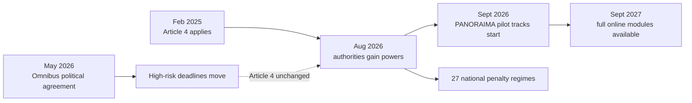

What is happening in Brussels right now carries enormous practical implications for every university, employer and AI deployer in Europe. Outside the compliance-law circuit, hardly anyone is watching the date.

## The clock that didn't stop

Article 4 of the EU AI Act has technically applied since 2 February 2025. What changes on 2 August 2026 is that national market surveillance authorities gain formal supervisory powers to enforce it.

 That is ten weeks from today.

The article requires providers and deployers of AI systems to "take measures to ensure, to their best extent, a sufficient level of AI literacy of their staff and other persons dealing with the operation and use of AI systems on their behalf."

 Short text. Wide blast radius.

On 28 April 2026, the second political trilogue on the Digital Omnibus on AI ended without agreement after roughly 12 hours of negotiation. The breakdown concerned the conformity assessment architecture for AI systems embedded in products. All three institutions had already converged on the postponement of high-risk obligations. A provisional [political agreement was then reached on 7 May](https://www.lexology.com/library/detail.aspx?g=34c6a42f-af33-4189-a32c-dc2e3d7a109f), but the package still requires formal endorsement and adoption before it can become law.

The Omnibus changed the high-risk timeline. It did not change the AI literacy timeline. Even if every star aligns and the Omnibus clears the OJ by August, Article 4 enforcement begins on schedule.

The AI literacy obligation will not be enforced or enforceable until 3 August 2026, the deadline by which national market surveillance authorities must be established by Member States and penalties for non-compliance established.

Ten weeks. The question underneath it, which I have yet to hear asked in a university rector's office or a mid-cap CFO's meeting, is who does the training.

## The twenty-point skills gap

I've been a founding contributor to both the [HCAIM](https://humancentered-ai.eu/) master's programme and its successor, [PANORAIMA](https://www.nathean.com/panoraima). I know how the sausage is made. The curriculum work is excellent. But it is pointed at a few hundred master's students per year across four, maybe eight, universities. Article 4 reaches much further than that.

It demands something more awkward: that the receptionist at a logistics firm in Brno who uses an AI scheduling tool can demonstrate, under a regulator's inspection, that her employer took reasonable steps to ensure she understands what the system is doing. The EU AI Act requires all providers and deployers of AI systems to take measures to ensure that their staff, and any other person dealing with AI systems on their behalf, have a sufficient level of AI literacy. The obligation extends to contractors and service providers.

The macro picture is grim. Only 55.6% of the EU's population has at least basic digital skills, and at the current pace the number of ICT specialists will reach just 12 million by 2030 against a target of 20 million. The EU would need to increase digital skills adoption nearly 9x faster to meet its 80% target by 2030. The numbers come from [Eurostat](https://digital-strategy.ec.europa.eu/en/policies/digital-skills), the [European Parliament Think Tank](https://epthinktank.eu/2025/03/04/growing-focus-on-digital-skills/), and [Visual Capitalist's analysis of Commission DESI data](https://www.visualcapitalist.com/cp/europe-2030-digital-skills-target/).

The Commission's own 2024 State of the Digital Decade report noted that 30% of 16–24-year-olds also lacked at least basic digital skills. Without further efforts, only 59.8% of those aged 16–74 would have at least basic digital skills by 2030.

That is a canyon, and the legally enforceable bridge deadline arrives in August.

## What HCAIM and PANORAIMA actually deliver (and what they don't)

The HCAI Master Programme supports the legal, regulatory-compliant, and ethical adoption of AI by helping develop highly skilled professionals with deep knowledge of both AI and its human-centred approaches.

 It runs at [TU Dublin, HU Utrecht, Università di Napoli Federico II, and Budapest University of Technology](https://digital-skills-jobs.europa.eu/en/opportunities/training/master-human-centred-artificial-intelligence-hcaim). Good programme. I've helped build it.

PANORAIMA brings together 16 organisations (8 universities, 4 research centres and 4 SMEs) to co-design modular curricula and self-standing upskilling/reskilling units aligned to market needs. It is a Digital Europe Programme initiative expanding responsible AI education beyond ICT to sectors such as healthcare, media, law, management and finance.

First pilot runs of developed specialisation tracks start in September 2026. Full online module availability follows in September 2027. Enforcement starts in August 2026. The sequencing mismatch is not PANORAIMA's fault. The consortium is doing precisely what its grant agreement requires. The fault lies with the Commission's own implementation calendar: it made AI literacy a legal duty eighteen months before the educational infrastructure it funded could plausibly deliver at scale.

## The credentialing dead end

The Commission's own feasibility study concluded that the costs of putting in place an EDSC quality label would outweigh its benefits.

 The [JRC study](https://joint-research-centre.ec.europa.eu/scientific-activities/education-and-training/digital-transformation-education/digital-competence-framework-citizens-digcomp/european-digital-competence-certificate-edsc_en) found that demand for such a quality label is currently limited and that its implementation would be complex and costly.

So the unified credential is dead on arrival. Member States don't want it, employers didn't ask for it, and the Commission shelved the quality-label model. What remains is the DigComp framework, updated to include AI literacy as a core competence, with no portable proof that a worker actually possesses it.

This is the gap that Article 4 enforcement walks into. The AI Office does not intend to impose strict requirements or mandatory trainings. No format. No rubric. No approved vendor list. The AI Act itself does not provide for specific penalties for non-compliance with Article 4 but leaves it to Member States to provide for applicable penalties. Enforcement will therefore diverge from one Member State to another.

I do not expect meaningful harmonisation of Article 4 enforcement before 2028 at the earliest. The likelier outcome is a patchwork, with Finland strict, Romania absent and Germany somewhere in between, looking much like the GDPR enforcement pattern of the first three years.

## What a university board can do before August

The Commission hosted a [high-level EdTech dialogue on 15 April 2026](https://education.ec.europa.eu/whats-new/news/shaping-the-future-of-digital-education-eu-vice-presidents-minzatu-and-virkkunen-meet-with-edtech-leaders), convened by Executive Vice-Presidents Mînzatu and Virkkunen. The meeting brought together 15 founders and leaders from across Europe's education technology sector, as part of the Commission's work to prepare the 2030 Roadmap on the future of digital education and skills. Good optics. But a roadmap for 2030 does not solve a compliance deadline in 2026.

Three moves are available to a European university board right now.

**One.** Stop treating AI literacy as a master's-level topic. It is an induction-week requirement. Every student, every faculty member, every administrative employee. One four-hour module is enough: what the system does, what it doesn't do, and how to spot when it's wrong. Document it. Make it auditable.

**Two.** Open the HCAIM course materials, already [freely accessible on the Digital Skills and Jobs Platform](https://digital-skills-jobs.europa.eu/en/human-centred-artificial-intelligence-master-hcaim), as the basis for employer-facing micro-credentials. Universities that move first will own the market that Article 4 is creating.

**Three.** Accept that the Digital Decade skills target is dead. At the current rate of progress the EU will reach only 60% by 2030. 80% was aspirational in 2021. It is fantasy in 2026. The honest move is to triage: target the workforce segments where AI deployment is highest, where risk is greatest, where enforcement will bite first. Credit scoring. Employment screening. Healthcare triage. Education itself.

The Commission built a regulation that demands mass AI literacy. Then it defunded the certification that would measure it, delayed the curricula that would teach it, and left enforcement to 27 Member States that haven't even designated their supervisory authorities yet. That is not a skills agenda. That is a compliance accident waiting to happen.

---

Tarry Singh is the founder and CEO of Real AI (realai.eu), an enterprise AI advisory and deployment firm working with global enterprises on production agent systems, model risk, and AI sovereignty strategy. He also leads Earthscan (earthscan.io) for Energy AI, and is a founding contributor to the EU-funded HCAIM and PANORAIMA programmes for responsible AI education across European universities. He writes at tarrysingh.com.
