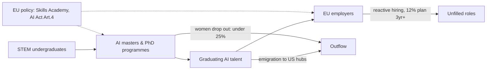
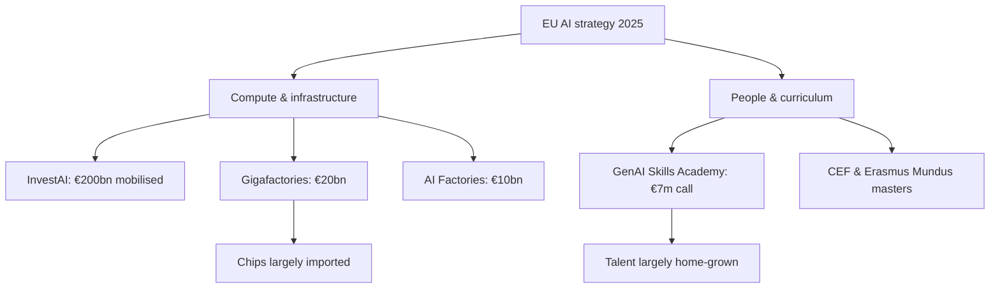

I have sat in enough boardrooms over thirty years to know the difference between a skills shortage and a skills story. The shortage is real, and I will get to the numbers. But the story Europe tells itself about fixing it through grand infrastructure announcements is, at best, half the job. We are building compute. We are still under-building people.

The actual state of AI education in Europe in mid-2026 starts on the demand side, because that is where the pain is measured.

## what employers are actually short of

94% of leaders face AI-critical skill shortages today, with one in three reporting gaps of 40% or more.

That is from the World Economic Forum's October 2025 work, and it tracks with what the WEF's own Future of Jobs survey found: skill gaps are categorically considered the biggest barrier to business transformation, with 63% of employers identifying them as a major barrier over the 2025–2030 period.

Alongside that sits a discipline gap. Only 46% of organisations currently integrate workforce planning into their AI roadmaps. McKinsey's Next Era of Work survey is blunter on the European side: while 73% of HR leaders claim to plan strategically, only 12% of European organisations are looking ahead three years or beyond. And 31% of European leaders cite limited visibility into current skills as an issue.

The pain point runs deeper than "we can't hire AI engineers." Most firms cannot see what they have, cannot say what they will need, and are recruiting reactively into the most competitive labour market in a generation.

Cities such as London, Paris, Berlin, Amsterdam and Madrid are facing some of the most significant talent shortages anywhere in the world.

The profile of who they want has also shifted under their feet.

Companies are no longer looking only for deep technical experts. They are searching for hybrid talent: people who understand AI technologies but can also connect them to business strategy, communicate with non-technical teams and think creatively about real-world applications.

The pure model-builder is still scarce and expensive. The person who can build, govern and translate is rarer still, and that is the person universities are least set up to produce.

## what Europe's universities are producing

The genuinely good news, and I do not get to write this often about European competitiveness, is that the continent is an education powerhouse on paper.

35% of all AI-related Master programmes globally are offered by EU universities and research centres, with Germany, France and the Netherlands at the forefront.

AI talent itself has more than doubled in the EU between 2016 and 2023, now representing 0.41% of the EU workforce.

The programme catalogue is deep and increasingly cross-border. Erasmus Mundus joint masters now stitch together four or five universities per degree. EMAI, for instance, runs across Pompeu Fabra in Barcelona, Sapienza in Rome, Radboud in Nijmegen and Ljubljana, integrating machine learning with modern symbolic AI across theory, methods and applications.

The Connecting Europe Facility funded four targeted masters years ago, designed by consortia of universities, SMEs and research centres focusing on human-centric AI, AI ethics, AI for the public sector and AI in healthcare.

I have skin in this. I am a founding contributor to the Human Centered AI Masters, developed by Technological University Dublin, HU Utrecht, Naples Federico II and Budapest. It trains specialists with knowledge of AI ethics and regulation alongside competences to apply it in real-world situations.

The pedagogy is sound. Throughput and timing are the problem.

Two leaks in that diagram matter most. The first is gender.

Women represent less than one-quarter of AI engineers across Europe, and as little as 11% in some cities.

You cannot solve a structural talent shortage while ignoring half the population at the top of the funnel. The second is geography.

Europe's AI workforce is unevenly internationalised. The EU attracts many foreign-trained professionals, but most talent inflows concentrate in a handful of countries, notably Germany.

A Portuguese or Greek graduate trained at EU expense too often ends up in Munich, London, or San Francisco.

## the policy layer and the money behind it

Brussels has not been idle, and I want to be fair about that. On 9 April 2025 the Commission published the AI Continent Action Plan, aiming to increase the offer of European bachelor's, master's and PhD degrees in AI and to launch the AI Skills Academy.

The Academy is meant to develop a pilot generative-AI degree and run scholarship and returnship schemes to attract more women to the field.

The Apply AI Strategy followed in October 2025 to support adoption across strategic sectors.

And since Article 4 of the AI Act entered into application on 2 February 2025, providers and deployers must ensure a sufficient level of AI literacy among staff.

That literacy mandate is the most underrated lever in the whole package. It quietly turns every regulated employer into a training provider.

Now the money.

At the Paris AI Action Summit, von der Leyen launched InvestAI to mobilise €200 billion for investment in AI, including a new €20 billion European fund for AI gigafactories.

National plans stack on top: France announced more than €100 billion in AI investment commitments in February 2025, Germany has permanently funded national AI Competence Centres, and Portugal's agenda implies up to 1.3 million workers may need retraining by 2030.

The dedicated GenAI skills academy call carried a budget of €7 million to help build a digital skills academy in GenAI, against €20 billion for gigafactories. 2,000 to one, compute over curriculum. I understand the logic of sovereign infrastructure. But Europe already does not manufacture the most advanced class of AI chips needed to populate those gigafactories, and most of the roughly 100,000 accelerators per site will be imported.

We are borrowing silicon to look sovereign while starving the one input we genuinely own: educated people.

## the mismatch in the long tail

The OECD looked at the general-literacy end of this. After surveying government training programmes across member countries, it concluded that current training supply may not be sufficient to meet the growing need for general AI literacy skills.

Europe has 800-plus specialised masters. The constraint is the long tail: the accountant, the nurse, the logistics planner who now has an AI tool on their desk and no framework for judging its output.

This matters more in Europe than the US precisely because of a cultural lag I see in every engagement.

European leaders and employees are roughly 10 percentage points less likely than their North American counterparts to expect their current role will meaningfully change in the next one to two years.

The technology will change the role whether the role-holder expects it or not.

The WEF projects that while overall job numbers grow by 170 million globally by 2030, roughly 90 million workers will be displaced based on the gap between existing and emerging skills.

Europe's demographic position, ageing with a shrinking working-age population, means it cannot afford to waste a single trainable worker.

## where the capital should go

European boards and ministers should push capital the other way: heavier into curriculum, apprenticeships and mid-career conversion, lighter on the trophy gigafactories whose chips we import anyway. The talent equation, as the interface researchers framed it, is whether Europe will nurture local AI talent, attract specialists from abroad, or watch its expertise emigrate to competing innovation hubs.

Right now we are doing all three at once, and the third is winning on the margins.

The universities are not the weak link. The catalogue is among the best anywhere, and Europe has committed roughly €20 billion to AI while projecting around 21% growth in ICT professions.

The weak link is the join: between graduate and employer, between literacy mandate and actual training budget, between announcement and intake.

A European AI strategy that spends three orders of magnitude more on machines than on the people who must run them is unlikely to deliver what it promises.

Fix the join.

The talent is already here. We keep letting it walk out the door.

* * *

Tarry Singh is the founder and CEO of Real AI (realai.eu), an enterprise AI advisory and deployment firm working with global enterprises on production agent systems, model risk, and AI sovereignty strategy. He also leads Earthscan (earthscan.io) for Energy AI, and is a founding contributor to the EU-funded HCAIM and PANORAIMA programmes for responsible AI education across European universities. He writes at tarrysingh.com.
