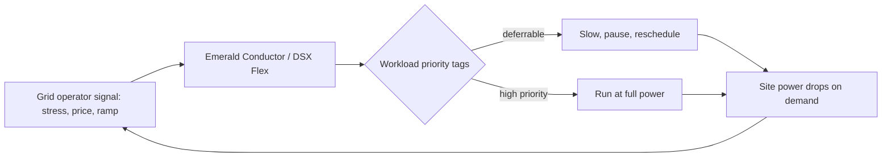

For two years the AI-and-energy story has had one plot. Demand goes vertical, the grid can't keep up, interconnection queues stretch past a decade, and everybody fights over who pays for the new wires. 

In July 2024 a voltage fluctuation in northern Virginia triggered the simultaneous disconnection of 60 data centres, producing a 1,500-megawatt power surplus that forced emergency adjustments to prevent cascading outages.

 That is the shape of the problem: enormous, lumpy, inflexible loads bolted onto a grid that was never designed for them.

On 1 June 2026, at GTC Taipei, Nvidia did something about it — or claims to have. Buried in the DSX platform launch was a line that matters more than the silicon. 

DSX Flex is powering a commercial, multi-megawatt pilot with Emerald AI and Silicon Valley Power to demonstrate grid-responsive AI factories that can dynamically adjust power consumption in response to utility signals while protecting AI workload performance.

Read that again. The pitch is no longer "build more power". It's "make the load behave". And the engineering, as far as it goes, actually works. The question — the one I'd put to any board signing a power contract this year — is whether the engineering was ever the binding constraint.

## what the demos actually showed

Start with the evidence, because it's better than the average vendor reel. The foundational result came out of Phoenix. 

In a field test in the Oracle Cloud Phoenix region, Emerald AI and its partners reduced the power consumption of AI workloads running on a cluster of 256 Nvidia GPUs by 25% over three hours during a grid stress event while preserving compute service quality.

On 3 May, a hot day in Phoenix with high air-conditioning demand, the utility's system peaked at 6 p.m.; during the test the cluster ramped down over 15 minutes, held the 25% reduction for three hours, then ramped back without exceeding its baseline.

 That work was published in Nature Energy as the first peer-reviewed evidence of AI power flexibility.

 Peer review matters here — it's the difference between a press release and a result.

Then the UK. Over five days in December 2025, National Grid, Emerald, Nebius, EPRI and Nvidia ran a live trial near London. 

A Nebius GPU cluster achieved 100% compliance cutting power by 40% during the five-day trial using Nvidia Blackwell Ultra GPUs.

 The detail I like: 

National Grid submitted signals specifying notice periods, power reduction percentages and ramp durations — some with zero advance notice, requiring immediate response — and the tests simulated real-world demand spikes, such as the surge when millions of viewers put the kettle on during half-time of major football matches.

 They ran genuine training workloads — gpt-oss, Llama, Qwen — not synthetic filler.

The catch sits in the same paragraph. 

The compute cluster was roughly 130 kW, equivalent to about 400 UK households — modest in scale, though the 100% compliance rate suggests the approach could work for much larger deployments.

 A 130 kW proof point is being used to underwrite gigawatt-scale claims. That's a long extrapolation, and it's worth keeping your hand on your wallet while you read it.

Here is the mediation loop the whole thesis rests on.

## the number everyone is quoting

The commercial case leans on one study, repeated everywhere. 

Duke's Nicholas Institute found that with 0.5% annual curtailment, PJM could integrate 18 GW of new load, MISO 15 GW, ERCOT and the Southwest Power Pool 10 GW each, and Southern Company 8 GW.

 In the framing Nvidia prefers, if new AI data centres flex their consumption by 25% for two hours at a time, fewer than 200 hours a year, they could unlock 100 gigawatts of new capacity — equivalent to over $2 trillion in data centre investment.

I want to be precise about what that figure is and isn't. It is a real, careful piece of work showing genuine headroom in a grid built to survive a handful of extreme peaks a year. It is also a theoretical maximum that assumes every new large load behaves perfectly, that curtailment is evenly distributed, and that resource-adequacy planners trust the behaviour enough to count it. 

The theoretical potential of flexibility is clear in the Duke papers — but significant real-world hurdles remain regarding reliability, resource adequacy and cost allocation.

 The "100 GW" has become a slogan. Slogans and capacity plans are different documents.

## why I think the engineering was the easy part

The demos solved the hard technical problem — choreographing thousands of GPU jobs by priority, in real time, without breaking the workloads that can't wait. Fine. But a grid operator doesn't plan around what a load *can* do on a good day with the vendor's engineers in the room. It plans around what a load is *contractually obliged* to do on the worst day of the year, with money on the line and lawyers watching.

That's a regulatory and commercial problem, and it's the one actually moving. 

Policymakers are increasingly weighing a "speed-to-power bargain": if hyperscale customers want to connect quickly in constrained regions, they accept some operational flexibility in return — and at the market level, PJM's board approved a framework letting data centres either bring their own new generation or accept early curtailment in exchange for faster interconnection.

 Meanwhile the federal regulator has been telling the industry, in plain terms, to squeeze the existing system harder — 

FERC's January 2026 "Energized for 2026" priorities named deployment of advanced demand response, dynamic line ratings and emerging operational technologies as a critical priority.

This is the part that should hold a board's attention. Nvidia is wiring flexibility into the product — Emerald says it has now completed five live demonstrations, and is explicitly equipping AI factories for ERCOT's new framework for faster power access in Texas.

 The vendor is racing ahead of the tariffs. When the engineering and the rulebook converge, the operators who designed for flexibility from day one get connected first. The ones who assumed they'd always draw full nameplate power wait in the queue. That's the real prize — not the megawatts, the *position in line*.

## the stake

If I were on the board of a hyperscaler or a large colo developer, I would push hard to build flex-ready now, and I would not pay a cent of premium for the headline "100 GW unlocked" framing. Those are two different decisions and they get conflated constantly.

Building flexible is cheap insurance. 

As Emerald's CEO put it, the software can be deployed in weeks, not years

 — which, set against decade-long interconnection queues, is the most attractive number in the entire pitch. The Silicon Valley Power partner is telling, too: 

SVP serves over 60,000 customers at rates 33 to 57% below neighbouring communities, exactly the kind of utility that would rather reshape demand than build a peaker plant.

But the macro claim deserves a colder eye. The same Bloomberg reporting that mapped how data centres waste energy in voltage conversion also carried Elon Musk's warning that "very soon, maybe even later this year, we'll be producing more chips than we can turn on."

 Flexibility doesn't manufacture electricity. It rearranges when you draw it. That helps enormously at the margin — and it does nothing for the underlying generation gap if AI demand keeps compounding. 

Even the IEA notes that while data centre demand growth is a fraction of total electricity growth this decade, its concentration in specific locations makes grid integration the hard part.

 Flexibility is a tool for the concentration problem, not the volume problem.

There's also a stranded-asset hazard nobody likes to discuss. 

If the anticipated demand does not materialise, utilities — and their consumers — could face stranded costs.

 Flexible load is, oddly, a hedge against that too: a grid that can lean on demand-side shock absorbers needs less speculative steel in the ground.

So: the demos are real, the peer review is real, the commercial pilot at Santa Clara is a genuine step from lab to invoice. What's still unproven is whether a utility planner will write a 500 MW flexible load into a resource-adequacy filing and sleep at night. Until that signature happens at scale, the "100 GW" is a beautiful number in search of a regulator brave enough to bank on it. I'd bet the technology arrives a full year or two before the rulebook does — and the gap between them is where this year's winners and losers get sorted.

Watch the tariffs, not the GPUs.

---

Tarry Singh is the founder and CEO of Real AI (realai.eu), an enterprise AI advisory and deployment firm working with global enterprises on production agent systems, model risk, and AI sovereignty strategy. He also leads Earthscan (earthscan.io) for Energy AI, and is a founding contributor to the EU-funded HCAIM and PANORAIMA programmes for responsible AI education across European universities. He writes at tarrysingh.com.
