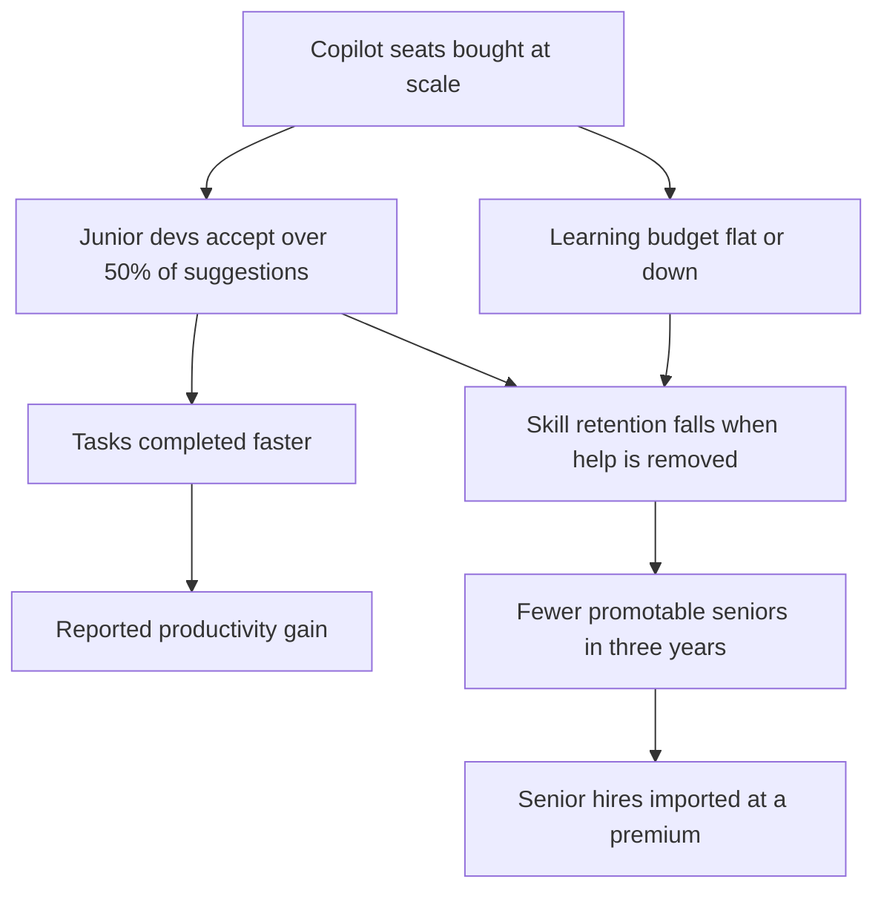

The companies buying the most copilot seats are often the companies whose people are getting faster at being shallow. Their people are not getting smarter. That distinction will define the next five years of enterprise productivity, and most of the dashboards measuring it are pointed at the wrong thing.

This is the part of the AI cycle where the measurement gets uncomfortable. The vendor decks are full of double-digit productivity gains. The instrumented studies are pulling in the opposite direction. The macro labour numbers say something stranger still. The cohort losing ground hardest right now is the one with the heaviest AI use.

## The numbers tell two stories

Microsoft's [2026 Work Trend Index](https://news.microsoft.com/annual-work-trend-index-2026/) is based on what the company calls a privacy-preserving analysis of more than 100,000 chats in Microsoft 365 Copilot and a 20,000-worker survey across ten countries.

| What Microsoft reports | Share |
| - | - |
| AI users report spending more time on high-value work | 66% |
| "Frontier Professionals" claim they are now producing work they could not have produced a year ago | 80% |
| [Workers say their employer rewards reinventing work with AI](https://blogs.microsoft.com/blog/2026/05/05/how-frontier-firms-are-rebuilding-the-operating-model-for-the-age-of-ai/) when initial results fall short | only 13% |
| Workers say leadership is consistently aligned on AI | only 26% |

Frontier Professionals are the top 16% of AI users. The high-value work and Frontier Professionals numbers are a self-report from people who use the tool. The rewards and leadership alignment numbers are a structural admission that the organisation around them has not caught up.

Anthropic's [Economic Index for March 2026](https://www.anthropic.com/research/economic-index-march-2026-report), built from roughly a million conversations across Claude.ai and the developer API, reports that about 49% of jobs already have at least 25% of their tasks performed through Claude. On the consumer side, augmentation has crept back ahead of automation, 52% against 45%. On the enterprise API side, automation dominates at 75%. Both numbers are interesting; neither is evidence of skill growth in the humans nearby. They measure what the model did. They do not measure what the person learned.

These are vendor reports. They should be read like vendor reports. Microsoft is the world's largest seller of AI-assistance subscriptions; Anthropic is one of the two firms with the strongest commercial incentive to demonstrate the indispensability of large models. The methodology is more careful than most vendor work, and the directional signal is solid: real usage is substantial inside Fortune 500 environments. The self-reported productivity uplifts are softer than the press release implies.

## What is happening to junior developers

The cleanest leading indicator that fluency is not a subscription sits in the labour data for 22-to-25-year-old software developers. The [2026 Stanford AI Index](https://hai.stanford.edu/ai-index/2026-ai-index-report) reports their employment has fallen nearly 20% from its 2024 peak, with the curve tracking almost exactly the adoption curve of coding assistants. [Research summarised this year](https://www.rafay99.com/blog/ai-coding-assistance-skill-atrophy-anthropic-research) shows junior developers accepting above 50% of copilot suggestions while seniors accept far fewer; junior developers complete coding tasks faster with assistance and demonstrate measurably worse skill retention when assistance is removed.

The cohort with the highest copilot acceptance rate is the same cohort whose roles are evaporating. The mechanism is not a mystery. If the first three years of professional coding consist of accepting suggestions you cannot evaluate critically, you do not become a senior engineer. You become a faster intermediate one, at the moment when faster intermediate is exactly the kind of work that gets eaten next.

Some of the better engineering teams have responded by running "copilot-free Fridays", a deliberate-practice carve-out designed to surface where the tool is a crutch and where it is a multiplier. The framing matters. It treats fluency as something you build under load. A licence does not switch it on.

## What McKinsey actually said

The [State of Organizations 2026](https://www.libertify.com/interactive-library/mckinsey-state-organizations-2026/) finding to take seriously is the gap between optimism and readiness: just over half of leaders expect positive outcomes from current transformation efforts, but 72% describe their organisations as unprepared to execute, and 86% say their organisation is not prepared to integrate AI into day-to-day operations. McKinsey's [own upskilling guidance](https://www.mckinsey.com/capabilities/people-and-organizational-performance/our-insights/the-organization-blog/redefine-ai-upskilling-as-a-change-imperative) is the part most enterprises ignore: 80% of tech-focused organisations say upskilling is the single most effective way to close skills gaps, while only 28% have any plan to fund it over the next two to three years.

The CFO line in most 2026 budgets reads "AI tooling, up; learning and development, flat or down." The result is an organisation where the seat count grows quarterly and the capability to use those seats well does not. That is the upstream of the slop pipeline. Most enterprises confuse a vendor-supplied training video for a learning programme; the two things are not in the same category and never will be.

## How to read a productivity claim

When someone shows you a 30% productivity improvement from a copilot rollout, ask three things. Was it self-reported, instrumented, or output-graded by a third party? Was the comparison a randomised assignment or a willing-volunteer cohort? Did the measurement run long enough to detect the productivity J-curve [Brynjolfsson, Rock, and Syverson have been writing about](https://mitsloan.mit.edu/ideas-made-to-matter/a-calm-ai-productivity-storm) since the 1990s? In most enterprise rollouts, the answer to all three is uncomfortable.

A recent NBER study referenced in the same MIT Sloan piece found over 80% of surveyed firms reporting zero productivity gains from AI, even as Brynjolfsson points to US productivity growth doubling to 2.7% in 2025. Both can be true at once. The macro number reflects the few firms that have actually done the complementary work: workflow redesign, retraining, software rewiring. The median firm is still in the trough of the J-curve, paying licensing and seeing flat output.

The technology is worth the attention. The dashboards are not worth the trust the vendor asks for them. The right comparison is grader-blind output assessment on matched tasks, six and twelve months out, against a control group that did not get the tool. Pre-rollout to post-rollout self-report tells you nothing. Almost no one does the harder work. The few who do find smaller and more uneven gains than the slide decks promised, concentrated in workers who already had strong domain skill before the tool arrived.

## What works at scale

Siemens has been running its [SiTecSkills Academy](https://initiatives.weforum.org/reskilling-revolution/siemens) since 2022. Across production, service, and sales, the programme has passed roughly 24,000 employees, with roughly 40% female participation, and six-month post-training reviews showing close to a 100% reskilling success rate. The most interesting thing about Siemens' approach is the curriculum design. The people who built it understood that digital, green and AI skills form a single composite capability in industrial work, and that you have to teach them as one. The implicit theory of skill underneath the programme is closer to a graduate apprenticeship than a corporate e-learning portal, and that is why it actually moves capability.

The EU is now attempting the same thing at population scale. The Union of Skills initiative announced in March 2025 has spawned an [AI Skills Academy](https://digital-strategy.ec.europa.eu/en/policies/ai-talent-skills-and-literacy) intended to aggregate sectoral training from European Digital Innovation Hubs, AI Factories, EIT communities, and the Interoperable Europe Academy. The earlier 70%-basic-digital-skills-by-2025 target was missed; the AI-specific targets should be read with that in mind. The mechanism the Commission has chosen is federated, sector-specific and employer-anchored. That is the right shape, but the execution is still front-loaded with administrative ceremony and back-loaded with measurement. Work inside the HCAIM and PANORAIMA programmes has been targeting exactly this gap inside European universities; the open question is whether the supply of trained instructors can keep up with the demand the policy is about to generate.

## The bill that arrives later

Any organisation that spent 2025 buying enterprise copilot subscriptions without also committing a hard spending floor to grader-blind capability assessment and deliberate-practice carve-outs has, I think, made a bad trade. My own number for that floor is at least 1.5% of fully-loaded labour cost. The seats are cheap. The capability is not. Most CFOs will discover by Q2 of 2027 that they bought the cheap thing and are now paying for the expensive thing on a delay, in the form of senior hires they could not promote internally because the internal pipeline thinned out.

The companies that quietly bent the curve in the other direction this year are the ones that will be hard to compete with for the next five. The asymmetry will be visible in two places: the speed at which their senior staff can ship novel work without ceremony, and the willingness of their mid-career hires to stay. Both are downstream of having taken capability seriously while everyone else was buying seats.

Fluency is not a subscription. It is a deliberate-practice habit, instrumented and graded, that an organisation either invests in directly or imports later at a steep premium.

---

Tarry Singh is the founder and CEO of [Real AI](https://realai.eu), an enterprise AI advisory and deployment firm working with global enterprises on production agent systems, model risk, and AI sovereignty strategy. He also leads [Earthscan](https://earthscan.io), an Energy AI startup, and is a founding contributor to the EU-funded HCAIM and PANORAIMA programmes for responsible AI education across European universities. He writes at [tarrysingh.com](https://tarrysingh.com).
