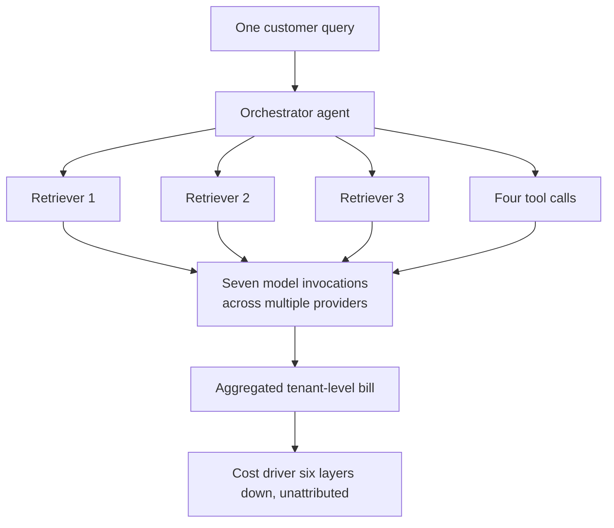

Uber exhausted its entire 2026 AI coding budget by April. Four months in. Coding-agent adoption across a roughly 5,000-engineer organisation went from 32-84% in about a month, and 95% of its engineers now use AI tools monthly. Nobody there did anything wrong. The adoption curve simply outran the budget cycle, which is a sentence I have now heard in some form from four different CFOs this year.

Mavvrik put a number on how common that is. Its 2026 State of AI Cost Governance Report, published on 29 July 2026, found unexpected AI costs materially altering a business decision at 62% of organisations. At 40%, the explaining had to be done in front of the board.

I discount vendor surveys by default. That second number I could not talk myself out of.

Cloud waste does not reach a board. Infrastructure variance does not reach a board. A cost reaches a board once it has cleared the spending authority of whoever caused it, and then somebody has to stand up and explain a charge nobody forecast. Two in five enterprises had that meeting.

## The slop layer

Harness published its own survey the same day, and its finding was the polite version of what I hear in the room: enterprise AI spend has outgrown the ownership, visibility and governance needed to manage it. When the bill jumps, nobody can say who owns it, why it moved, or whether it bought anything.

Underneath sits what we started calling AI slop debt a year ago. Half-finished proofs of concept that never shipped and never got switched off. Unevaluated agents consuming tokens in production. Prompt sprawl, which is a tidiness word for a cost problem: run hundreds of prompts across several models and you get inconsistent outputs, compliance headaches, and a bill nobody budgeted for.

Shadow AI is a real category now, with teams running unauthorised models outside central visibility and cost allocation. PayPal described the end state as "context sprawl where you have 30 different agents…a bunch of different sources of truth."

The cost structure changed mid-flight, and that is the part the budget could not have anticipated. Somebody set the 2026 numbers in 2025, before token-burning agents existed at production scale. Teams deployed chatbots with one token profile. Coding assistants arrived with another, and far more volume. Then agentic workflows, different again and worse again. At agentic scale, an architectural decision that cost almost nothing during the pilot executes thousands of times a day against a bill nobody modelled.

## The FinOps reckoning

The FinOps Foundation surveyed 1,192 practitioners responsible for more than $83 billion in annual cloud spend, and found nearly all of them, 98%, now managing AI spend. Two years ago it was 31%. That is not adoption. That is reclassification: AI cost management was absorbed wholesale into the FinOps function inside 24 months, and people who built careers arguing about reserved instances are now asked to forecast token consumption for workloads younger than a fiscal year.

Where those practices report tells you how the problem is being classified. In the same survey, 78% sit under the CTO or CIO and only 8% under the CFO. Structurally that is correct, because the decisions that determine the bill are taken in engineering. It also means finance sees the damage after it has been committed.

KPMG asked 204 US business leaders at billion-dollar-plus organisations whether they had full, real-time visibility into what their AI systems cost to run. Only a quarter said yes. You cannot control what you cannot see, and most enterprises cannot see AI costs at the granularity where the overrun actually happens.

Agentic AI breaks attribution outright. A single customer query in a banking workflow can trigger an orchestrator, three retrievers, four tool calls and seven model invocations across multiple providers. The invoice arrives at an aggregated tenant level, with the cost driver sitting six layers down in the agent graph.

## What compounds

Code holds still. AI debt does not. The data underneath it changes, the model drifts, the regulator moves, and the prompt that worked at launch keeps billing months later while quietly returning worse answers. That is why it compounds faster than the debt engineering teams are used to carrying: every layer beneath it is moving.

Nobody decides to accumulate this. A team ships something that works, the engineer moves on, and the system stays up because switching it off needs someone willing to own that call. A few budget cycles later, the maintenance bill has no name on it.

Gartner now predicts a remediation market will emerge for tools and consultants that can audit and refactor the AI-generated technical debt companies are accumulating. When Gartner sizes the cleanup, the mess is already a business.

The stack has grown well past code and cloud waste: unmanaged prompts, orphaned agents, token consumption with no owner, and infrastructure locked to vendors who price by usage. That last item is the only one somebody else controls.

## The debt behind the buildout

The same pattern is visible one level up, on the balance sheets funding the buildout. Big Tech's borrowing for AI infrastructure has doubled to $350 billion, on Bloomberg's count, and Goldman Sachs strategist Amanda Lynam puts AI-related debt issued in 2026 at $489 billion, already past Goldman's $322 billion estimate for all of last year.

That is not a crisis. Bond demand is softening rather than breaking, and coverage ratios on hyperscaler bonds are declining. What I would watch instead is where the financing is moving: an estimated $800 billion for data centres is shifting towards private credit and off-balance-sheet structures. Public balance sheets then stop telling you who bears the risk if AI returns arrive late or small.

## What a board should ask for

Any board carrying material AI spend needs three things before the next invoice cycle:

- A named human owner for every production agent.
- A real-time cost model that attributes spend to a business outcome, not only to infrastructure.
- An audit of what is running, why it was started, and whether it is delivering anything. Much of it comes back empty, and that is the part that pays for the exercise.

The organisations that come through this cycle will treat AI spend as a capital allocation problem with architectural consequences. Treating it as a technology question with a FinOps wrapper is what produced this year's surprises. The CFO patience that tolerated single-digit returns has run out, and the next round of invoices will separate the projects that had a business case from the ones that had momentum.

There is a reading of that 40% that is less alarming, and I keep turning it over. A board briefing on unplanned AI cost can mean a company lost control of its spending. It can equally mean the company could see its spending clearly enough to explain it. Opposite conditions, same survey answer, and I would want to know which one I was in.

---

Tarry Singh is the founder and CEO of Real AI (realai.eu), an enterprise AI advisory and deployment firm working with global enterprises on production agent systems, model risk, and AI sovereignty strategy. He also leads Earthscan (earthscan.io) for Energy AI, and is a founding contributor to the EU-funded HCAIM and PANORAIMA programmes for responsible AI education across European universities. He writes at tarrysingh.com.
