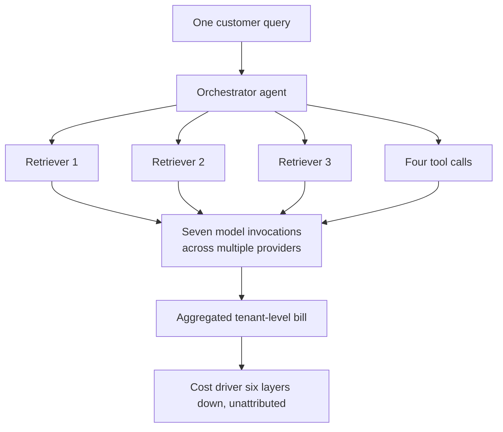

Sixty-two per cent of organisations say an unexpected AI cost materially altered a business decision this past year. Forty per cent required board-level escalation. Thirty-three per cent implemented emergency spending freezes, and 25 per cent delayed or cancelled an AI initiative outright. This is from the 2026 State of AI Cost Governance Report released by Mavvrik on 29 July 2026, surveying enterprises on how they forecast, attribute, and govern AI spending.

The data point that matters most is the 40 per cent that went to the board. An unplanned, material charge requiring executive escalation is a different animal from infrastructure variance or cloud waste. It tells you the surprise exceeded delegated authority.

Nearly seven in ten U.S. companies (68 per cent) say at least some of their artificial intelligence initiatives ran over budget in the past year, with one-third (33 per cent) reporting that overruns occurred mostly or always, according to AI security firm WitnessAI in a report released on 22 July 2026.

Uber exhausted its entire 2026 AI coding budget by April, four months in. Coding-agent adoption went from 32 per cent to 84 per cent of a roughly 5,000-engineer org in about a month. Nearly all its engineers, 95 per cent, now use AI tools monthly.

The pattern is consistent. The FinOps Foundation's State of FinOps 2026 report, drawn from 1,192 practitioners responsible for more than $83 billion in annual cloud spend, found that 73 per cent of organisations reported their AI costs exceeded original projections. That is the number every vendor lead-gen blog now repeats, and it's accurate. But it understates the problem.

## The Slop Layer

Harness released the 2026 State of AI in FinOps on 29 July 2026, revealing that enterprise AI spend has outgrown the ownership, visibility, and governance needed to manage it.

Basic questions go unanswered: who owns the bill, why it spiked, and whether the spend is paying off.

What sits underneath those numbers is what we started calling "AI slop debt" a year ago: half-finished POCs that never shipped but stayed on, unevaluated agents consuming tokens in production, and prompt sprawl. Organisations managing hundreds of prompts across multiple models face inconsistent outputs, compliance headaches, and unexpected costs.

Shadow AI is a real category now: teams running unauthorised models outside central visibility and cost allocation. PayPal named the end state as "context sprawl where you have 30 different agents…a bunch of different sources of truth." When organisations forecasted their 2026 AI spend months ago, by June 9 many had already burned through 3× that entire annual budget.

The cost structure changed mid-flight. The 2026 budget was set in 2025, before token-burning agents existed at production scale. Teams deployed chatbots with a certain token profile. Then coding assistants arrived, with different usage and different volume. Then agentic workflows, different again and far worse. At agentic scale, the same architectural decision that cost almost nothing during the pilot is now executing thousands of times a day against a bill nobody modelled.

## The FinOps Reckoning

In the same FinOps Foundation survey, 98 per cent of practices now manage AI spend, up from 31 per cent in 2024. That is reclassification, not adoption.

In the span of 24 months, AI cost management has been absorbed wholesale into the FinOps function, and the people who used to argue about reserved instances and savings plans are now being asked to forecast token consumption for workloads that have existed for less than a fiscal year.

The FinOps Foundation's 2026 data shows 78 per cent of FinOps practices now report into the CTO or CIO organisation, up 18 points from 2023, with only 8 per cent reporting to the CFO. That classifies AI cost governance as an architecture capability rather than a finance one. It is structurally correct, because the decisions that determine the bill are taken in engineering. It also means the finance team sees the damage after it has already been committed.

KPMG's Q2 2026 AI Pulse survey of 204 US business leaders at $1B+ revenue organisations found only 26 per cent have full, real-time visibility into what their AI systems cost to operate. KPMG's parallel global survey of 2,145 leaders across 20 markets found 42 per cent have only partial visibility into AI spending. You cannot control what you cannot see, and most enterprises cannot see AI costs at the granularity where the overrun actually occurs.

Agentic AI breaks attribution. A single customer query in a banking workflow can trigger an orchestrator, three retrievers, four tool calls, and seven model invocations across multiple providers. The bill arrives at an aggregated tenant level; the cost driver is buried six layers down in the agent graph.

## What Compounds

AI technical debt is the hidden cost, complexity, and risk that accumulate when organisations implement AI solutions faster than they can properly govern, maintain, and scale them. It emerges from rushed AI deployments, poor data quality, weak governance frameworks, fragmented integrations, and overreliance on AI vendors. While AI initiatives may deliver short-term wins, these shortcuts often create long-term operational challenges that increase maintenance costs, slow innovation, reduce AI ROI, and make future changes significantly more expensive.

AI technical debt extends beyond code into data quality, machine learning models, prompts, APIs, workflows, governance policies, compliance requirements, and vendor ecosystems. AI systems continuously evolve as data changes, models drift, regulations tighten, and business requirements shift. As a result, AI technical debt compounds much faster than traditional technical debt. The cycle it creates runs through rising maintenance costs, growing operational risk, increasing vendor dependency and slower business agility.

A Forrester report found that 75 per cent of technology decision-makers expect technical debt to rise to a "severe" level in 2026. A recent CAST report estimated that technical debt worldwide has amounted to 61 billion workdays. Gartner's "Predicts 2026" report predicts that "a new remediation market will emerge for specialised tools and consulting services that can audit, identify, and refactor the 'AI-generated technical debt' that companies accumulate."

The debt stack has grown well past code and cloud waste: code + unmanaged prompts + orphaned agents + token consumption with no owner + infrastructure locked to vendors who price by usage. AI systems ingest more data, evolve faster, and interact with more environments, which means technical debt forms quickly and often goes unnoticed until it fuels a major breach.

## The Debt Behind the Buildout

According to Bloomberg, Big Tech's debt for AI infrastructure has doubled to $350 billion. Bank of America estimates that AI-related bonds will reach $270 billion in 2026, up from $136 billion in 2025.

Goldman Sachs strategist Amanda Lynam estimated that $489 billion of AI-related debt has been issued in 2026, already above Goldman's estimate of $322 billion for how much came to market last year.

AI's rapid buildout is significantly impacting credit markets, with global AI-related debt issuance projected to hit $570 billion by 2026. While not a crisis, bond demand is softening, evidenced by declining coverage ratios for hyperscaler bonds. Investors may soon demand higher yields.

Vendor bonds are only part of it. The bigger concern is the shift of financing towards less transparent private credit and off-balance-sheet structures, estimated at $800 billion for data centres. This move makes potential losses harder to track, as public balance sheets no longer tell the full story of who bears the risk if AI returns are delayed or fall short.

An enterprise board with material AI spend needs three things, and 40 per cent of enterprises had to brief their boards on unplanned AI costs in the last year. A named owner for every production agent. A real-time cost model that attributes spend to business outcome as well as infrastructure. An audit of what is running, why, and whether it is delivering value.

The organisations that survive this cycle will be those that treat AI spend as a capital allocation problem with architectural consequences. Treating it as a technology question with a FinOps wrapper is what produced this year's surprises. The CFO patience that allowed most companies to report 1-5 per cent ROI is already exhausted. The next round of invoices will determine which AI projects had business cases and which had momentum.

---

Tarry Singh is the founder and CEO of Real AI (realai.eu), an enterprise AI advisory and deployment firm working with global enterprises on production agent systems, model risk, and AI sovereignty strategy. He also leads Earthscan (earthscan.io) for Energy AI, and is a founding contributor to the EU-funded HCAIM and PANORAIMA programmes for responsible AI education across European universities. He writes at tarrysingh.com.
