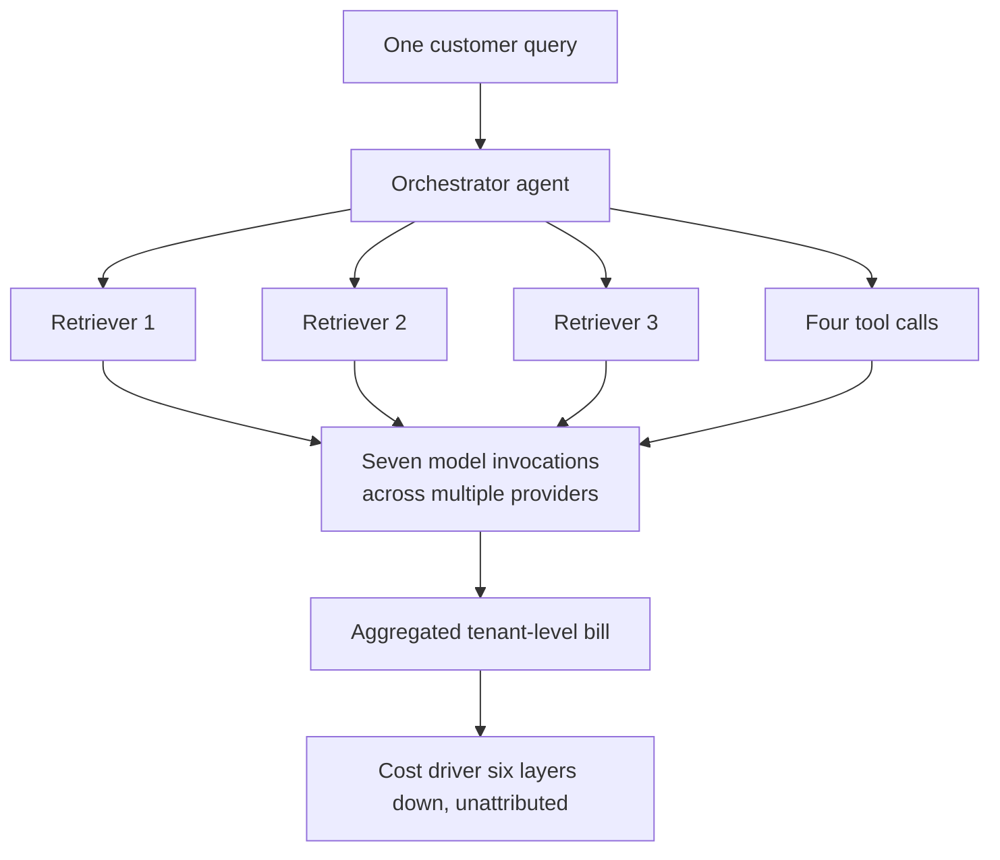

Finance teams spent the past year explaining AI charges nobody had forecast. Mavvrik has now put a number on it. Its 2026 State of AI Cost Governance Report, published on 29 July 2026, surveyed how enterprises forecast, attribute, and govern AI spending, and found 62 per cent of organisations saying an unexpected AI cost had materially altered a business decision. At 40 per cent of organisations, the explaining had to be done in front of the board.

Mavvrik counted the fallout too. Enough teams reached for the emergency brake that 33 per cent of organisations imposed a spending freeze, and another 25 per cent delayed or cancelled an AI initiative outright.

I discount vendor surveys by default. This one carries a number I could not talk myself out of.

The 40 per cent that went to the board is what I keep returning to. Cloud waste does not reach a board. Infrastructure variance does not reach a board. A cost reaches a board once it has cleared the spending authority of whoever caused it, and somebody has to explain to directors a charge nobody forecast.

The security firm WitnessAI reported on 22 July 2026 that 68 per cent of U.S. companies had watched at least some of their artificial intelligence initiatives run over budget in the past year. Overruns were rarely a one-off, either, with 33 per cent of U.S. companies saying they happened mostly or always.

Uber exhausted its entire 2026 AI coding budget by April. Four months in. Coding-agent adoption across a roughly 5,000-engineer org went from 32 to 84 per cent in about a month, and 95 per cent of its engineers now use AI tools monthly. That is an adoption curve outrunning a budget cycle.

The FinOps Foundation surveyed 1,192 practitioners responsible for more than $83 billion in annual cloud spend for its State of FinOps 2026, and found 73 per cent of organisations reporting AI costs above original projections. Every vendor lead-gen blog now repeats that figure, and it is accurate. It also understates the problem, because it measures the overrun and not its cause.

## The Slop Layer

Harness put out the 2026 State of AI in FinOps on the same day Mavvrik published, 29 July 2026. Enterprise AI spend, it found, has outgrown the ownership, visibility, and governance needed to manage it. Which is the polite version of what I hear. When the bill jumps, nobody can say who owns it, why it moved, or whether it bought anything.

What sits underneath those numbers is what we started calling "AI slop debt" a year ago. Half-finished POCs that never shipped and never got switched off. Unevaluated agents consuming tokens in production. Prompt sprawl, a tidiness word for a cost problem. Organisations managing hundreds of prompts across multiple models get inconsistent outputs, compliance headaches, and costs nobody budgeted.

Shadow AI is a real category now: teams running unauthorised models outside central visibility and cost allocation. PayPal named the end state as "context sprawl where you have 30 different agents…a bunch of different sources of truth." The arithmetic is worse than the anecdote. Organisations forecasted their 2026 AI spend months ago. By 9 June, many had already burned through 3× that entire annual budget.

The cost structure changed mid-flight. Somebody set the 2026 budget in 2025, before token-burning agents existed at production scale. Teams deployed chatbots with one token profile. Coding assistants arrived with another, and far more volume. Then agentic workflows, different again and worse again. At agentic scale, the architectural decision that cost almost nothing during the pilot now executes thousands of times a day against a bill nobody modelled.

## The FinOps Reckoning

In the same FinOps Foundation survey, 98 per cent of practices now manage AI spend, up from 31 per cent in 2024. Read that as reclassification, not adoption.

That took 24 months. AI cost management was absorbed wholesale into the FinOps function, and the people who built careers arguing about reserved instances and savings plans are now asked to forecast token consumption for workloads that have existed for less than a fiscal year.

The FinOps Foundation's 2026 data shows 78 per cent of practices reporting into the CTO or CIO organisation, up 18 points from 2023, with only 8 per cent reporting to the CFO. That classifies AI cost governance as an architecture capability, not a finance one. Structurally, that is correct. The decisions that determine the bill are taken in engineering. It also means the finance team sees the damage after it has already been committed.

KPMG's Q2 2026 AI Pulse survey asked 204 US business leaders at $1B+ revenue organisations whether they had full, real-time visibility into what their AI systems cost to operate. Only 26 per cent said yes. KPMG's parallel global survey of 2,145 leaders across 20 markets found 42 per cent with only partial visibility into AI spending. You cannot control what you cannot see, and most enterprises cannot see AI costs at the granularity where the overrun actually occurs.

Agentic AI breaks attribution outright. A single customer query in a banking workflow can trigger an orchestrator, three retrievers, four tool calls, and seven model invocations across multiple providers. The bill arrives at an aggregated tenant level, and the cost driver sits six layers down in the agent graph.

## What Compounds

Code holds still. AI debt does not. The data underneath it changes, the model drifts, the regulator moves, and the prompt that worked at launch keeps billing months later while quietly returning worse answers. That is why it compounds faster than the debt engineering teams are used to carrying. Every layer beneath it is moving.

Nobody decides to accumulate this. A team ships something that works, the engineer moves on, and the system stays up because switching it off needs someone willing to own that call. A few budget cycles later, the maintenance bill has no name on it.

Forrester found 75 per cent of technology decision-makers expect technical debt to rise to a "severe" level in 2026. A recent CAST report estimated that technical debt worldwide has amounted to 61 billion workdays. Gartner's "Predicts 2026" report predicts that "a new remediation market will emerge for specialised tools and consulting services that can audit, identify, and refactor the 'AI-generated technical debt' that companies accumulate." When Gartner sizes the cleanup market, the mess is already a business.

The stack has grown well past code and cloud waste: code, unmanaged prompts, orphaned agents, token consumption with no owner, and infrastructure locked to vendors who price by usage. The last item is the only one somebody else controls. AI systems ingest more data and interact with more environments than the code they replaced, so the debt forms quickly and goes unnoticed until it fuels a major breach.

## The Debt Behind the Buildout

According to Bloomberg, Big Tech's debt for AI infrastructure has doubled to $350 billion. Bank of America estimates that AI-related bonds will reach $270 billion in 2026, up from $136 billion in 2025.

Goldman Sachs strategist Amanda Lynam estimated that $489 billion of AI-related debt has been issued in 2026, already above Goldman's estimate of $322 billion for how much came to market last year.

Global AI-related debt issuance is projected to hit $570 billion by 2026, and the buildout is significantly affecting credit markets. This is not a crisis. But bond demand is softening, evidenced by declining coverage ratios for hyperscaler bonds, and investors may soon demand higher yields.

Vendor bonds are only part of it. The bigger concern is the shift of financing towards less transparent private credit and off-balance-sheet structures, estimated at $800 billion for data centres. That move makes potential losses harder to track, because public balance sheets no longer tell the full story of who bears the risk if AI returns are delayed or fall short.

Boards at 40 per cent of enterprises were briefed on unplanned AI costs in the last year. Any board carrying material AI spend needs three things before the next invoice cycle:

- A named human owner for every production agent.
- A real-time cost model that attributes spend to business outcome as well as to infrastructure.
- An audit of what is running, why it was started, and whether it is delivering value. Much of it comes back empty, which is the part that pays for it.

The organisations that come through this cycle will treat AI spend as a capital allocation problem with architectural consequences. Treating it as a technology question with a FinOps wrapper is what produced this year's surprises. The CFO patience that allowed most companies to report 1-5 per cent ROI has run out. The next round of invoices will separate the AI projects that had a business case from the ones that had momentum.

There is a reading of that 40 per cent that is less alarming. A board briefing on unplanned AI cost can mean a company lost control of its spending. It can equally mean the company saw its spending clearly enough to explain it. Opposite conditions, same survey answer, and I would want to know which one I was in.

---

Tarry Singh is the founder and CEO of Real AI (realai.eu), an enterprise AI advisory and deployment firm working with global enterprises on production agent systems, model risk, and AI sovereignty strategy. He also leads Earthscan (earthscan.io) for Energy AI, and is a founding contributor to the EU-funded HCAIM and PANORAIMA programmes for responsible AI education across European universities. He writes at tarrysingh.com.
