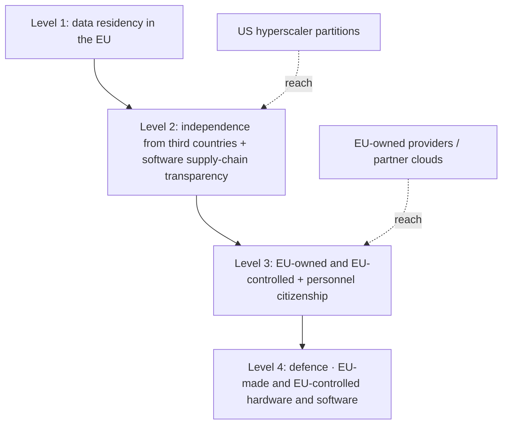

For a decade Europe argued about digital sovereignty in the abstract. Conferences, white papers, the occasional indignant op-ed when a US law reached across the Atlantic and grabbed something. On 3 June the argument acquired a legal text.

The European Commission presented the European Technological Sovereignty Package, a set of measures to strengthen Europe's capacity in semiconductors, artificial intelligence, cloud and open source.

At the centre sits the Cloud and AI Development Act, or CADA. Inside CADA is the thing that will actually move money: a four-tier sovereignty scale.

I've sat through enough of these announcements to know the press release is the least interesting part. The definitions are what matter, because definitions decide who wins a tender. So: the mechanics.

## what CADA actually does

Two things, really. The first is a build-out.

The proposal aims to triple EU data centre capacity over the next five to seven years and ensure that the Union has the capacity it needs by 2035.

The Commission talks about an estimated €200 billion in mostly private money, faster permitting, better access to energy and land. Fine. We've heard infrastructure targets before, and I'd treat the 2035 number the way I treat any decade-out capex promise: as a direction rather than a commitment.

The second thing is the one that matters for procurement.

The Cloud and AI Development Act defines cloud and AI sovereignty comprising four assurance levels, to be used by public sector bodies based on their risk assessments, and cloud service providers can be recognised under this framework by Member States, after undergoing an audit.

This is the GDPR move repeated for infrastructure: a graded standard that public bodies must measure their suppliers against, with no outright ban anywhere in it.

The levels climb in strictness.

At Level 2, providers must demonstrate independence from third countries and transparency over their software supply chain; at Level 3, providers must be owned and controlled from the EU and meet additional criteria, such as personnel citizenship.

Above that sits the defence tier.

The Commission's framework's most critical tier, covering defence, would effectively be reserved for suppliers with EU-made and EU-controlled hardware and software.

The fault line sits between the second and third rungs. A US hyperscaler running a structurally separated European entity can plausibly argue its way to Level 2. Level 3, with its ownership, control and personnel-citizenship tests, is where the corporate parent in Delaware becomes the disqualifying fact. Level 4 is, by design, not for them at all.

## what defence buyers already decided

The neat thing about CADA is that the market pre-empted it. The strictest tier describes a decision European defence buyers were already making case by case.

The Bundeswehr's rejection of Palantir for its military cloud-AI project in favour of European alternatives anticipated level-4 logic before the framework existed.

When a procurement officer in Germany decides that a US-controlled analytics stack can't sit at the centre of military operations, you don't need a regulation to tell you which way sovereignty is trending. CADA just writes down what the buyers concluded on their own.

And the reason buyers reached that conclusion isn't paranoia. It's an unresolved legal collision.

The US CLOUD Act requires US companies to produce data stored anywhere in the world upon a valid US government demand, regardless of storage location. GDPR Article 48 prohibits transfers to non-EU authorities on the basis of a foreign court order alone. But it does not prevent those orders from being issued, and it does not compel Microsoft to refuse them, and data residency commitments do not resolve that structural conflict.

Data residency answers the wrong question. The question is jurisdiction over the entity holding the keys, and a German server farm doesn't change the nationality of the parent company served with a warrant.

The most honest moment in this whole saga came from a vendor.

Microsoft's sovereignty credibility took a public hit in July 2025, when its chief legal officer in France, appearing before the French Senate, was unable to clearly confirm that Microsoft would never hand over EU data to US authorities without consent. That moment crystallised the limits of technical and contractual safeguards when US jurisdiction still applies.

Every CIO who watched that clip understood the implication immediately. The contracts don't save you. The corporate structure does or it doesn't.

## the hyperscalers saw it coming, and built partitions

To their credit, the American providers didn't wait.

Amazon Web Services launched its European Sovereign Cloud to general availability, marking a €7.8 billion investment in physically and logically separated infrastructure, now available in Brandenburg, Germany.

The structure is the interesting bit: the infrastructure is managed through dedicated European legal entities established under German law, with EU-resident managing directors, and an advisory board comprised exclusively of EU citizens providing additional oversight on sovereignty matters.

Microsoft went a different route through partner clouds, Bleu in France and Delos in Germany, while keeping its productivity stack inside sovereign controls.

A partition is a real engineering achievement and a partial answer. It is not a clean Level 3, and the trade-offs are visible: around a 15 per cent pricing premium, roughly 90 services versus 240-plus in commercial EU regions, only two availability zones at launch, and missing services like CloudFront, GPU instances, and most Bedrock models.

For an AI workload the missing GPUs are the whole story. You can have sovereignty or you can have the frontier compute, and at launch you couldn't fully have both on the sovereign partition. And even with EU-resident operators and a German parent, the honest reading is the one InfoQ landed on: significant questions persist about whether this separation can truly protect against US government data requests.

## the third-country recognition clause

Everyone is staring at Level 4 because defence is dramatic. Wrong place to look. The variable that decides how much of this package has teeth is buried in the recognition mechanism for foreign providers.

The Cloud and AI Development Act includes provisions allowing third countries to be recognised as providing sufficient assurances for certain sovereignty requirements.

That clause is the trapdoor. A board with European public-sector exposure should plan on the assumption that the third-country recognition language survives the trilogue in a form generous enough to let well-structured US partitions clear Level 2 and contest the edges of Level 3. The hyperscaler lobby will spend the next eighteen months working precisely those definitions, and the level-3 recognition clause for third-country providers is the line to read when the text emerges.

My expectation is that the strict reading gets softened, and that the practical sovereignty win for most enterprises comes from operational design instead of the statute: customer-held encryption keys, EU-operated entities, the unglamorous controls that make a transfer impact assessment credible regardless of which tier the marketing claims.

There's a second reason not to overreact. The Commission itself is managing expectations: it has indicated that only a relatively small proportion of public sector workloads may ultimately require the strictest sovereignty requirements. Translated: most of the market stays open to American providers, and the genuinely ring-fenced slice is narrow. That's pragmatic, and it's also a tell. Brussels wants the political symbolism of sovereignty without the economic shock of evicting the firms that, by one estimate, account for approximately 80 per cent of annual professional cloud expenditure in the EU.

You don't unwind that dependency with a four-tier label. You unwind it with a decade of capex you haven't spent yet.

## what to do before the trilogue

Three moves, none of which require waiting for the trilogue.

Map your workloads to the four levels now, before a procurement officer does it for you. The framework codifies expectations that DORA, NIS2 and the AI Act were already pushing toward. Enterprises with EU public-sector contracting exposure cannot afford to wait for trilogue resolution before positioning the work.

Separate the residency question from the control question in every vendor conversation. Where the data sits is table stakes. Who holds the keys, who operates the hypervisor, and whose law binds the parent: that's the sovereignty that matters, and the French Senate hearing told you no contract clause substitutes for it.

And treat the GPU gap as a lasting strategic constraint. If your sovereign tier can't run frontier inference today, your AI roadmap and your sovereignty roadmap are in tension, and pretending otherwise is how you end up explaining an architecture you can't defend to a regulator in 2027.

The package is real. The ambition is overstated. The clause in the middle is where the money goes.

* * *

Tarry Singh is the founder and CEO of Real AI (realai.eu), an enterprise AI advisory and deployment firm working with global enterprises on production agent systems, model risk, and AI sovereignty strategy. He also leads Earthscan (earthscan.io) for Energy AI, and is a founding contributor to the EU-funded HCAIM and PANORAIMA programmes for responsible AI education across European universities. He writes at tarrysingh.com.
