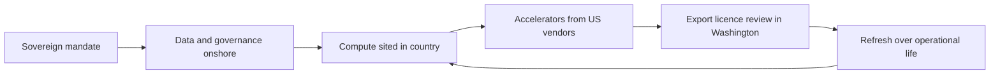

A trade-show floor I walked across in 2008 still occupies real estate in my head. London, BIA, the largest European banks negotiating with three American outsourcers for the right to run their core systems in datacentres outside the EU. The conversation was about cost. The phrase nobody used out loud was "sovereignty." Eighteen months later Lehman fell, governments wrote large cheques to those same banks, and within five years the regulatory letters started arriving asking exactly where the systems lived. The phrase appeared. It has been gathering force ever since.

I think about that floor a lot in 2026, because the same pattern is replaying with AI infrastructure, only faster, and with the regulatory letters arriving before the cost narrative has finished telling itself.

## Notes from a Brussels reading on May 7

On 7 May 2026, the Council of the European Union and the Parliament reached a political agreement on what is being called the AI Omnibus, a substantial rewrite of the AI Act's enforcement clock. [The Council's own press release](https://www.consilium.europa.eu/en/press/press-releases/2026/05/07/artificial-intelligence-council-and-parliament-agree-to-simplify-and-streamline-rules/) frames it as "simplification." The trade press, including [a clean writeup from Latham & Watkins](https://www.lw.com/en/insights/ai-act-update-eu-resolves-to-change-rules-and-extend-deadlines) and [a useful breakdown by DLA Piper](https://knowledge.dlapiper.com/dlapiperknowledge/globalemploymentlatestdevelopments/2026/The-Digital-AI-Omnibus-Proposed-deferral-of-high-risk-AI-obligations-under-the-AI-Act), reads it as a deferral: high-risk AI systems embedded in regulated products now have until 2 August 2028 to comply, the national sandbox deadline slides to 2 August 2027, and the General-Purpose AI rules are kept in their original shape. The Code of Practice on synthetic-content marking, meanwhile, is being tightened. The grace period for AI-generated-content transparency was cut from six months to three, with the new effective date set at 2 December 2026.

What stayed in is what matters. The 2 August 2026 enforcement powers for the Commission over GPAI providers (the date the AI Office gets to issue formal information requests, order recalls, and impose fines) were not touched. [The Commission's own implementation timeline](https://ai-act-service-desk.ec.europa.eu/en/ai-act/timeline/timeline-implementation-eu-ai-act) still names that date. Eleven weeks from when I am writing this, the Commission will have teeth.

What happened on May 7 was a re-sequencing. The hard, slow, downstream high-risk-product obligations get more time. The fast, upstream GPAI obligations stay on the original clock. Anyone reading this as a regulatory retreat is misreading it. Europe still intends to police the foundation models, and is being more honest about the realistic readiness of every regulated product underneath them.

## what Delhi just bought and from whom

Roughly three months earlier, [G42 of Abu Dhabi announced, alongside India's C-DAC and MBZUAI](https://www.g42.ai/resources/news/uae-deploy-8-exaflop-supercomputer-india-strengthen-local-sovereign-ai-infrastructure), that it would build an 8 exaflop supercomputer inside India under Indian governance, with data residency required to stay onshore. [Cerebras supplies a substantial part of the silicon](https://techcrunch.com/2026/02/20/uaes-g42-teams-up-with-cerebras-to-deploy-8-exaflops-of-compute-in-india/). At the India AI Impact Summit that ran a few weeks later, BharatGen rolled out Param2, [a 17-billion-parameter multilingual mixture-of-experts model built on the NVIDIA software stack and infrastructure](https://www.business-standard.com/technology/tech-news/india-ai-impact-summit-2026-sovereign-models-sarvam-bharatgen-gnani-126021900417_1.html).

The compute sits under Indian governance. The chips come from Sunnyvale, Cupertino, and Santa Clara via an Emirati intermediary. The model is "sovereign" in name and weights; the toolchain has the same American genealogy as anything that runs on AWS in Northern Virginia.

This is what I call **geopatriation**: the localisation of cloud and AI workloads under sovereign pressure, accompanied by the quiet recognition that the underlying silicon supply chain has not been localised at all. It is the dominant pattern in 2026, and it is honest if you look at it squarely. The Indian government's posture is that data should not leave the country and that governance should sit in Delhi; the posture is not that every transistor must be fabricated in Hyderabad. Saudi Arabia's HUMAIN, the UAE's MGX and Mistral's [own sovereign-compute pitch](https://mistral.ai/news/mistral-compute) to European customers are versions of the same arithmetic.

I am sympathetic to it. I do not believe a country needs to fab its own GPUs to have sovereignty over its AI. I do believe a country needs durable supply contracts, residency control, and the legal right to inspect. That is what Delhi negotiated. For anyone on the receiving end of one of these deals, the constraint worth tracking is the export-license switch in Washington. Chip count is the easy part.

## Washington still has the dimmer switch

As of 15 January 2026, [the Bureau of Industry and Security made its revised license-review policy for advanced AI chips to China formal](https://www.morganlewis.com/pubs/2026/01/bis-revises-export-review-policy-for-advanced-ai-chips-destined-for-china-and-macau): H200-class and AMD MI325X-class parts became reviewable case-by-case rather than presumptively denied, subject to security and supply-chain conditions. By February, [CNBC was reporting](https://www.cnbc.com/2026/02/26/nvidia-china-chip-sales-export-controls-ai-competition.html) that NVIDIA still had not actually shipped its US-approved China parts even though approvals were available, because local Chinese rivals were beginning to win bids in the gap. The current arrangement, [as Tom's Hardware summarised in March](https://www.tomshardware.com/tech-industry/semiconductors/nvidia-prepares-h200-shipments-to-china-as-chip-war-lines-blur), has NVIDIA preparing roughly 82,000 H200s for China subject to a 25% export tax, a structure announced after the Trump administration revisited the policy in late 2025. NVIDIA's number, not mine; treat the volume as a planning figure rather than a settled outcome.

I have spent thirty years selling, deploying, and unwinding cross-border technology arrangements, and I cannot remember a regime quite like this. It is not a ban. It is not a free market. It is a metered valve with a tax. The valve is being adjusted quarterly by political actors in response to negotiations on tariffs, agricultural exports, fentanyl precursors, and the rare-earth supply chain. Treating the rate of flow through the valve on 18 May 2026 as the rate of flow on 18 May 2027 assumes a single White House policy holds through a year of bilateral trade negotiations. I would not plan on it.

The corollary is that the same valve sits between G42's Indian supercomputer and the chips it will need to refresh over its operational life. The Council on Foreign Relations laid out [the durability case for export controls](https://www.cfr.org/articles/chinas-ai-chip-deficit-why-huawei-cant-catch-nvidia-and-u-s-export-controls-should-remain) earlier this spring; the posture in Washington keeps oscillating, and nothing in it trends toward openness. India sits on the permitted side of that valve today. India could sit on a more constrained side of it tomorrow.

## A note from a CTO conversation last Friday

A CTO at a European telco asked me bluntly, over coffee in Frankfurt last week, whether the right move for his AI workloads in 2026 is the sovereign-EU stack or the hyperscaler equivalent in a designated EU region. He had a vendor pitching him a French sovereign-compute build-out, and an American hyperscaler with a "sovereign cloud" SKU that is, in practice, the same data centres with different legal entities and different audit logs. He wanted to know which I trusted.

My answer was that he was asking the wrong question. The choice that matters in 2026 is which set of clauses he can get in writing. Specifically: a contractual right to a frozen model snapshot, a defined chain-of-custody on his weights, residency that survives mergers and political shifts, and an exit plan that is engineering-real rather than legally-real. The vendor wrapper is downstream of that. A "sovereign" badge that does not survive a US chip-license renegotiation is theatre.

He did not love the answer. He took it.

## Notes for the board pack

Put the 2 August 2026 GPAI deadline on the risk register at the same severity as a major audit milestone. Stress-test the chip-supply assumption in every sovereign-AI partnership by asking what happens if the US export valve closes by half in twelve months. Keep data sovereignty, weight sovereignty and compute sovereignty separate in the language. Those are three different problems with three different ledgers. And refuse to sign any sovereign-AI deal where the residency, audit and exit clauses are weaker than what you would demand from a generic cloud contract.

None of that is exciting. None of it makes a press release. It is the unromantic discipline that survives contact with regulators and trade officials at the same time.

The trade-show floor in London in 2008 ended up being the place I learned that "where the systems live" eventually becomes a board-level question, whether the participants want it to or not. The Brussels-Delhi-Washington triangle in May 2026 is the same floor, with bigger machines and harder politics. Anyone telling you the geography no longer matters because the model is open-weights is selling you a slide. Anyone telling you the geography is the only thing that matters is selling you a different slide.

The truth is in the clauses. It always was.

* * *

*Tarry Singh is the founder and CEO of* [*Real AI*](https://realai.eu)*, an enterprise AI advisory and deployment firm working with global enterprises on production agent systems, model risk, and AI sovereignty strategy. He also leads* [*Earthscan*](https://earthscan.io) *for remote sensing and environmental monitoring, and is a founding contributor to the EU-funded HCAIM and PANORAIMA programmes for responsible AI education across European universities. He writes at tarrysingh.com.*
