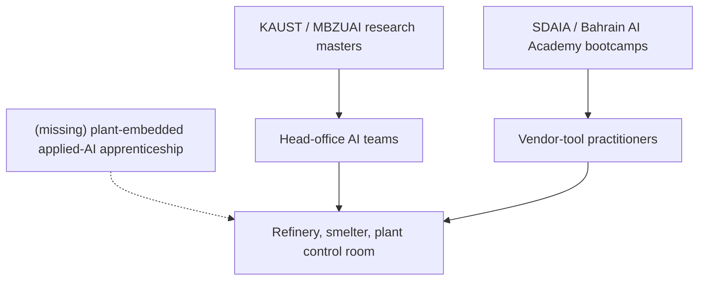

# The Gulf's Industrial AI Curriculum Is Missing Its Middle Rung

The instructor is at a portable whiteboard on the mezzanine, one flight above the distillation-tower control room. Below him the panel is doing what it has always done: the same operators tracking the same pressures, the same temperatures, the same handful of setpoints that keep the tower behaving. Above him, four rows of hard hats are trying to work out what a token is.

That mezzanine is where the industrial workforce meets whatever the head office has decided the next skill layer will be. This year, across the Gulf's flagship industrial operators, that layer is artificial intelligence, and the plans on file to deliver it are unusually specific.

## The commitments, on paper

The primary artefacts are worth reading in order. On [12 February 2026 Aramco signed a non-binding MoU with Microsoft](https://www.aramco.com/en/news-media/news/2026/aramco-signs-mou-with-microsoft-to-help-advance-industrial-ai-and-digital-talent-transformation), scoping four workstreams that include workforce development in AI engineering, cybersecurity, data governance and product management. That sits on top of an earlier public commitment [Aramco chief technology officer Ahmad Al-Khowaiter set out at LEAP 2025](https://www.aramco.com/en/news-media/speeches/2025/remarks-by-ahmad-al-khowaiter-at-leap-2025): the company will put more than 6,000 AI developers through advanced degree programmes with Imperial College, Caltech and KAUST.

Then on [12 May 2026 EDGE Group and ADNOC signed their own MoU](https://www.zawya.com/en/press-release/companies-news/edge-and-adnoc-partner-to-advance-strategic-capability-development-ft3cfc4a), extending an earlier BRIDGE-run capability programme that had already put 450 ADNOC employees through AI, leadership and data-driven decision-making training. On [29 June 2026 the Saudi Data and Artificial Intelligence Authority opened its summer intake](https://www.spa.gov.sa/en/N2623645): 215 students from 28 Saudi universities, in Riyadh, on a bootcamp-shaped programme in data science and applied AI.

The shape is coherent. The Gulf's two flagship industrial operators are putting budget behind a workforce transition, and the state academies are feeding a pipeline into it. Nothing here is a press release without a signature underneath.

## The 47-initiative view

The most careful audit I have found is a peer-reviewed study in Nature's *Humanities and Social Sciences Communications*, ["Artificial Intelligence and the Gulf Cooperation Council workforce"](https://www.nature.com/articles/s41599-025-05984-5), published in the September 2025 issue. The authors compile an inventory of 47 publicly disclosed AI initiatives across Saudi Arabia, the UAE, Qatar, Kuwait, Bahrain and Oman, dated January 2017 through April 2025. Of those 47, they judge 34 (about 72%) to exhibit joint social-technical design, meaning the initiative deliberately pairs a technology stack with a skills pipeline rather than compute-buying alone. Country-level indices run 0.57 to 0.90. Skills pipelines dominate the sample: specialist master's programmes at KAUST and MBZUAI on one end, SDAIA bootcamps and Bahrain's polytechnic-linked AI Academy on the other.

That is the honest, well-methodologised optimistic reading. Its closing warning is a two-track observation, worth quoting: "an emerging two-track talent system, research elites versus rapidly trained practitioners, that risks labor-market bifurcation without bridging mechanisms." The paper credits the initiatives. Its point is that they collectively build the top and the bottom of an industrial skills ladder and leave the middle to figure itself out.

## Where the paper stops short

A refinery, a petrochemical plant, an aluminium smelter, a fertiliser complex, the machinery that actually earns the Gulf's non-hydrocarbon diversification revenue does not need a KAUST master's holder standing next to the distributed control system. It needs someone who can sit next to a thirty-year operator and translate an anomaly-detection alert into a valve turn, a maintenance ticket, or a shutdown call. That person sits between the elite researcher and the bootcamp graduate: a maintenance engineer with data literacy, or a data scientist with plant instincts. Neither existing track produces them at any useful scale.

The [World Bank's December 2025 Gulf Economic Update](https://www.worldbank.org/en/news/press-release/2025/12/04/gcc-economies-demonstrate-resilience-advance-diversification-and-accelerate-digital-transformation) records the region's diversification momentum with satisfaction. It reads as accurate on the top-line and incomplete on the mechanics. The GCC is buying compute at hyperscale. It has, in MBZUAI, a serious research university, and in SDAIA an increasingly serious training authority. What it does not yet have, in the visible plan documents published across the last two years, is a systematic middle-tier programme: the industrial equivalent of a two-year applied-AI apprenticeship, embedded in a working plant, with rotations through operations, maintenance and safety.

That gap will be most expensive where the value is highest. Aramco's downstream refining and petrochemical footprint, ADNOC's upstream and gas-processing operations, Ma'aden's phosphate and aluminium complexes, SABIC's cracker network: these are the sites where a single reliably interpreted anomaly-detection alert can be worth more per shift than a bootcamp cohort produces per year. The industrial-AI ROI does not sit in the training suite. It sits at the DCS console at 3am.

## What a middle-tier programme would look like

A useful comparison sits in Europe. The [World Economic Forum's Future of Jobs Report 2025](https://reports.weforum.org/docs/WEF_Future_of_Jobs_Report_2025.pdf) tracks, across 55 economies, the mismatch between what employers say they need and what training systems supply. 63% of employers name skills gaps as the single largest barrier to business transformation, and that gap sits inside the middle tier almost everywhere it is measured. In the Gulf industrial context it is compounded by a specific problem: the operator population Aramco and ADNOC are asking to reskill is largely mid-career, largely male, largely accustomed to a shift-work rhythm that a university lecture theatre does not respect and cannot absorb.

A middle-tier programme built for that reality would look closer to a German Meister apprenticeship than to either KAUST or SDAIA: three years, plant-embedded, alternating classroom weeks with operations weeks, taught by a mix of industrial trainers and applied researchers, credentialing an occupational category rather than a degree. The curriculum I would design starts with statistical process control taught at the DCS the operator actually uses, rather than at a Kaggle notebook. Then time-series and anomaly-detection intuition built on the plant's own historian data, with failure modes drawn from its own incident register rather than a generic MOOC dataset. Then a governance thread that teaches the operator when to override the model, when to page the vendor, and when to shut down the unit, because industrial safety cases do not survive an operator who has learned to defer. The governance thread is the part every existing Gulf programme I have read appears to skip, and the part the plant floor cannot function without.

In Europe, the HCAIM programme and its follow-on PANORAIMA have been assembling parts of that machinery for the pan-European AI-teaching community. What the Gulf industrial operators need is the manufacturing-specific version of it, delivered in Arabic and English, on-site, at plant cadence, with the certificate owned by the operator rather than by the vendor whose tool they were taught on.

## The counter, engaged

The strongest counter comes from the Nature paper's own optimism about country-level indices. If Bahrain scores 0.57 and MBZUAI-anchored UAE programmes cluster higher, one reasonable reading is that the middle tier will fill itself as vendor-led certification programmes proliferate and as the Microsoft-Aramco talent workstream cited above matures. The reading is coherent. It is also, I think, wrong. Vendor certifications solve the "does this employee know Azure ML Studio" problem. They do not solve the "does this employee know when to trust a soft-sensor prediction on a corroded distillation column" problem, which is the real constraint on industrial-AI value capture in the Gulf. The literature the Nature authors themselves cite, WEF numbers on skills-gap complaints and IMF work on emerging-economy AI exposure, is consistent with that reading rather than against it.

## The number

400 and fifty. That is the count of ADNOC employees the [May 2026 EDGE announcement discloses](https://www.zawya.com/en/press-release/companies-news/edge-and-adnoc-partner-to-advance-strategic-capability-development-ft3cfc4a) as put through the previous BRIDGE capability programme in full, before the new MoU was signed. It is the largest demonstrated, disclosed, employer-run industrial-AI reskilling cohort I can find anywhere in the Gulf. The rest, for now, is on the whiteboard.

---

*Tarry Singh is the founder and CEO of [Real AI](https://realai.eu), an enterprise AI advisory and deployment firm working with global enterprises on production agent systems, model risk, and AI sovereignty strategy. He also leads [Earthscan](https://earthscan.io) for Energy AI startup, and is a founding contributor to the EU-funded HCAIM and PANORAIMA programmes for responsible AI education across European universities. He writes at tarrysingh.com.*
