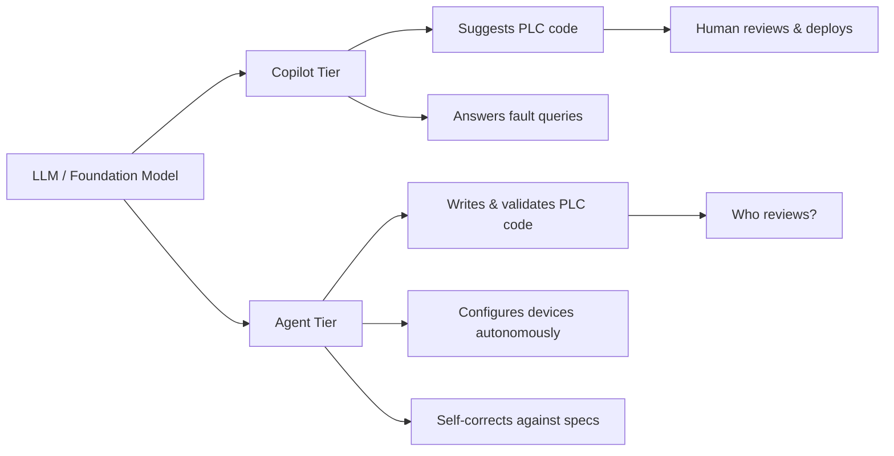

Hannover Messe closed on 24 April. Five weeks later the vendor dust has settled, and something genuinely structural is visible underneath the usual press-release avalanche. "AI is coming to manufacturing" has been doing the rounds since 2017 and was not the news. The theme this year is that the copilot era on the factory floor is already forking into two camps: vendors who still sell advisory suggestions, and vendors who now claim autonomous execution. That fork matters enormously, and I'm not sure the market is pricing it correctly.

## 1. Siemens draws the line: from copilot to agent

On 21 April, Siemens launched the Eigen Engineering Agent at Hannover Messe 2026, a purpose-built AI for automation engineering, now generally available. Unlike typical copilots, it uses multi-step reasoning and self-correction to carry out tasks autonomously.

The agent operates inside real engineering systems with full awareness of each project's context and constraints, executing tasks like PLC coding, HMI visualisation, and device configuration while meeting industrial standards for correctness, safety, and reliability.

Siemens's claimed numbers: 2–5× faster execution, up to 50% higher engineering efficiency, and up to 80% improvement in solution quality.

 Those are vendor figures. I doubt the upper bounds hold across brownfield sites with legacy ladder logic from 2003 and undocumented German-language code comments. But even at half the claimed gains, this is a structural shift.

Siemens piloted the Eigen Engineering Agent with over 100 companies in 19 countries.

US-based Prism Systems used it to create, modify, and import SCL code, reducing the process to seconds.

A large automotive line builder found that new engineers spent weeks learning project structure and component relationships; with Eigen, new team members could query the project directly ("Show me all blocks controlling Station 3"), and onboarding time dropped from weeks to days.

The product is available now to over 600,000 users of Siemens' TIA Portal through the [Siemens Xcelerator](https://press.siemens.com/global/en/event/siemens-hannover-messe-2026) portfolio. 

The launch forms part of Siemens' €1 billion investment in industrial AI.

Vasi Philomin, Siemens' EVP of Data & AI, framed it bluntly: "This product signals a fundamental shift, away from AI that merely makes suggestions, toward AI that actually does the work."

 That is a strong claim and a strong liability posture. When an AI agent autonomously writes your PLC code and something goes wrong on a €40 million filling line at 03:00, who holds responsibility? Siemens has not, to my knowledge, published a formal liability framework for Eigen-authored code deployed in safety-critical loops. Any company adopting this should have that document in hand before rollout.

## 2. The supporting cast: Bosch, Schneider, Beckhoff

Siemens was not alone. The concentration of announcements at Hannover Messe on 20–24 April was remarkable.

**Bosch** expanded its [Manufacturing Co-Intelligence®](https://www.bosch-presse.de/pressportal/de/en/press-release-282369.html) portfolio around agentic AI for production. 

This is Bosch's approach to combining human judgement, existing production systems, and agentic AI on a shared data foundation at an industrial scale. It covers daily shopfloor decisions through to full traceability across the product lifecycle.

Bosch claims a single agentic use case in a plant can achieve annual savings of almost €1 million, with broader rollouts yielding productivity gains of 5–15% and cost cuts of 10–30% in specific areas.

 Bold numbers. I note they say "can achieve" and "specific areas". That is marketing-grade hedging.

**Schneider Electric** unveiled agentic manufacturing capabilities [powered by Microsoft Azure AI](https://windowsforum.com/threads/schneider-electric-and-microsoft-push-agentic-manufacturing-with-industrial-copilot.413759/). 

The company says its industrial copilot can cut engineering time by up to 50% and compress production changes from weeks to hours.

**Beckhoff** showed [TwinCAT CoAgent](https://www.beckhoff.com/en-us/company/press/beckhoff-facilitates-physical-ai-2026-02.html), where the ATRO modular industrial robot is programmed and controlled via voice commands, built on the Model Context Protocol (MCP), translating spoken instructions into machine commands, orchestrating path planning, and performing diagnostic tasks.

 Hans Beckhoff's quote was characteristic: "We are moving AI away from chat windows and directly into machines and enabling language models to access the real world of controls through new standards such as MCP."

## 3. Humanoids on the factory floor: real metrics, real limits

The most photogenic announcement was the [Siemens–NVIDIA–Humanoid trial](https://press.siemens.com/global/en/pressrelease/siemens-and-humanoid-bring-physical-ai-factory-floor-deploying-humanoids-industrial) at Siemens' electronics factory in Erlangen. 

Humanoid's HMND 01 Alpha wheeled model, built on NVIDIA's physical AI stack, autonomously handled tote-destacking tasks for over 8 hours, reaching a throughput of 60 container moves per hour and a pick-and-place success rate above 90%.

90% sounds impressive until you consider what the other 10% means on a live production line. 

The trial ran for two weeks in January 2026 ahead of the April announcement.

 Two weeks is a trial, not a deployment. 

Simulation-first hardware design enabled the team to cut prototype development from 18–24 months to just 7 months. That compression is the real result here, and it speaks more to NVIDIA's Omniverse value proposition than to the humanoid form factor itself.

I doubt humanoids become the dominant factory robotic form within five years. Wheeled platforms with articulated arms (exactly what the HMND 01 actually is, marketing notwithstanding) are the pragmatic path. The humanoid framing is investor theatre.

## 4. The real gap: data governance on the shop floor

Microsoft's overarching message at Hannover Messe was "[Industrial Intelligence Unlocked](https://www.microsoft.com/en-us/microsoft-cloud/blog/manufacturing/2026/04/16/industrial-intelligence-unlocked-microsoft-at-hannover-messe-2026/)". 

In 2026, the primary constraint for many manufacturers will be organisational readiness: the ability to share data responsibly, collaborate across silos, and build AI literacy.

 That's Microsoft admitting, politely, that the tech is ahead of the customers.

Every vendor I've spoken to in the past month tells the same story off the record: the models work, the shopfloor data doesn't. OPC-UA endpoints exist but are misconfigured. Historian databases are siloed. Tag naming conventions change between shifts. The unsexy work of data plumbing remains the binding constraint. 

A rule of thumb from the scaling literature is the "10–20–70 rule". Roughly 10% of success comes from algorithms and 20% from technology and data foundations. The remaining 70% comes from people and processes.

That ratio explains why Apple launched its [Manufacturing Academy](https://www.apple.com/newsroom/2026/05/apple-manufacturing-academy-accelerates-ai-use-in-us-supply-chains/) with Michigan State University. 

The free programme pairs Apple engineers and MSU experts with small- and medium-sized US businesses to help them implement AI and smart manufacturing techniques.

To date, it has supported more than 150 American businesses through dozens of free in-person training sessions.

 150 businesses is modest. Even so, Apple is treating AI in manufacturing as a people problem before a technology problem.

## The boundary between suggesting and executing

The fork between copilot and agent is the right framing for the next two years of industrial AI. Siemens and Bosch are explicitly crossing the line from "the AI suggests" to "the AI executes." Schneider and Beckhoff are close behind. That boundary carries engineering liability, regulatory exposure under the EU AI Act's high-risk classification for safety components, and a workforce trust deficit that no demo at a trade fair can resolve.

If you run a factory and a vendor tells you their agent will write your PLC code autonomously, put the questions to them plainly. What is the formal verification step? Who holds liability for agent-authored logic in a safety-instrumented system? Can the agent's reasoning be audited end-to-end by your own engineers? Until those answers are crisp, the sensible move is to deploy agents on non-safety-critical workflows (documentation, configuration search, HMI layout) and keep humans in the loop for everything that can cause harm.

The technology is real. The governance is not yet.

---

Tarry Singh is the founder and CEO of Real AI (realai.eu), an enterprise AI advisory and deployment firm working with global enterprises on production agent systems, model risk, and AI sovereignty strategy. He also leads Earthscan (earthscan.io) for Energy AI, and is a founding contributor to the EU-funded HCAIM and PANORAIMA programmes for responsible AI education across European universities. He writes at tarrysingh.com.
