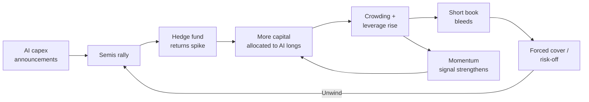

Goldman Sachs's latest *Hedge Fund Trend Monitor*, published on 22 May 2026, reads less like a positioning report and more like a confession. 

The report covers 1,059 hedge funds with $4.6 trillion in gross equity positions. It shows that funds lifted their net tilt to the Information Technology sector by +853 basis points, the largest quarterly increase to the sector on record.

 That is a stampede.

I've watched hedge funds chase themes for three decades. Telecom build-out in 1999. Commodity supercycle in 2007. Cloud multiples in 2020. Every time, the same playbook: concentration disguised as conviction. And every time, the crowd forgets that when everyone is in the same trade, the question stops being *will it work?* and becomes *who gets out first?*

## The numbers, cold

The headline figure is semiconductor weight. 

Hedge funds entered Q2 2026 with a record 10 per cent portfolio weight in Semiconductors, while their 6 per cent weight in Software marks the lowest since 2019.

 Two-to-one, hardware over software, at a time when the actual enterprise consumption story is deeply ambiguous.

The largest increases occurred in Semiconductors (+428 bp), Systems Software (+167 bp), Tech Hardware (+147 bp), and Application Software (+133 bp).

 Those sub-sector moves tell you exactly where fund managers believe AI value accrues: in silicon rather than the application layer.

Among the companies seeing the biggest rise in hedge fund popularity were Lam Research, Applied Materials, Analog Devices, Micron Technology and Intel.

 Three of those are fab equipment or memory, the picks-and-shovels play pushed to its logical extreme. 

The most popular long positions within Info Tech have returned 62 per cent year-to-date, according to Goldman. That is a number vendors will quote and realists should interrogate.

Mega-cap technology companies continue to dominate hedge fund portfolios, with Amazon, Nvidia, Alphabet, Microsoft and Meta Platforms emerging as the top five hedge fund long positions.

 Eight of the top ten VIP positions appear to be AI-related, per the FT's read of the chart. 

The typical hedge fund now holds 72 per cent of its long portfolio in its top 10 positions.

Seventy-two per cent. That is a concentrated bet with a compliance wrapper around it.

## Where the tension lives

Short interest for the median S&P 500 stock has risen to 3 per cent of market cap, the highest level since 2011.

 And gross leverage ranks in the 94th percentile versus the last five years.

So the picture is: long AI semiconductors at record weight, short everything else at post-GFC highs, on leverage that's higher than nearly any period in recent memory. That is a one-way bet funded with borrowed money. If you've been around long enough, you've seen how those end.

Reuters reported in February 2026 that hedge funds suffered their worst trading day in nearly a year as technology stocks sold off sharply, with Goldman describing the move as a momentum event where funds rushed to exit concentrated long positions.

 That was just a dress rehearsal. The AI trade then was smaller than it is now. The leverage was lower. The crowding was less extreme.

BlackRock flagged exactly this in its Spring Hedge Fund Outlook. 

What appears to be diversified exposure across dozens, or even hundreds, of portfolio managers may, under stress, behave like a single crowded trade.

 That warning was issued in April 2026. Six weeks later, the crowding metrics are *worse*.

## The SaaSpocalypse and the ETF tell

The flip side of the semiconductor mania is what's happened to software. 

Software & Services as an industry group is down 14 per cent year-to-date. Semiconductors & Semi Equipment are up 38 per cent YTD and have surged 104 per cent in the past year.

Roughly $2 trillion in software market cap has been wiped out over the past twelve months in what Jefferies traders labelled the "SaaSpocalypse."

The irony is thick. Hedge funds are buying the infrastructure that powers AI while the actual software companies that *consume* that infrastructure (the application layer) are getting re-rated downward. 

The cause is a fundamental reassessment of where AI value actually accrues. The answer the market keeps giving sits upstream of the application layer.

 I doubt that consensus hardens into permanence. Somebody has to monetise inference at the point of business process. The picks-and-shovels thesis works until the gold rush slows.

Meanwhile, 

Uber's COO Andrew Macdonald recently admitted on the *Rapid Response* podcast that the firm can't draw a clear line between rising Claude Code usage and consumer-facing innovation, after burning through its entire 2026 AI coding-tools budget in just four months.

 If the largest consumers of AI compute are struggling to show output, maybe the infrastructure-spend forecasts that underpin the semiconductor trade deserve more scrutiny than they're getting.

Then there's the ETF signal Goldman flagged. 

The 4.9 per cent ETF share of hedge fund long portfolios represents the highest level since the GFC.

 Hedge funds (the people paid 2-and-20 to pick stocks) are buying S&P 500 index funds at a rate last seen in 2008. That says plenty about their stock-picking confidence outside the mega-cap tech basket.

## Questions for an allocation committee

**How correlated is your manager roster?** If your five "diversified" hedge fund allocations are all long Nvidia, AMAT, LRCX, and short software, you don't have five managers. You have one trade with five fee layers.

**What happens to AI capex when the demand side disappoints?** 

The key risk is that AI spending slows or a major customer cuts capex, causing earnings to miss and hedge funds to unwind crowded long positions fast.

 Hyperscaler capex guidance is already doing enormous work holding up the entire semiconductor thesis. One bad quarter from Microsoft or Meta and the reflexive loop reverses.

**Who owns the short book pain?** 

U.S. equity hedge funds have returned 7 per cent year-to-date through 21 May, which sounds decent until you realise the S&P 500 is roughly flat and the Mag-7 are carrying the index. The longs are working. The shorts are bleeding. That's survivable right up until it isn't. "Right up until it isn't" is a phrase I associate with late-cycle positioning.

## Thesis and price

The hedge fund industry has made a record, leveraged, concentrated, one-directional bet on AI infrastructure at precisely the moment when crowding measures are flashing amber. The underlying thesis (that AI compute demand will grow for years) is probably correct. But "probably correct thesis" and "good risk-adjusted trade at current positioning" are not the same sentence. Ask anyone who was long fibre-optic cable in March 2000 whether the *thesis* was wrong. It wasn't. The *price* was.

I doubt the current semiconductor weighting survives the next serious vol event intact. The AI build-out is real. The trouble is that 1,059 funds simultaneously deciding the same sub-sector is the only trade worth owning is the textbook definition of a crowded exit in formation.

The trade has worked. That's the problem.

---

Tarry Singh is the founder and CEO of Real AI (realai.eu), an enterprise AI advisory and deployment firm working with global enterprises on production agent systems, model risk, and AI sovereignty strategy. He also leads Earthscan (earthscan.io) for Energy AI, and is a founding contributor to the EU-funded HCAIM and PANORAIMA programmes for responsible AI education across European universities. He writes at tarrysingh.com.
