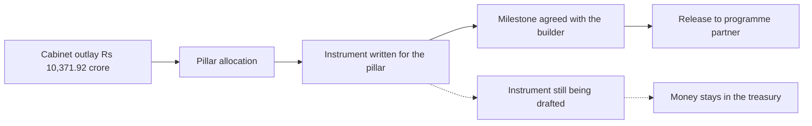

# IndiaAI's Absorption Ceiling

What does a mission look like on the day someone counts the money that has actually moved out the door? Announced outlays, published artefacts and hosted summits all measure something else. The measure here is the rupees that left the treasury and landed in the accounts of programme partners. Two years past Cabinet approval, the IndiaAI Mission is that test case.

The Cabinet [approved the IndiaAI Mission in March 2024](https://www.pmindia.gov.in/en/news_updates/cabinet-approves-ambitious-indiaai-mission-to-strengthen-the-ai-innovation-ecosystem/) with seven pillars (compute, foundation models, data platforms, startup financing, applications, skilling, safety) and a headline outlay of Rs 10,371.92 crore over five years. The Ministry of Electronics and Information Technology (MeitY) [operationalised the compute pillar quickly](https://www.pib.gov.in/PressReleasePage.aspx?PRID=2178092&reg=3&lang=2), running 3 GPU tenders and pushing empanelled capacity past 38,000 units at subsidised hourly rates. On the surface, the mission looks fast. The disbursement schedule tells a different story.

## The gap between the outlay and the release

[Takshashila's February budget note](https://takshashila.org.in/content/blogs/20260203_ai-mission-budget-analysis.html) laid out the arithmetic without garnish. FY2024-25 released Rs 21.79 crore against a revised estimate of Rs 173 crore. FY2025-26 released Rs 379.15 crore against a revised estimate of Rs 800 crore (itself already cut from a budgeted Rs 2,000 crore). The FY2026-27 allocation, reported by [Storyboard18 as a roughly 50% cut from the prior fiscal](https://www.storyboard18.com/digital/indiaai-mission-semiconductor-plans-face-scrutiny-over-budget-cuts-and-slow-execution-92512.htm), sits at Rs 1,000 crore in the underlying document that the Parliamentary Standing Committee on Communications and Information Technology examined this spring. The Committee's own reading, [summarised by PRS](https://prsindia.org/policy/report-summaries/impact-of-emergence-of-ai-and-related-issues), was that about 32% of the FY2025-26 revised-estimate stage funding had been spent.

| Fiscal | Budget estimate | Revised estimate | Actual released |
|---|---|---|---|
| FY2024-25 | n/a | Rs 173 crore | Rs 21.79 crore |
| FY2025-26 | Rs 2,000 crore | Rs 800 crore | Rs 379.15 crore (as of 9 Feb 2026) |
| FY2026-27 | Rs 1,000 crore | pending | pending |

Two years is early. That is the honest first caveat. A mission with a five-year window has time. And under-release is not the same problem as under-commitment: Rs 10,371.92 crore is still nominally on the table. But the shape of the mismatch matters. [MediaNama, reporting in April on the total released](https://www.medianama.com/2026/04/223-indiaai-mission-400-crore-over-rs-10000-crore-5-year-outlay-released/), noted that the pillar-level allocation puts Rs 4,563.36 crore against compute, Rs 1,971.37 crore against foundation models and Rs 1,942.5 crore against startup financing. That is where the promised money sits. The mismatch between that pillar map and the actual burn schedule is what the second half of the mission has to close.

## What the compute pillar has bought

Empanelment is a procurement act. Utilisation is an operational one. The IndiaAI Mission's own compute page [lists three tender rounds and a growing empanelled base](https://indiaai.gov.in/hub/indiaai-compute-capacity), and its most recent programme announcement said utilisation reports would follow "next quarter", a formulation that as of this week still meant next quarter. What the market can verify is that GPUs are being made available at Rs 115 to Rs 150 per GPU-hour, roughly 42% below prevailing commercial rates. What the market cannot verify, from published data, is how many of those units are being drawn on for how many hours per day by how many distinct workloads.

That gap is the difference between a compute pillar that is genuinely underwriting Indian AI development and one that is provisioning a strategic reserve. Both are legitimate policy choices. They imply different budgets, different depreciation profiles, and different narratives about what "sovereign compute" means in 2026. Without the utilisation reports, the government cannot fairly claim either outcome. Neither can its critics. A researcher at an IIT lab sitting on a partial GPU allocation lives inside that ambiguity every week.

[Business Standard, in late June](https://www.business-standard.com/technology/artificial-intelligence/india-ai-compute-race-subsidised-gpu-capability-gap-126062900734_1.html), made the strongest bull case going for the compute strategy: subsidised access lowers the cost of experimenting at scale, and cost of experimentation is what determines whether India produces a research base rather than importing one. That case is real. It is also the case that predicts the utilisation reports will show heavy, distributed use. If instead they show light use, or heavy use concentrated in a handful of well-connected teams, the bull case bends.

## The twelve foundation-model builds sit on partial cheques

MeitY [selected 12 organisations under the foundation-model call](https://www.medianama.com/2026/04/223-centre-funds-12-ai-projects-sovereign-models-bharatgen-4x-next-highest-allocation-rs-1000-crore/): the IIT Bombay-led BharatGen consortium, Sarvam AI, Soket, Gnani, Gan.AI, Avataar, GenLoop, Zenteiq, Intellihealth, Shodh AI, Fractal, and Tech Mahindra Maker's Lab. BharatGen received the largest allocation, Rs 1,058.52 crore, about 4x the next highest. Sarvam trained and open-sourced two models on IndiaAI Mission compute. BharatGen shipped Param2, a 17-billion-parameter multilingual mixture-of-experts model. These are real artefacts. They exist. They can be downloaded and evaluated.

Where the story gets uneven is the cheque. A commitment of Rs 1,058.52 crore does not mean Rs 1,058.52 crore has moved. It means the Ministry has agreed to move it against milestones over the life of the build. If the FY2025-26 disbursement across the whole mission was Rs 379.15 crore, the milestone-linked share flowing to any one foundation-model builder is a fraction of a fraction. The instruments being written to route that money (equity stakes in some cases, milestone-triggered grants in others, cloud-credit arrangements in others still) did not exist when the mission was announced. That is what the second half of the disbursement schedule will have to invent as much as execute.

Slow release is not, by itself, a failure of ambition. It is the outcome that follows when a fast policy commitment meets a slow disbursement machinery designed for a different era of technology procurement. The IndiaAI Mission was pledged in March 2024. The instruments needed to move money into 12 foundation-model builders, 3 GPU tenders, a data platform, a skilling programme and a safety institute (instruments that reconcile with the CAG, with the Public Accounts Committee, with the standing IT-department rules) do not exist off the shelf. They are being written now. That, more than anything, is why Rs 400 crore is the total for two years.

## Where the bull case still holds, and where it starts to bend

I will not overstate this. [ThePrint's opinion piece on India's AI mission "flying blind without technocrats"](https://theprint.in/opinion/indias-ai-mission-is-flying-blind-without-technocrats/2895578/) argues the problem is structural: that the mission's governance layer is thin, that empanelled hardware is a poor proxy for shipped capability, and that Indian frontier researchers are too few for the outlay to fully absorb even if the money flowed at target pace. The piece makes the case a technocratic mission board should answer publicly, and their public answer has not arrived.

The bull case survives that critique in one place: the compute pillar has, at least, established a set of facts on the ground that let subsequent policy iterate. Empanelled GPUs are visible. Rate cards are visible. Foundation models trained on them are visible. If the utilisation reports arrive, they will settle the question of whether the pillar is a research substrate or a strategic reserve, and either answer is more useful than the current ambiguity. A mission that has shipped visible artefacts in two years, even at 32% utilisation of its own revised estimate, has more optionality than a mission that has neither.

The bear case is not that the mission has failed. The balance sheet the IndiaAI Mission's second half will have to close is heavier than the announcement implied. The FY2026-27 budget is Rs 1,000 crore. To hit the five-year Rs 10,371.92 crore outlay from where the disbursement schedule sits today would require a step-change in release pace across every remaining year of the mission. It is not clear the machinery is ready for that step-change. If it does not arrive, the outlay will be trimmed, quietly, in successive budget notes, and the number the Cabinet approved in March 2024 will end up as an announcement figure rather than an execution figure. That is a specific kind of debt: the debt of headline commitments carried on the government's books at a face value the disbursement calendar cannot honour. It is a debt paid in credibility rather than rupees, and the state is the one that pays it.

## The question the mission still has to answer

If the utilisation reports arrive next quarter and show heavy, distributed use across dozens of research groups and startups, the story I have written here softens. If they arrive and show light use, or heavy use by a small handful of well-connected builders, it hardens. If they do not arrive at all, the ambiguity itself becomes the story.

Which of those three shows up in the next quarter's data?

I do not know. Reading the disbursement schedule as it sits today, I am not sure the mission does either. That is the sentence I would want a researcher at an IIT lab, waiting on a milestone-tied grant, to be told before they are asked to plan the next twelve months of a build.

---

*Tarry Singh is the founder and CEO of [Real AI](https://realai.eu), an enterprise AI advisory and deployment firm working with global enterprises on production agent systems, model risk, and AI sovereignty strategy. He also leads [Earthscan](https://earthscan.io) for Energy AI startup, and is a founding contributor to the EU-funded HCAIM and PANORAIMA programmes for responsible AI education across European universities. He writes at tarrysingh.com.*
