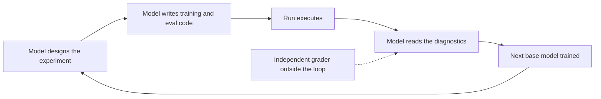

Karpathy Joins Anthropic, and the Training Loop Starts to Close

On 19 May 2026, Andrej Karpathy told the world he had joined Anthropic. He co-founded OpenAI, built Tesla's Autopilot and Full Self-Driving program, returned to OpenAI for a year, then left in 2024 to start Eureka Labs around AI tutoring. The move was covered within hours by [TechCrunch](https://techcrunch.com/2026/05/19/openai-co-founder-andrej-karpathy-joins-anthropics-pre-training-team/), [Axios](https://www.axios.com/2026/05/19/anthropic-openai-karpathy-andrej-claude) and [CNBC](https://www.cnbc.com/2026/05/19/anthropic-hires-openai-cofounder-andrej-karpathy-former-tesla-ai-lead.html), and read mostly as a talent-war headline. A prize researcher changed jerseys.

That reading holds up as far as it goes. It is also shallow. The sentence that matters sits in Anthropic's own description of the job. Karpathy joins the pre-training team under Nick Joseph and, in Anthropic's framing, will help build a group focused on using Claude to speed up pre-training research and experimentation. His own [note on X](https://x.com/karpathy/status/2056753169888334312) said he wanted to "get back to R&D." Put those together. A celebrated researcher's first assignment is to point the current model at the job of building the next one.

## The mandate is the story

Pre-training is the expensive part. It is the long base-model run that gives Claude its raw knowledge before any fine-tuning or alignment work happens on top. It is the most capital-intensive, least glamorous, hardest-to-iterate stage of the entire pipeline, and therefore the place where a faster feedback loop is worth the most money. Staffing a marquee hire there, with an explicit mandate to bring the model into the work, is a deliberate choice rather than a press-release flourish.

I want to be careful with attribution, because this is the part everyone will inflate. "Using Claude to speed up pre-training research" is Anthropic's phrasing, not a measured result. Nobody has published a number showing how much faster a frontier run gets when a model designs the experiments. Treat it as a stated intention and watch for the evidence.

It is not an isolated intention. In March 2026, [MIT Technology Review reported](https://www.technologyreview.com/2026/03/20/1134438/openai-is-throwing-everything-into-building-a-fully-automated-researcher/) that OpenAI has made an "automated researcher" a top priority. Chief scientist Jakub Pachocki described an autonomous research intern targeted for September 2026 and a full multi-agent research system aimed at 2028. [IEEE Spectrum](https://spectrum.ieee.org/recursive-self-improvement) tracks the same theme under an older and blunter name: recursive self-improvement. And a survey of 25 researchers across Google DeepMind, OpenAI, Anthropic, Meta and several universities found 20 of them naming the automation of AI research itself as one of the most severe near-term risks they could name ([arXiv preprint](https://arxiv.org/html/2603.03338)). The Karpathy hire is one lab staffing for a direction the whole frontier has already chosen.

## Why the economics make this hard to resist

Follow the money. [Epoch AI's cost work](https://epoch.ai/blog/how-much-does-it-cost-to-train-frontier-ai-models) puts the amortised cost of a frontier training run rising about 3.5x a year since 2020, a doubling roughly every seven months. A 2026-class run sits somewhere between $200 million and $500 million. The [underlying study](https://arxiv.org/abs/2405.21015) projects the largest runs past $1 billion by 2027.

The arithmetic is plain. Training used to cost millions, then tens and hundreds of millions. That trajectory is the reason the labs want models inside the research loop, and it owes nothing to science fiction. When one run costs $300 million, a failed experiment is a write-off rather than a learning opportunity. Anything that triages which experiments deserve compute, writes the training and evaluation code, and reads the diagnostics faster than a human team pays for itself the first time it works. The case for AI-accelerated research is a cost-control case before it is a capability case.

There is a speed claim folded in as well. A new model generation used to mean a wait measured in months: data assembled, runs scheduled, results argued over. Compress the experiment cycle and that wait shortens. Real, and worth taking seriously. The most excitable version of it imagines "templated" models you simply instruct into existence, preset architectures with the AI doing the rest. We are not there, and pretending otherwise helps no one. What is real is narrower and still consequential: the cycle time of an experiment is collapsing, and its cost is being attacked from the inside.

## The moat was never the credential

Here I part company with the most-quoted worry: that a PhD in machine learning was a moat, and an AI capable of doing the research dissolves it.

The credential was never the moat. Judgment is. The scarce thing is knowing which experiment is worth $300 million of compute, which evaluation measures the capability you care about rather than a flattering proxy for it, and what a genuine result looks like next to a merely plausible one. A model that writes excellent training code does not yet supply that.

I do not want to be glib, though, because something is disappearing, and the pay data shows the market has already worked out what. OpenAI is reported to offer base salaries up to $685,000 for research roles ([Seoul Economic Daily](https://en.sedaily.com/society/2026/02/26/openai-pays-up-to-685000-base-salary-in-ai-talent-war)); Meta's hiring run reportedly reached packages worth as much as $300 million over four years for a handful of individuals ([DeepLearning.AI's The Batch](https://www.deeplearning.ai/the-batch/metas-hiring-spree-raised-compensation-for-top-ai-engineers-and-executives)). Both figures come from parties with an interest in the headline, so treat them loosely. What they price is research direction. The far larger population who execute (run the sweep, clean the data, code the ablation) is exactly the tier an automated researcher absorbs first.

So a moat is eroding, and it is the mid-tier execution job that a PhD used to be a safe ticket into.

I doubt OpenAI's 2028 "fully automated research system" arrives on schedule. Roadmaps in this field slip, reliably. By 2027, though, I expect the median pre-training experiment to be designed, coded and triaged by a model, with a human signing off. Labs approving headcount this year should be defending the people who can tell a real result from a flattering one.

## Models trained by other models

The second danger is the quality and nature of models trained by other models. That is the part I take most seriously.

There is a well-evidenced failure mode. Recursive training on a model's own unverified output degrades it. The literature calls that model collapse. The [ICLR 2025 "Strong Model Collapse" work](https://arxiv.org/pdf/2410.04840) showed that a synthetic-data fraction as small as one part in a thousand can stall performance, and that larger models can amplify the effect rather than dampen it. More recent work on [escaping collapse through verification](https://arxiv.org/html/2510.16657v1) confirms the obvious counter: keep verified, human-grounded data and an independent check inside the loop.

Precision matters here. Using Claude to accelerate research is not the same act as training Claude on Claude's text. One is a colleague reading over your shoulder; the other is a photocopy of a photocopy. But the two blur at the edges, and that blur is the real exposure. When the model that designs the training signal, the model that runs the experiment and the model that judges the result all come from the same family, the independent grader is gone. Errors stop being caught because nothing outside the loop is positioned to catch them. [Sakana AI's "AI Scientist"](https://sakana.ai/ai-scientist-nature/), which produced a paper that cleared human peer review, is genuinely impressive and also a quiet warning: when an AI writes the paper and an AI reviews the paper, the peer-review signal itself decays.

This is the centaur-versus-autopilot choice, and it is a design decision rather than a prophecy. A centaur keeps a human (or at minimum an independent model lineage) outside the loop, grading. An autopilot lets the loop close on itself because that is cheaper. The cost curve pushes hard toward autopilot. Resisting that push is an engineering responsibility now.

## The grader outside the loop

The Karpathy hire is a real signal, and the honest version of it is neither the talent-war shrug nor the recursive-superintelligence panic. The research cycle is being compressed and partly automated. That is good for a cost curve that had become indefensible, and bad for anyone whose job was to execute experiments rather than choose them. Whether a model can help train the next model is settled; it visibly can, partially, today. The question worth holding a lab accountable on is whether anyone is still paid to stand outside the loop and grade what comes out. Keep that person funded. When that role gets automated too, start worrying.

* * *

*Tarry Singh is the founder and CEO of* [*Real AI*](https://realai.eu)*, an enterprise AI advisory and deployment firm working with global enterprises on production agent systems, model risk, and AI sovereignty strategy. He also leads* [*Earthscan*](https://earthscan.io) *for Energy AI startup, and is a founding contributor to the EU-funded HCAIM and PANORAIMA programmes for responsible AI education across European universities. He writes at tarrysingh.com.*
