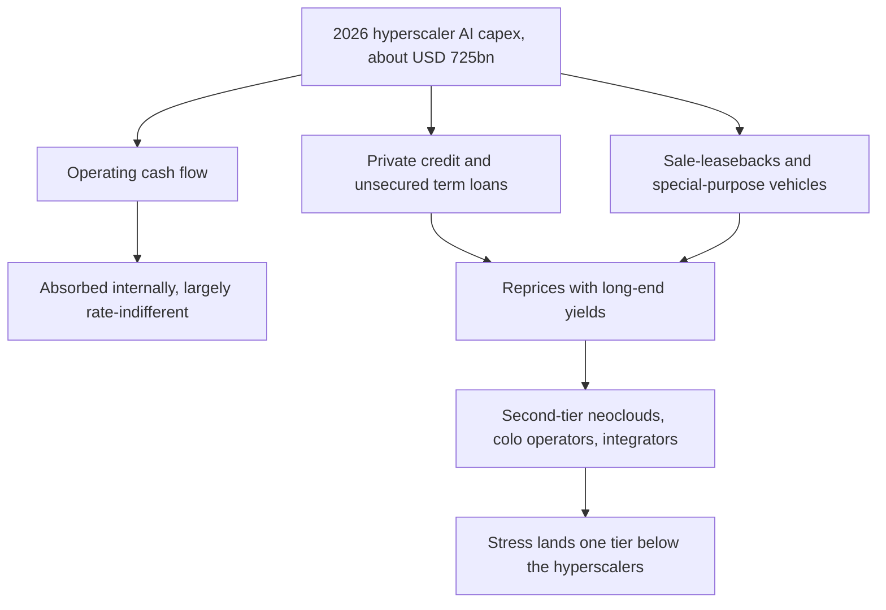

# The Money Stack Behind the Model Stack

The AI story most boards are still being told in 2026 is a productivity story. Knowledge work gets cheaper. Margins improve. Revenue follows. It is a clean story and it is mostly the wrong one to be looking at right now.

The story that matters in June 2026 is a balance-sheet story. Roughly $660 to $725 billion will be spent this year by the five largest US hyperscalers on infrastructure, depending on whose numbers you read. Tom's Hardware's compilation [puts it at $725 billion across Microsoft, Alphabet, Amazon, Meta and Oracle](https://www.tomshardware.com/tech-industry/big-tech/big-techs-ai-spending-plans-reach-725-billion), about a 77% jump from 2025. Goldman Sachs' baseline model [pegs total AI capex at $765 billion in 2026 and a projected $1.6 trillion by 2031](https://www.goldmansachs.com/insights/articles/tracking-trillions-the-assumptions-shaping-scale-of-the-ai-build-out). Morgan Stanley sees about $3 trillion of AI infrastructure investment flowing through the global economy by 2028, with more than 80% of that spend [still ahead of us](https://www.morganstanley.com/insights/articles/economic-outlook-midyear-2026). Those are construction budgets, and they are now large enough to move GDP. Morgan Stanley's research team attributes roughly a quarter of 2026 US growth to AI investment alone.

If you only watch the income statement, the AI cycle looks healthier than at any point in the last cycle. Nvidia just reported $81.6 billion in Q1 FY27 revenue, with $75.2 billion of that in Data Center, [up 92% year-over-year on its 8-K filing in May 2026](https://www.sec.gov/Archives/edgar/data/0001045810/000104581026000051/q1fy27pr.htm). GAAP margins of 74.9%. Eighty billion in fresh buyback authorisation. A quarterly dividend lifted from one cent to twenty-five. Spectacular by any measure. The problem is that nothing in Nvidia's quarter tells you who is going to pay for the data centres that will house the next generation of chips, or whether the depreciation cycle that flatters the buyer's income statement bears any resemblance to the real economic life of the asset.

**The depreciation argument has stopped being academic.**

Hyperscaler accounting still treats servers and AI hardware on five-to-six-year useful lives. Michael Burry has [made the case publicly](https://www.cnbc.com/2025/11/14/ai-gpu-depreciation-coreweave-nvidia-michael-burry.html) that this overstates profits across 2026 to 2028 by more than 20%, with the implied understatement of depreciation amounting to roughly $176 billion. Fortune [ran a longer version of the same argument in April 2026](https://fortune.com/2026/04/15/data-centers-hyperscalers-spending-billions-on-hardware-thats-worthless-in-3-years/) under the title that the hardware is "obsolete in three years." The pushback from the buy-side is genuine and worth respecting: each Nvidia generation is two-to-three times more efficient per watt than the last, but the prior generation does not vanish. It gets reassigned to latency-tolerant batch inference, retraining utility models, internal workloads. And there is a deep and growing market for cheap inference that a four-year-old H100 can serve perfectly well. That argument is a reasonable one. It is also not yet evidenced at any scale that would let a CFO sign off on the published useful lives without a deeper look. The honest position is that nobody has run a complete generation of accelerators through both halves of that life-cycle. The five-year number is a forecast, dressed up as an accounting policy.

My own reading, and I hold it loosely, is that the longer schedules do not survive an honest re-rating within the next eighteen months. The first time a major hyperscaler restates a single quarter to shorten useful lives by even a year, the read-through to consensus EPS will be severe. It does not need to take a default or a write-off. A pen-stroke is enough.

**Where the money actually comes from is starting to matter.**

The capex headline collapses three different funding sources into one number, and they are not interchangeable. Hyperscaler operating cash flow funds most of what Microsoft, Alphabet, Amazon and Meta spend. That money is real and largely indifferent to interest rates. Then there is the private-credit and lease-debt layer that is doing the heavy lifting outside the Magnificent Seven. SoftBank closed a [$40 billion unsecured loan led by JPMorgan](https://en.wikipedia.org/wiki/Stargate_LLC) to fund its OpenAI follow-on commitment to the Stargate joint venture. Oracle took roughly $14 billion from Pimco to fund its share of the same buildout. CoreWeave's [Q1 2026 8-K disclosures](https://www.sec.gov/Archives/edgar/data/0001769628/000176962826000220/coreweave1q26earningspress.htm) show tens of billions in lease commitments against a customer base concentrated in a small handful of names. When CNBC [reported on the OpenAI data-centre pivot in March 2026](https://www.cnbc.com/amp/2026/03/22/openai-data-center-pivot-underscores-wall-street-ipo-concerns.html), the concern raised by IPO-tracking analysts was exactly this: how much of the demand signal reflects independent end-user uptake, and how much is bilateral commitments between firms that already own pieces of each other.

Jensen Huang [called the circular-financing framing "ridiculous"](https://finance.yahoo.com/news/coreweave-ceo-calls-nvidia-circular-013121853.html), and his point is technically correct: Nvidia's $2 billion stake is small relative to the capital CoreWeave still has to raise externally. It is also beside the point. The risk in interlocking financing has little to do with any one firm propping up another. The risk is that the demand signal an outside observer reads off the system is partially recycled inside it, so when the writedown event arrives, if it arrives, the affected counterparties are correlated rather than diversified. You can hold both positions at once: Huang is not lying, and the broader concern is rational.

The other implication of the funding mix is one most analyst notes still understate. The portion of the $725 billion that sits inside hyperscaler balance sheets is genuinely insulated from short-term financial stress. The portion that sits in private credit, Pimco loans, sale-leasebacks, and special-purpose vehicles is not. If the cycle bends, it will not bend uniformly. It will bend at the second-tier neocloud, at the colo operator that financed its build at the top of the rate cycle, at the systems integrator that promised inference economics it could not actually meet. The Magnificent Seven will be fine through that. Their customers and counterparties may not be.

**The rate exposure that matters sits in the long end.**

A Federal Reserve Bank of Dallas paper from February 2026 [walked through the duration-supply consequences of AI debt financing](https://www.dallasfed.org/research/economics/2026/0210-searls-aifinancing) and argued that AI-related issuance has been large, concentrated in long maturities, and in some sense rate-insensitive because the underlying assets are long-lived and their economics do not vary with the business cycle. That is the optimistic reading. The Fed's own [May 2026 Financial Stability Report](https://www.federalreserve.gov/publications/files/financial-stability-report-20260508.pdf) lists rising concentration of AI-linked credit among the items it is actively monitoring. The market view shifted in April 2026 when meeting minutes showed officials growing more worried that inflation would stay above target. Part of the reason, awkwardly, is that the AI build-out itself is pushing utility prices and memory chip costs higher.

For a CFO building an AI roadmap in mid-2026, the live rate question is what a 50 to 100 basis-point shift in long-end yields does to the marginal new data-centre project that requires eight-to-twelve-year financing against an asset depreciated in five. Whether the Fed cuts twice, once or not at all this year matters much less than that. The cheap math falls apart fast.

**What I'd watch over the next two quarters.**

Three specific tells. First, any hyperscaler that voluntarily restates GPU useful lives downward. That single action would re-price the entire cohort, because once one of them admits the assumption was generous, the others cannot keep theirs intact without explaining why their fleet ages differently. Second, the spread between Treasury yields and investment-grade AI-infrastructure debt. If it widens by more than 75 basis points without a corresponding move in the Treasury curve, the credit market is repricing the cycle ahead of equity. Third, the lease structures at the Stargate-adjacent special-purpose vehicles. When you see lessors push for shorter terms or higher coverage ratios, the people closest to the assets have already decided what they think of the depreciation argument.

None of this is the case that the AI build-out is fake. The chips are real. The revenue is real. The productivity gains, where the workflow has actually been redesigned, are real. But productivity is the wrong frame for what is happening at the macro level right now. The macro level is a roughly seven-hundred-billion-dollar-a-year capex programme financed across three layers, depreciated on assumptions nobody has fully tested, and feeding back into rate expectations that the policymakers themselves are still learning how to model. It deserves the same scepticism a board would bring to any capex cycle of this size. Telling each other about the productivity story without pricing the balance-sheet risk is exactly the move we made in 2007 about housing, and in 2000 about telecom dark fibre. The mechanism is different. The form of the mistake is not.

---

*Tarry Singh is the founder and CEO of [Real AI](https://realai.eu), an enterprise AI advisory and deployment firm working with global enterprises on production agent systems, model risk, and AI sovereignty strategy. He also leads [Earthscan](https://earthscan.io), an Energy AI startup, and is a founding contributor to the EU-funded HCAIM and PANORAIMA programmes for responsible AI education across European universities. He writes at tarrysingh.com.*
