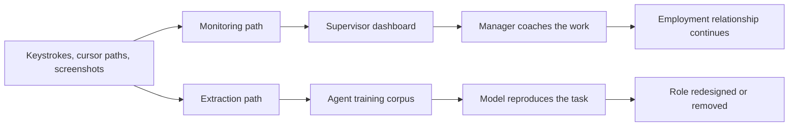

This morning, in waves that began around 4 a.m. local time in Singapore and rolled west across the time zones, Meta started cutting roughly 8,000 jobs, close to ten per cent of its 78,865 employees, while reassigning about 7,000 more into AI teams. Reuters reported the broad outline in mid-April and confirmed the specifics this week from an internal memo written by Chief People Officer Janelle Gale. North American staff were told to work from home today. Layers of management are being removed. Teams are being rebuilt into smaller units the company calls "pods," using what the memo describes as "AI native design principles." That is [the headline as NBC News carried it](https://www.nbcnews.com/tech/tech-news/meta-layoffs-ai-rcna345968), and the headline is being read everywhere.

Inside the company, a petition against a new monitoring program had already passed a thousand signatures before any of today's notifications went out.

## The Model Capability Initiative

For about a month, Meta has run a program it calls the Model Capability Initiative, sitting under a wider effort named the Agent Transformation Accelerator. Software on employee machines records mouse movement, clicks and keystrokes, and takes periodic screenshots of work applications. The stated purpose is to train AI agents to reproduce how Meta's own people operate a computer. [Engadget reported](https://www.engadget.com/2172212/meta-employees-are-protesting-the-companys-mouse-tracking-program/) that more than a thousand employees signed a petition against it.

Flyers appeared in meeting rooms, next to vending machines, inside bathroom stalls, [naming the program an "Employee Data Extraction Factory"](https://www.technology.org/2026/05/13/meta-employees-protest-mouse-tracking-software/) and directing colleagues to the US National Labor Relations Act, which protects workers who organize over the conditions of their work. In the United Kingdom, staff opened a unionization drive with United Tech and Allied Workers. The petition's authors raised concrete fears: that the capture could sweep up passwords, unreleased product details, and personal information including health and immigration status, [as The Next Web detailed](https://thenextweb.com/news/meta-mouse-tracking-protest-layoffs).

The company is recording, in granular detail, how its workforce does its work in the same quarter that it removes ten per cent of that workforce and tells another seven thousand people their roles are being redesigned around AI. Meta's employees did that arithmetic themselves. It is the emotional core of the petition, and they were not wrong to do it.

## Isn't this just monitoring, which is old news?

The defense Meta will reach for is that monitoring is ordinary. It is. Call centers have recorded calls for thirty years. Warehouses scan-track every pick. Trading floors log every message for compliance. Long before the current AI cycle, most large employers tracked individual productivity in some form. Monitoring is neither new nor, on its own, a scandal.

But monitoring and extraction are different acts, and the distinction is the whole argument. Monitoring measures a worker so a manager can manage them, bounded by a stated purpose, conducted with notice, constrained by labor law. Extraction copies a worker so that the worker is no longer needed. The first is an instrument of the employment relationship. The second is a plan for ending it. A keystroke log read by a supervisor and a keystroke log fed to the model meant to replace that supervisor's whole team are not the same artifact, even when the capture software is byte-for-byte identical.

I watched an early, cruder version of this confusion around 2006, on a financial-services back-office floor in Europe that had just installed a keystroke-and-idle-time monitor. Management presented it as a productivity tool. Within two weeks the staff had worked out that the score climbed if you rested a thumb on the spacebar during meetings. So they did. The dashboard turned green, and the actual work sat in the queue exactly where it had been. The number never measured the work. It measured the workforce's understanding that it was being watched. Mouse-tracking-for-AI is that same instrument, pointed now at a model meant to make the measured person redundant instead of at a dashboard a manager glances at.

The consent question is the sharp edge. A worker can be told, lawfully and routinely, that their output is monitored. It is a categorically different thing to be told, or worse not told plainly, that the record is the training set for the system designed to do without them. That goes well past a working condition in any ordinary sense. It is being asked to dig, on company time and with company tools, in the direction of your own exit.

## What the monitoring research shows

The operational question is the one boards actually respond to. Does this produce what it claims to?

The research on electronic monitoring does not flatter the premise. A 2026 study by Jansen and colleagues frames intensive electronic monitoring as a kind of ["workplace imprisonment,"](https://journals.sagepub.com/doi/10.1177/00380385251359077) and finds it reliably raises stress and corrodes trust between worker and manager. A [broad review of decades of monitoring research](https://www.annualreviews.org/content/journals/10.1146/annurev-orgpsych-110622-060758) reaches a consistent verdict: monitoring tends to push job satisfaction down, stress up, and counterproductive behavior up, while the link to genuine performance gains stays weak and conditional. People who know they are watched do not become better workers. They become better at being watched.

Then add the specific contamination in this case. The data Meta is collecting is being generated by people who have been told precisely what it is for, by petition, by flyer, by Reuters. A keystroke corpus gathered from a workforce that knows it is training its own replacement is data shaped by resistance, by self-conscious performance, by the entirely rational instinct to withhold your best moves from the thing built to copy them. Meta has guided toward $125–145 billion in 2026 capital expenditure on its AI build-out, [according to Fox Business's account of the restructuring](https://www.foxbusiness.com/fox-news-tech/meta-ai-workforce-restructuring-layoffs). Treat that as Meta's own guidance rather than settled fact. The figure has moved more than once. Against a number that size, the value of a contaminated keystroke corpus is a rounding error, and the trust damage done to collect it is not.

This is not only a Meta story. MIT Technology Review reported on April 20 that [tech workers in China are being instructed to train the agents meant to replace them](https://www.technologyreview.com/2026/04/20/1136149/chinese-tech-workers-ai-colleagues/), and are beginning to refuse. The assignment has a name that workers keep arriving at independently: building your own coffin. The phrase travels because the pattern travels.

## What the law currently reaches

Commentary on this tends to get sloppy, so the dates matter. The EU AI Act's one absolute, currently in-force prohibition that touches the workplace is a ban on emotion recognition: inferring workers' emotions from data, applicable since February 2025. That ban is real and it has teeth. It also does not reach what Meta is doing. Logging cursor paths and keystrokes to replicate task execution is not emotion recognition.

The category that would reach it, AI for worker management, sits in the Act's high-risk tier, with duties for documentation, human oversight and transparency. The enforcement clock for that tier was re-sequenced by the AI Omnibus agreed in Brussels on May 7, and the precise dates are now contested rather than settled. In the United States, [Colorado's AI Act takes effect on June 30, 2026](https://www.joneswalker.com/en/insights/blogs/ai-law-blog/whose-rules-govern-the-algorithmic-boss-state-ai-employment-laws-federal-preemp.html) and treats employment-decision systems as high-risk, with an obligation to report algorithmic discrimination to the state attorney general. The United Kingdom, where Meta's staff are unionizing, has no equivalent AI statute at all. That is exactly why the response there runs through UTAW and collective bargaining rather than a regulator.

The rule firmly in force is narrow and misses this case. The rules that would catch it are deferred, sub-national, or absent. Workers have started organizing inside that gap instead of waiting for it to close, and the [protests have spread across multiple US offices](https://www.thedailystar.net/news/tech-startup/news/meta-staff-protest-surveillance-layoffs-loom-report-4174666) in under two weeks.

## What the corpus actually costs

My reading, and I hold it with less confidence than I would like, is that the keystroke corpus turns out to be worth far less than what collecting it costs Meta. The software license is the cheap part. The expensive part is the workforce's willingness to be measured at all. Once people learn that instrumentation is a step in their own replacement, every future measurement gets read as a threat, including the legitimate ones that an honest AI rollout genuinely needs. Trust of that kind is spent once.

The defensible alternative is not complicated, and it is not even especially generous. Tell people exactly what is captured and what it trains. Make participation in replacement-grade data collection something a worker can decline without losing the job. Keep monitoring tied to managing the work rather than to retiring the worker. A company that cannot hold those lines does not have an AI program. It has a labor dispute with better tooling.

Meta's memo will be quoted for its big numbers today: eight thousand, seven thousand, ten per cent. The number that will matter longer is the one on the petition. It was past a thousand last week, and it is still climbing.

---

*Tarry Singh is the founder and CEO of [Real AI](https://realai.eu), an enterprise AI advisory and deployment firm working with global enterprises on production agent systems, model risk, and AI sovereignty strategy. He also leads [Earthscan](https://earthscan.io), an Energy AI startup, and is a founding contributor to the EU-funded HCAIM and PANORAIMA programmes for responsible AI education across European universities. He writes at tarrysingh.com.*
