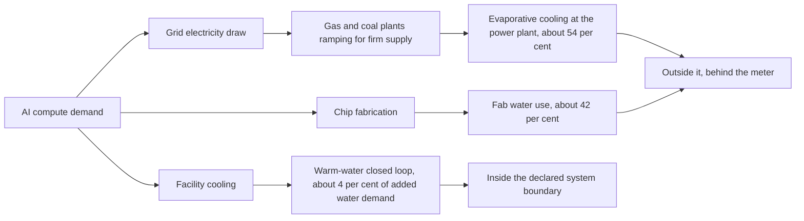

On 22 June, Nvidia announced that its warm-water cooling system can "eliminate 'pretty much all water usage' inside the data center". Josh Parker, the company's chief sustainability officer, told Axios the problem is solved. The market agreed: HVAC equipment suppliers shed 5–7 per cent the day the reference design shipped. I doubt that call survives contact with the wider water accounting.

The design is real. Rubin-generation racks ship in the second half of 2026, integrating 72 GPUs and 36 CPUs at power densities exceeding 100 kilowatts per cabinet, and liquid cooling is the only viable path at that density. But Nvidia drew the system boundary around the facility and declared victory. The bulk of AI's water footprint sits outside that line, in the natural-gas peakers and coal plants that supply the grid when solar stops producing and batteries run flat.

Fossil fuel power plants consume 2.7 billion gallons per day in the United States for evaporative cooling, with natural gas plants using 1.17 litres of water per kilowatt-hour and coal plants using 2.2 litres. Fossil fuel plants collectively generate about half of all data centre power today, according to the IEA.

A 2026 analysis by Xylem and Global Water Intelligence found that direct data centre cooling accounts for only 4 per cent of the additional water AI will demand by 2050; power generation accounts for roughly 54 per cent, and semiconductor fabrication the remaining 42 per cent. Nvidia's closed-loop design addresses one-twentieth of the problem. Vendor marketing implies something closer to three-quarters.

The public backlash is already here. Seven in 10 Americans oppose data centre construction in their communities, with half citing excessive water and power use, per a recent Gallup survey. On 3 July, Texas Governor Greg Abbott called for a ban on building data centres in rural areas during a campaign stop, a position that polls well across party lines. Maine is poised to become the first state to implement data centre construction moratoriums, pausing new projects until November 2027. In the first quarter of 2026, at least 75 projects valued at $130 billion were disrupted by local opposition.

The heat trade-off is inescapable physics. Servers dissipate power as heat; remove the heat with air and you burn electricity at industrial scale, or remove it with water and you consume municipal supply at the rate of tens of thousands of households per facility. For every megawatt of heat rejected through evaporative cooling, approximately 1,500–2,500 gallons per hour of water is consumed; a 100 MW hyperscale facility can consume 3–6 million gallons per day during peak summer operation. The trade-off tightens further as rack densities climb. Traditional racks dissipate 5–15 kW; AI training racks equipped with H100/H200 or MI300X GPUs dissipate 40–120 kW, with next-generation liquid-cooled racks pushing toward 200 kW.

Transparency is the first regulatory constraint. On 23 June, the [Texas Public Utility Commission revealed](https://www.texastribune.org/2026/06/23/texas-data-centers-puc-water-survey/) that only 28 companies representing 92 facilities responded to a state survey on water consumption, cooling systems, and electricity demand, a small fraction of Texas's existing data centres, prompting legislators to question whether the results provide a reliable foundation for future planning. One lawmaker called the participation rate "pretty pathetic." In a state with no comprehensive water regulation and an industry claiming self-governance works, non-compliance on a voluntary survey is not a confidence builder.

Regulation is accelerating at state level because the federal permitting push does not override land use, zoning, or utility rules. President Trump's July 2025 AI Action Plan includes 'promoting rapid buildout of datacenters', and that language leaves every local rule intact. Virginia enacted a consumption tax of $0.011 per kilowatt-hour on all electricity consumed by data centres beginning 1 July 2026, estimated to generate $600 million annually. Twenty-seven states are advancing legislation that requires developers to cover data centre energy costs and report usage, with California, Ohio, and Utah already enacting laws that go beyond the federal Ratepayer Protection Pledge. That pledge, signed in March by major developers, has no enforcement mechanism.

The IEA's April 2026 update confirms the demand trajectory is steeper than the efficiency offset. Global electricity demand from data centres grew 17 per cent in 2025, in line with IEA projections, while electricity consumption from AI-focused data centres surged 50 per cent. Global electricity consumption for data centres is projected to nearly double to reach around 945 TWh by 2030, representing just under 3 per cent of total global electricity consumption. That's a contained share in global terms, but the regional concentration creates acute stress. US data centre electricity consumption is expected to increase by around 240 TWh (up 130 per cent) by 2030; China by around 175 TWh (up 170 per cent).

The policy misstep is treating this as a cooling-technology problem when it is a grid-sequencing and power-source problem. Closed-loop liquid cooling buys down direct water use, provided you can afford the retrofit capital and are building at sufficient density. It does nothing about the 54 per cent of AI's water footprint that sits behind the meter, in the gas combined-cycle plants and coal stations that ramp when the wind dies. Natural gas and coal are expected to provide more than 40 per cent of new electricity needed to meet data centre demand through 2030, per the IEA. The cooling loop is closed; the fuel loop is not.

In Europe the play is different. Germany's *Energieeffizienzgesetz* mandates that new facilities commissioned from July 2026 onward must reach a power usage effectiveness of 1.2 within two years, the strictest performance law in the EU. The European Commission is preparing a Datacenter Energy Efficiency Package that will introduce a rating scheme for data centres and launch work on minimum performance standards. The consultation closed in April; expect delegated regulation before year-end. Companies that wait for the standard to publish will optimise for yesterday's ask. The ones moving now are specifying contracted renewable supply and battery co-location to demonstrate 24/7 carbon-free operation at the interconnection stage, as a hedge against permitting denial at municipal or *Länder* level rather than an ESG flourish.

Nvidia's boundary-line accounting is standard industry practice. Scope 1 and 2 emissions stop at the fence; Scope 3 is someone else's problem until a regulator or utility commission says otherwise. That worked in an environment of flat demand and slowly growing renewables penetration. It breaks when five technology companies' capital expenditure surged to more than $400 billion in 2025 and is set to increase by a further 75 per cent in 2026, and when the public sees the numbers on the water bill and the planning application in the same month. Transparency obligations under the EU Energy Efficiency Directive are live, and reports are due annually on 15 May, covering the prior calendar year. The first dataset covering 2025 will land in two months, and it will not include Scope 3 power-generation water unless the Commission amends the delegated regulation. My expectation is that it will, though I would not put a date on it.

The correct metric is watershed-level water intensity per compute-hour, inclusive of generation. No one is publishing it because the tracking infrastructure does not exist and the data would be commercially sensitive in the wrong boardroom. That is the ask I'd make: mandate disclosure of end-to-end water consumption per unit of delivered compute, segregated by fuel source for the marginal electricity supply. It will not be popular and it will reveal that some facilities in water-stressed regions are 10× worse than others on an apples-to-apples basis. But it would let capital allocators price the risk before the next drought instead of after it.

---

Tarry Singh is the founder and CEO of Real AI (realai.eu), an enterprise AI advisory and deployment firm working with global enterprises on production agent systems, model risk, and AI sovereignty strategy. He also leads Earthscan (earthscan.io) for Energy AI, and is a founding contributor to the EU-funded HCAIM and PANORAIMA programmes for responsible AI education across European universities. He writes at tarrysingh.com.
