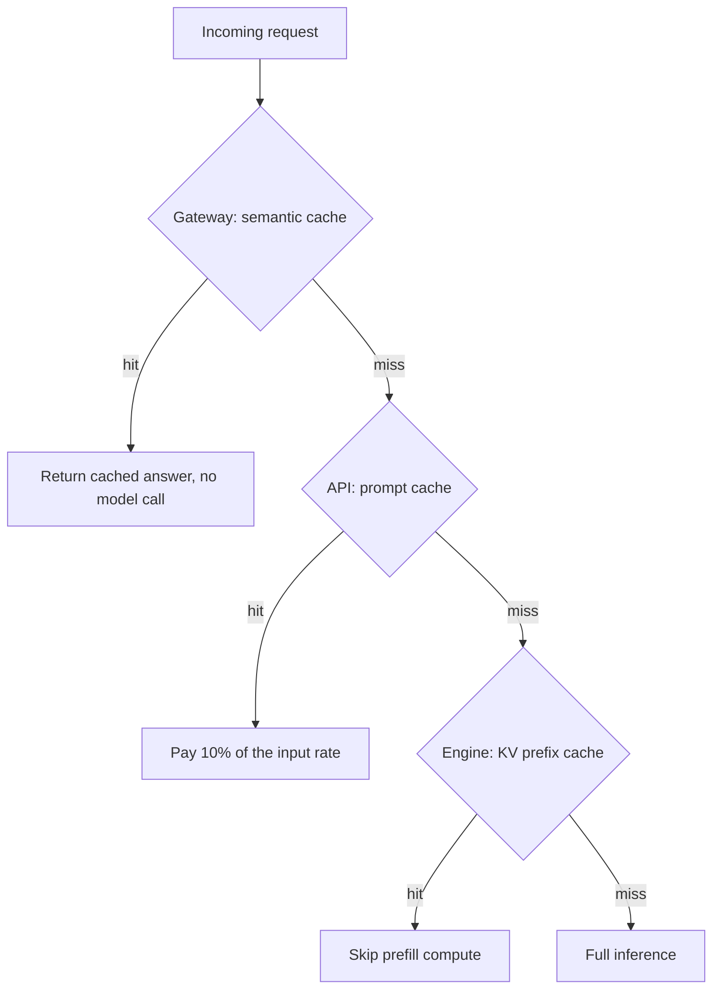

A few weeks ago I was reviewing the production architecture for a customer-dispute agent one of our engineers had inherited from a partner team. Latency was bad. The token bill was worse. I scrolled through the routing code for 40 seconds and asked the question I have asked too many times this year: where is the cache.

The answer was: there isn't one.

Every call sent a 4,200-token system prompt to Claude Sonnet fresh, every time, several thousand times an hour. The prompt held policy text, formatting rules, the regulatory framework and three pages of example reasoning. Multiply that by the per-token input price on the premium tier and the inference bill was running roughly 55–65% larger than the same workload should cost. The team had spent a quarter tuning the prompt and zero time on the layer that decides whether the prompt gets paid for once or 50,000 times.

This is the most common production mistake I am seeing in 2026. Not architectural. Not algorithmic. The simple, repeatable, embarrassing failure to cache. It is also the most expensive single line item in the category I keep calling AI slop debt.

## the three-layer pattern

Anthropic, OpenAI, Google and the open-source serving stack have spent the last eighteen months giving you three distinct places to put a cache. Most production teams I see are using one of them. A surprising number are using none. The teams whose unit economics still work are the ones using all three at their proper layer.

The layers are:

1.  **The engine layer.** Prefix caching inside the inference server: vLLM, SGLang, TensorRT-LLM. Decides whether the GPU recomputes attention over tokens it has already seen.
    
2.  **The API layer.** Prompt caching exposed by the model provider: Anthropic's explicit `cache_control` breakpoints, OpenAI's automatic cached prefix, Google's context caching API. Decides what the provider charges you per token.
    
3.  **The gateway layer.** Semantic caching at the application edge: GPTCache, Redis vector cache, a hand-rolled embedding lookup, or one of the AI gateways. Decides whether the request reaches the model at all.
    

The pattern is that they nest. A request hits the gateway first. If the gateway finds a semantically similar prior question with a known-good answer, it returns the cached response and the request never reaches the model. If the gateway misses, the request goes to the API, which checks whether the prefix of your prompt matches a cached prefix from the last 5 minutes (Anthropic default) or 1 hour (extended cache, at higher write cost). If the API hits, you pay roughly 10% of the input rate on Anthropic, 50% on OpenAI. If the API misses and you are running your own engine, the engine's KV cache may still spare you the prefill compute. Three falls; only the last one is full-price.

That is the entire pattern. The hard part is implementing it in the right order.

## the engine · prefix caching done correctly

If you serve your own models, your floor is vLLM v1 or SGLang. Both ship automatic prefix caching as a default. vLLM v1 uses a global hash table over fixed-size KV blocks and turned prefix caching on-by-default in the v1 series, with optional per-request `cache_salt` for tenant isolation ([vLLM docs](https://docs.vllm.ai/en/latest/design/prefix_caching/)). SGLang uses RadixAttention, a radix tree indexed at the token level, which discovers shared prefixes across requests without any developer hint ([LMSYS blog](https://www.lmsys.org/blog/2024-01-17-sglang/)).

On prefix-heavy workloads, SGLang's KV reuse can deliver multi-x throughput edges over a no-cache baseline. Agent loops, multi-turn chat with stable system prompts and batched evaluations all qualify. On standard H100 benchmarks with Llama 3.1 8B, SGLang lands around 16,200 tokens/sec to vLLM's 12,500, with the gap widening to roughly 6.4x on prefix-heavy traffic ([Particula benchmark, 2026](https://particula.tech/blog/sglang-vs-vllm-inference-engine-comparison)).

If you serve your own models and are not running one of these two engines with prefix caching turned on, you are leaving GPU cycles on the floor you have already bought. There is no engineering justification for that posture in 2026. Migrate, or stop having the conversation about inference margin.

## the API · prompt caching with deliberate breakpoints

If you use a hosted model, the work is at the API layer, and Anthropic exposes the most explicit interface: up to four `cache_control` breakpoints you place at the end of segments of your prompt you expect to repeat. Cache writes cost 1.25x the input rate; cache reads cost 10%. Default lifetime is 5 minutes; the optional one-hour TTL costs 2x to write but pays for itself on slow-decaying workloads ([Claude prompt-caching deep dive, mager.co, Apr 2026](https://www.mager.co/blog/2026-04-29-claude-prompt-caching/)).

The two-segment trick puts one breakpoint at the end of the static system context and a second at the end of a per-tenant block that updates less often than the chat history. The Culprit team document it, and report cutting their root-cause-analysis workflow cost by roughly 90% on Haiku 4.5 using cached system context ([Culprit blog, May 2026](https://theculprit.ai/blog/anthropic-prompt-caching-90-percent)). ProjectDiscovery's writeup is the more honest version of the same arc. Their initial cache hit rate sat at 7%, and climbed to 84% only after they relocated breakpoints and pinned tool definitions inside the cached prefix. That work ultimately delivered a 59% cost reduction across their security-agent workload ([ProjectDiscovery, Apr 2026](https://projectdiscovery.io/blog/how-we-cut-llm-cost-with-prompt-caching)).

The operational point is buried in those numbers. The cache does not help by being turned on. It helps by being instrumented. If you cannot read your API cache hit rate from your billing telemetry today, by tenant, by route and by hour, you are not yet using prompt caching. You are hoping.

## the gateway · semantic caching with the dial

The third layer is the one most teams skip and most should not. Semantic caching at the gateway intercepts requests before they reach the model: embed the incoming query, compare it against an indexed set of prior queries, and if a stored query clears a cosine-similarity threshold, return the cached answer instead of calling the model at all. GPTCache, Redis Stack, and the AI-gateway products from Maxim, Portkey and others all implement variations of this idea.

The dial is the similarity threshold. Set it too low and the cache returns wrong answers; set it too high and you never hit. Production deployments cluster between roughly 0.85 and 0.92 cosine similarity, with hit rates of 30–70% on long-tail customer support and FAQ traffic ([Spheron survey on GPTCache and Redis vector cache, 2026](https://www.spheron.network/blog/semantic-cache-llm-inference-gpu-cloud/); [GPT Semantic Cache, arXiv preprint](https://arxiv.org/html/2411.05276v2)).

The mistake everyone makes here is treating semantic caching as set-and-forget. It is the opposite. The threshold needs re-tuning against real production traffic at least monthly. The cache needs an eviction policy that respects answer freshness. And it must never serve a stale response to a question whose answer depends on time-sensitive data: your order status, your account balance, today's regulatory state. This is the layer where wrong answers come from a system the user trusts. Treat it accordingly, or do not deploy it.

## the math everyone gets wrong

Per-token inference cost has dropped roughly 10x per year since 2021, a curve a16z calls LLMflation ([Andreessen Horowitz, refreshed 2026](https://a16z.com/llmflation-llm-inference-cost/)). What cost $60 per 1 million tokens in 2021 costs about $0.06 today for equivalent-class models. That curve sounds like the problem is solving itself. It isn't.

The FinOps Foundation's [2026 State of FinOps report](https://data.finops.org/) found that 73% of respondents said AI costs exceeded original budget projections, and AI is now the fastest-growing new spend category. Agentic workloads consume 5–30x more tokens per completed task than single-turn chat, and the average enterprise AI budget has grown from about $1.2 million in 2024 to roughly $7 million in 2026 ([AnalyticsWeek inference-economics breakdown](https://analyticsweek.com/inference-economics-finops-ai-roi-2026/)). The unit cost is falling. The unit count is rising faster. The bill goes up.

Caching is the only architecture choice that bends both curves at once. Prefix caching at the engine layer cuts the compute. Prompt caching at the API layer cuts the price. Semantic caching at the gateway layer cuts the volume. None of the three is sufficient alone. Together, in production workloads I have personally measured, they routinely deliver 50–70% cost reductions. Those are real production numbers, measured outside vendor-benchmark conditions, with hit rates you can pull from a dashboard.

## the size of the avoidable bill

If you are running a production agent system in 2026 without all three layers configured deliberately, with measured hit rates visible to your engineering team and your finance team, your inference bill is at least 30% larger than it needs to be. In the systems I have reviewed this year it is closer to 60%. That floor has held every time I have looked, which is not proof that it always will.

The work to fix it is dull. It is also not optional. The cache layer is where the FinOps reckoning either lands quietly, inside your engineering team, six weeks of work and a dashboard later, or arrives loudly six months later, on someone's expense statement, with the CFO holding the page.

Cache before you call.

* * *

Tarry Singh is the founder and CEO of [Real AI](https://realai.eu), an enterprise AI advisory and deployment firm working with global enterprises on production agent systems, model risk, and AI sovereignty strategy. He also leads [Earthscan](https://earthscan.io), an Energy AI startup, and is a founding contributor to the EU-funded HCAIM and PANORAIMA programmes for responsible AI education across European universities. He writes at tarrysingh.com.
