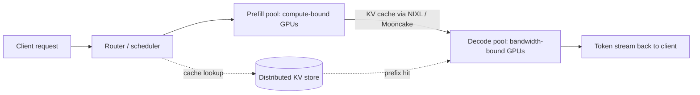

For most of the last decade, an LLM inference server was one process holding one model on one GPU. You sent it a prompt, the server ate the prompt, the server spat out tokens, you closed the connection. The two halves of that loop — reading the prompt and generating the answer — got treated as a single workload because the alternative was complicated and the simple version was good enough.

## The simple version is no longer good enough.

By mid-2026, every serious inference framework — vLLM, SGLang, TensorRT-LLM, LMDeploy — has accepted that the two halves of a forward pass want different hardware, different schedules, and different cost structures. The pattern has a clumsy name: prefill-decode disaggregation, sometimes shortened to PD disaggregation, sometimes generalised further as the [KVCache-centric architecture Moonshot AI described in the Mooncake paper](https://arxiv.org/abs/2407.00079). Either way the design is the same. Prefill on one pool of GPUs. Decode on another. KV cache shipped between them over a fabric that knows how to move tensors fast. This is the deepest reshaping of LLM serving since continuous batching, and it has happened mostly without anyone outside the inference crowd noticing.

## why one box was always the wrong answer

The prefill phase ingests a prompt and produces the first token. It runs every position of the input through every transformer layer in parallel — a compute-bound matrix multiply storm with GPU utilisation often pinned in the 90 to 95 percent range. The decode phase generates each subsequent token one at a time, sequential by construction, dominated by memory bandwidth as the model weights and KV cache get streamed through the attention units. Decode utilisation on the same GPU sits around [20 to 40 percent](https://www.spheron.network/blog/nvidia-dynamo-disaggregated-inference-guide/).

Put both phases on the same box and you guarantee one of two outcomes. Either you size the GPU pool for prefill peaks, in which case decode wastes silicon all day. Or you size it for sustained decode, in which case prefill queues up behind running decodes and tail latency blows past your SLO at exactly the moments people are watching. There is no cleverness that resolves this. The phases have different bottlenecks on the same hardware.

DistServe at UCSD was the first publicly defensible argument that the right answer was to stop trying. Eighteen months on, [the Hao AI Lab retrospective](https://haoailab.com/blogs/distserve-retro/) tracks how the idea went from a 2024 paper into the default deployment topology for any serving stack that touches reasoning models.

## what the split actually looks like in production

The router is the new control point. It owns three decisions a single-pool server never had to make: which prefill worker takes this prompt, which decode worker will host the resulting KV cache, and whether any of the prompt is already cached somewhere from a prior session. The transport layer underneath — [NVIDIA's NIXL](https://developer.nvidia.com/blog/enhancing-distributed-inference-performance-with-the-nvidia-inference-transfer-library/) on one side, the Mooncake Transfer Engine on the other — exists to move KV cache blocks between GPUs without going anywhere near the host CPU. Most production deployments use NVLink or InfiniBand for this. RoCE works but with worse tail behaviour.

The KV store at the bottom of the diagram is the part that turns disaggregation from a clever scheduling trick into an economic shift. Mooncake exposes the underused CPU, DRAM, SSD, and NIC capacity on the GPU servers as a tiered cache, currently running across [thousands of nodes and processing over 100 billion tokens a day for Kimi](https://github.com/kvcache-ai/Mooncake). If your prefix is in the store, decode doesn't need a prefill at all. That, more than the per-phase utilisation gain, is where the dollars come from.

## the numbers, with the appropriate skepticism

NVIDIA shipped [Dynamo 1.0 in March](https://developer.nvidia.com/blog/nvidia-dynamo-1-production-ready/) and quoted up to a 7x throughput improvement on DeepSeek R1 running on Blackwell. That is a vendor number on a vendor stack against a vendor baseline. Treat it the way you'd treat a SPECint score from the chip designer. The honest takeaway is that disaggregation gets you somewhere between 2x and 4x sustainable throughput improvement on real workloads, with a strong assist on tail latency that the headline throughput numbers tend to bury.

The Red Hat-led [llm-d project, accepted into the CNCF Sandbox on 24 March 2026](https://www.cncf.io/blog/2026/03/24/welcome-llm-d-to-the-cncf-evolving-kubernetes-into-sota-ai-infrastructure/), reports a 40 percent reduction in per-output-token latency for DeepSeek V3.1 on H200s with v0.4 — a more believable claim because it's measured against a vanilla vLLM baseline rather than a hand-tuned monolith. SGLang has published 2.7x decode throughput on GB200 NVL72 racks running its disaggregated path against the non-disaggregated baseline on the same hardware.

These numbers move around a lot depending on workload shape. The [dstack benchmark of PD ratios](https://dstack.ai/blog/benchmarking-pd-ratios/) showed a 3:1 prefill-to-decode worker ratio improves time-to-first-token but creates a decode chokepoint at any reasonable concurrency. At higher request rates, 1:3 dominates across both TTFT and inter-token latency. This is the part nobody puts in the vendor deck. The optimal ratio depends on prompt-length distribution, expected output length, and the shape of your traffic. It is not a knob you set once. It is a control surface you operate against.

## what changes for the team running this

The pattern forces three decisions that monolithic serving let you ignore.

The first is your prefill-to-decode ratio, and whether it is static or dynamic. Most teams start static — set xPyD at deploy time, alarm when goodput drops, retune by hand. The honest path forward is runtime reconfiguration, which Dynamo supports through its discovery service and which llm-d is building toward with cache-aware LoRA routing in v0.5. If your traffic has a daytime/nighttime shift, your worker mix should too.

The second is how you account for the KV cache tier. A cache hit collapses prefill cost to roughly zero for that portion of the prompt. If your business has long, repeated prefixes — agent system prompts, RAG context, multi-turn conversation history — the cache tier dominates your cost model. You need observability on hit rate by prefix shape, not just GPU utilisation. The cost per million tokens for cached prefix is closer to the cost of network bandwidth than the cost of compute, and that delta widens every quarter.

The third is procurement. Compute-heavy prefill pools want the dense, high-FLOPs GPUs. Decode pools want memory bandwidth and capacity — Blackwell B200s and H200s shine here in ways that don't show up on a marketing chart. Treat the two pools as separate procurement lines. If your finance team is still quoting "GPU hours" as a single SKU, you are losing money the cluster is happy to bill you for.

The macro picture is that inference now eats [55 to 80 percent of enterprise AI GPU spend](https://www.spheron.network/blog/ai-inference-cost-economics-2026/) and per-million-token prices have collapsed from around $20 in 2023 to roughly $0.40 today. That collapse is the cumulative result of speculative decoding, MoE routing improvements, FP8 quantisation, continuous batching, and — increasingly — disaggregation. If you're paying $0.40 per million tokens in 2026 and not running disaggregated, your provider is keeping the disaggregation margin.

## the bet I'd actually make

Honestly, I would push for disaggregated serving on any workload with more than one production model and more than a few hundred RPS. The complexity tax — a router you have to operate, a transport layer that can fail in new ways, two pools to monitor instead of one — is real, but it is the kind of complexity that is now standard rather than exotic. Kubernetes-native paths through [llm-d](https://github.com/llm-d/llm-d) make the operations side dramatically less scary than it looked a year ago.

The thing I would not do is build my own. The four orchestration layers that matter — Dynamo, llm-d, the SGLang router, Mooncake — already encode the hard-won lessons about KV transfer, prefill backpressure, and tail latency under load. Reinventing this is the kind of project that takes a small team six months and ends up shipping a worse version of something the open-source world already gave away.

The next argument worth having is whether disaggregation goes further. NVIDIA's [Attention-FFN Disaggregation announcement at GTC](https://blogs.nvidia.com/blog/lowest-token-cost-ai-factories/) suggested attention and feedforward want different hardware too, and there is a coherent thesis for pushing the KV cache tier out onto dedicated memory servers entirely. That argument is for another day. The current pattern — prefill here, decode there, KV cache shared between them — has won. Plan accordingly.

* * *

*Tarry Singh is the founder and CEO of* [*Real AI*](https://realai.eu)*, an enterprise AI advisory and deployment firm working with global enterprises on production agent systems, model risk, and AI sovereignty strategy. He also leads* [*Earthscan*](https://earthscan.io)*, an Energy AI startup, and is a founding contributor to the EU-funded HCAIM and PANORAIMA programmes for responsible AI education across European universities. He writes at* [*tarrysingh.com*](https://tarrysingh.com)*.*
