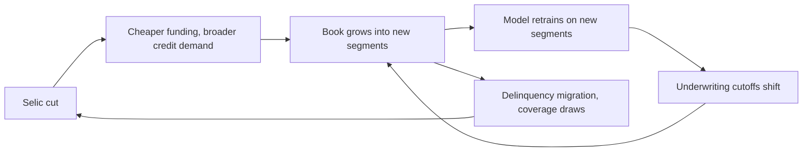

David Vélez, the founder still running the company he started in São Paulo in 2013, described the latest generation of NuFormer with the reserve an operator can afford. Quadrupled context length. Quadrupled training and inference speed. Production costs down. He read the sentence once for the analysts on the [Q2 2026 earnings call](https://www.fool.com/earnings/call-transcripts/2026/08/20/nu-nu-q2-2026-earnings-call-transcript/), then turned to the numbers.

The numbers deserved the reserve. Net income cleared the ten-figure line for the first time in the company's history, on 139 million customers across Brazil, Mexico and Colombia, per the [Q2 2026 investor release](https://international.nubank.com.br/company/nu-holdings-ltd-reports-second-quarter-2026-financial-results/). Net interest margin expanded 180 basis points to 22.9 percent. Risk-adjusted NIM rose 290 basis points to 12.4 percent. The 15-to-90-day early-delinquency indicator improved 16 basis points to 4.8 percent. The 90-plus non-performing loan ratio rose 35 basis points to 6.9 percent, which the company attributed to seasonal migration of first-quarter early cases and to what it plainly called "intentional expansions into higher-risk, higher-return segments." Total coverage sat at 244 percent of the 90-plus balance.

That last figure is the one a risk officer reads first. It is the ratio of allowances to the loans most likely to sour. It says the company is holding two-and-a-half times what its worst-bucket exposure would ask for. It is a specific promise about the quarter after next, from a lender whose growth story has spent most of its life inside a rate-hike cycle and is now, for the first serious stretch, running inside a rate-cut one.

## Where the Selic sits in September

The setting under all of these numbers is the one every retail bank in Brazil now shares. The Comitê de Política Monetária [cut the Selic to 14 percent on August 5, 2026](https://www.riotimesonline.com/brazil-copom-selic-14-percent-fourth-cut-2026/), a fourth straight 25-basis-point step from the 15 percent plateau that held through the second half of 2025. Focus survey expectations for year-end 2026 now sit at 13.75 percent. The Copom itself refused to promise a fifth cut at its September 16 meeting. Headline inflation is still running above the top of the target range. The central bank is walking a rate down in a corridor whose ceiling and floor it can still describe from memory.

For a monoline retail lender like Nubank, a falling Selic is a two-sided instrument. It cheapens funding, which improves net interest margin arithmetically. It also softens demand for the highest-margin unsecured products, where the risk-adjusted margin expansion actually came from this quarter. And it changes the base rate against which every borrower's ability to service revolves. A 100-basis-point move down is a straightforward gift to the current book. It also opens the door for a broader slice of the population to borrow. Those two effects run in opposite directions on the P&L in the same quarter and only sort themselves in the quarter after.

Everyone at every Brazilian lender knows this. What is new in the 2026 cycle is that a specific piece of software now sits inside the decision on which of those new borrowers to accept.

## The mechanics of NuFormer

The [Nubank engineering blog on the Muon optimizer](https://building.nubank.com/muon-for-improved-foundation-model-pretraining-data-efficiency/), published earlier this year, is the primary technical document on this specific model. NuFormer is a self-supervised foundation model whose training corpus is the sequence of financial actions of Nubank's own customer base: card swipes, Pix transfers, loan draws and repayments, deposit balances, session-level app behavior, timestamps. The current generation is a hybrid linear-attention transformer, an architecture whose compute cost scales close to linearly with sequence length rather than the classic quadratic cost of full self-attention. That property matters because a customer's financial history is by nature a long, sparse sequence, and the useful signals are often the far-apart ones. A shock in month twelve is often best explained by a pattern that started in month one.

Trained with Muon rather than the AdamW default, the model reached its convergence point on fewer tokens and less compute. Muon is a second-order optimizer derived from first-principles matrix geometry, expensive per step but efficient per unit of pretraining loss reduction across the training run. The reason a company like Nu bothers is that a foundation model that costs less to train can be retrained more often, and a model retrained more often can absorb regime changes in the underlying data before they show up in the loss book.

That last sentence is the one the Copom decision quietly points at.

## The regional shape of the decision

Take three postures inside Latin American finance right now, sitting at three different points on the same maturity curve.

| Operator | Q2 2026 AI-in-credit disclosure | What it tells you |
|---|---|---|
| Nubank | NuFormer live in largest credit segment (Brazil), rolling into personal loans and Mexico and Colombia; hybrid-linear architecture; production costs down | Model owns underwriting; retraining cadence is the risk-management primitive |
| Itaú Unibanco | Efficiency ratio in Brazil at 35.5 percent, AI SuperApp assistant launched, [BRL 12.4bn Q2 net income at 24.3 percent ROE](https://www.tipranks.com/news/company-announcements/itau-unibanco-posts-brl-12-4-billion-q2-2026-profit-and-launches-ai-superapp-assistant) | AI shows up in the cost line; balance-sheet size does most of the earnings work |
| MercadoLibre / Mercado Pago | Credit portfolio up 87 percent YoY to $14.6bn, [AI assistant handling 87 percent of user interactions](https://www.pymnts.com/earnings/2026/mercado-libre-says-ai-investments-support-45-revenue-surge/) | AI carries customer service; the underwriting engine is running against a still-young book |

The gap between the three is not about model quality. It is about where in the P&L the AI investment shows up first. At Itaú, it is a cost reduction on a book whose interest income was already priced into the year. At MercadoLibre, it is a service-cost reduction on a book still growing at a rate that would strain any risk framework. At Nubank, it is now inside the underwriting decision itself, which means the model's calibration error is on the same line as the loss reserve.

The line that connects all three is the same falling Selic that decides how forgiving the next twelve months will be.

## The regulatory backdrop, quietly

The other setting worth naming is the one the Banco Central do Brasil has been building for five years, mostly with less international attention than it deserves. Pix now clears more than six billion transactions a month with over 170 million users. Open Finance has moved through Phase 4, has 148 institutions registered as data transmitters as of June 2026, and processes over 60 million active data-sharing consents. The BCB and the National Monetary Council tightened cybersecurity requirements for Pix-connected environments this year, which pulled the compliance floor upward for every institution touching the rail.

None of that is directly about AI in credit. All of it is the substrate against which any Brazilian AI-in-credit strategy has to run. A foundation model trained on financial behavior is only as useful as the data pipes it drinks from. Pix and Open Finance give any authorised institution a data pipe wider and cleaner than anything an equivalent institution has in most other emerging markets. That structural advantage is one of the reasons the Nubank model can even exist at the depth it does.

It is also the reason the BCB will, sooner rather than later, be asked to have a view on foundation-model use in retail credit. The regulator does not yet have a public one. The absence of that view is currently a subsidy to the largest and fastest-moving lender. That subsidy has a shelf life.

## The disconfirming reading

The [Financial Stability Board's November 2024 report on the financial stability implications of AI](https://www.fsb.org/uploads/P14112024.pdf), which predates the current Latin American news cycle by nearly two years, makes the case a Brazilian supervisor would recognise once she read it. The FSB is not against AI in credit. It flags three specific channels through which AI in retail finance amplifies existing risks: greater model complexity that reduces explainability and slows internal validation; concentration of a small number of providers of foundation models and their underlying compute; and pro-cyclicality when models trained on recent data over-fit to the current phase of a cycle and misprice risk when the phase turns.

The [BIS Financial Stability Institute paper of December 2024](https://www.bis.org/fsi/publ/insights63.pdf) makes the same point in the drier language a national supervisor would use. The paper notes that most AI models in the financial sector do not introduce fundamentally new risks; they exacerbate old ones. Model risk, data quality, third-party dependency, herding behavior. All of them older than the current generation of foundation models, all of them made harder by scale and speed.

Nubank's answer to that reading is retraining cadence and coverage ratio. Retrain the model often enough and the pro-cyclical over-fit narrows. Hold enough allowance and the misprice, when it happens, does not reach the equity line. Both answers are correct as far as they go. Neither is a substitute for what the FSB and BIS are asking about, which is what happens when several institutions in the same market use similar architectures trained on overlapping data during the same phase of the cycle and then correct at the same time.

The 244 percent coverage number is a good number for one bank in one quarter. It is not a market-level answer.

## The feedback loop, in five moves

The loop is closed and self-correcting only when the retraining frequency is faster than the migration rate of the loans through the delinquency buckets, and only when the model owner and the risk owner sit at the same table and speak the same language when the retraining changes the cutoff. Both are engineering problems. Neither is a solved problem at any bank on the continent.

## What a past cycle taught

I have watched a Brazilian credit book turn once in a serious way in this century, when the 2014-15 recession, the Petrobras and Odebrecht disclosures, and a currency shock stacked on top of each other, and the private-bank loss lines rearranged the country's banking hierarchy for the following decade. The lenders that came through least damaged were, without exception, the ones whose provisioning models had been trained on the 2008-09 downturn and had never been fully re-parameterised during the boom that followed. Their models were too pessimistic in 2013 and 2014. They were roughly correct in 2015 and 2016. The lenders that suffered most had, in the years before the turn, quietly retrained scorecards on the data the good years produced and had convinced themselves that the world had permanently priced their downside out.

I am not drawing a straight line from 2015 to 2026. The book, the customer base and the toolkit are all different. The pro-cyclicality warning is the same warning, and any Brazilian lender who has watched a credit cycle turn will find the FSB paper reads like a translation of what a colleague told them in the coffee queue in 2016.

## The compute bill sitting underneath

The other number worth holding in view is not on any bank's balance sheet. It is on the ledgers of the data-center companies now committing capital to build the compute that everyone's model will eventually train on. [Elea Data Centers announced Rio AI City](https://www.prnewswire.com/news-releases/elea-announces-rio-ai-city-a-landmark-brazilian-data-center-project-with-capacity-up-to-3-2-gw-of-renewable-energy-supporting-ai-growth-302449289.html) as a landmark campus with 1.5 gigawatts of capacity targeted for 2027, expandable to 3.2 gigawatts by 2032, powered by Brazil's roughly three-quarters-renewable grid. Oracle and NVIDIA have signed memoranda of understanding to join. The Brazilian government's declared ten-year data-center investment strategy sits at a scale most sovereign-wealth funds would consider a major commitment to a single sector.

That capacity has to earn its keep. Some of it will train models like NuFormer. Some of it will train much less useful models. Discount-rate arithmetic on a ten-year data-center build is unforgiving under a Selic even at 14 percent, and less forgiving still if the Copom finds the corridor it was walking down is narrower than it hoped. Every retail lender's model economics live downstream of that arithmetic.

The bill is downstream of the decision Nubank has already made and upstream of the decisions Itaú, Bradesco and Santander Brasil will have to make. A bank that owns its own inference on cheaper hardware and a bank that rents inference from a hyperscaler have very different operating leverage in the year rates turn. Neither is obviously right. What is obviously true is that the decision cannot be un-made cheaply once a foundation model has been trained on a proprietary corpus. That is the sunk cost the next five years will price.

## The stake

Here is what I would put on the record, from the outside of these decisions and after reading the disclosures with the attention a credit analyst would give them. Nubank has bought itself a real margin cushion this quarter, and NuFormer is a genuine piece of that cushion, not marketing. The retraining-cadence advantage over a bank running static scorecards is not small; it is possibly the most important production-ML result any Latin American lender has published this cycle.

The cushion is not what will decide the next twelve months. What will decide them is whether the Copom finds the room to keep cutting, and whether the migration rate through the 90-plus bucket stays in line with what the model expected. If the Copom is forced to hold, Nubank's intentional risk expansion becomes materially harder to underwrite at the same margin. If the migration rate accelerates, the coverage ratio starts drawing faster than the retraining schedule can keep up with. The company can survive either alone. Together, they would compress the return-on-equity story the equity market has been paying a growth multiple for.

There is a second-order stake worth naming. If the Nubank approach is the right one, and in most scenarios I think it is, the pressure on Itaú and Bradesco to move toward similar architectures will show up in their 2027 disclosures. The BCB will see that pressure before the market does, and its choice, whether to write model-supervision rules pre-emptively or to wait until the first credible mispricing event, will shape whether Brazilian retail credit in 2028 looks structurally different or looks like an accelerated version of the same book with faster underwriting.

The stock market has already made a version of this trade. Nubank's shares are down roughly a third this year, one of the [weakest performers among Latin America's large financials](https://www.riotimesonline.com/nubank-stock-analyst-downgrades-credit-cycle-june-2026/), on precisely this concern. The Q2 numbers were strong enough to shift the near-term debate. They did not change the underlying question.

## Whose Monday

Somewhere in a Faria Lima tower on Monday morning, a mid-thirties credit analyst is reading the same disclosure package I just did. She has three tabs open. One is the Nubank release. One is the Copom minutes from the last meeting. The third is her own bank's provisioning model, which she wrote two years ago in Python and which nobody else in the room understands well enough to challenge. Her boss will ask her, before lunch, whether the Nubank number is a signal about the market or about one company. She will not have a clean answer. She will have a set of ratios, a rate curve and a memory of the last time a Brazilian credit book was priced at these implied loss rates. She will trust the memory more than she trusts the ratios, and she will be right to.

---

Tarry Singh is the founder and CEO of [Real AI](https://realai.eu), an enterprise AI advisory and deployment firm working with global enterprises on production agent systems, model risk, and AI sovereignty strategy. He also leads [Earthscan](https://earthscan.io) for Energy AI, and is a founding contributor to the EU-funded HCAIM and PANORAIMA programmes for responsible AI education across European universities. He writes at [tarrysingh.com](https://tarrysingh.com).
