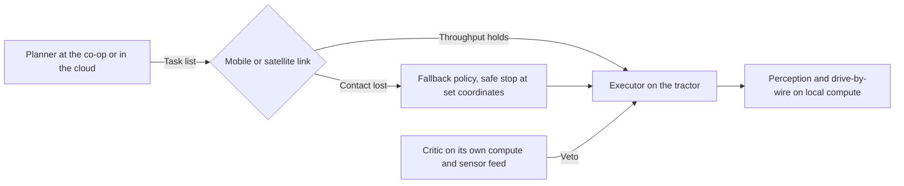

# The Rice Paddy Needs a Planner: What Japan's Hillside Robots Say About Agent Design

40%. That is the share of Japan's cultivated land that sits on hills or in mountain valleys, tilted, terraced, awkwardly shaped, threaded by roads narrow enough to slow a delivery truck to walking pace, and laced through cell coverage that thins on the second bend of the climb. Those are also the parcels aging out fastest, the terraces the returning son will not farm, the paddies that will fall to bamboo if steel and software do not learn to handle them soon.

The figure sits inside [a joint press release from NTT, Kubota and NTT DOCOMO dated 25 May 2026](https://group.ntt/en/newsrelease/2026/05/25/260525b.html), announcing a demonstration of hybrid mobile-plus-satellite communications for remotely operating agricultural robots in exactly that hilly-mountainous terrain. The demonstration used what NTT calls multi-link control: the network watches signal quality on both the mobile link and the satellite link, and rides whichever one is delivering enough throughput to keep the video-control loop alive. Anyone who has tried to remote-supervise a robot on a hillside will read that and nod. Anyone designing the agent that sits behind such a system should be doing more than nodding, because the story is a design-pattern story before it is a connectivity one.

## The planner and the executor are not the same job

The clearest framing I know for what NTT's demonstration implies is the planner-executor split. [Anthropic's engineering post on building effective agents](https://www.anthropic.com/research/building-effective-agents), which most teams now treat as the plain-English reference for the year, lays out five composable workflow shapes and puts the wins in the split itself. One enormous prompt wired to a tool belt does not get them. [LangChain has documented the same idea](https://www.langchain.com/blog/planning-agents) under the label plan-and-execute, arguing that separating a planner (usually a larger, slower model reasoning across the whole task) from executors (smaller, faster models or code that each handle one step) buys you latency, cost, and the point most teams miss, reliability.

The pattern maps onto a hillside farm cleanly. The planner is the thing that says *this week we cut row three, spray tomorrow morning if the wind is under 4 metres per second, then move to row seven if the soil moisture reading holds*. The executor is the machine that actually cuts. In the NTT arrangement the executor sits on the M5 Narrow tractor Kubota commercialised through its partnership with Agtonomy, [announced at CES 2026 in January](https://www.prnewswire.com/news-releases/kubota-brings-smarter-solutions-to-ces-2026-redefining-how-work-gets-done-302654080.html) as a 105-horsepower diesel with onboard sensing and AI making immediate control decisions locally. The planner sits at the co-op, on a small on-farm server, or in the cloud, wherever it can afford to hold context across seasons and machines. The connection between the two runs across the network NTT is trying to make reliable enough for the mountain.

## Do not put the planner and the executor on the same model

The temptation is to hand the whole loop to one large model and let it think and act. It works in a demo. The cost and the brittleness show up in production. Anthropic's own guidance is blunt: start with the simplest composition that solves the problem and only escalate to full agentic autonomy when the workflow demands it. [A recent peer-reviewed review of agentic AI in precision agriculture](https://pmc.ncbi.nlm.nih.gov/articles/PMC12847348/) reaches the same conclusion from the field-robotics side. The systems that work in the wild have a lightweight planner producing a small structured plan, and executors that follow the plan without re-reasoning the world from scratch every 100 milliseconds.

Practically, on the hillside: perception, obstacle avoidance and drive-by-wire run on the tractor's own compute, at rates the network cannot possibly guarantee. The planner produces the day's task list. The two are separated by the messiest interface in modern computing, an intermittent, bandwidth-limited radio link across a wet valley, and that interface is what the network engineers are trying to make survivable. If the planner and executor are the same model, you have already lost. The moment the link degrades to satellite-only throughput, the executor stalls waiting for the planner, and the tractor sits in the row.

## Planning around the link

This is where I see teams import the wrong assumptions from cloud-native SaaS. In a warehouse or a datacentre the planner can assume a fat, low-latency link to its executors. On a hillside it cannot. A production planner-executor split for farm robots has to carry the connectivity model as a first-class input. That means the plan is not *cut row three*. It is *cut row three, and if you lose contact for more than N seconds, execute this fallback and come to a safe stop at coordinates X*. The executor needs the fallback baked in, because there will be no LLM available to reason about the situation live.

The pre-LLM literature was clearer about this than the current one. A [2023 arXiv paper on variable-autonomy weeding platforms](https://arxiv.org/pdf/2303.05461) worked exactly this problem: the machine defaults to the most conservative action in its policy library when supervisory signal is lost. That default has largely dropped out of the current hype cycle. Nobody wants to publish a diagram with a big grey box marked *stop safely if planner unreachable*. Every serious production system I know still has that box.

## Functional safety on a farm

Teams read the evaluator-optimizer pattern, apply it to a document workflow, and forget it when they move to a physical system. On a farm, the evaluator becomes a safety monitor, the thing that says *the planner has asked you to spray, but soil moisture is above threshold and the wind sensor has drifted, so do not*. An [engineering write-up from Spyrosoft](https://spyro-soft.com/blog/agritech/why-agricultural-robotics-fails-without-functional-safety-engineering) puts the case as sharply as I have seen anyone put it. Agricultural robots fail on functional safety. Once they operate near people, crops, obstacles and regulators, the problem stops being an autonomy problem and becomes a functional-safety one. The implication for agent architects is direct. The critic runs on its own compute, on its own sensor feed where possible, and is allowed to veto the executor without asking the planner.

I disagree with the Spyrosoft framing on one point. The author argues, essentially, that autonomy without functional safety is not a business, and I would go further. Autonomy without a physically independent critic is not a defensible engineering claim in the first place. The critic is the third component of the split, alongside the planner and the executor, and every board that has funded a farm-robotics pilot should be asking to see all three drawn separately before writing the next cheque.

## Where the Japanese stack lands

Those pieces sit against a hard demographic backdrop. [Japan's MAFF has reported](https://www.tokyoreview.net/2025/12/migrant-labor-in-an-aging-agricultural-sector/) that the country's core agricultural workforce has fallen to 1.1 million from 2.4 million at the start of the century, with an average age of 69.2 and 71.7% of workers over 65. [The OECD's 2025 Agricultural Policy Monitoring review](https://www.oecd.org/en/publications/2025/10/agricultural-policy-monitoring-and-evaluation-2025_354e7040/full-report/japan_d94ab3f7.html) puts the same picture into policy language and notes that the state is now underwriting the automation transition explicitly, through what MAFF calls Smart Agriculture 2.0. Japan will run its hillsides on autonomous machinery. What remains open is which agent architecture those machines will run.

The evidence from the last six months says the answer will be the planner-executor split, with a distinct critic, over a hybrid comms substrate. NTT is building the substrate. Kubota is building the executor. The planner and the critic are still being negotiated between vendors, cooperatives and Japan's [national earth-observation programme at JAXA](https://www.eorc.jaxa.jp/en/earth_observation_priority_research/agriculture/), whose satellite data streams now feed the planning layer for irrigation and yield forecasting. Nobody in this network is asking whether a single large model could take the whole job. The engineers who have to keep the machinery running on the second bend of a mountain road already know the answer.

## Collapsed into one prompt

A hillside farm-robotics architecture with the planner, executor and critic collapsed into one prompt will probably pass the greenhouse test. It fails on the road. The moment the truck rolls onto a Nagano access road and the LTE bar drops, the whole thing becomes a very expensive brick that cannot even come to a safe stop.

There is an older lesson buried under this that keeps repeating. Twenty years ago, on an early distributed-control retrofit for a European water utility, I watched a team lose two days of pump operation because the central scheduler and the local PLC had been coded to share the same decision path. When the wide-area link failed, both halted, waiting for each other. That was 2005. What fixed it was a local executor with a defined fallback, a central planner allowed to be intermittent, and a hardwired safety layer that answered to neither. That is the arrangement the Japanese ag stack is quietly rediscovering, two decades on, with more capable models and worse terrain.

Mitsubishi Research Institute [projects that by 2050 Japan will be down to roughly 180,000 agricultural management entities](https://www.oecd.org/en/publications/2025/10/agricultural-policy-monitoring-and-evaluation-2025_354e7040/full-report/japan_d94ab3f7.html) to feed a G7 country.

---

Tarry Singh is the founder and CEO of Real AI ([realai.eu](https://realai.eu)), an enterprise AI advisory and deployment firm working with global enterprises on production agent systems, model risk, and AI sovereignty strategy. He also leads [Earthscan](https://earthscan.io) for Energy AI startup, and is a founding contributor to the EU-funded HCAIM and PANORAIMA programmes for responsible AI education across European universities. He writes at [tarrysingh.com](https://tarrysingh.com).
